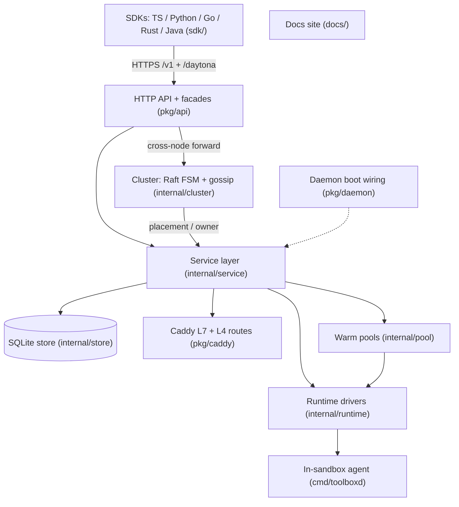

<!--
  RULES FOR THE AUTHOR. The reviewer contract is pr-review.md at the repo root:
  §1–§8 = the code rules, §A–§D = how to write this description.

  - GitHub auto-fills this template only when a PR is opened in the web UI.
    `gh pr create --body ...` (and most agents) BYPASS it, so paste this
    file's structure in yourself (`gh pr create --body-file <file>`).
  - Summary, Repo impact map, How to review and Safety axes are MANDATORY.
    Delete other sections only if they genuinely don't apply.
    "N/A - <one-line reason>" is a valid answer; an empty answer is not.
  - Summary + impact map must ORIENT a reviewer in < 3 min, so keep them short.
  - "How to review" must let ANYONE (someone who has never opened this repo)
    COMPLETE the review without asking you anything. It is meant to be long.
    Follow pr-review.md §A: nine parts (Quick start → Part 7), every review
    step in the five-part format (Open / What it does / Check / Example / Test),
    searchable names instead of line numbers, real verified numbers, full ids.
  - Before posting, check every function / test / file you cite exists on the
    branch (pr-review.md §B). Reviewers spot-check and bounce on a missing name.
  - Write only what is true of THIS PR (pr-review.md §A.4 rule 9). Never restate
    the review procedure (checkout, run the tests first, read code, decide);
    it lives in pr-review.md §D. A line that would read the same in any PR is
    deleted.
  - Trivial PRs (docs / comments / version pin / mechanical rename, no
    behaviour change, ≲ 50 lines) may use the short form from pr-review.md §A.5:
    Quick start + one Part 3 step + Part 6 red flags.
  - The mermaid impact map is strictly required (pr-review.md §C). Reviewers
    bounce a PR without it, or with one that doesn't match the diff.
  - If the map needs > 12 nodes, or "What changed" needs > 7 bullets, the PR
    is too big. Split it.
-->

## Summary

<!-- 2–3 sentences, no more:
     1. What problem exists (or what was asked for).
     2. What this PR does about it.
     3. The one thing a reviewer must know before reading the diff.

     PLAIN LANGUAGE ONLY. Write for someone who has never opened this
     codebase: a PM, a support engineer, a new hire on day one. Say what goes
     wrong for the user/operator and what changes, not the mechanism:
       ✗ "TryReserveHostPort now returns Existing on a PK conflict so
          allocateHostPort skips the pool walk"
       ✓ "exposing the same sandbox port twice used to burn a second public
          port; a retry now gets back the address it already has"
     Litmus test: a sentence with a `backticked_identifier`, a key/tuple, or
     3+ internal terms belongs in "What changed", not here. -->

## Repo impact map (mandatory)

<!-- Which layers this PR touches and how the change flows through them
     (rules: pr-review.md §C). Start from the starter diagram below:
       - DELETE nodes/edges this PR doesn't touch.
       - Mark every touched node with the `touched` class.
       - Label NEW or CHANGED edges (e.g. -->|"new: POST /v1/sandboxes/{id}/x"| ).
     Keep it ≤ 12 nodes. This is the high-level picture; the step-by-step
     control flow goes in "Code-path diagram" below. -->



## What changed

<!-- Max 7 bullets, grouped by area. One line each: file/area — what + why.
     Example:
     - `internal/store/store.go` — `TryReserveHostPort` returns the existing
       row on a same-(sandbox, port) conflict, so a retried expose gets its
       old URL instead of walking the host-port pool. -->

-

## How to review

<!-- STANDARD: pr-review.md §A. Write for someone who has never opened this
     codebase. Fill every part below; delete only the parts the tier
     (§A.5) makes optional, and write "(n/a: <why>)" instead of leaving blanks.
     Worked example of a Part 3 step: pr-review.md §A.3. -->

### ✅ Quick start (≈ total time)

<!-- ONLY what is specific to this PR. The review procedure (check out the
     branch, run Part 4 first, read Part 3 in order, try Part 5, red flags,
     decide) is the same for every PR and lives in pr-review.md §D, so don't
     write it here: no checkout command, no "Run the tests: see Part 4", no
     "Decide" step. -->

| # | Commit | What it does (plain words) | Review with |
|---|---|---|---|
| 1 | `<short sha>` | … | Part 3 · Step … |

<!-- Optional, only when true for this PR: where to start, what is safe to
     skim (generated code, SDK mirrors of the same change, test fixtures), a
     commit that must be reviewed alone, a stacked base branch. -->

### Part 0: The change in one picture

<!-- The problem in everyday terms (an analogy or a small table), plus REAL
     before → after numbers from something you actually ran: boot latency,
     coverage %, a flaky test's pass rate over N runs, a CI run that failed.
     Say which data and window, e.g. "go test -count=50 on this branch". -->

### Part 1: Dictionary

<!-- One line per domain term / identifier / abbreviation the reviewer meets
     in this PR, e.g. L4, host-port pool, owner node, warm pool, FSM apply. -->

- **term:** meaning

### Part 2: How the request flows

<!-- 3–6 line diagram of the path through the touched layers and where the
     change sits, e.g.
       SDK.exposePort → v1 handler → Service.ExposePort → allocateHostPort
         → store.TryReserveHostPort  ← THIS PR
         → caddy L4 route
     Optional when a single layer is touched: "(n/a: one layer)". -->

### Part 3: Review steps

<!-- One step per logical change, each in the FIVE-PART FORMAT. Use searchable
     names, never line numbers. Mark the single most important step with ⭐.
     A step with no test must say "no test: verified only by <how>". -->

**Step 1: <what this step reviews> ⏱ N min**
- **Open:** `path/to/file.go`, search **`FunctionName`**
- **What it does:** before → now, in plain words, and why.
- **Check:**
  1. <a yes/no thing verifiable by reading the code>
- **Example:** <real input>: before <value> → after <value>.
- **Test:** `TestFunctionName` in `path/to/file_test.go`

### Part 4: Run the tests

```bash
go test -count=1 -run '<TestRegex>' ./<changed packages>/...
go test -count=1 -coverprofile=coverage.out ./<changed packages>/...
go tool cover -func=coverage.out | tail -n 1
```
**Expected:** <e.g. all pass; package coverage ≥ 85% (was X% → now Y%)>.

<!-- Add the SDK test commands from CLAUDE.md for every SDK this PR touches,
     and the integration target (e.g. `make integration-cluster-hetero`) if
     live verification is part of the claim. -->

### Part 5: Try it

<!-- Required for any user-visible change (API, SDK, CLI, docs page, operator
     behaviour). Exact inputs: the SDK call, env var, or command; full ids. -->

| Ask / do | You should see | You should NOT see |
|---|---|---|
| … | … | … |

### Part 6: Red flags

<!-- Conditions that would mean the PR is wrong, phrased "❌ If you see X…".
     Include at least one behaviour that must NOT change (e.g. single-node
     mode with EnableCluster=false, an existing SDK response shape). -->

- ❌ If …

### Part 7: Not in this PR

<!-- Known issues deliberately left out, so reviewers don't block on them. -->

- …

## Code-path diagram

<!--
REQUIRED for any change to runtime behaviour (see pr-review.md §8): at least
one ```mermaid``` diagram of the changed code path, annotated with what
changed on each branch (before -> after).

- sequenceDiagram for protocol / handshake / cross-process changes
- flowchart for control-flow, lifecycle, or cleanup-path changes
- every failure/cleanup branch the diff touches must appear as a branch

Reference example: PR #289 "What changed, visually".
Only valid opt-out: "N/A - docs/comment/test-only change."
-->

## Safety axes

<!-- One answer per axis. Silence is not acceptable on these (CLAUDE.md
     "Hard rules", pr-review.md §1–§7). "N/A - <reason>" is fine when the
     axis is untouched. Keep the sub-heading names: project skills point
     authors at them by name. -->

### Sandbox boot impact

<!--
Did this PR add ANY work - DB query, HTTP round-trip, file I/O, lock
acquisition - to CreateSandbox or anything it calls? (pr-review.md §2)

If yes: state what was added, expected added latency, when it fires, and
whether it's bounded. "Only on the first call" is still impact and must be
called out.

If no: write "N/A - no work added to sandbox boot path."
-->

### Idempotency

<!--
For every API surface this PR touches, describe behaviour under retry and
under concurrent calls with the same inputs. Sandbox APIs MUST be
idempotent (see pr-review.md §1).

If no API surface changed: write "N/A - no API surface changed."
-->

### Failure-path consistency

<!--
For any multi-step write that touches BOTH caddy and the store: what is the
rollback rule on partial failure? Who cleans up if step 2 of 3 fails?
(pr-review.md §4)

If no multi-step write path was changed: write "N/A - no multi-step write
path changed."
-->

### L4 / host-port-pool changes

<!--
Did this PR touch TryReserveHostPort, the partial unique index on
host_port, allocateHostPort, EnsureLayer4, EnsureLayer4Ready, or the
l4Ready latch? If yes, link the regression test that covers the change.
(pr-review.md §6)

If no: write "N/A - neither touched."
-->

### Cluster correctness

<!--
Did this PR touch internal/cluster/ (FSM, placement selection, recovery
replication, owner watcher, capacity lease / heartbeat) or a cross-node
forwarding wrapper? If yes: split-brain risk, replay safety, leader-change
behaviour, single-node / EnableCluster=false no-op, and the regression test
next to the changed file. (pr-review.md §7)

If no: write "N/A - no cluster path changed."
-->

### Mount inputs

<!--
Does this PR widen what a PAT holder can pass into a host-side mount command,
or add a mount option / source form that could carry a credential?
(pr-review.md §5)

If no: write "N/A - mount inputs unchanged."
-->

## How I verified

<!-- Commands you ran + outcome, with real numbers: unit tests (with -count
     for flake fixes), per-package coverage before → after (/maintain-coverage),
     SDK test suites, `make docs-build`, integration targets, manual daemon
     check. Unticked boxes are for things still pending (e.g. CI). -->

- [ ] …

## Risk & rollback

<!-- Blast radius (which users / runtimes / cluster roles / SDKs), whether a
     store schema change is involved (and whether old binaries tolerate the
     new schema), and the revert path (plain `git revert`? config flag such as
     an SB_* env var? SDK release to yank?). -->

## Checklist

- [ ] Every Go package this PR changes is at ≥ ~85% line coverage, new files have a `_test.go` next to them, and before → after numbers are in "How I verified"
- [ ] Fragile area touched (host-port pool, L4 latch, cluster FSM / placement / forwarding, `internal/network/tap`) → regression test next to the changed file + answered in "Safety axes"
- [ ] Cluster-mode code stays a no-op when `cfg.EnableCluster` is false
- [ ] New or changed `/v1` surface → all five SDKs updated in lockstep (`/add-sdk-method`)
- [ ] Docs: no raw HTTP / `curl` examples (install one-liner excepted); every example in all five `<Tabs syncKey="lang">` languages; a new top-level feature gets its own `.mdx` registered in `docs/src/content.config.ts`
- [ ] Store schema change → idempotent CREATE / ALTER in `internal/store/store.go` (`/add-store-column`)
- [ ] No version branching in `internal/`; API errors go through `apihttp.WriteStoreAwareError`
- [ ] No network / AWS calls in a plain `_test.go` (live checks sit behind the `integration` build tag)
- [ ] Every function / test / file cited in "How to review" exists on this branch (pr-review.md §B)
- [ ] No truncated ids in this description (sandbox, node, CI run and PR ids written in full; short commit SHAs only in the Quick start table)
