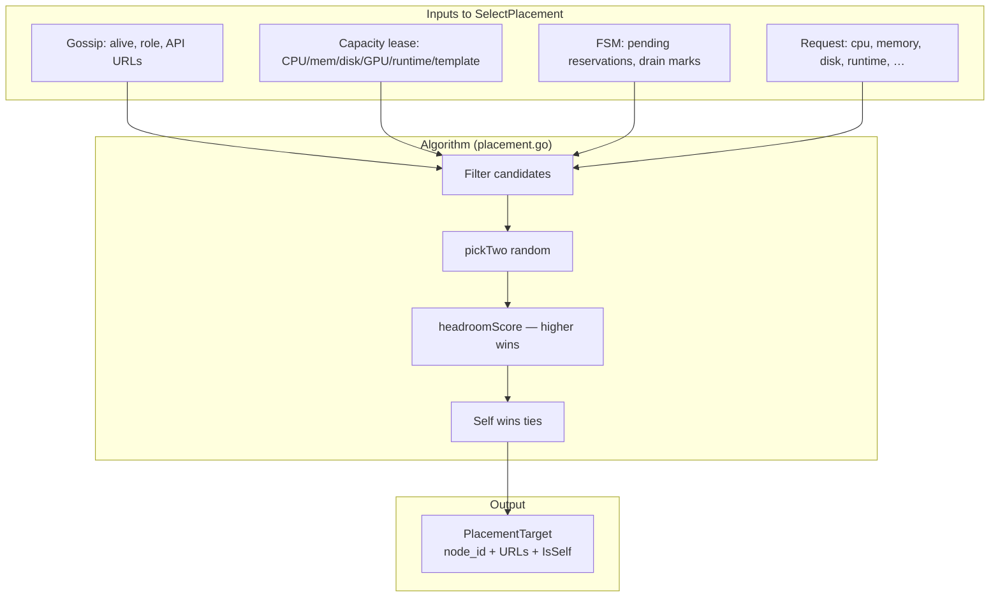
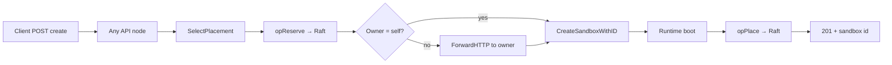
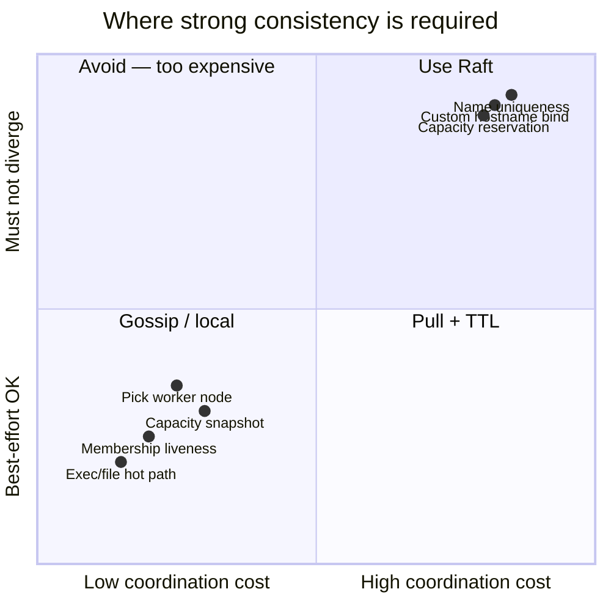
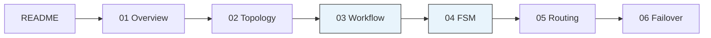

# Architecture at a glance

One-page map of **sandbox placement** in AerolVM cluster mode. Details live in the numbered docs.

## System context

```mermaid
C4Context
    title AerolVM cluster — placement context

    Person(client, "Client", "SDK / HTTP")
    System_Boundary(aerolvm, "AerolVM cluster") {
        System(api, "sandboxd API", "Any node :21212")
        System(raft, "Raft quorum", "Placement FSM")
        System(gossip, "SWIM gossip", "Membership")
        System(cap, "Capacity leases", "Pull /v1/capacity")
        System(owner, "Owner node", "Runtime + SQLite")
    }
    System_Ext(lb, "Load balancer", "TLS pass-through")
    System_Ext(caddy, "Caddy ingress", "Per-node routes")

    client --> lb
    lb --> api
    api --> raft
    api --> gossip
    api --> cap
    api --> owner
    raft --> owner
    lb --> caddy
    caddy --> owner
```

## Placement decision — condensed



## Create path — condensed



## Consistency boundaries



## Document map



**Start here for a design review:** [03-placement-workflow.md](./03-placement-workflow.md) + [04-placement-fsm.md](./04-placement-fsm.md)

**Start here for ops / failure modes:** [06-failover-and-recovery.md](./06-failover-and-recovery.md) + [`setup/cluster.md`](../setup/cluster.md)
