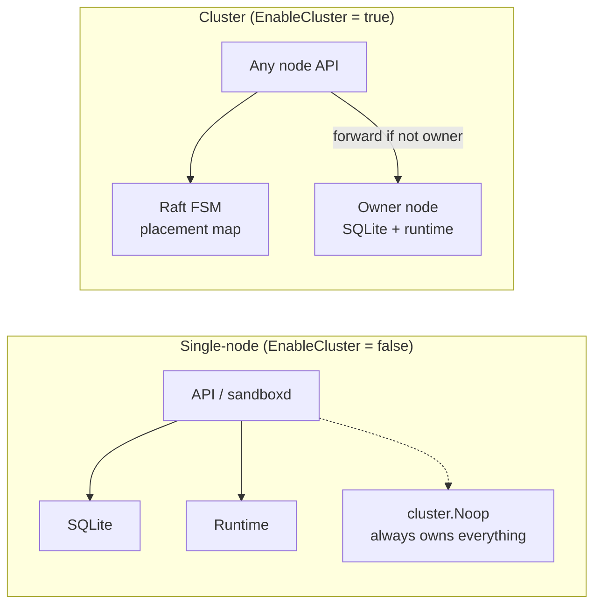
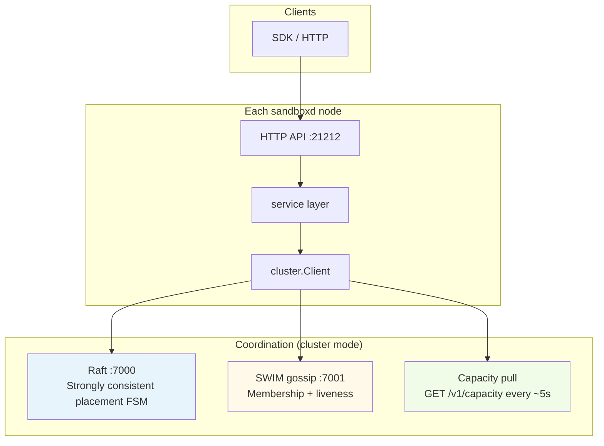

# Overview — Why placement works this way

## What “placement” means

A **placement** is a durable cluster record:

```
sandbox_id  →  owner_node_id  (+ spec metadata, secrets handle, exposed ports, …)
```

Once committed, every server-role node agrees on the owner. The owner is the only node that runs the sandbox runtime (Docker, Firecracker, or WASM), holds the local SQLite row, allocates host ports, and serves toolbox/exec traffic.

Placement is **not** migration. Sandboxes do not move between nodes during normal operation. A new owner appears only through explicit failover (opt-in recreate) or a fresh create after orphaning.

## Single-node vs cluster



| Mode | Placement decision | Source of truth for owner |
|------|-------------------|----------------------------|
| Single-node | Implicit — this machine | `cluster.Noop` (no-op client) |
| Cluster | Power-of-two-choices + Raft | `internal/cluster/fsm.go` on server-role nodes |

The service layer always talks to `cluster.Client`. In single-node mode that client is `Noop`, so callers never branch on “is cluster enabled?”.

## Design principles

### 1. No central scheduler process

Workloads are assumed to be **large nodes** (1000+ sandboxes each) and **short-lived sandboxes**. A dedicated scheduler would be another failure domain; perfect global balance decays in seconds anyway.

Instead: **O(1) local decisions** (power-of-two-choices) plus **Raft only where divergence is destructive** (name uniqueness, capacity reservation, custom hostname binding).

### 2. Owner-sharded execution

After placement, **all runtime state stays on the owner**:

- Container / VM / WASM worker
- Local SQLite (`state.db`) for ports, sessions, mounts
- Host-port pool and Caddy routes on that host

Other nodes learn the owner from the FSM and **reverse-proxy** API calls. Hot paths (exec, files, port-forward) do not go through Raft.

### 3. Two-stage create (reserve → place)

Capacity is learned from **pulled heartbeats** (every ~5s), not pushed in real time. Without a reservation step, two concurrent creates could read the same snapshot and overload one node.

```
opReserve  →  hold name + capacity on chosen owner (before runtime starts)
opPlace    →  promote to placed after runtime create succeeds
```

### 4. CAP positioning

| Concern | Choice |
|---------|--------|
| Placement writes | **CP** — require Raft leader; 503 during election |
| Already-placed sandboxes serving | **Available** — owner serves locally; reads use FSM cache |
| Capacity view | **Eventually consistent** — stale nodes drop out of candidate set |

## The three coordination layers



| Layer | Default port | Carries | Consistency |
|-------|-------------|---------|-------------|
| **Raft** | 7000/TCP | Placement map mutations | Strong (majority commit) |
| **Gossip (SWIM)** | 7001/TCP+UDP | Node identity, role, API URLs | Eventual |
| **Capacity pull** | via API | CPU/memory/disk/GPU/runtime inventory | Freshness-gated (TTL ≈ 15s) |
| **Internal mTLS** | 7002/TCP | Cross-node API + Raft apply forwarding | Cert-pinned |

Gossip intentionally does **not** carry full capacity snapshots — memberlist’s 512-byte `NodeMeta` limit cannot fit them. Capacity is fetched separately (`capacity_lease.go`).

## Key code locations

| Concern | Package / file |
|---------|----------------|
| Placement algorithm | `internal/cluster/placement.go` → `SelectPlacement` |
| Create orchestration | `pkg/api/clustercreate/clustercreate.go` |
| HTTP entry (v1) | `pkg/api/v1/cluster_handler.go` |
| FSM + Raft ops | `internal/cluster/fsm.go`, `raft.go` |
| Worker without FSM | `internal/cluster/agent.go` |
| Request forwarding | `internal/cluster/forward.go` |
| Dead owner | `internal/cluster/dead_owner.go` |
| Single-node stub | `internal/cluster/noop.go` |

## What this doc set does not cover

- Runtime drivers (Docker / Firecracker / WASM) — see `internal/runtime/`
- Ingress / Caddy reconciliation — see `05-routing-and-forwarding.md` for the placement-driven part only
- Terraform / Ansible deployment — see `setup/` and `Terraform/`
