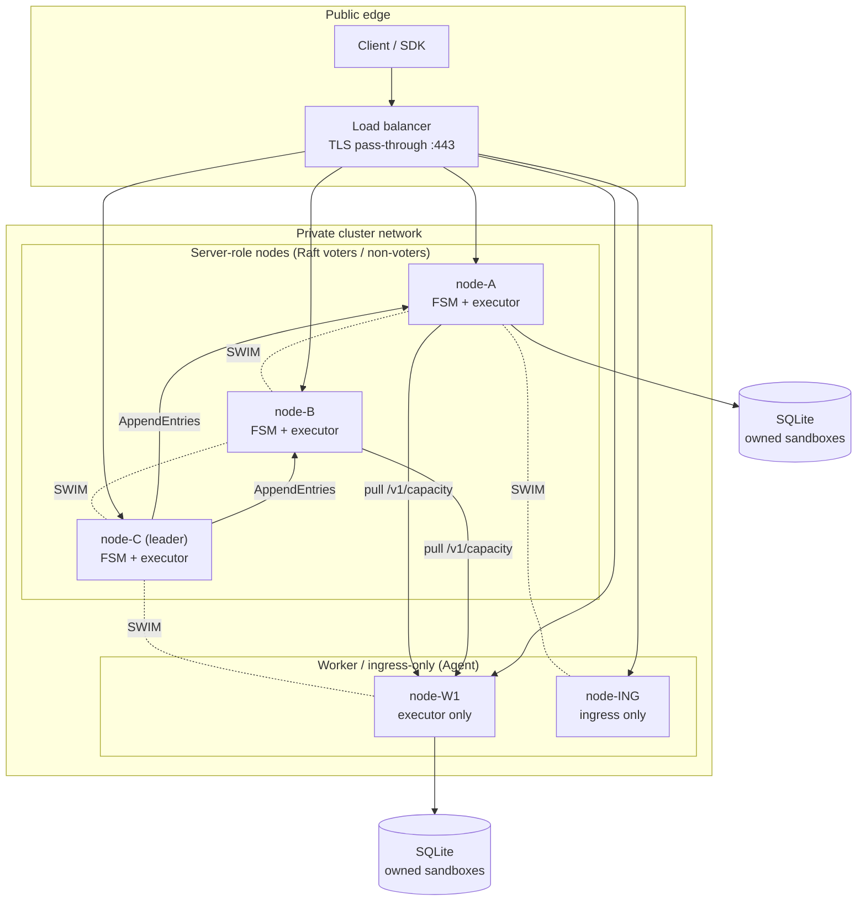
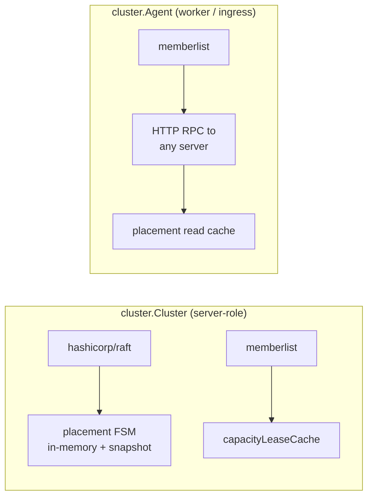
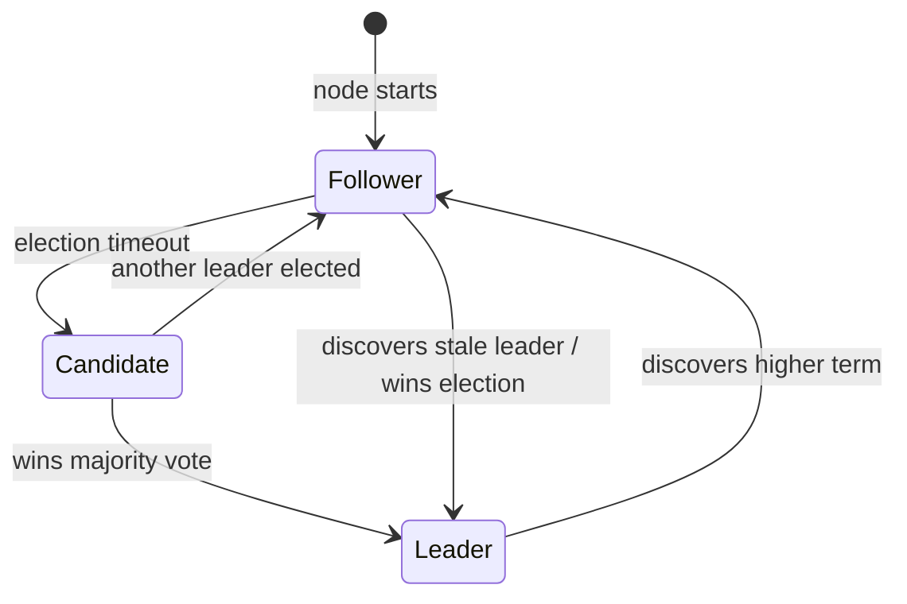
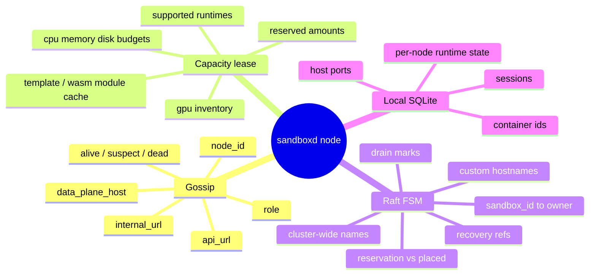

# Cluster topology and node roles

## Physical view

A production cluster is a fixed set of `sandboxd` processes — one per host — sharing secrets and three internal coordination channels.

Every node runs the same binary. **Role** (`SB_NODE_ROLE`) decides whether it hosts the Raft FSM, only executes sandboxes, or only serves ingress.

## Node roles

| Role | Runs Raft FSM | Can own sandboxes | Typical use |
|------|---------------|-------------------|-------------|
| `server` | Yes | No (control plane only) | Small quorum, dedicated planners |
| `worker` | No (`Agent`) | Yes | Large executor pool |
| `ingress` | No (`Agent`) | No | Edge TLS + route fan-out |
| `mixed` | Yes | Yes | Dev / small clusters (default in homogenous installs) |

Role helpers in `placement.go`:

- `CanOwnSandboxRole` — worker or mixed
- `CanServeControlPlaneRole` — server or mixed
- `CanServeIngressRole` — ingress or mixed

Empty role string is treated as legacy “can do everything” for rolling upgrades.

## Server node vs Agent

| Operation | Server (`Cluster`) | Worker (`Agent`) |
|-----------|-------------------|------------------|
| `SelectPlacement` | Local against FSM + leases | RPC → server runs algorithm |
| `ReserveOnTarget` / `RecordPlacement` | Raft apply (leader-forwarded) | RPC → server applies |
| `OwnerOf` | Local FSM read | RPC or cached shard read |
| Gossip | Publishes identity + URLs | Same |
| Capacity | Serves `/v1/capacity`; pulls peers | Serves `/v1/capacity`; pulled by servers |

Workers **never** store the authoritative FSM. They gossip so everyone knows how to reach everyone; placement authority lives on the server quorum.

## Raft membership

- **Voters** participate in elections and quorum (recommended odd count: 3, 5, 7).
- **Non-voters** receive replicated log (full placement map) but do not count toward majority — used when `SB_CLUSTER_MAX_AUTO_VOTERS` (default 5) is reached.
- Join flow: gossip first → leader adds node to Raft config (`voter_autojoin.go`).

Only the **leader** accepts new Raft log entries. Followers and Agents forward writes; API returns **503** if no leader is available.

## What each layer knows

**Important split:** Raft holds **intent and ownership**. SQLite on the owner holds **runtime reality**. They are updated in order on create: runtime first (local), then `opPlace` (cluster).

## Secrets and trust

Cluster-wide (same on every node):

| Secret | Purpose |
|--------|---------|
| `SB_PAT_TOKEN` | API auth; used on capacity pulls and forwarding fallback |
| `SB_GOSSIP_SECRET_KEY` | Encrypts gossip; gates auto-join |
| Cluster TLS bundle | mTLS on :7002 for cross-node API |
| `SB_CREDENTIAL_ENCRYPTION_KEY` | Unseal registry/mount creds on owner / failover |

Plaintext credentials never enter the Raft log — see `recovery_replication.go` and `06-failover-and-recovery.md`.

## Homogeneous vs split topology

**Homogeneous (3× mixed):** Each node is voter + executor. Simplest mental model; matches many integration tests.

**Split (3× server + N× worker):** Quorum stays small; executors scale without enlarging election blast radius. Placement RPC goes server → server for `SelectPlacement`, then create forwards to the chosen worker.

Both topologies use the **same placement algorithm**; only where `SelectPlacement` runs and where `opReserve` is applied differs (always on the server quorum).
