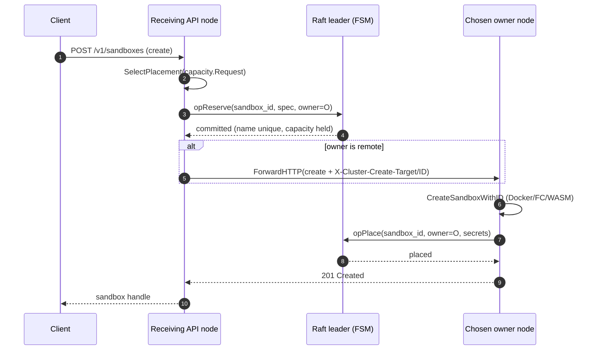
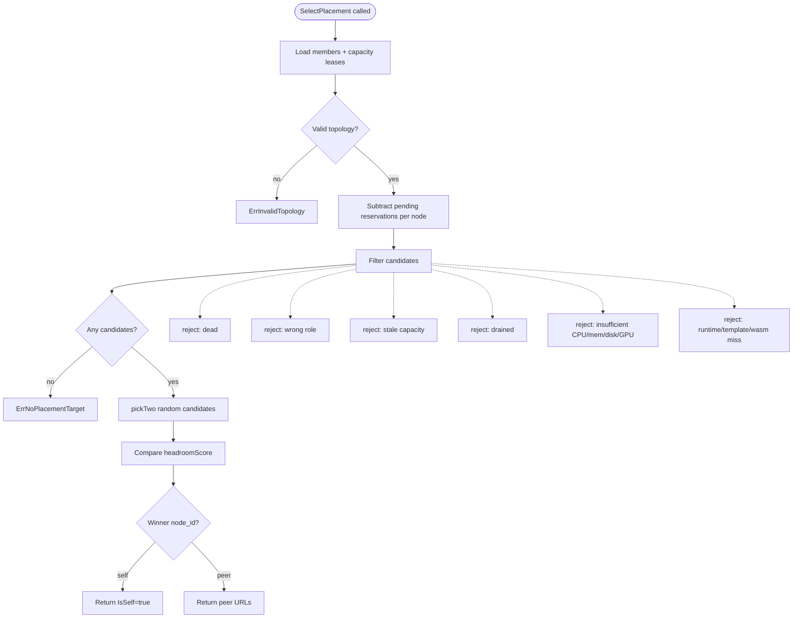
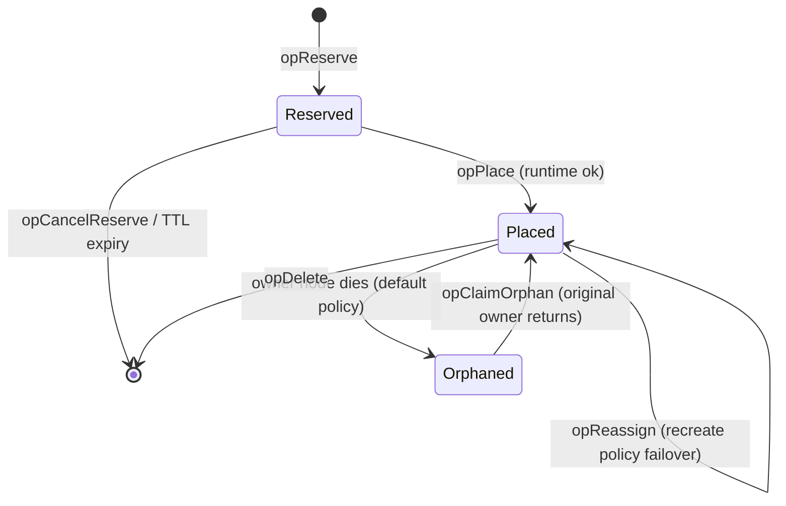

# Placement workflow — creating a sandbox

This document traces a **cluster-mode create** from the client through owner selection, reservation, forwarding, runtime boot, and final placement commit.

Entry points:

- `pkg/api/clustercreate/clustercreate.go` → `Prepare`, `CreateOnSelectedNode`
- `pkg/api/v1/cluster_handler.go` → HTTP handlers
- `internal/cluster/placement.go` → `SelectPlacement`

## High-level sequence



## Phase 1 — Request arrives at any node

Clients use one `baseURL` (e.g. behind a load balancer). **Any** healthy node may receive the create.

The handler normalizes the request (image distribution, failover policy, runtime) then calls `clustercreate.Prepare`.

Special case — **local-only images** (`ImageRequiresLocalPlacement`): the image cannot run on another host. Placement still runs, but reservation is skipped; the receiving node or selected peer with the image must execute locally.

## Phase 2 — SelectPlacement

`SelectPlacement` in `placement.go` chooses **one** owner candidate.



### Power-of-two-choices (not global scan)

1. Build filtered candidate list (alive, worker-capable, fresh capacity, not drained, fits request).
2. Sample **two** random candidates (`pickTwo`).
3. Pick the one with higher **headroom score** — fraction of CPU, memory, and (if reported) disk budget remaining after reservations and this request.
4. **Self wins ties** (`>` not `>=`): forward only when a peer is strictly better.

This is O(1) per decision and near-optimal at scale (Mitzenmacher’s “power of two choices” result).

### Pending reservations

Between gossip ticks, in-flight `opReserve` entries are visible in the FSM but not in capacity heartbeats. `pendingReservationsByNode` subtracts them before scoring so concurrent creates do not double-book the same node.

### Capacity request shape

`capacityRequestFromSpec` / `CapacityRequestFromCreate` normalize CPU, memory, disk (including Firecracker overlay), runtime, template ID, WASM module ref, and GPU requirements — shared by create and failover recreate paths.

## Phase 3 — opReserve (Raft)

Before starting the runtime, the router commits a **reservation**:

```
sandbox_id  →  owner=O, state=Reserved, expires≈now+120s
```

Checks at commit time:

- Cluster-wide **name uniqueness**
- Target worker still alive and fits capacity (including other pending reserves)
- Backpressure: `SB_CLUSTER_CREATE_MAX_PENDING_PER_WORKER` per node
- No overwrite of an already-**placed** sandbox

On success, headers are set for forwarding:

| Header | Meaning |
|--------|---------|
| `X-Cluster-Create-Target` | Chosen `node_id` |
| `X-Cluster-Create-ID` | Pre-assigned `sandbox_id` |

If `target.IsSelf`, the handler continues locally with `ReservationID`.

## Phase 4 — Forward to owner (if needed)

`cluster.ForwardHTTP` reverse-proxies the create to the owner’s API (mTLS :7002 when configured, else public URL + PAT).

The target node validates:

- `X-Cluster-Create-Target` matches `SelfNodeID()` (else **421 Misdirected Request**)
- `X-Cluster-Create-ID` is present (pre-reserved ID)

Then it runs `CreateOnSelectedNode` with that reservation ID.

## Phase 5 — Local runtime create (owner only)

On the owner:

```go
CreateSandboxWithID(ctx, req, reservationID)  // not a fresh random ID
```

This boots Docker / Firecracker / WASM using the **reserved** sandbox ID so URLs and placement records align.

Failure path:

1. Destroy partial runtime if any
2. `opCancelReserve` on the FSM (safe even if promote raced — cancel never deletes a placed sandbox)
3. Return error to client

## Phase 6 — opPlace (Raft)

After successful local create:

1. Seal secrets via `PutClusterSecretsForRecipient` (cluster credential key)
2. `RecordPlacement` → `opPlace` promoting Reserved → **Placed**
3. Attach redacted spec + secret ref to the FSM row (for failover / recreate)

Placement is committed **after** runtime success so the cluster never records a sandbox that failed to boot. If Raft commit fails, the owner rolls back the local sandbox.



## Idempotency and retries

| Scenario | Behavior |
|----------|----------|
| Retry same create with same sandbox ID | `ErrReservationConflict` → route to existing owner if already placed |
| Duplicate name | `ErrNameConflict` → 409 |
| Leader loss mid-reserve | Client retries; new leader sees pending reserve or empty slot |
| Owner crash after reserve, before place | Reservation TTL (120s) + 5s reconciler releases capacity |

## Single-node shortcut

When `EnableCluster=false`, `Noop.SelectPlacement` always returns self. `Prepare` returns immediately with no reserve/forward. `CreateSandbox` assigns ID and runs locally — same service code path, no Raft.

## Timing diagram (happy path)

```mermaid
gantt
    title Cluster create (remote owner)
    dateFormat X
    axisFormat %Ls

    section Receiving node
    SelectPlacement           :a1, 0, 2
    opReserve (Raft)          :a2, 2, 8
    Forward HTTP              :a3, 8, 10

    section Owner node
    CreateSandboxWithID       :b1, 10, 500
    Seal secrets              :b2, 500, 505
    opPlace (Raft)            :b3, 505, 512

    section Client
    Total perceived latency   :crit, 0, 512
```



Boot-path latency (Docker pull, Firecracker cold start, WASM module load) dominates; Raft reserve+place is typically single-digit milliseconds on a healthy quorum.

## Batch creates

`opReserveBatch` folds N reservations into **one** Raft entry for burst efficiency. Validation is all-or-nothing under the FSM lock — partial batch commit is impossible.
