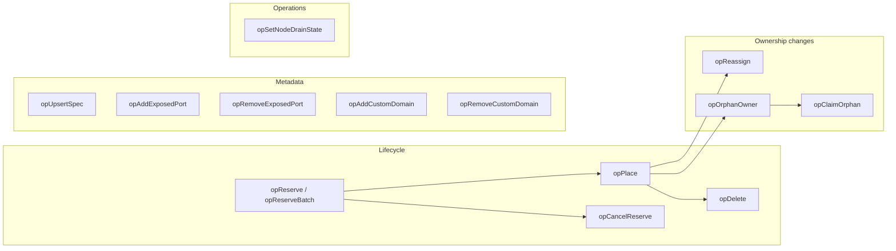
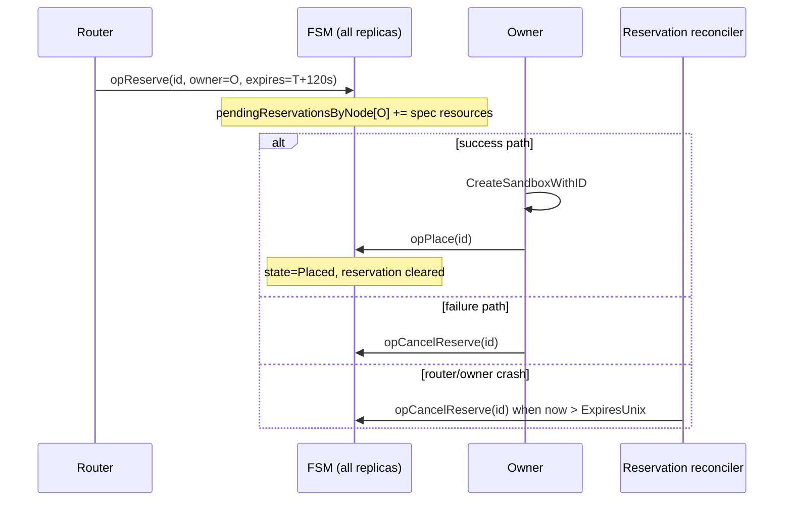
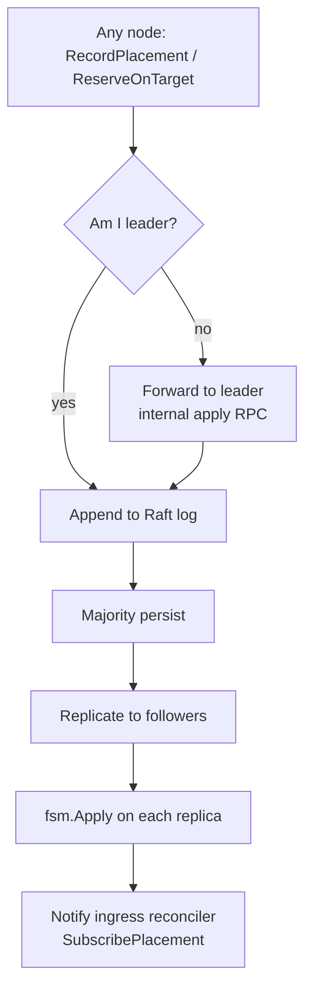
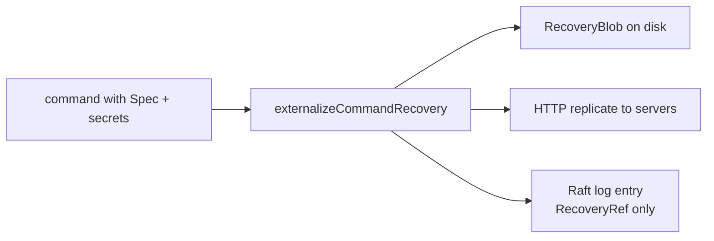

# Placement FSM — states, operations, invariants

The **placement finite-state machine** lives in `internal/cluster/fsm.go`. It is replicated by HashiCorp Raft: each mutation is one log entry; every server-role replica applies the same deterministic transition.

## Data model (conceptual)

Each sandbox ID maps to a `Placement` struct (`cluster.go`):

| Field | Role |
|-------|------|
| `SandboxID` | Stable identifier (also drives default hostname) |
| `OwnerNodeID` | Executing node; empty when orphaned |
| `OwnerAPIURL` / `OwnerDataPlaneHost` | Forwarding targets (gossip can refresh URLs) |
| `OwnerState` | `Placed`, `Reserved`, `Orphaned`, … |
| `Name` | Hot copy for cluster-wide name index |
| `RecoveryRef` | Pointer to sealed spec blob (not in Raft log body) |
| `Spec` | Redacted create request (hydrated from recovery store when needed) |
| `SecretRef` / `SecretVersion` | Handle to unseal credentials on owner |
| `ExposedPorts` / `ExposedPortRoutes` | Replicated port **intent** for failover |
| `CustomHostnames` | Cluster-wide TLS hostname bindings |
| `Version` | Raft log index at last mutation (drives ingress reconcile) |

Secondary indexes (same FSM):

- **Name → sandbox_id** (uniqueness)
- **Hostname → sandbox_id** (ingress / TLS-ask)
- **Owner → list of sandbox IDs** (dead-owner sweep, drain checks)
- **Pending reservations per owner** (placement scoring)

## FSM operation catalog

| Op | Purpose |
|----|---------|
| `opReserve` | Hold name + capacity on chosen owner before runtime |
| `opReserveBatch` | Same, N sandboxes in one Raft entry |
| `opCancelReserve` | Release reservation (rollback / TTL GC); **never** deletes placed |
| `opPlace` | Promote reserved → placed; or record placement after local create |
| `opDelete` | Remove placement row |
| `opReassign` | Change owner (failover recreate) |
| `opOrphanOwner` | Bulk orphan all sandboxes of a dead node |
| `opClaimOrphan` | Original owner reclaims false-positive death |
| `opUpsertSpec` | Resize / lifecycle update without moving owner |
| `opAddExposedPort` / `opRemoveExposedPort` | Replicate exposure intent |
| `opAddCustomDomain` / `opRemoveCustomDomain` | Global hostname binding |
| `opSetNodeDrainState` | Operator cordon — exclude node from `SelectPlacement` |

## Reservation lifecycle (detail)

**Why TTL matters:** A crashed router between reserve and forward leaves capacity “held” until expiry. Reconciler tick ≈ 5s; worst-case sticky reservation ≈ 125s.

**Why cancel is safe after place:** `opCancelReserve` only affects `Reserved` rows. A late rollback cannot delete a successfully placed sandbox.

## Write path through Raft

Reads (`OwnerOf`, placement queries) hit the **local FSM snapshot** — no round-trip to leader. Staleness is bounded by Raft replication lag (normally sub-ms to low ms).

## Versioning and watchers

`Placement.Version` is set to the Raft **log index** on apply. This survives snapshots and fixes cold-restart watcher bugs.

Consumers:

- **Ingress reconciler** — install Caddy/L4 routes when version advances
- **Owner watcher** — trigger `RecreateSandbox` after `opReassign`
- **Convergence API** — `GET /v1/cluster/placements/:id` exposes `placement_version` vs `node_installed_version`

## Recovery externalization

Before a command enters the log, `externalizeCommandRecovery` (`recovery_replication.go`):

1. Seals full spec + secrets into a `RecoveryBlob`
2. Replicates blob to peer server nodes over HTTPS
3. Strips plaintext from the Raft command → only `RecoveryRef` remains

Followers apply ownership without unsealing. Only the assigned owner fetches and decrypts when recreating.

## Core invariants

1. **Single writer per sandbox ID in FSM** — at most one of {reserved, placed, orphaned} row; name index is unique cluster-wide.
2. **Ownership authority** — whatever the **committed** FSM says is the owner; SQLite on other nodes is irrelevant for routing.
3. **Reserve before place on cluster create** — capacity held in FSM before runtime starts (except local-image fast paths).
4. **Place after local success** — no placed row without a running owner attempt; rollback destroys runtime on Raft failure.
5. **Orphan ≠ delete** — dead owner leaves rows observable (410 Gone) unless recreate policy reassigns.
6. **Drain is hard exclusion** — drained nodes never appear in `SelectPlacement` candidates.
7. **No plaintext secrets in Raft log** — only refs and redacted specs.

## Interaction with local SQLite

| Concern | Raft FSM | Owner SQLite |
|---------|----------|--------------|
| Who owns sandbox X? | Yes | Mirror for local ops only |
| Container ID | No | Yes |
| Host port allocations | Intent in FSM | Actual binding in SQLite |
| Live session state | No | Yes |
| Cluster-wide name | Yes | Per-node names scoped to owner |

On create: SQLite write happens first; FSM `opPlace` second. On delete: typically local destroy then `opDelete` (service-layer ordering).

## Noop FSM (single-node)

`internal/cluster/noop.go` implements `cluster.Client` without Raft:

- `OwnerOf` → always self
- `SelectPlacement` → always self
- `RecordPlacement` → no-op success

The real SQLite store remains the sole source of truth.
