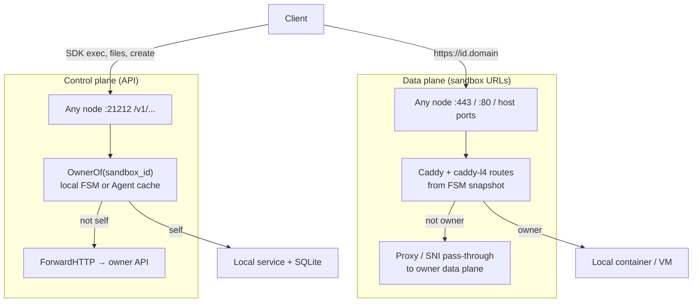
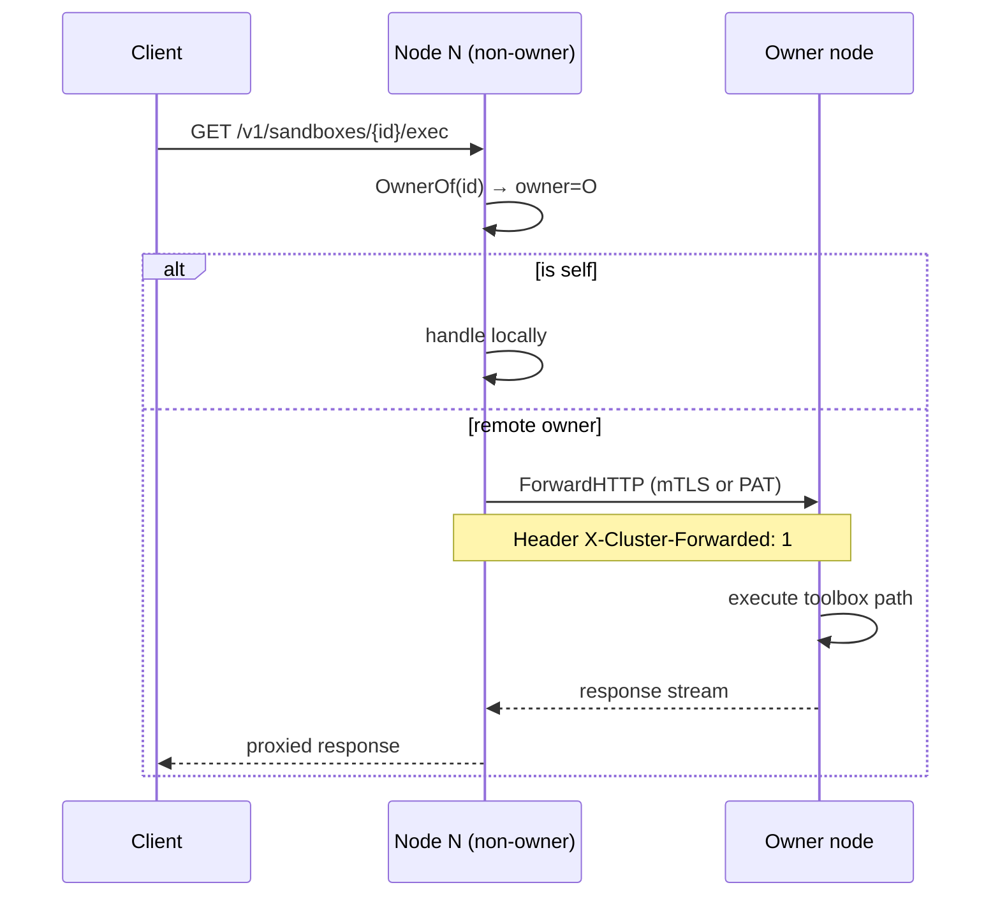
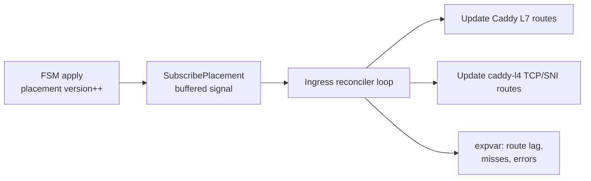
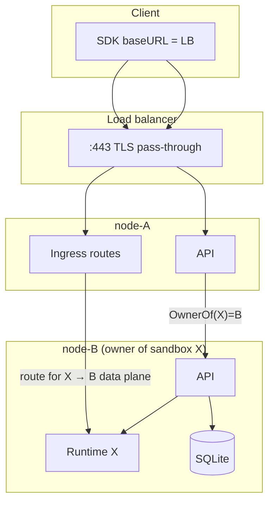

# Routing and forwarding — reaching the owner

Placement answers **who** owns a sandbox. This document covers **how** traffic gets there after that decision — API control plane and public data plane.

## Two traffic planes

| Plane | Uses Raft on hot path? | Resolution source |
|-------|------------------------|-------------------|
| API | No | FSM placement map + gossip URLs |
| Sandbox HTTP/TLS URLs | No | Ingress reconciler from FSM |
| Raw TCP host ports | No | Same — bind on every node, proxy to owner |

## API forwarding (`forward.go`)

Every sandbox-scoped handler resolves ownership first:

### Transport selection

1. **Preferred:** cluster mTLS on `:7002` when both sides have `SB_CLUSTER_TLS_DIR`
2. **Fallback:** public `SB_API_ADVERTISE_URL` with `Authorization: Bearer PAT`

Separate reverse-proxy caches per transport — TLS state and keepalives are not shared.

### Loop prevention

If a node receives a request that already has `X-Cluster-Forwarded: 1` and would forward again → **421 Misdirected Request**. Caller should re-resolve owner (stale FSM view).

### Error contract (routing)

| HTTP | Meaning | Client action |
|------|---------|---------------|
| 503 | Owner URL unknown / no leader / placement resolving | Retry with backoff |
| 410 Gone | Placement orphaned (owner dead, default policy) | New create |
| 421 Misdirected | Forward loop / wrong target | Re-resolve owner |

## Create forwarding (special case)

Creates are different from exec/file paths:

1. **Receiving** node runs `SelectPlacement` + `opReserve` (not the owner).
2. Request is forwarded with pinned headers so only the chosen owner executes `CreateSandboxWithID`.
3. Owner commits `opPlace`.

This guarantees placement is chosen **once** cluster-wide, not independently on each hop.

## Ingress reconciliation

Non-owner nodes still install routes so a dumb load balancer can send `*.domain` to any backend.

**Event-driven:** each FSM mutation wakes the reconciler; a 5s tick is a safety net.

**Convergence:** `placement_version` vs `node_installed_version` on `GET /v1/cluster/placements/:id`. Brief window where HTTP returns 503 `Retry-After: 2` (“placement in flux”).

### Data-plane target address

Peers forward to `OwnerDataPlaneHost` (`SB_DATA_PLANE_ADVERTISE_HOST`), not necessarily the API URL. Set explicitly when API traffic uses a shared LB hostname that would loop back.

Forwarding modes (from `setup/cluster.md`):

| Exposure type | Non-owner behavior |
|---------------|-------------------|
| Domain HTTP (`id.domain`) | SNI pass-through to owner |
| IP/path HTTP | Reverse-proxy to owner :80 |
| Raw TCP `host_port` | Bind same port locally, proxy to owner |
| TLS-SNI port routes | Pass-through to owner :443 |

## Worker / Agent nodes

Agents do not run the full FSM. For `OwnerOf`:

- Point read via control-plane RPC, or
- Cached placement shard/page (for list operations)

Forwarding behavior is identical — once owner is known, `ForwardHTTP` applies.

## Single-node mode

`Noop` reports every sandbox as owned locally. No forwarding, no ingress fan-out to remote owners. Caddy routes still reconcile from local SQLite + placement noop.

## End-to-end diagram (steady state)

**Takeaway:** Clients stay ignorant of placement. The cluster presents one API URL; ingress makes sandbox URLs work no matter which node receives the TCP connection.
