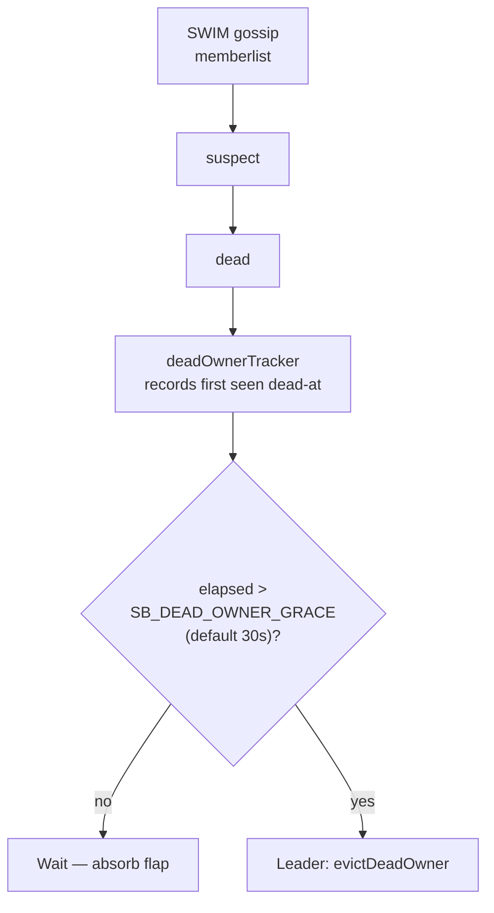
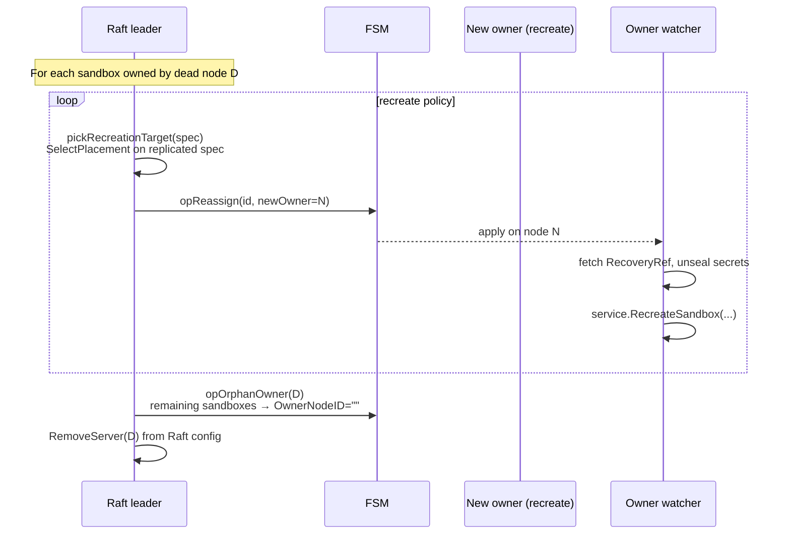
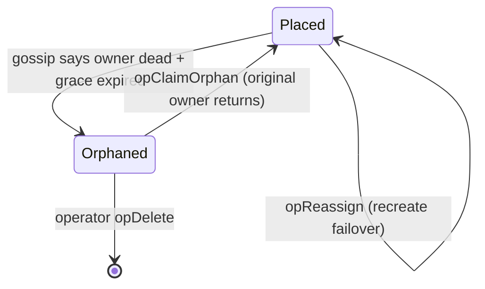
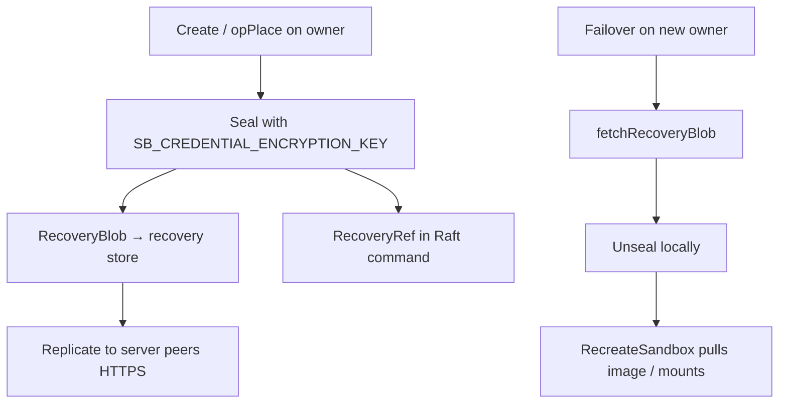

# Failover, orphaning, and recovery

Default product policy: **sandboxes are not HA**. If the owner host dies, the container/VM and its writable layer are gone. The **cluster** survives: quorum continues, other sandboxes keep running, new placements use remaining capacity.

Opt-in: `failover.policy = "recreate"` — leader reassigns placement; new owner rebuilds from replicated spec.

## Failure detection

Gossip provides **liveness**, not capacity. A node can be dead in gossip while capacity leases are merely stale — placement already excludes stale capacity.

## Leader eviction sequence

`dead_owner.go` runs on the **Raft leader only**, in order:

### Step 1 — Recreate policy (`opReassign`)

For each dead-owned sandbox with `failover.policy = "recreate"`:

1. `pickRecreationTarget` calls `SelectPlacement` on the **replicated spec** (same gating as create).
2. One `opReassign` Raft entry per sandbox → new `OwnerNodeID`.
3. New owner’s **owner watcher** (`owner_watcher.go`) sees the assignment on FSM apply.
4. Watcher loads sealed spec from `RecoveryRef`, unseals with cluster credential key, calls `RecreateSandbox`.

Recreate sandboxes **skip** the orphaned state — they go directly from old owner to new owner with the same sandbox ID.

### Step 2 — Orphan the rest (`opOrphanOwner`)

Sandboxes without recreate policy:

- `OwnerNodeID` cleared, `OwnerState = Orphaned`
- Pending reservations on dead node released
- API returns **410 Gone** for that sandbox ID
- Rows are **not deleted** — observable for operators and false-positive recovery

### Step 3 — Remove from Raft (`RemoveServer`)

Raft config drops the dead node. **Order matters:** orphan/reassign first so a crashed leader mid-eviction leaves observable state, not “owner points at ghost server ID.”

## False-positive recovery (`opClaimOrphan`)

A node marked dead by gossip may still be running its containers (network partition, long GC pause).

When the original owner returns:

1. Boot-time `AssertOwnership` compares local SQLite sandboxes vs FSM orphans.
2. For matches, `ClaimOrphan` → `opClaimOrphan` reclaims placement **only if** orphaned from this node.

`opPlace` refuses to silently overwrite an orphan — explicit claim prevents two live owners.

## What survives vs what does not

| Artifact | Survives owner death? | Notes |
|----------|----------------------|-------|
| FSM spec + secret ref | Yes | In Raft + recovery store |
| Exposed port **intent** | Yes | New owner re-binds host port; may park if conflict |
| Custom hostnames | Yes | Ingress reconciles to new owner |
| Container / VM process | No | Local to dead host |
| Writable layer / sessions | No | Unless on external mount |
| Default public URL | No (410) | Unless recreate policy |
| Other sandboxes on cluster | Yes | Unaffected |

## Recovery replication (credentials)

Raft never stores plaintext registry passwords or mount credentials.

All nodes must share the **same** credential encryption key (`cluster-init` / `cluster-join` distribute it). Mismatched keys → recreate cannot pull private images.

## TCP host port replay

FSM carries original `host_port` for TCP exposures. On recreate:

- New owner attempts to bind the **same** host port (cluster-stable endpoint).
- If port taken locally → exposure **parks** (`ErrPreferredHostPortUnavailable`), `converged: false` — does not silently pick a different port.

## Operator tools

| Action | API / mechanism |
|--------|-----------------|
| Cordon node from new placements | `POST /v1/cluster/nodes/{id}/drain` → `opSetNodeDrainState` |
| Inspect placement + convergence | `GET /v1/cluster/placements/{sandbox_id}` |
| Force-remove dead member | `DELETE /v1/cluster/members/{id}` (orphans placements) |
| List members + capacity | `GET /v1/cluster/members` |

Drain excludes a node from `SelectPlacement` but does not evict existing sandboxes — drain → wait for empty → remove.

## Placement after partial cluster loss

| Failure | Placement writes | Existing sandboxes | New creates |
|---------|------------------|-------------------|-------------|
| Worker dies | Continue | On other nodes: OK. On dead node: gone / recreate | `SelectPlacement` skips dead worker |
| Minority voter loss | Continue | OK | OK |
| Majority voter loss | **Stop** (no leader) | Owners still serve locally | 503 until quorum recovery |
| Network partition (split) | Only majority partition commits | Minority cannot mutate placement | See CAP note in `01-overview.md` |

## Design limits (explicit)

- **Grace period:** 30s default before eviction — tunable `SB_DEAD_OWNER_GRACE`.
- **Recreate is best-effort:** Ephemeral disk state is lost; only replicated intent returns.
- **Reservation TTL:** Crashed create can hold capacity up to ~125s.
- **Capacity staleness:** ~15s TTL — recovering host may miss placements briefly.
- **Two voter Raft:** Rejected at startup (`LargeClusterTopologyError`) — same fault tolerance as one voter, worse quorum math.

## Related flows (not placement, but coupled)

- **Ingress reconcile** after `opReassign` — non-owners repoint routes to new owner data plane.
- **Platform volumes** — FSM replicates volume metadata; data lives in S3/NFS (`opUpsertVolume` family).
- **Lost quorum recovery** — operational procedure in `setup/cluster.md` / `scripts/raft-lost-quorum-recover.sh`; destructive to unreplicated log tail.
