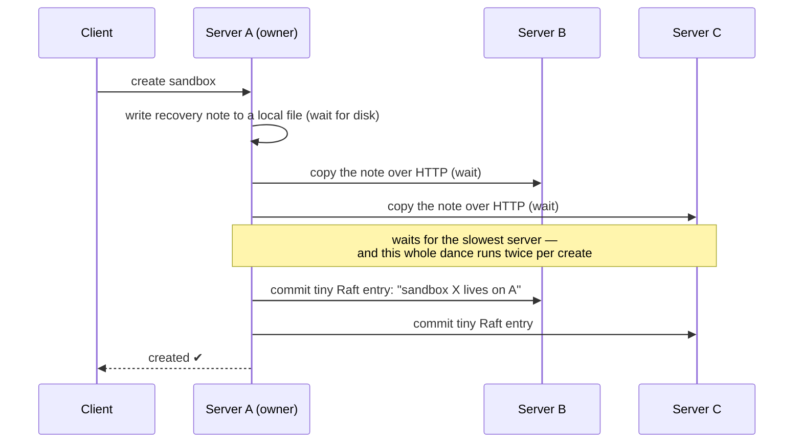
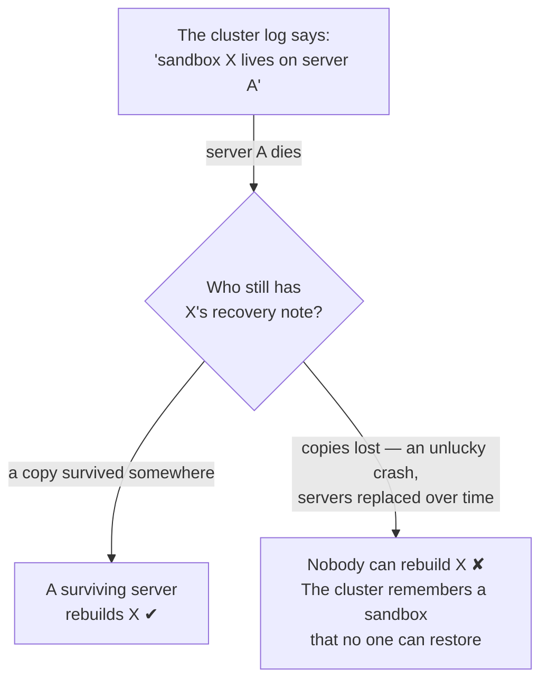
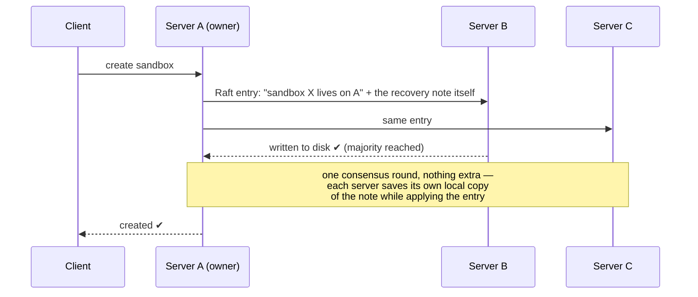

# The latency fix that quietly made our failover safer

*AerolVM engineering — July 2026*

We recently shipped a performance release (v0.6.0) that cut warm sandbox creation on our clusters from about 43 milliseconds to 28. That was the goal. The surprise was what came with it: the same change closed a real durability gap. Data that used to be copied between servers on a best-effort basis is now guaranteed to survive on a majority of servers *before* we ever tell you your sandbox exists.

This is the story of what was there before, how we found the problem (by accident, while hunting milliseconds), and why the fix made the system safer, not just faster.

## The recovery note

AerolVM runs sandboxes — small, disposable Linux environments — spread across a cluster of servers. Every sandbox has an owner: the server actually running it.

Servers die. Spot instances get reclaimed, disks fail, someone trips over the wrong cable. When an owner dies, another server is supposed to rebuild its sandboxes. To do that, the new server needs to know what the sandbox *was*: which image it ran, its settings, and a handle to its credentials.

We keep all of that in what we call a **recovery note**. Small — usually under a kilobyte. Boring. And absolutely load-bearing: if nobody has the note, nobody can rebuild the sandbox.

## What we had before

Our cluster already uses Raft for coordination. If you haven't met it: Raft is a way for a group of servers to agree on one shared, ordered list of events. An event is *committed* once a majority of servers have written it durably to disk — after that, the cluster cannot forget it.

So when a sandbox was created, a tiny event went into that log: *"sandbox X now lives on server A."* But the recovery note itself did **not** go into the log. It took a separate trip:

At first glance this looks *more* than safe. We push the note to **every** server — that's even more copies than a majority. The problem isn't how many copies exist when everything goes right. It's what is *guaranteed* when things go wrong.

The cluster's memory that the sandbox exists lives in the Raft log — majority-durable, effectively unforgettable. But the note needed to *act* on that memory lived outside the log, held together by ordinary file copies made at one moment in time. Those two things can drift apart:

A badly-timed crash during that copy step could leave the surviving servers without the note. Servers that joined the cluster later never received the original push at all — they had to fetch the note from whoever still held a copy, and if those holders were gone, the fetch came back empty-handed. The decision was durable; the data behind the decision was merely *probably around*.

## How we found it — while looking for something else

We weren't auditing durability. We were staring at a benchmark.

Warm sandbox creation was measuring 40–44ms, and our target was 30. The per-stage timings pointed at one step: the cluster "promote" — recording the placement — was eating 23–25ms all by itself.

Our first theory was disk flushes in the Raft log store. So we swapped the log store for a faster write-ahead-log implementation and re-ran the benchmark.

**The numbers didn't move.** 23ms before, 25ms after. Same on both backends.

That's the moment a wrong theory becomes useful: if the disk isn't the cost, something else on that path is. Reading the code with fresh eyes, there it was — before every Raft commit, the owner synchronously wrote the note file and pushed it over HTTP to every other member, waiting for the slowest one to answer. And because creation involves two Raft operations (one to reserve a slot, one to promote it), the whole tax was paid **twice per create**.

The expensive step wasn't consensus. It was the courier service we'd bolted on next to it.

## The fix: ship the data with the decision

The realization is almost embarrassing in hindsight. We already had a delivery mechanism that reaches every server, retries on failure, survives leader changes, and confirms majority durability before reporting success — the Raft log itself. And we were already sending an entry through it for every create.

So we put the note *inside* that entry:

No separate file write. No HTTP fan-out. No waiting on the slowest peer. Each server materializes its own copy of the note as a natural side effect of applying the log entry it was going to apply anyway.

There is one piece of small print, and it matters: **secret material never goes into the log.** A Raft log is permanent — you can't surgically erase one sandbox's bytes from it later, and we *do* want credentials to be erasable when a sandbox is destroyed. So notes ride inline only when they're small (under 4KiB) and carry no embedded secrets. Modern sandboxes only ever store a *reference* to their credentials, not the credentials themselves, so in practice everything takes the fast path — in our live verification run, 1,043 notes out of 1,043 went inline.

## What actually got safer

Before, "create succeeded" meant: *the placement is committed, and the note was pushed to everyone who was alive and reachable a moment ago.* Two different guarantees, stapled together with timing and hope.

Now, "create succeeded" means: *a majority of servers have durably written both the placement **and** the note, as one atomic entry.* If the owner dies a millisecond later, the note is already sitting on a majority of machines. There is no window where the cluster remembers a sandbox that nobody can restore.

And the speed? The promote step fell from 23–25ms to 10–11ms — what's left is the genuine cost of consensus, not overhead beside it. Warm creates now land at 28ms.

## What we'd tell you to take away

**If you're already paying for consensus, ship the data with the decision — not alongside it.** Any time critical data travels on a different channel than the commit that makes it matter, you've created two sources of truth and a timing window between them.

**Measure before you trust your own architecture story.** We "knew" the cost was disk flushes. A one-variable experiment (swap the log store, watch nothing change) killed that theory in an afternoon and pointed at the real one.

**Redundancy is not durability.** Five best-effort copies can still all be missing when it counts. One majority-committed entry cannot. Count guarantees, not copies.
