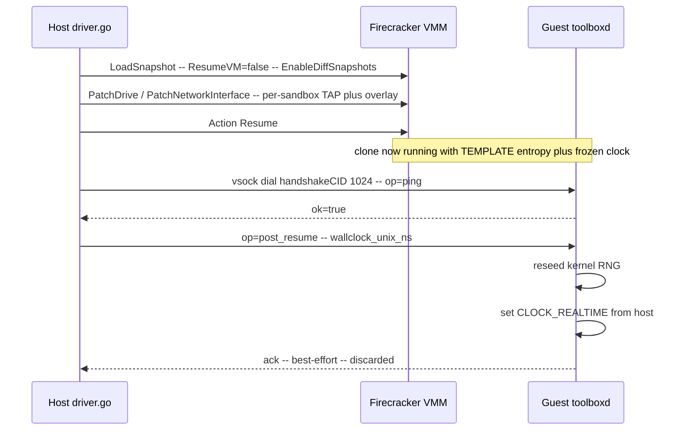

import { Tabs, TabItem } from '@astrojs/starlight/components';

A Docker container starts from nothing. A VM started from an ISO starts from
nothing. A Firecracker microVM resumed from a snapshot starts from **the exact
running state of another kernel** — page tables, file descriptors, scheduler
queues, the contents of `/dev/urandom`, the value `CLOCK_REALTIME` returned at
the moment of capture. That is what makes snapshot resume fast (sub-100ms
versus seconds for a cold boot) and it is what makes it dangerous.

Two clones of the same snapshot, left alone, are **the same machine**. Not
"similar". The same. Same entropy pool, same wall clock, same network
identity, same in-flight kernel state. Any code that runs in either of them
before they are forcibly *made different* will draw on inputs that are now
shared across the fleet.

This page is the war story: what specifically breaks, what we tried first,
and the architecture — a paused resume plus a vsock handshake plus a
post-resume reseed — that holds the invariant *every clone must be unique
before its vCPUs see guest code*.

## The first thing that broke

The first time we resumed a pool of clones from one snapshot in a test
harness, every sandbox in the batch produced the **same SSH host key on
first boot**. Not similar. Identical. The kernel's RNG pool had been
captured into the snapshot's memory image. Every clone resumed with the
same `random_state`, the same entropy estimate, and the same internal
ChaCha key. Every `getrandom()` call returned the same bytes in the same
order. `ssh-keygen -A` ran during early boot and produced bit-identical
Ed25519 keys across the fleet.

That is the headline hazard. It is also the friendliest one, because SSH
fingerprints make the bug *visible*. The four hazards underneath it are
worse precisely because they are silent:

- **Wall clock frozen at capture time.** `CLOCK_REALTIME` reads back the
  moment the snapshot was taken — minutes, hours, sometimes days in the
  past. TLS handshakes reject certificates as "not yet valid". `apt` thinks
  its package metadata is fresh when it's stale. `make` thinks files from
  the future need rebuilding. Log timestamps go backwards across a resume
  boundary, which breaks every correlator downstream.
- **Network identity inherited from the template.** The snapshot was
  captured against the template VM's TAP device. Two clones resumed
  against that same TAP both try to bind it; the second wins, the first
  loses traffic, and for a few hundred milliseconds packets cross between
  sandboxes.
- **Disk inherited from the template.** Same problem at the block layer.
  If the clone's first write goes to the template's rootfs file, the
  template drifts and every subsequent clone resumes into a corrupted
  base.
- **In-flight kernel state.** Half-completed syscalls, sockets in
  `TIME_WAIT`, futexes held by threads that no longer exist in this
  clone's namespace — all preserved verbatim. Most don't matter. Some
  (in-progress DHCP leases, in-flight DNS queries) absolutely do.

## What didn't work

**Idea 1: reseed `/dev/urandom` from inside the template's init script.**
Doesn't work — the seed source is in the same shared memory image, so
"random" reseed bytes are identical too. You cannot bootstrap uniqueness
from a state that is itself shared.

**Idea 2: pass a per-clone seed via kernel cmdline.** Firecracker's
snapshot resume doesn't replay the boot path. Kernel cmdline was parsed
once, at template boot, and is now frozen inside the memory image. New
cmdline arguments on resume are ignored.

**Idea 3: let the guest fix itself once it notices the wall clock is
wrong.** The window between "clone resumes" and "clone notices anything"
is exactly the window in which guest code derives long-lived secrets,
hits TLS endpoints, and writes log lines. By the time the guest reseeds
itself, the damage is in your customer's database.

**Idea 4: just don't snapshot.** Cold-boot every sandbox. We considered it
seriously. Cold boots are 30–80× slower than snapshot resume on the
hardware we target; the entire performance story of the platform
collapses without this path.

The conclusion from those four dead ends: **the fix cannot live entirely
inside the guest, and it cannot live entirely outside the guest.** The
host has the inputs the clone needs (current wall clock, a per-clone CID,
a fresh TAP, a per-clone overlay) but cannot reach into the guest's
address space to install them. The guest can install them but cannot
manufacture them. So the architecture has to be a *cooperation* — and the
cooperation has to happen in a window the guest's own application code is
not yet running in.

## The architecture

Three primitives, ordered. Each one is load-bearing; remove any and the
hazards return.

### 1. Resume paused, patch device identity, then unfreeze

`LoadSnapshot` with `ResumeVM=false`. The clone's memory image is mapped,
the vCPUs are configured, but **the vCPUs do not run yet.** While the clone
is paused:

- `PatchDrive` swaps the template's rootfs reference for this clone's
  own copy-on-write overlay. Writes from this point on land in the
  clone's overlay, not the template.
- `PatchNetworkInterface` swaps the snapshot's TAP for a per-sandbox TAP
  on the host bridge. The guest kernel still believes it owns the
  template's TAP — the patch happens at the Firecracker boundary, below
  the guest's view.

Only then does `Action(Resume)` release the vCPUs. The guest kernel never
runs against the template's disk or NIC. It runs against its own from
instant zero.

`EnableDiffSnapshots` is what makes the disk patch possible. Without it,
the memory image is mapped read/write and clone writes corrupt the
template directly. With it, the memory mapping is `MAP_PRIVATE` and the
kernel's copy-on-write handler routes each first-write to a fresh
private page.

### 2. vsock as the bootstrap-safe control channel

The host needs to talk to the clone *before* it can trust the clone's
network stack. DHCP hasn't run, the per-sandbox routing rules may or may
not have been applied yet, and the guest still believes its IP is
whatever the template had at snapshot time. Any path through the IP
stack is, for a hundred milliseconds or so, unreliable.

vsock is the answer. It is a hypervisor-mediated socket — guest userspace
sees a `AF_VSOCK` socket, the host sees a vsock proxy, and traffic
crosses the VMM boundary without touching the guest's network stack at
all. The handshake CID is part of the per-clone Firecracker config, set
during the paused window, so the host always knows where to dial.

The host opens the vsock, sends `op=ping`, and waits for `ok=true`. That
exchange proves the in-guest agent (toolboxd) survived the resume and
is ready to take orders. Nothing else has run yet — the agent is
launched by an early systemd unit specifically so it wins the race
against any other guest code.

### 3. post_resume: the host pushes truth into the guest

With the control channel established, the host sends one message:

```
op=post_resume, wallclock_unix_ns=<host's current time>
```

The guest does two things, in order:

1. **Reseed the kernel RNG.** The agent reads fresh bytes from the
   host-supplied wall clock value (mixed with a TSC read for finer
   granularity) and writes them into `/dev/urandom` via the
   `RNDADDENTROPY` ioctl, then increments the entropy counter via
   `RNDADDTOENTCNT`. The kernel's ChaCha state advances, and every
   subsequent `getrandom()` returns bytes that are unique to this
   clone.
2. **Set `CLOCK_REALTIME`.** `clock_settime(CLOCK_REALTIME, ...)` with
   the host-supplied wall clock. `time(2)`, `gettimeofday(2)`, and every
   downstream time API now report reality.

The guest acks. The host discards the ack. (Reasoning below.)



## The unsafe window, and why it's visible by design

Between `Action(Resume)` and the moment the guest finishes reseeding,
**there is a window — typically a few hundred milliseconds, longer on a
loaded host — in which the clone is running with shared entropy and a
stale clock.** We do not pretend this window does not exist. The
architecture cannot eliminate it; the guest has to be alive to receive
the post_resume message, and "alive" means "running guest code".

The contract we publish to template authors is:

> Do not generate long-lived secrets, sign tokens, derive cryptographic
> keys, or take timestamps you care about, before `toolboxd` signals
> `post_resume_complete`.

Our shipped templates defer SSH host key generation, TLS cert
generation, and machine-id assignment until after that signal.
Application code that runs at boot must wait on the same gate.

This is the load-bearing tradeoff: we chose a small *visible* unsafe
window with a documented contract over a hidden one papered over with
heuristics. A heuristic ("reseed inside the guest the moment the clock
jumps forward") is worse than a contract, because the heuristic gives
the impression that everything is fine and silently fails when the
assumption breaks.

## Why best-effort and not fatal

The post_resume ack is discarded for a specific reason. Making it fatal
("if the ack doesn't arrive in N ms, kill the sandbox") would mean:

- A briefly slow guest (page-fault storm from CoW resolution, kernel
  pre-emption under host load) gets killed even though it would have
  recovered.
- An entire class of intermittent sandbox-creation failures appears
  under host load, exactly when operators least want to debug a new
  failure mode.
- The host becomes responsible for a property (post-resume reseed
  succeeded) that is fundamentally a guest invariant. Coupling them
  inverts the dependency direction.

In practice, the local guest operations (`RNDADDENTROPY` ioctl,
`clock_settime`) cannot fail on a healthy kernel. If they did, the
clone is too sick to be useful anyway, and the next operation against
it will surface that. We chose to let the slow-guest case resolve
itself rather than tie sandbox health to ack timing.

## What we don't claim this fixes

- **In-flight kernel state from the template.** A socket in `TIME_WAIT`
  at snapshot time is still in `TIME_WAIT` after resume. Open file
  descriptors, in-flight DNS queries, half-completed syscalls — all
  inherited. The reseed handshake does not address them. The mitigation
  is template hygiene: capture snapshots from a quiesced template, not
  from one in the middle of doing work.
- **Address-space layout overlap.** Two clones share the same kernel
  ASLR offsets because they share the kernel memory image. KASLR is a
  per-boot randomization; resume is not a boot. For threat models that
  rely on cross-tenant KASLR diversity, snapshot resume is the wrong
  primitive — cold-boot those tenants.
- **Per-CPU state on the host.** TSC values, host scheduler decisions,
  and other host-side variability leak into guest timing in subtle ways
  that this handshake doesn't try to normalize. If your workload is
  sensitive to those, snapshot resume is again the wrong primitive.

The honest framing: we made the *guest-visible* state unique. We did not
make the clones cryptographically indistinguishable from a cold boot,
and we don't claim to.

## What this buys you

From any SDK, snapshot-backed sandbox creation behaves like any other
create — same call shape, same returned sandbox, just dramatically
faster cold start. The reseed handshake is invisible to the caller.

<Tabs syncKey="lang">
  <TabItem label="TypeScript">
    ```ts
    import { MicroVM } from '@aerol-ai/aerolvm-sdk'

    const client = new MicroVM({
      apiUrl: process.env.SB_API_URL,
      patToken: process.env.SB_PAT_TOKEN,
    })

    // Resumed from a Firecracker template snapshot. The post_resume
    // handshake runs before the call returns; by the time `sandbox` is
    // in your hand, the guest's RNG and wall clock are fresh.
    const sandbox = await client.create({
      runtime: 'firecracker',
      templateId: 'python-3.12-warm',
      cpu: 1,
      memoryMB: 512,
    })

    // First exec sees a unique RNG state and the current wall clock.
    const out = await sandbox.exec('python3 -c "import secrets, time; print(secrets.token_hex(8), int(time.time()))"')
    console.log(out.stdout)
    ```
  </TabItem>
  <TabItem label="Python">
    ```python
    from microvm import MicroVM

    client = MicroVM(
        api_url='https://sandbox.example.com',
        pat_token='your-token',
    )

    sandbox = client.create({
        'runtime': 'firecracker',
        'templateId': 'python-3.12-warm',
        'cpu': 1.0,
        'memoryMB': 512,
    })

    # Post-resume reseed has already completed. secrets.token_hex
    # returns clone-unique bytes; time.time() returns wall-clock now.
    out = sandbox.exec('python3 -c "import secrets, time; print(secrets.token_hex(8), int(time.time()))"')
    print(out['stdout'])
    ```
  </TabItem>
  <TabItem label="Go">
    ```go
    import (
        "context"
        "fmt"
        "log"
        "os"

        microvm  "github.com/aerol-ai/microvm/sdk/go/pkg/microvm"
        sdktypes "github.com/aerol-ai/microvm/sdk/go/pkg/types"
    )

    client, err := microvm.NewClientWithConfig(&sdktypes.MicroVMConfig{
        APIUrl:   os.Getenv("SB_API_URL"),
        PATToken: os.Getenv("SB_PAT_TOKEN"),
    })
    if err != nil {
        log.Fatal(err)
    }

    sandbox, err := client.Create(context.Background(), sdktypes.CreateSandboxOptions{
        Runtime:    "firecracker",
        TemplateID: "python-3.12-warm",
        CPU:        1,
        MemoryMB:   512,
    })
    if err != nil {
        log.Fatal(err)
    }

    out, err := sandbox.Exec(context.Background(),
        `python3 -c "import secrets, time; print(secrets.token_hex(8), int(time.time()))"`)
    if err != nil {
        log.Fatal(err)
    }
    fmt.Println(out.Stdout)
    ```
  </TabItem>
  <TabItem label="Rust">
    ```rust
    use aerolvm_sdk::{Client, CreateOptions};

    let client = Client::new(
        Some("https://sandbox.example.com"),
        Some("your-token"),
    )?;

    let sandbox = client.create(CreateOptions {
        runtime:     Some("firecracker".to_string()),
        template_id: Some("python-3.12-warm".to_string()),
        cpu:         Some(1),
        memory_mb:   Some(512),
        ..Default::default()
    })?;

    let out = sandbox.exec(
        r#"python3 -c "import secrets, time; print(secrets.token_hex(8), int(time.time()))""#,
    )?;
    println!("{}", out.stdout);
    ```
  </TabItem>
  <TabItem label="Java">
    ```java
    import ai.aerol.microvm.MicroVMClient;
    import ai.aerol.microvm.MicroVMConfig;
    import ai.aerol.microvm.Sandbox;
    import ai.aerol.microvm.model.CreateOptions;
    import ai.aerol.microvm.model.ExecResult;

    MicroVMClient client = new MicroVMClient(
        new MicroVMConfig()
            .setApiUrl("https://sandbox.example.com")
            .setPatToken(System.getenv("SB_PAT_TOKEN"))
    );

    Sandbox sandbox = client.create(
        new CreateOptions()
            .setRuntime("firecracker")
            .setTemplateId("python-3.12-warm")
            .setCpu(1.0)
            .setMemoryMb(512)
    );

    ExecResult out = sandbox.exec(
        "python3 -c \"import secrets, time; print(secrets.token_hex(8), int(time.time()))\""
    );
    System.out.println(out.stdout);
    ```
  </TabItem>
</Tabs>

Run the same snippet against two sandboxes created from the same
template back-to-back. The `token_hex` values are different. The
`time.time()` values are the current wall clock. Without the handshake,
both would have returned identical token bytes and a timestamp from
whenever the snapshot was captured.

See also:
[Snapshot Clone Correctness](/engineering-snapshot-correctness) for the
broader hazard catalogue and the supporting invariants, and
[Hydration & Operational Fold](/firecracker-hydration) for how the
warm-VMM pool fits underneath this.
