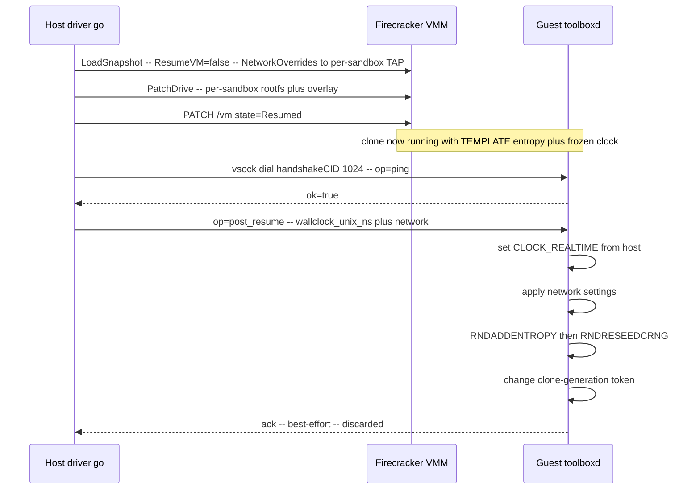

import { Tabs, TabItem } from '@astrojs/starlight/components';

A Docker container starts from nothing. So does a virtual machine booted from an install disk. A Firecracker **microVM** (a small, fast virtual machine with its own kernel) resumed from a **snapshot** does not. It starts from **the exact running state of another kernel**.

A snapshot is a saved copy of a running virtual machine's memory and devices. That state includes page tables, open files, scheduler queues, the contents of `/dev/urandom` and the time `CLOCK_REALTIME` showed at capture. This is why resuming is fast: under 100 ms, against seconds for a cold boot. It is also why resuming is dangerous.

**In short:**

- Two clones of one snapshot are the same machine: same random-number state, same clock, same network identity.
- The fix cannot live only inside the guest or only on the host. The two have to cooperate.
- AerolVM resumes each clone paused, gives it its own disk and network, and only then starts it.
- The host then talks to the clone over vsock, a direct host-to-VM channel. It has the clone reseed its randomness and set its clock.
- A short unsafe window remains, so templates wait for a signal before they make secrets.

Left alone, two clones of the same snapshot are **the same machine**. Not similar: the same. They share the entropy pool (the kernel's store of unpredictable bits for making random numbers), the wall clock, the network identity and half-finished kernel work. Any code that runs in either one before they are *made different* uses inputs shared across the fleet.

This page tells the story: what breaks, what we tried first, and the design that fixes it. The design has three parts: a paused resume, a vsock handshake and a reseed after resume. Together they keep one rule: *every clone must be unique before its virtual CPUs run guest code*.

## The first thing that broke

This section tells how we found the problem. Once, in a test setup, we resumed a pool of clones from one snapshot for the first time. Every sandbox made the **same SSH host key on first boot**. Not similar: identical.

The kernel's random-number state had been captured in the snapshot's memory image. Every clone resumed with the same `random_state`, the same entropy estimate and the same internal ChaCha key. (ChaCha is the cipher Linux uses to turn its entropy pool into random bytes.)

Every `getrandom()` call returned the same bytes in the same order. `ssh-keygen -A` ran during early boot and made bit-identical Ed25519 keys across the fleet.

That is the headline hazard. It is also the friendliest one, because SSH fingerprints make the bug *visible*. The four hazards below it are worse because they are silent:

- **Wall clock frozen at capture time.** `CLOCK_REALTIME` reads back the moment the snapshot was taken: minutes, hours, sometimes days ago. **TLS** handshakes (the encryption behind HTTPS) reject certificates as "not yet valid". `apt` thinks stale package lists are fresh, and `make` thinks files from the future need rebuilding. Log times go backwards across a resume, which breaks every tool that lines logs up later.
- **Network identity copied from the template.** The snapshot was taken while attached to the template VM's TAP device (a virtual network cable on the host). Two clones resumed against that same TAP both try to bind it. The second wins and the first loses traffic. For a few hundred milliseconds, packets cross between sandboxes.
- **Disk copied from the template.** The same problem happens at the disk layer. Suppose a clone's first write goes to the template's **rootfs** file (the disk image that holds the root file system). Then the template changes, and every later clone resumes onto a corrupted base.
- **Half-finished kernel work.** Half-done **syscalls** (requests from a program to the kernel) are kept exactly as they were. So are sockets in `TIME_WAIT`, and futexes (kernel locks) held by threads that no longer exist in this clone. Most of this does not matter. Some of it matters a lot, like DHCP leases in progress or DNS lookups (name-to-address requests) in flight.

## What did not work

This section lists four fixes we tried and why each one failed.

**Idea 1: reseed `/dev/urandom` from the template's init script.** This fails because the seed source sits in the same shared memory image. So the "random" reseed bytes are identical too. You cannot build uniqueness from a state that is itself shared.

**Idea 2: pass a per-clone seed on the kernel command line.** Firecracker's snapshot resume does not replay the boot. The kernel read its command line once, when the template booted, and that is now frozen in the memory image. New command-line arguments at resume are ignored.

**Idea 3: let the guest fix itself once it notices the clock is wrong.** The time between "clone resumes" and "clone notices anything" is exactly when guest code acts. That is when it makes long-lived secrets, calls TLS endpoints and writes log lines. By the time the guest reseeds itself, the damage is in your customer's database.

**Idea 4: do not use snapshots.** Cold-boot every sandbox instead. We considered it seriously. On the hardware we target, cold boots are 30 to 80 times slower than resuming a snapshot. Without this path, the platform loses its whole speed advantage.

Those four dead ends led to one conclusion: **the fix cannot live only inside the guest, and it cannot live only outside it.** The host has the inputs the clone needs: the current wall clock, the clone's network settings, a fresh TAP and a per-clone overlay. (An **overlay** is a private disk layer that holds one clone's writes.)

But the host cannot reach into the guest's memory to install them. The guest can install them but cannot create them. So the design has to be a *cooperation*, and it has to happen before the guest's own application code starts running.

## The design

This section describes the three steps, in order. Each one is load-bearing: remove any of them and the hazards come back.

### 1. Resume paused, swap the devices, then start

The first step gives each clone its own disk and network before it runs. AerolVM calls `LoadSnapshot` with `ResumeVM=false`. The clone's memory image is mapped and its virtual CPUs (vCPUs) are set up, but **the vCPUs do not run yet.** Two swaps happen before they do:

- **Network.** The same `LoadSnapshot` call carries a network override (`NetworkOverrides`). It points the guest's network card at a per-sandbox TAP instead of the snapshot's TAP. The guest kernel still thinks it owns the template's TAP. The swap happens at the Firecracker boundary, below what the guest can see.
- **Disk.** While the clone is paused, `PatchDrive` points the root disk at this clone's own link to (or copy of) the template's read-only rootfs. It points the overlay disk at this clone's own **copy-on-write** overlay file. Copy-on-write means the clone reads the shared base and writes only to its own layer. From now on, writes land in the clone's overlay, not the template.

These calls are in `configureVMMForLoad` in `driver.go`. On the warm path, the TAP was attached when the paused VM was prepared, and is handed to the sandbox when it takes that VM.

Only then does the resume call start the vCPUs: `PatchVM`, which is Firecracker's `PATCH /vm` with state `Resumed`. The guest kernel never runs against the template's disk or network card. It runs against its own from the first instant.

`EnableDiffSnapshots` is what makes the disk swap possible. Without it, the memory image is mapped read/write, and clone writes corrupt the template directly. With it, the mapping is `MAP_PRIVATE`, and the kernel's copy-on-write handler sends each first write to a fresh private page.

### 2. vsock: a channel that works before the network does

The second step opens a safe way for the host to talk to the clone. The host must talk to the clone *before* it can trust the clone's network stack. The per-sandbox routing rules may not be in place yet. The guest also still thinks its IP is whatever the template had at snapshot time, until `post_resume` gives it this sandbox's address.

So for about a hundred milliseconds, any path through the IP network stack is unreliable.

vsock is the answer. It is a socket that the **hypervisor** (the software that runs virtual machines) carries between host and guest. Guest programs see an `AF_VSOCK` socket, and the host sees a vsock proxy. Traffic crosses the **VMM** boundary (the Firecracker process that runs this virtual machine) without touching the guest's network stack at all.

The host dials the clone at its **CID**, its address on vsock. That CID was baked into the snapshot when the template was built, so every clone of a template listens on the same CID. The host dials that template CID, not the per-sandbox slot CID (`handshakeCID` in `driver.go`).

The host opens the vsock, sends `op=ping` and waits for `ok=true`. That exchange proves that the agent inside the guest (toolboxd) survived the resume and is ready for orders.

Nothing else has run yet. The agent is the guest's first program. The server boots the kernel with `init=/usr/local/bin/toolboxd-init`, a small script it adds to the rootfs, which starts toolboxd as PID 1 (`coldBootArgs` in `coldboot_agent.go`). So the agent wins the race against any other guest code.

### 3. post_resume: the host sends the truth into the guest

The third step resets the clone's clock, network and randomness. With the control channel open, the host sends one message (`postResumeData` in `driver.go`):

```text
op=post_resume, wallclock_unix_ns=<host's current time>, network=<guest IP, gateway, netmask, prefix length>
```

The host sends this message on every boot, cold boots included. On a cold boot it mainly re-applies the network address once the agent is running. The agent handles it in `OnPostResume` (`cmd/toolboxd/vsock.go`), in this order:

1. **Set `CLOCK_REALTIME`.** The agent calls `clock_settime(CLOCK_REALTIME, ...)` with the host's wall clock. `time(2)`, `gettimeofday(2)` and every time function built on them now report the real time.
2. **Apply the network settings.** `ConfigureNetwork` sets the guest's address and default route from the `network` block.
3. **Force a reseed of the kernel's random-number generator.** `ReseedRandom` reads 32 bytes from Go's `crypto/rand` and writes them into `/dev/random` with the `RNDADDENTROPY` ioctl, crediting 256 bits. It then calls `RNDRESEEDCRNG`, so the kernel's ChaCha state reseeds at once instead of on its own schedule. An **ioctl** is a system call that sends a special command to a device.
4. **Change the clone-generation token.** The agent writes a new token to `/run/aerolvm/clone-generation`, even if the reseed failed, and logs `vsock: post_resume complete`.

The 32 reseed bytes come from inside the guest, not from the host: AerolVM attaches no virtio-rng device. So this step forces a reseed but brings in no outside randomness. The agent's own code comment names vmgenid, Firecracker's VM generation ID, as the real backstop. vmgenid makes the guest kernel reseed itself on restore, before user programs run; [Correct snapshot clones](/engineering-snapshot-correctness/) covers it.

The guest replies OK, even if one of its steps failed and was logged as a warning. The host ignores the reply. The reason is explained below.


```mermaid
sequenceDiagram
    participant H as Host driver.go
    participant FC as Firecracker VMM
    participant G as Guest toolboxd
    H->>FC: LoadSnapshot -- ResumeVM=false -- NetworkOverrides to per-sandbox TAP
    H->>FC: PatchDrive -- per-sandbox rootfs plus overlay
    H->>FC: PATCH /vm state=Resumed
    Note over FC,G: clone now running with TEMPLATE entropy plus frozen clock
    H->>G: vsock dial handshakeCID 1024 -- op=ping
    G-->>H: ok=true
    H->>G: op=post_resume -- wallclock_unix_ns plus network
    G->>G: set CLOCK_REALTIME from host
    G->>G: apply network settings
    G->>G: RNDADDENTROPY then RNDRESEEDCRNG
    G->>G: change clone-generation token
    G-->>H: ack -- best-effort -- discarded
```

## The unsafe window, and why we keep it visible

This section is about the short time when a clone is not yet safe. Between the resume call and the moment the guest finishes reseeding, **the clone runs with shared randomness and a stale clock.** This window is usually a few hundred milliseconds, and longer on a busy host.

We do not pretend the window is not there. The design cannot remove it. The guest must be alive to receive the `post_resume` message, and "alive" means "running guest code".

This is the rule we publish for template authors:

> Do not generate long-lived secrets, sign tokens, derive cryptographic keys, or take timestamps you care about, before `post_resume` has finished.

A program inside the guest can tell when that is: toolboxd changes the clone-generation token in `/run/aerolvm/clone-generation` as the last step of `post_resume`. [Randomness in clones](/randomness-in-cloned-sandboxes/) shows how to watch it.

Our shipped templates wait until `post_resume` has finished before they make SSH host keys, TLS certificates and the machine ID. Application code that runs at boot must wait for the same point.

This is the key trade-off. We chose a small, *visible* unsafe window with a written rule over a hidden one covered by a heuristic (a rule of thumb).

One such heuristic is "reseed inside the guest the moment the clock jumps forward". A heuristic is worse than a rule. It makes everything look fine, then fails silently when its assumption breaks.

## Why a missing reply does not fail the create

This section explains why the host ignores the `post_resume` reply. Making the reply required ("if it does not arrive in N ms, kill the sandbox") would cause three problems:

- A guest that is briefly slow gets killed, even though it would have recovered. It might be slow from a burst of copy-on-write page faults, or because the host is busy.
- A whole class of random sandbox-creation failures appears under host load. That is exactly when operators least want to debug a new kind of failure.
- The host becomes responsible for a property that belongs to the guest: that the reseed worked. Tying the two together reverses the direction of the dependency.

In practice, the guest-side calls (the `RNDADDENTROPY` ioctl and `clock_settime`) cannot fail on a healthy kernel. If they did, the clone is too sick to use anyway, and the next operation on it will show that. We chose to let a slow guest recover on its own, rather than tie sandbox health to reply timing.

## What this does not fix

This section lists what the design leaves alone.

- **Kernel state left over from the template.** A socket in `TIME_WAIT` at snapshot time is still in `TIME_WAIT` after resume. Open files, DNS lookups in flight and half-done syscalls are all carried over, and the reseed handshake does not touch them. The fix is template hygiene: take snapshots from a quiet template, not one in the middle of work.
- **Shared memory layout.** ASLR places code at random memory addresses to make attacks harder, and KASLR is the kernel's version of it. Two clones share the same kernel ASLR offsets, because they share the kernel's memory image. KASLR is randomized once per boot, and a resume is not a boot. If your threat model needs different KASLR layouts across tenants (customers or accounts), snapshot resume is the wrong tool. Cold-boot those tenants instead.
- **Per-CPU state on the host.** TSC values, host scheduler choices and other host-side variation leak into guest timing in subtle ways. This handshake does not try to even them out. If your workload is sensitive to that, snapshot resume is again the wrong tool.

Put honestly: we made the state the guest can see unique. We did not make clones cryptographically impossible to tell apart from a cold boot, and we do not claim to.

## What this means in your code

This section shows what the handshake looks like from the SDK. Creating a sandbox from a snapshot looks like any other create. You use the same call and get the same kind of sandbox back, only with a much faster start. The reseed handshake is invisible to you.

To take the snapshot path, you pass a template id. Every SDK can set it: `templateId` in TypeScript and Python, `TemplateID` in Go, `template_id` in Rust and `setTemplateId` in Java. Without it, the sandbox cold-boots, and a fresh kernel has nothing stale to fix.

<Tabs syncKey="lang">
  <TabItem label="TypeScript">
    ```ts
    import { MicroVM } from "@aerol-ai/aerolvm-sdk";

    const client = new MicroVM(); // reads SB_API_URL and SB_PAT_TOKEN

    // The template id takes the snapshot path.
    const sandbox = await client.create({
      image: "python:3.12-slim",
      runtime: "firecracker",
      templateId: "python-3.12-warm",
      cpu: 1,
      memoryMB: 512,
    });

    // The first command sees its own random state and the current time.
    const result = await sandbox.exec(
      `python3 -c "import secrets, time; print(secrets.token_hex(8), int(time.time()))"`,
    );
    console.log(result.stdout);
    ```
  </TabItem>
  <TabItem label="Python">
    ```python
    from microvm import MicroVM

    client = MicroVM()  # reads SB_API_URL and SB_PAT_TOKEN

    # The template id takes the snapshot path.
    sandbox = client.create(
        image="python:3.12-slim",
        runtime="firecracker",
        templateId="python-3.12-warm",
        cpu=1,
        memory_mb=512,
    )

    # The first command sees its own random state and the current time.
    result = sandbox.exec(
        'python3 -c "import secrets, time; print(secrets.token_hex(8), int(time.time()))"'
    )
    print(result["stdout"])
    ```
  </TabItem>
  <TabItem label="Go">
    ```go
    client, err := microvm.NewClient() // reads SB_API_URL and SB_PAT_TOKEN
    if err != nil {
        log.Fatal(err)
    }

    // TemplateID resumes the sandbox from the template's snapshot. The
    // post_resume handshake finishes before Create returns.
    sandbox, err := client.Create(ctx, sdktypes.CreateSandboxOptions{
        Image:      "python:3.12-slim",
        Runtime:    sdktypes.RuntimeFirecracker,
        TemplateID: "python-3.12-warm",
        CPU:        1,
        MemoryMB:   512,
    })
    if err != nil {
        log.Fatal(err)
    }

    // The first command sees its own random state and the current time.
    result, err := sandbox.ExecCommand(ctx,
        `python3 -c "import secrets, time; print(secrets.token_hex(8), int(time.time()))"`)
    if err != nil {
        log.Fatal(err)
    }
    fmt.Print(result.Stdout)
    ```
  </TabItem>
  <TabItem label="Rust">
    ```rust
    use aerolvm_sdk::{Client, CreateOptions};

    let client = Client::new(None, None)?; // reads SB_API_URL and SB_PAT_TOKEN

    // The template id takes the snapshot path.
    let sandbox = client.create(CreateOptions {
        image: "python:3.12-slim".into(),
        runtime: Some("firecracker".into()),
        template_id: Some("python-3.12-warm".into()),
        cpu: Some(1),
        memory_mb: Some(512),
        ..Default::default()
    })?;

    // The first command sees its own random state and the current time.
    let result = sandbox.exec(
        r#"python3 -c "import secrets, time; print(secrets.token_hex(8), int(time.time()))""#,
    )?;
    print!("{}", result.stdout);
    ```
  </TabItem>
  <TabItem label="Java">
    ```java
    MicroVMClient client = new MicroVMClient(); // reads SB_API_URL and SB_PAT_TOKEN

    // The template id takes the snapshot path.
    Sandbox sandbox = client.create(new CreateOptions()
        .setImage("python:3.12-slim")
        .setRuntime("firecracker")
        .setTemplateId("python-3.12-warm")
        .setCpu(1.0)
        .setMemoryMb(512));

    // The first command sees its own random state and the current time.
    ExecResult result = sandbox.exec(
        "python3 -c \"import secrets, time; print(secrets.token_hex(8), int(time.time()))\"");
    System.out.print(result.stdout);
    ```
  </TabItem>
</Tabs>

Run the same code against two sandboxes made from the same template, one after the other. The `token_hex` values differ, and the `time.time()` values show the current time. Without the handshake, both would print the same token bytes and a time from whenever the snapshot was taken.

## Next steps

- [Correct snapshot clones](/engineering-snapshot-correctness/): the full list of clone hazards and the rule that fixes each one.
- [Firecracker snapshot restore](/firecracker-hydration/): how the warm pool of paused virtual machines fits underneath this.
- [Randomness in clones](/randomness-in-cloned-sandboxes/): reseed randomness inside your own long-running programs.
