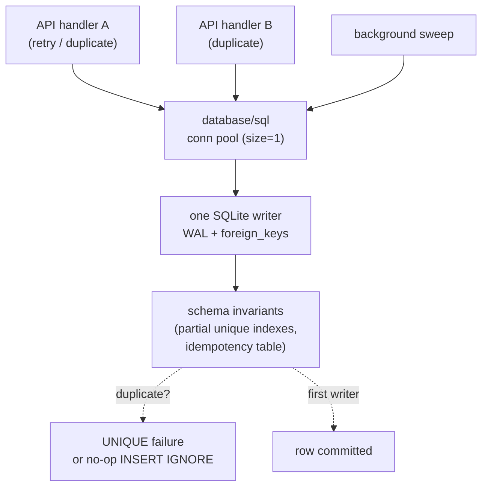
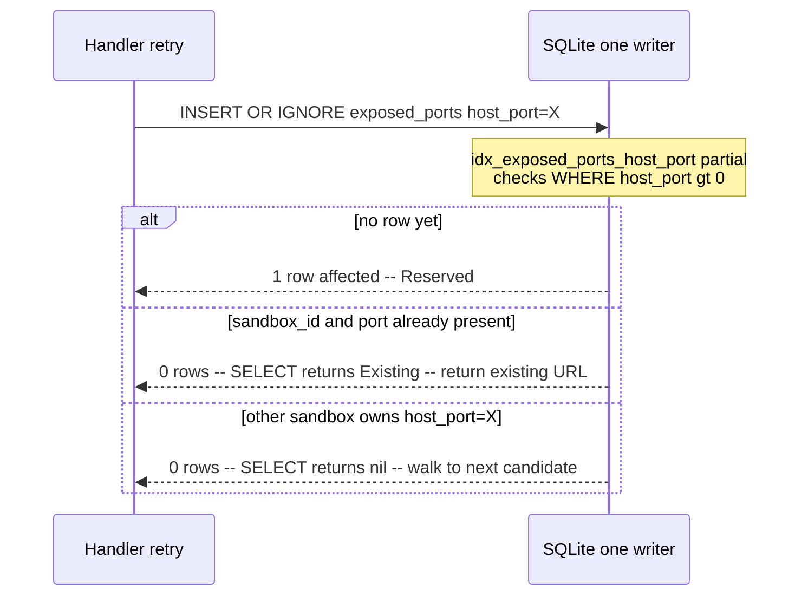
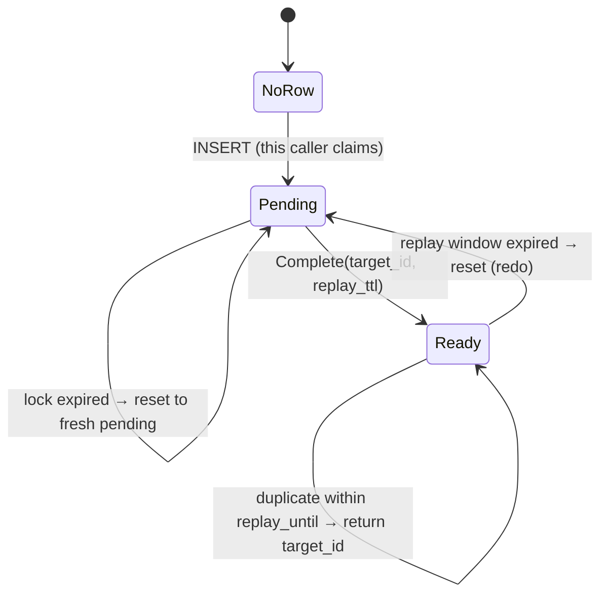

import { Tabs, TabItem } from '@astrojs/starlight/components';

Callers retry: a network hiccup mid-create, a load balancer reissuing under
timeout, two control planes racing on a fingerprinted request, a CI job
rerunning the same step. Without care, every retry is a correctness bug: two
ports bound to the same number, two sandboxes claiming the same name, two TAP
slots attached to one VMM. The fix is not "check before insert"; that race is
*already* the bug. The fix is to make the duplicate **unrepresentable**.

AerolVM puts that fix in the schema. Three primitives combine to do it: a
**single-writer SQLite core**, **partial unique indexes** on the pool-allocator
tables, and a generic **`request_idempotency`** claim/replay table. Resource
allocations are safe under retry, and the E2B facade's create is safe under
duplicate-body retry via fingerprint dedupe. The application observes the
outcome; SQLite does the rejection.

Three hazards, the invariant for each, and the SQL that holds it. Symbols
below are grep-able in `internal/store/store.go` and `internal/cluster/fsm.go`.

## One writer, by configuration

The premise everything else rests on is in `Open()`:

```go
// SQLite has one-writer semantics. Keep one connection in this process so
// API handlers, event handling, and background sweeps queue in database/sql
// instead of racing separate SQLite connections into "database is locked".
db.SetMaxOpenConns(1)
db.SetMaxIdleConns(1)
```

Plus `PRAGMA journal_mode = WAL` for concurrent readers, `PRAGMA foreign_keys = ON`
for cascade safety, and `busy_timeout=5000`. The crucial property is the first
two lines: **all writes in this process are serialized through a single SQL
connection.** Two API handlers attempting conflicting mutations do not race in
the database; one waits in Go's `database/sql` pool. SQLite's busy-timeout
flake (`SQLITE_BUSY` when two connections both try to upgrade to a writer) is
not a failure mode this daemon can hit, because there is only one connection
that can write.

That is the floor. By itself it doesn't make any operation idempotent; two
serially-executed `INSERT`s for the same logical resource still produce two
rows. The serialization is what lets the *next* layer (schema-level uniqueness)
do the actual rejection deterministically rather than probabilistically.



> **Invariant.** Within a sandboxd process, every mutation is serialized
> through one SQLite connection. The application never reasons about
> concurrent writers; the connection pool's `size=1` invariant makes it
> impossible.

## Hazard 1: pool allocators: a candidate races itself

The TCP host-port allocator and the Firecracker TAP slot allocator are walkers:
they propose a candidate value, attempt to bind it, and walk to the next on
collision. Two creates that propose the same candidate at the same moment must
not both succeed.

The naive approach is "SELECT to check, then INSERT". That race window (any
window at all) is the bug. AerolVM closes it with **partial unique indexes**. A
losing candidate is rejected at commit time; the allocator observes the
outcome:

```sql
-- exposed_ports table: host_port is the OS-level port bound on the parent host.
-- The default 0 (no host port assigned) is allowed many times.
CREATE UNIQUE INDEX idx_exposed_ports_host_port
  ON exposed_ports(host_port)
  WHERE host_port > 0;

-- firecracker_tap_pool: sandbox_id is NULL when the slot is free.
-- At most one allocated slot per sandbox is permitted.
CREATE UNIQUE INDEX idx_firecracker_tap_pool_sandbox
  ON firecracker_tap_pool(sandbox_id)
  WHERE sandbox_id IS NOT NULL;
```

The `WHERE` clause is the load-bearing word. A plain `UNIQUE(host_port)` would
forbid the natural "many rows with host_port=0" state during transient
unassignment. The partial form **enforces uniqueness only on the values we
actually want to be unique** (the bound ports, the assigned slots) and lets
the unassigned/free state coexist freely.

The allocator's role collapses to a single `INSERT OR IGNORE`:

```go
result, err := s.db.ExecContext(ctx, `
    INSERT OR IGNORE INTO exposed_ports (sandbox_id, port, protocol, host_port, public_url, created_at)
    VALUES (?, ?, ?, ?, ?, ?)
`, sandboxID, containerPort, protocol, hostPort, publicURL, now.UTC())
```

`OR IGNORE` swallows two distinct UNIQUE failures: the `(sandbox_id, port)`
primary key collision (this exposure already exists) and the partial index
collision (some other sandbox owns this host port). A retry is observably
identical to a brand-new request that lost the race; the allocator does not get
to lie to itself. The disambiguation between the two cases happens on the
follow-up `SELECT` and produces a three-state outcome (`Reserved` / `Existing`
/ neither) so the caller knows whether to use the existing row, stop walking,
or try the next candidate. The comment on `TryReserveHostPort` calls out
exactly the bug this prevents:

> Without that disambiguation, retrying expose for an already-exposed port
> looks identical to a host_port collision and walks the whole allocator pool
> before failing with "exhausted".



> **Invariant.** Two concurrent allocations of the same pool value cannot both
> succeed. The partial unique index rejects the loser at commit time; the
> allocator never reasons about the race, it only observes the outcome.

The `expose_port` call is the most retry-fragile path in the system: the same
call reserves a row in `exposed_ports` AND installs an L4 route in Caddy. If
the Caddy install fails after the row commits, we have a half-installed
exposure. `Service.allocateHostPort` returns a `reused` flag so the caller can
tell whether *this* call inserted the row or found an existing one
(`internal/service/service.go:2215`). The caddy-failure rollback in
`Service.ExposePort` deletes the row only when `reused=false`
(`service.go:2103-2126`); a row another caller installed is not ours to undo.
Without that flag, a retry of a partially-installed `expose_port` would tear
down the in-flight exposure of a parallel caller. This is the hand-wired piece
the database can't do for you.

## Hazard 2: cluster-wide names and hostnames

Sandbox names are unique at two scopes. Locally, the `idx_sandboxes_name`
partial unique index rejects duplicates within a node:

```sql
CREATE UNIQUE INDEX idx_sandboxes_name
  ON sandboxes(name)
  WHERE name <> '';
```

Empty (the default for unnamed sandboxes) is allowed many times; any non-empty
name is unique within the node. Cluster-wide, the Raft FSM mirrors that with
`nameIndex` (`internal/cluster/fsm.go:201` and the duplicate check at
`fsm.go:383`); a second create with the same `name` landing on a different
owner surfaces `cluster.ErrNameConflict` at `pkg/api/v1/cluster_handler.go:229`
and returns 409. Daytona's name-based lookup is the most visible consumer.

Custom domains follow the same two-scope shape. The local PK on `hostname`:

```sql
CREATE TABLE sandbox_custom_domains (
  hostname    TEXT PRIMARY KEY,   -- exactly one binding per hostname
  sandbox_id  TEXT NOT NULL,
  ...
);
```

The cluster-wide half lives in the same FSM: `opAddCustomDomain` checks
`customHostnameIndex` under the FSM lock and rejects a duplicate with
`ErrCustomHostnameConflict` (`internal/cluster/fsm.go:784`). Only the leader
appends; the loser's owner sees the sentinel and rolls back the local row.
The comment on the op states the contract directly:

```go
// Cluster-wide hostname uniqueness check. ... The hostname index is the
// single tiebreaker: first committed log entry wins, the loser's owner
// returns ErrCustomHostnameConflict so the local row can roll back.
```

The cluster page goes deep on the FSM half; see
[Placement & Failover](/engineering-placement-failover).

> **Invariant.** Sandbox names and custom hostnames each map to at most one
> sandbox cluster-wide. Local uniqueness is held by a partial unique index;
> cluster uniqueness is held by an in-memory index inside the Raft FSM. Both
> scopes reject duplicates structurally, not via "check then write".

## Hazard 3: request_idempotency: the generic claim/replay primitive

Pool allocators handle resource uniqueness. The other half; **caller-retry
dedupe** needs something else, because the duplicate request might propose
*no* particular resource at all (a `create_sandbox` retry just wants the same
sandbox back, not whichever one we made first).

The `request_idempotency` table is the generic primitive:

```sql
CREATE TABLE request_idempotency (
  scope         TEXT NOT NULL,          -- facade namespace, e.g. "e2b.create"
  fingerprint   TEXT NOT NULL,          -- hash of the request body
  target_id     TEXT NOT NULL DEFAULT '',
  state         TEXT NOT NULL DEFAULT 'pending',  -- pending | ready
  locked_until  DATETIME NOT NULL,      -- pending TTL
  replay_until  DATETIME,               -- ready-result replay TTL
  ...
  PRIMARY KEY (scope, fingerprint)
);
```

Two writes drive the state machine:
`ClaimIdempotentRequest(ctx, scope, fingerprint, now, pendingTTL)` at the
start of the work, and
`CompleteIdempotentRequest(ctx, scope, fingerprint, targetID, now, replayTTL)`
once the work has produced an outcome. The claim is the interesting one: a
single `INSERT ... ON CONFLICT DO NOTHING` distinguishes four cases
(`internal/store/store.go:1749`):

1. **Insert succeeded** → `acquired=true`. This caller does the work.
2. **Row exists, state=ready, replay window still open, target_id set** →
   `acquired=false`. Replay the prior outcome verbatim; do not redo the work.
3. **Row exists, state=pending, lock not expired** → `acquired=false`, no
   target_id yet. The caller waits for the in-flight attempt to complete; in
   the E2B facade, `waitForCreateReplay` (`pkg/api/e2b/handlers.go:98`) polls
   until the row flips to Ready.
4. **Row exists, but stale** (lock expired without ready, or replay window
   expired) → reset the row to pending with a fresh lock and `acquired=true`.
   The previous attempt is treated as failed; this caller redoes the work.

`scope` is the per-facade namespace. The same fingerprint hash from the E2B
facade and from a hypothetical Daytona create mean different things; scoping
keeps them from colliding.



The actual guarantee:

- **Within the replay window of a successful completion, duplicates replay the
  same `target_id` without redoing the work** (case 2). Two parallel duplicates
  in flight either share the in-flight pending attempt (case 3) or one waits
  out the other and replays.
- **Outside the replay window, or after a failed attempt's `locked_until`
  expires, the work runs again** (case 4). The dedupe is at-least-once with
  replay suppression for completed work, not at-most-once. A process crash
  mid-create does not strand the fingerprint as un-retriable.

`DeleteIdempotentRequest` is the explicit-cleanup escape hatch when the work
itself rolls back (e.g. docker create failed) and the next retry should start
from scratch rather than wait out `locked_until`. The E2B handler uses it on
every rollback path (`pkg/api/e2b/handlers.go:68-72,114,124,134`).

> **Invariant.** Within the replay window of a successful completion, every
> duplicate of `(scope, fingerprint)` returns the same `target_id` without
> redoing the work. Outside that window, or after a failed attempt's lock
> expires, the row resets and a new claimer runs.

### What the TTLs and fingerprint actually do

The two TTLs are configured per facade. The E2B facade uses
`e2bCreatePendingTTL = 2 * time.Minute` and `e2bCreateReplayWindow =
10 * time.Second` (`pkg/api/e2b/meta.go:21`). `pendingTTL` is the in-flight
lock budget: too short and a slow-but-healthy create lets a second caller
proceed in parallel (split-brain), too long and a crashed worker stalls retries
for that long. `replayTTL` is how long the same fingerprint replays the same
sandbox; after that, the row resets and a duplicate post produces a new one.

The fingerprint is hashed in `createRequestFingerprint`
(`pkg/api/e2b/meta.go:287`) from `templateID`, sorted env vars, sandbox
metadata, timeout/auto-resume/secure flags, and the network allow/deny
posture. It does NOT include a client request ID or timestamp; if your SDK
adds one to the body, dedupe is silently broken because every retry rehashes
to a new fingerprint. It also does not include fields outside that list, so a
field the fingerprint elides cannot drive dedupe.

### Single-writer dedupe is per-process

The `request_idempotency` table is local to one sandboxd's SQLite. In cluster
mode, two nodes each have their own copy. Native v1's placement router picks a
target by capacity, not by fingerprint (`pkg/api/v1/cluster_handler.go:201`),
so a retry can land on a different node from the original and see an empty
`request_idempotency`. The E2B facade sidesteps this for the common case by
deriving a deterministic `sandboxID` from the fingerprint
(`sandboxIDFromFingerprint`, `pkg/api/e2b/handlers.go:141`); the second create
with the same body picks the same id and collides on the cluster-wide
`nameIndex`/placement layer. But the in-process state machine itself only
protects against retries that hit the *same* node.

## Why a single writer at all

The schema invariants below are cheap because there's one writer. Partial
unique indexes need careful isolation-level analysis under multi-writer
Postgres; the `request_idempotency` state machine is a four-line
`INSERT ... ON CONFLICT` here and several pages of isolation-level reasoning
there.

Operationally, sandboxd's whole personality is "self-hostable, no external
service to run". A control plane that requires a clustered Postgres to enforce
idempotency loses the property that makes it deployable on a single VM or a
laptop. Cluster mode (Raft FSM in `internal/cluster/`) handles consensus
across nodes; see
[Placement & Failover](/engineering-placement-failover).

## What this buys you

From the SDK, most of this is invisible. A retried `exposePort` returns the
existing public URL rather than walking the host-port pool and exhausting it;
the partial unique index on `host_port` plus the `(sandbox_id, port)` primary
key together guarantee the second call sees the same row. A concurrent name
collision returns a typed 409 at the API boundary rather than two sandboxes
sharing a name. For the E2B facade, a duplicate `create` with the same body
returns the same sandbox id via fingerprint replay (`request_idempotency`);
native `/v1/sandboxes` does not fingerprint-dedupe today, so two identical
POSTs either collide on the cluster-wide `nameIndex` (409) or return two
distinct ids if no `name` is set.

The `exposePort` retry property is the cleanest one to demonstrate. The same
call shape, exercised twice, returns the same public URL in every SDK:

<Tabs syncKey="lang">
  <TabItem label="TypeScript">
    ```ts
    import { MicroVM } from '@aerol-ai/aerolvm-sdk'

    const client = new MicroVM({
      apiUrl: process.env.SB_API_URL,
      patToken: process.env.SB_PAT_TOKEN,
    })

    const sandbox = await client.create({
      image: 'ubuntu:22.04',
      cpu: 1,
      memoryMB: 512,
    })

    // First call reserves a host port and installs the Caddy route.
    const first = await sandbox.exposePort(8080)

    // Retry of the same expose. The (sandbox_id, port) PK steers the store
    // into the Existing branch (see TryReserveHostPort in internal/store);
    // the allocator does not walk the pool, no second port is consumed,
    // and the same publicUrl is returned.
    const retry = await sandbox.exposePort(8080)

    console.log(first.publicUrl === retry.publicUrl) // true
    ```
  </TabItem>
  <TabItem label="Python">
    ```python
    from microvm import MicroVM

    client = MicroVM(
        api_url='https://sandbox.example.com',
        pat_token='your-token',
    )

    sandbox = client.create({
        'image': 'ubuntu:22.04',
        'cpu': 1.0,
        'memoryMB': 512,
    })

    first = sandbox.expose_port(8080)
    # Retry: same (sandbox_id, port) row is observed; no second host port
    # is consumed; the same public URL is returned.
    retry = sandbox.expose_port(8080)

    print(first['publicUrl'] == retry['publicUrl'])  # True
    ```
  </TabItem>
  <TabItem label="Go">
    ```go
    import (
        "context"
        "fmt"
        "log"
        "os"

        microvm  "github.com/aerol-ai/microvm/sdk/go/pkg/microvm"
        sdktypes "github.com/aerol-ai/microvm/sdk/go/pkg/types"
    )

    client, err := microvm.NewClientWithConfig(&sdktypes.MicroVMConfig{
        APIUrl:   os.Getenv("SB_API_URL"),
        PATToken: os.Getenv("SB_PAT_TOKEN"),
    })
    if err != nil {
        log.Fatal(err)
    }

    sandbox, err := client.Create(context.Background(), sdktypes.CreateSandboxOptions{
        Image:    "ubuntu:22.04",
        CPU:      1,
        MemoryMB: 512,
    })
    if err != nil {
        log.Fatal(err)
    }

    first, err := sandbox.ExposePort(context.Background(), 8080)
    if err != nil {
        log.Fatal(err)
    }
    // Retry returns the existing row's publicUrl; no new host port is allocated.
    retry, err := sandbox.ExposePort(context.Background(), 8080)
    if err != nil {
        log.Fatal(err)
    }

    fmt.Println(first.PublicURL == retry.PublicURL) // true
    ```
  </TabItem>
  <TabItem label="Rust">
    ```rust
    use aerolvm_sdk::{Client, CreateOptions, ExposeOptions};

    let client = Client::new(
        Some("https://sandbox.example.com"),
        Some("your-token"),
    )?;

    let sandbox = client.create(CreateOptions {
        image:     "ubuntu:22.04".to_string(),
        cpu:       Some(1),
        memory_mb: Some(512),
        ..Default::default()
    })?;

    let first = sandbox.expose_port(8080, ExposeOptions::default())?;
    // Retry: same (sandbox_id, port) row, same public URL.
    let retry = sandbox.expose_port(8080, ExposeOptions::default())?;

    println!("{}", first.public_url == retry.public_url); // true
    ```
  </TabItem>
  <TabItem label="Java">
    ```java
    import ai.aerol.microvm.MicroVMClient;
    import ai.aerol.microvm.MicroVMConfig;
    import ai.aerol.microvm.Sandbox;
    import ai.aerol.microvm.model.CreateOptions;
    import ai.aerol.microvm.model.ExposeResult;

    MicroVMClient client = new MicroVMClient(
        new MicroVMConfig()
            .setApiUrl("https://sandbox.example.com")
            .setPatToken(System.getenv("SB_PAT_TOKEN"))
    );

    Sandbox sandbox = client.create(
        new CreateOptions()
            .setImage("ubuntu:22.04")
            .setCpu(1.0)
            .setMemoryMb(512)
    );

    ExposeResult first = sandbox.exposePort(8080);
    // Retry: same (sandbox_id, port) row, same public URL.
    ExposeResult retry = sandbox.exposePort(8080);

    System.out.println(first.publicUrl.equals(retry.publicUrl)); // true
    ```
  </TabItem>
</Tabs>
