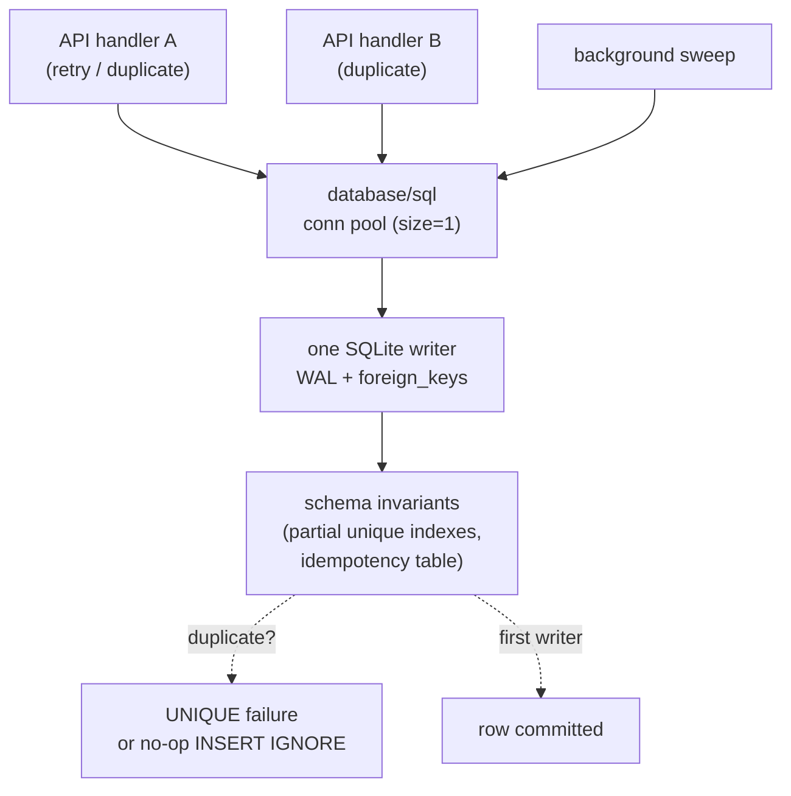
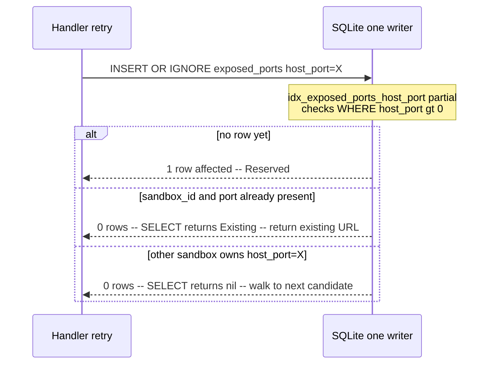
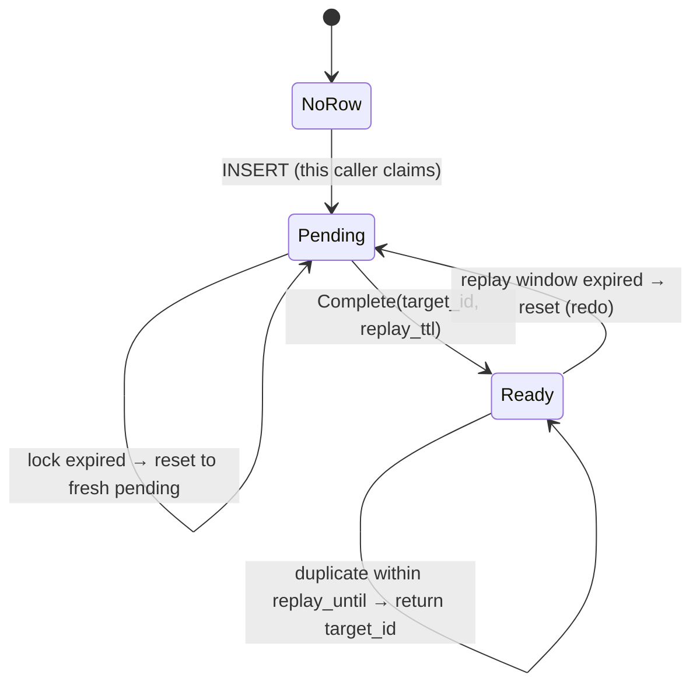

import { Tabs, TabItem } from '@astrojs/starlight/components';

Callers retry. A network hiccup cuts off a create, a load balancer resends a request after a timeout, or a CI job reruns a step. Two control planes can even race on the same request. Without care, every retry is a correctness bug: two ports bound to the same number, two sandboxes with the same name, or two TAP slots (virtual network cards) attached to one VM.

The fix is not "check before you insert", because the gap between the check and the insert *is* the bug. The fix is to make the duplicate **impossible to store**. An operation that is safe to repeat is called idempotent: doing it twice has the same effect as doing it once.

**In short:**

- Every write inside one `sandboxd` goes through a single SQLite connection, so writes never race inside the database.
- Partial unique indexes make the database itself reject a second claim on the same port, slot, name or hostname.
- A retried `exposePort` finds its own earlier row and returns the same URL, without using up a second port.
- A claim-and-replay table lets the E2B facade (AerolVM's E2B-compatible API) return a finished create's sandbox instead of making a second one.
- That table only protects retries that reach the same server; in a cluster, the E2B facade also derives the sandbox ID from the request.

## How the pieces fit

AerolVM puts the fix in the database schema, using three tools together:

- A **single-writer SQLite core.** SQLite is a database that lives in one file, and here only one connection writes to it.
- **Partial unique indexes** on the tables that hand out resources such as ports and network slots.
- A general **`request_idempotency`** table that claims a request and replays its result.

Resource allocations are safe under retry. The E2B facade's create is also safe when the same request body arrives twice, because it dedupes by fingerprint (a hash of the request body). The application only reads the outcome; SQLite does the rejecting.

The sections below cover three hazards, the invariant for each (a rule that always holds), and the SQL that enforces it. You can search for every name below in `internal/store/store.go` and `internal/cluster/fsm.go`.

## One writer, by configuration

Everything else rests on one setting in the store's `open()` function: a single database connection.

```go
// SQLite has one-writer semantics. Keep one connection in this process so
// API handlers, event handling, and background sweeps queue in database/sql
// instead of racing separate SQLite connections into "database is locked".
db.SetMaxOpenConns(1)
db.SetMaxIdleConns(1)
```

The store also turns on three SQLite settings:

- `PRAGMA journal_mode = WAL` (write-ahead logging), so readers can keep working during a write.
- `PRAGMA foreign_keys = ON`, so deleting a sandbox also deletes the rows that belong to it.
- `busy_timeout=5000`, so a blocked operation waits up to five seconds instead of failing at once.

The key property is in the first two lines of code: **every write in this process goes through one SQL connection.** Two API handlers making conflicting changes do not race in the database. One waits its turn in Go's `database/sql` pool.

SQLite has a known failure, `SQLITE_BUSY`, when two connections both try to become the writer at once. This daemon (the background `sandboxd` program) cannot hit it, because only one connection can write.

That is the floor. On its own, it does not make anything idempotent: two `INSERT`s for the same thing, run one after the other, still make two rows. What serial writes give you is that the *next* layer can do the real work. Uniqueness rules in the schema then reject the duplicate every time, not just most of the time.


```mermaid
graph TB
    A1["API handler A<br/>(retry / duplicate)"] --> POOL["database/sql<br/>conn pool (size=1)"]
    A2["API handler B<br/>(duplicate)"] --> POOL
    SWEEP["background sweep"] --> POOL
    POOL --> CONN["one SQLite writer<br/>WAL + foreign_keys"]
    CONN --> SCHEMA["schema invariants<br/>(partial unique indexes,<br/>idempotency table)"]
    SCHEMA -.->|"duplicate?"| REJECT["UNIQUE failure<br/>or no-op INSERT IGNORE"]
    SCHEMA -.->|"first writer"| COMMIT["row committed"]
```

> **Invariant.** Within one `sandboxd` process, every change goes through one SQLite connection. The application never reasons about concurrent writers, because a connection pool of size 1 makes them impossible.

## Hazard 1: two allocations race for the same value

A pool allocator hands out values from a fixed range, and two creates can pick the same value at the same moment. The TCP host-port allocator and the Firecracker TAP slot allocator both work this way. They propose a candidate value, try to claim it, and move to the next one if it is taken. Two creates that propose the same candidate at once must not both succeed.

The naive approach is "SELECT to check, then INSERT". Any window between the two steps is the bug. AerolVM closes it with **partial unique indexes**.

A unique index makes the database refuse a second row with the same value. A *partial* unique index applies that rule only to rows that match a `WHERE` clause. A losing candidate is rejected when it commits, and the allocator just reads the result:

```sql
-- exposed_ports table: host_port is the OS-level port bound on the parent host.
-- The default 0 (no host port assigned) is allowed many times.
CREATE UNIQUE INDEX idx_exposed_ports_host_port
  ON exposed_ports(host_port)
  WHERE host_port > 0;

-- firecracker_tap_pool: sandbox_id is NULL when the slot is free.
-- At most one allocated slot per sandbox is permitted.
CREATE UNIQUE INDEX idx_firecracker_tap_pool_sandbox
  ON firecracker_tap_pool(sandbox_id)
  WHERE sandbox_id IS NOT NULL;
```

The `WHERE` clause is the important part. A plain `UNIQUE(host_port)` would forbid many rows with `host_port=0`, which is the normal state while a row has no port yet. The partial form **enforces uniqueness only on the values that must be unique** (bound ports, assigned slots). Unassigned or free rows can share their empty value freely.

The allocator's job shrinks to a single `INSERT OR IGNORE`:

```go
result, err := s.db.ExecContext(ctx, `
    INSERT OR IGNORE INTO exposed_ports (sandbox_id, port, protocol, host_port, public_url, created_at)
    VALUES (?, ?, ?, ?, ?, ?)
`, sandboxID, containerPort, protocol, hostPort, publicURL, now.UTC())
```

`OR IGNORE` absorbs two different uniqueness failures:

- The `(sandbox_id, port)` primary key collides: this exposure already exists.
- The partial index collides: another sandbox owns this host port.

A retry looks exactly like a new request that lost the race, so the allocator cannot fool itself. A follow-up `SELECT` tells the two cases apart and returns one of three outcomes: `Reserved`, `Existing` or neither. The caller then knows whether to use the existing row, stop, or try the next candidate. The comment on `TryReserveHostPort` names the bug this prevents:

> Without that disambiguation, retrying expose for an already-exposed port
> looks identical to a host_port collision and walks the whole allocator pool
> before failing with "exhausted".


```mermaid
sequenceDiagram
    participant H as Handler retry
    participant DB as SQLite one writer
    H->>DB: INSERT OR IGNORE exposed_ports host_port=X
    Note over DB: idx_exposed_ports_host_port partial<br/>checks WHERE host_port gt 0
    alt no row yet
        DB-->>H: 1 row affected -- Reserved
    else sandbox_id and port already present
        DB-->>H: 0 rows -- SELECT returns Existing -- return existing URL
    else other sandbox owns host_port=X
        DB-->>H: 0 rows -- SELECT returns nil -- walk to next candidate
    end
```

> **Invariant.** Two allocations of the same pool value at the same time cannot both succeed. The partial unique index rejects the loser when it commits. The allocator never reasons about the race; it only reads the outcome.

### The part the database cannot do

The `expose_port` call breaks most easily under retry, because it changes two systems. It reserves a row in `exposed_ports` *and* installs an L4 route (one that forwards raw TCP) in Caddy, the web server that takes incoming traffic. If the Caddy step fails after the row commits, the exposure is only half installed.

`Service.allocateHostPort` (in `internal/service/service.go`) returns a `reused` flag. It tells the caller whether *this* call inserted the row or found an existing one. On a Caddy failure, `Service.ExposePort` deletes the row only when `reused=false`, because a row another caller installed is not ours to undo.

Without that flag, retrying a half-installed `expose_port` would tear down another caller's exposure while it is in progress. This is the hand-wired piece the database cannot do for you.

## Hazard 2: names and hostnames across the cluster

Sandbox names and custom hostnames must each point at one sandbox, both on one server and across the whole cluster. Sandbox names are unique per owner (the account that created the sandbox). On one node (one server), the `idx_sandboxes_name` partial unique index rejects duplicates:

```sql
CREATE UNIQUE INDEX idx_sandboxes_name
  ON sandboxes(owner_ref, name)
  WHERE name <> '';
```

An empty name, the default for unnamed sandboxes, is allowed any number of times. A non-empty name is unique for each owner on the node.

Across the cluster, the Raft FSM keeps the same rule in its `nameIndex` map (`internal/cluster/fsm.go`). Raft is how cluster servers agree on shared data even when some fail. The FSM (finite state machine) is the shared table that every server changes only through agreed Raft log entries.

A second create with the same name can land on a different server. There it gets `cluster.ErrNameConflict`, which the API returns as HTTP 409. Daytona's lookup by name is the most visible user of this.

Custom domains follow the same two-level shape. Locally, `hostname` is the primary key:

```sql
CREATE TABLE sandbox_custom_domains (
  hostname    TEXT PRIMARY KEY,   -- exactly one binding per hostname
  sandbox_id  TEXT NOT NULL,
  ...
);
```

The cluster-wide half lives in the same FSM. `opAddCustomDomain` checks `customHostnameIndex` while holding the FSM lock, and rejects a duplicate with `ErrCustomHostnameConflict`. Only the Raft leader (the one server that writes new entries) appends to the log. The node that owns the losing request sees that error and rolls back its local row. The comment on the operation states the contract:

```go
// Cluster-wide hostname uniqueness check. ... The hostname index is the
// single tiebreaker: first committed log entry wins, the loser's owner
// returns ErrCustomHostnameConflict so the local row can roll back.
```

[Placement and failover](/engineering-placement-failover/) goes deep on the FSM half.

> **Invariant.** Each sandbox name (per owner) and each custom hostname maps to at most one sandbox in the whole cluster. A partial unique index holds the rule on one node. An index in memory inside the Raft FSM holds it across the cluster. Both reject duplicates by structure, not by "check, then write".

## Hazard 3: a general claim-and-replay table

Pool allocators protect resources, but retried requests need something more. The duplicate request might not name any particular resource. A `create_sandbox` retry just wants the same sandbox back, not a second one.

The `request_idempotency` table is the general tool. Each row is keyed by a scope and a fingerprint of the request:

```sql
CREATE TABLE request_idempotency (
  scope         TEXT NOT NULL,          -- facade namespace, e.g. "e2b.create"
  fingerprint   TEXT NOT NULL,          -- hash of the request body
  target_id     TEXT NOT NULL DEFAULT '',
  state         TEXT NOT NULL DEFAULT 'pending',  -- pending | ready
  locked_until  DATETIME NOT NULL,      -- pending TTL
  replay_until  DATETIME,               -- ready-result replay TTL
  ...
  PRIMARY KEY (scope, fingerprint)
);
```

Two writes drive it:

- `ClaimIdempotentRequest(ctx, scope, fingerprint, now, pendingTTL)` runs when the work starts.
- `CompleteIdempotentRequest(ctx, scope, fingerprint, targetID, now, replayTTL)` runs once the work has an outcome.

The claim is the interesting one. A single `INSERT ... ON CONFLICT DO NOTHING` sorts every call into one of four cases (see `Store.ClaimIdempotentRequest` in `internal/store/store.go`):

1. **The insert succeeded:** `acquired=true`. This caller does the work.
2. **The row exists, `state=ready`, the replay window is open and `target_id` is set:** `acquired=false`. Replay the earlier result exactly, and do not redo the work.
3. **The row exists, `state=pending` and the lock has not expired:** `acquired=false`, with no `target_id` yet. The caller waits for the attempt in progress. In the E2B facade, `waitForCreateReplay` (`pkg/api/e2b/handlers.go`) polls until the row turns ready.
4. **The row exists but is stale:** the lock expired before the row was ready, or the replay window closed. Reset the row to pending with a fresh lock, with `acquired=true`. The earlier attempt counts as failed, and this caller redoes the work.

`scope` keeps different facades apart. The same fingerprint from the E2B facade and from a future Daytona create would mean different things. The scope stops them from colliding.


```mermaid
stateDiagram-v2
    [*] --> NoRow
    NoRow --> Pending: INSERT (this caller claims)
    Pending --> Ready: Complete(target_id, replay_ttl)
    Pending --> Pending: duplicate sees lock → caller polls
    Ready --> Ready: duplicate within replay_until → return target_id
    Ready --> Pending: replay window expired → reset (redo)
    Pending --> Pending: lock expired → reset to fresh pending
```

Here is what is actually guaranteed:

- **Within the replay window after a success, duplicates get the same `target_id` without redoing the work** (case 2). Two duplicates in flight at once either share the pending attempt (case 3), or one waits for the other and replays.
- **Outside the replay window, or once a failed attempt's `locked_until` passes, the work runs again** (case 4). The dedupe is at-least-once with replay for finished work, not at-most-once. At-least-once means the work may run more than once but is never skipped, so a crash mid-create cannot leave the fingerprint stuck forever.

`DeleteIdempotentRequest` is the explicit cleanup. Use it when the work itself rolls back (for example, the container create failed) and the next retry should start fresh. Otherwise that retry would wait out `locked_until`. The E2B handler calls it on every rollback path in `pkg/api/e2b/handlers.go`.

> **Invariant.** Within the replay window after a success, every duplicate of `(scope, fingerprint)` returns the same `target_id` without redoing the work. Outside that window, or after a failed attempt's lock expires, the row resets and a new caller runs the work.

### What the TTLs and the fingerprint do

Two TTLs (time-to-live limits) control how long a claim lasts, and each facade sets its own. The E2B facade uses `e2bCreatePendingTTL = 2 * time.Minute` and `e2bCreateReplayWindow = 10 * time.Second` (`pkg/api/e2b/meta.go`).

`pendingTTL` is how long an in-flight claim holds its lock. If it is too short, a slow but healthy create lets a second caller start in parallel. That is split-brain: two attempts, each sure it owns the work. If it is too long, a crashed worker blocks retries for that long.

`replayTTL` is how long the same fingerprint keeps replaying the same sandbox. After that, the row resets and a duplicate request makes a new sandbox.

`createRequestFingerprint` (`pkg/api/e2b/meta.go`) builds the hash from a fixed list of fields:

- the caller's account and the `templateID`,
- env vars and sandbox metadata,
- the timeout settings and the auto-resume and secure flags,
- the network allow and deny settings, the public-traffic setting and the host-header mask.

It does NOT include a client request ID or timestamp. If your SDK adds one to the body, dedupe silently breaks, because every retry hashes to a new fingerprint. Fields outside that list are not in the hash, so they cannot drive dedupe either.

### Dedupe is per process

The `request_idempotency` table only protects retries that reach the same server. It lives in one `sandboxd`'s SQLite file, and in cluster mode each node has its own copy.

The native v1 placement router picks a node by capacity, not by fingerprint (`pkg/api/v1/cluster_handler.go`). So a retry can land on a different node from the original and find an empty table there.

The E2B facade avoids this in the common case. It derives a fixed sandbox ID from the fingerprint (`sandboxIDFromFingerprint` in `pkg/api/e2b/handlers.go`). A second create with the same body picks the same ID and collides in the cluster-wide name index and placement layer. Even so, the per-node claim-and-replay logic only protects retries that hit the *same* node.

## Why a single writer at all

One writer makes these rules cheap, and it keeps AerolVM easy to run. With many writers, as in a clustered Postgres, partial unique indexes need careful thought about isolation levels. (An isolation level sets how much one running transaction can see of another.)

Here the `request_idempotency` state machine is a four-line `INSERT ... ON CONFLICT`. With many writers, it would take pages of isolation-level reasoning.

In operations, `sandboxd` is meant to be self-hostable with no external service to run. A control plane that needs a clustered Postgres to enforce idempotency loses what makes it deployable on one VM or a laptop. Cluster mode (the Raft FSM in `internal/cluster/`) handles agreement across nodes; see [Placement and failover](/engineering-placement-failover/).

## What this buys you

From the SDK, most of this is invisible, but a few behaviors show through:

- A retried `exposePort` returns the existing public URL. It does not walk the host-port pool until the pool runs out. The partial unique index on `host_port` and the `(sandbox_id, port)` primary key together make the second call see the same row.
- Two creates racing for the same name get a typed 409 error at the API, not two sandboxes that share a name.
- In the E2B facade, a duplicate `create` with the same body returns the same sandbox ID, by fingerprint replay through `request_idempotency`.
- Native `/v1/sandboxes` does not dedupe by fingerprint today. Two identical creates either collide on the name index (409), or return two different IDs if no `name` is set.

The `exposePort` retry is the easiest one to show. The same call, made twice, returns the same public URL in every SDK:

<Tabs syncKey="lang">
  <TabItem label="TypeScript">
    ```ts
    import { MicroVM } from '@aerol-ai/aerolvm-sdk'

    const client = new MicroVM({
      apiUrl: process.env.SB_API_URL,
      patToken: process.env.SB_PAT_TOKEN,
    })

    const sandbox = await client.create({
      image: 'ubuntu:22.04',
      cpu: 1,
      memoryMB: 512,
    })

    // First call reserves a host port and installs the Caddy route.
    const first = await sandbox.exposePort(8080)

    // Retry of the same expose. The (sandbox_id, port) PK steers the store
    // into the Existing branch (see TryReserveHostPort in internal/store);
    // the allocator does not walk the pool, no second port is consumed,
    // and the same URL is returned.
    const retry = await sandbox.exposePort(8080)

    console.log(first.url === retry.url) // true
    ```
  </TabItem>
  <TabItem label="Python">
    ```python
    from microvm import MicroVM

    client = MicroVM(
        api_url='https://sandbox.example.com',
        pat_token='your-token',
    )

    sandbox = client.create({
        'image': 'ubuntu:22.04',
        'cpu': 1.0,
        'memoryMB': 512,
    })

    first = sandbox.expose_port(8080)
    # Retry: same (sandbox_id, port) row is observed; no second host port
    # is consumed; the same public URL is returned.
    retry = sandbox.expose_port(8080)

    print(first.url == retry.url)  # True
    ```
  </TabItem>
  <TabItem label="Go">
    ```go
    import (
        "context"
        "fmt"
        "log"
        "os"

        microvm  "github.com/aerol-ai/microvm/sdk/go/pkg/microvm"
        sdktypes "github.com/aerol-ai/microvm/sdk/go/pkg/types"
    )

    client, err := microvm.NewClientWithConfig(&sdktypes.MicroVMConfig{
        APIUrl:   os.Getenv("SB_API_URL"),
        PATToken: os.Getenv("SB_PAT_TOKEN"),
    })
    if err != nil {
        log.Fatal(err)
    }

    sandbox, err := client.Create(context.Background(), sdktypes.CreateSandboxOptions{
        Image:    "ubuntu:22.04",
        CPU:      1,
        MemoryMB: 512,
    })
    if err != nil {
        log.Fatal(err)
    }

    first, err := sandbox.ExposePort(context.Background(), 8080)
    if err != nil {
        log.Fatal(err)
    }
    // Retry returns the existing row's PublicURL; no new host port is allocated.
    retry, err := sandbox.ExposePort(context.Background(), 8080)
    if err != nil {
        log.Fatal(err)
    }

    fmt.Println(first.PublicURL == retry.PublicURL) // true
    ```
  </TabItem>
  <TabItem label="Rust">
    ```rust
    use aerolvm_sdk::{Client, CreateOptions, ExposeOptions, ExposeResult};

    let client = Client::new(
        Some("https://sandbox.example.com"),
        Some("your-token"),
    )?;

    let sandbox = client.create(CreateOptions {
        image:     "ubuntu:22.04".to_string(),
        cpu:       Some(1),
        memory_mb: Some(512),
        ..Default::default()
    })?;

    let first = sandbox.expose_port(8080, ExposeOptions::default())?;
    // Retry: same (sandbox_id, port) row, same public URL.
    let retry = sandbox.expose_port(8080, ExposeOptions::default())?;

    if let (ExposeResult::Http { url: a }, ExposeResult::Http { url: b }) = (&first, &retry) {
        println!("{}", a == b); // true
    }
    ```
  </TabItem>
  <TabItem label="Java">
    ```java
    import ai.aerol.microvm.MicroVMClient;
    import ai.aerol.microvm.MicroVMConfig;
    import ai.aerol.microvm.Sandbox;
    import ai.aerol.microvm.model.CreateOptions;
    import ai.aerol.microvm.model.ExposeResult;

    MicroVMClient client = new MicroVMClient(
        new MicroVMConfig()
            .setApiUrl("https://sandbox.example.com")
            .setPatToken(System.getenv("SB_PAT_TOKEN"))
    );

    Sandbox sandbox = client.create(
        new CreateOptions()
            .setImage("ubuntu:22.04")
            .setCpu(1.0)
            .setMemoryMb(512)
    );

    ExposeResult first = sandbox.exposePort(8080);
    // Retry: same (sandbox_id, port) row, same public URL.
    ExposeResult retry = sandbox.exposePort(8080);

    System.out.println(first.url.equals(retry.url)); // true
    ```
  </TabItem>
</Tabs>

## Next steps

- [Placement and failover](/engineering-placement-failover/): the cluster-wide half of name and hostname uniqueness.
- [TCP and TLS ports](/tcp-ports/): publish raw TCP from a sandbox, using the host-port pool from this page.
- [Use the E2B SDK](/using-e2b-sdk/): the facade whose create is deduped by fingerprint.
- [Why AerolVM exists](/engineering-distributed-sandbox-runtime/): the overall design these rules support.
