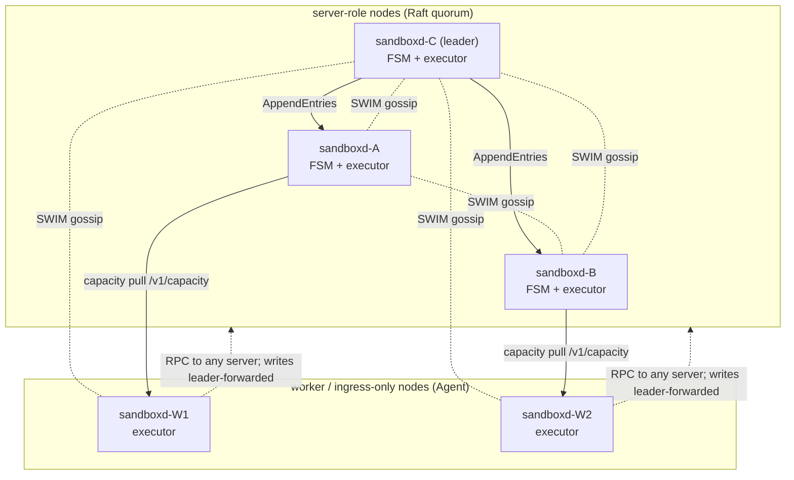

import { Tabs, TabItem } from '@astrojs/starlight/components';

AerolVM has one binary. It runs as the standalone daemon and as a cluster
node: same `sandboxd`, different config. No separate scheduler process; no
etcd. Cluster mode is `hashicorp/raft` for the placement FSM and
`hashicorp/memberlist` (SWIM) for membership. Capacity is pulled out-of-band,
not stuffed into gossip. The thesis: put the consistency boundary at the
points where divergence is destructive (cluster-wide name uniqueness, capacity
reservation, custom-domain binding) and leave everything else to best-effort
gossip plus local decisions.

Three things in `internal/cluster/` are worth understanding before reading
the code:

1. **Two-stage create with reservations.** Placement is two FSM writes, not
   one: `opReserve` claims capacity and name; `opPlace` promotes to placed
   once docker has actually run the sandbox. The reservation prevents two
   concurrent creates from picking the same node between capacity-heartbeat
   fetches.
2. **Owner-sharded execution with reverse-proxy forwarding.** Any node accepts
   any request. Mutating requests for sandbox X reverse-proxy to X's owner.
   The cluster presents a single endpoint to callers.
3. **Capacity-heartbeat freshness gating.** A candidate's last capacity
   heartbeat must be fresh. A node alive in gossip but missing recent
   capacity fetches drops out of the placement set.

`Noop` (`internal/cluster/noop.go`) is selected when `cfg.EnableCluster=false`
so the `cluster.Client` interface stays addressable in single-node mode.
Function and type names below are real and grep-able.

## Why not a single central scheduler

Two workload assumptions shape the design:

1. Each resource node is large (a beefy bare-metal box or VM). AerolVM packs
   over 1K sandboxes per node, so each node has enough headroom to absorb
   minor scheduling drift.
2. Sandboxes are short-lived; the set on any one node turns over fast.

A central scheduler buys global optimality at the cost of one more moving
part to keep alive, and this workload makes the trade unattractive. A
perfectly-balanced cluster decays back to "roughly balanced" in seconds
anyway. Power-of-two-choices on per-node capacity gets to roughly balanced in
O(1) per decision, with no scheduler to lose. Where a correctness boundary
is required (cluster-wide name uniqueness, capacity reservation,
custom-domain binding), Raft holds it. Everywhere else: gossip and local
decisions.

**CAP positioning.** The placement FSM is CP. Placement writes (`opReserve`,
`opPlace`, `opReassign`, custom-domain ops) require a leader; during a leader
election they fail with `ErrNotLeader` and the API surfaces 503. Already-placed
sandboxes keep serving; owner-routed reads and toolbox traffic do not touch
Raft.

## Topology

Two roles, plus an ingress-only variant:

- **Server-role nodes** run the Raft FSM that holds the placement map.
  Mutations go through Raft consensus; reads are local to the FSM cache.
- **Worker / ingress-only nodes** run `Agent` instead: gossip identity,
  receive forwarded API requests, but do not store the FSM and do not join
  Raft. All placement reads/writes go to the server quorum over authenticated
  RPC.



Gossip (`hashicorp/memberlist`) carries identity and role only. The payload
has to fit memberlist's 512-byte `NodeMeta` cap, and a capacity snapshot
blows past it (`gossip.go` documents the regression that motivated splitting
them). `capacityLeaseCache` fetches `capacity.Snapshot` from each
worker-capable peer over an authenticated `/v1/capacity` GET on the gossip
interval (default 5s; TTL = 3× interval, clamped ≥15s; see `capacity_lease.go`).
Worker / Agent nodes do not join Raft; they call into any server-role member
over RPC and writes get leader-forwarded.

## The placement FSM

`internal/cluster/fsm.go` defines a small command set:

```go
opPlace              opCode = 1
opDelete             opCode = 2
opReassign           opCode = 3
opUpsertSpec         opCode = 4
opAddExposedPort     opCode = 5
opRemoveExposedPort  opCode = 6
opReserve            opCode = 7   // hold capacity + name BEFORE docker
opCancelReserve      opCode = 8   // release a pending reservation
opSetNodeDrainState  opCode = 9
opOrphanOwner        opCode = 10  // atomically orphan all placements of a dead node
opClaimOrphan        opCode = 11  // reclaim an orphaned placement
opReserveBatch       opCode = 12  // one Raft entry for a create burst
opAddCustomDomain    opCode = 13  // cluster-wide hostname binding
opRemoveCustomDomain opCode = 14
```

Every mutation is one Raft log entry. The placement state is deterministic
across replicas: `f.version = log.Index` on apply (`fsm.go`) uses the raft
log index as the FSM version, so it survives snapshots and matches
leader/follower without extra bookkeeping. The earlier in-process counter
reset to zero on every cold restart and broke watchers; pinning it to
`log.Index` fixed B9.

One caveat: `now := time.Now().Unix()` is also set on apply, so timestamps
like `UpdatedUnix` and `OrphanedUnix` are local wall-clock and differ between
leader and followers by milliseconds. Placement correctness does not depend
on those fields being byte-identical across replicas; the keys and ownership
fields are.

Reads are local off the FSM cache; the leader is only on the write path.

**No split-brain on placement.** Two nodes cannot both win a write because
Raft only accepts an entry once a majority of voters has logged it. During a
leader election, writes block (the API returns 503); reads keep working off
each replica's last committed state. Gossip and capacity heartbeats can
partition and let two halves hold different *capacity views*, but neither
side can mutate placement without a majority.

> **Invariant.** Ownership of sandbox X is whatever the committed FSM state
> says about `placements[X]`. The FSM mutates only by raft log entry. Two
> replicas may briefly disagree while a commit is in flight; once committed,
> every server-role node converges to the same owner.

## Reservations: the two-step create

Without reservations, two concurrent creates with the same capacity snapshot
pick the same node and double-book it. AerolVM commits intent before docker
runs:

1. **Router-side.** A server-role router runs `SelectPlacement` locally; a
   worker / ingress-only Agent calls the control-plane RPC to get a target
   back. The router then writes `opReserve` for `(sandbox_id, spec,
   target_owner)`. The FSM checks cluster-wide name uniqueness, refuses to
   overwrite an already-placed sandbox, and accounts the reservation against
   the chosen owner. Other in-flight reservations on the same owner are
   subtracted from headroom before the next `SelectPlacement` runs:

   > Subtract still-in-flight reservations (router wrote opReserve but the
   > target hasn't yet promoted via opPlace, so the gossip ledger doesn't
   > reflect them) from each peer's headroom. Without this, two creates that
   > arrive between gossip ticks both pick the same "best" node and double-
   > book it. The FSM serializes opReserve through raft, so the second
   > SelectPlacement on the same leader sees the first reservation here.

2. **Owner-side.** The chosen owner runs docker locally. On success it writes
   `opPlace`, promoting "reserved" to "placed". On failure the router writes
   `opCancelReserve` and the reservation is released.

`opCancelReserve` has a deliberate safety property:

> Only cancel reservations, never delete a placed sandbox, even if a stale
> rollback attempt arrives after a successful promote. This is the safety
> property that lets the router fire CancelReservation freely on any failure
> without worrying about a racing successful promote.

`opReserveBatch` is the burst optimization: N creates fold into one Raft
entry instead of N. `validateReservationBatchLocked` runs under the FSM lock
on every replica before the loop, so a batch with even one conflict (name
collision, capacity overflow) is rejected whole and a partial commit cannot
leave half the sandboxes reserved. The leader also runs
`admitReservationCommand` as a pre-raft check; that one is just to avoid
wasting log entries.

```mermaid
sequenceDiagram
    participant C as Caller
    participant R as Router node
    participant L as Raft leader
    participant O as Chosen owner
    C->>R: create(spec)
    R->>R: SelectPlacement(spec)<br/>(local on server; RPC on Agent)
    R->>L: opReserve(sandbox_id, spec, owner=O)<br/>(leader-forwarded if R is a follower)
    L-->>R: applied (name unique, capacity held)
    R->>O: forward create (R==O when self wins)
    alt docker create ok
        O->>L: opPlace(sandbox_id, owner=O)
        L-->>O: placed
        O-->>R: ok
        R-->>C: sandbox
    else docker create failed
        R->>L: opCancelReserve(sandbox_id)
        R-->>C: error
    end
```

> **Invariant.** Once `opReserve` commits, the next `SelectPlacement` on the
> leader sees the held capacity. Followers see it once they apply the log
> entry locally (sub-millisecond in normal operation, bounded by raft commit
> plus apply latency). A sandbox occupies capacity at most once on any node,
> even under concurrent creates with a stale capacity lease.

## Power-of-two-choices placement

`SelectPlacement` does not scan all members. The comment at `placement.go`
spells it out:

> The algorithm samples up to 2 random alive members (including self) and
> picks the one with the most CPU+memory headroom relative to the requested
> resources. This gives near-optimal load balancing without any global
> coordination; at scale it converges to within a small constant factor of
> the truly-optimal choice while costing O(1) per placement.

Why power-of-two and not consistent hashing / Maglev / load-aware random?
Power-of-two has no rebalancing on membership change, constant decision
cost, and works without global state. The Mitzenmacher result (linked
below) is the reason it gets within a constant factor of optimal.

Scoring is `(budget − reserved − pending − request) / budget`, averaged
across CPU, memory, and (when reported) disk; see `headroomScore` in
`placement.go`. Candidates are rejected for: drained, dead, role-disallowed
(`CanOwnSandboxRole`), no advertised API URL (partially joined), stale
capacity (`CapacityStale`), capacity-budget overflow, GPU mismatch, runtime
mismatch, or template miss (Phase 6 PR-D, with an unknown-allow rule for
legacy peers).

**Self wins ties.** The comparison at `placement.go:139` is `>`, not `>=`:
`a` (the first pick) wins unless `b` has strictly greater headroom. When
`a` is self, self stays. The intent is "only forward when a peer is
genuinely better"; placement stays single-node-shaped until the cluster
has a reason to disagree.

Drain is a hard admission rule, not a soft-scoring penalty:

> Drained nodes are excluded from the candidate set entirely. Cheaper and
> clearer than threading the flag through nodeFits; drain is a hard
> admission rule (operator says "don't put more work here"), not a
> soft-scoring penalty.

> **Invariant.** A placement decision uses the freshest information the
> deciding node has: capacity-lease snapshot, minus in-flight reservations
> (visible to the leader synchronously; visible to other replicas once
> their FSM apply catches up), minus drain marks. Stale-capacity nodes drop
> out of the candidate set until the next successful heartbeat fetch.

## Capacity heartbeats and freshness gating

Capacity is pulled, not gossiped. `capacityLeaseCache` runs a fan-out
(`capacityLeaseFetchConcurrency = 32`) that pulls `capacity.Snapshot` from
each worker-capable peer over an authenticated `/v1/capacity` GET. The
interval is the gossip period (default 5s); TTL is interval × 3, clamped to
≥15s. A snapshot older than the TTL is marked stale and the node drops out
of the candidate set.

Why pull and not push? Trust boundary. Pulls reuse the existing PAT auth on
`/v1/capacity`; push would need a separate auth endpoint on every peer. At
N=1000 peers, a 32-way fanout on a 5s interval is roughly 6 req/sec/peer;
order of magnitude, not 10K req/s/peer.

Local capacity is refreshed every tick from the in-process `Admitter`
(`pkg/capacity`), not pulled (that would be a self-call). The same path
overlays template inventory before storing, so the local view matches what
peers see when they pull this node:

> placement reads straight off this lease, so without the overlay our own
> snapshot would advertise no templates and the unknown-allow rule would let
> creates land on peers that lack them.

> **Invariant.** A node is a candidate for placement only if its capacity
> report is fresh (≤ TTL). Membership liveness is not enough. A partition
> that drops capacity traffic but not gossip degrades to "unplaceable", not
> "placed but unreachable". Existing sandboxes keep serving; forwarding
> uses the gossiped `APIURL` / `InternalURL`, not capacity.

## Owner-sharded execution

A placed sandbox lives on its owner. Its local SQLite store, its docker
container, its toolbox agent: none of that moves. Everything else is glued
together with reverse-proxy forwarding (`forward.go`):

> Once a sandbox is placed on node N, all of its state and lifecycle stays on
> N. The local SQLite store is unchanged. Cross-node API calls (toolbox,
> sessions, port forwards) are transparently reverse-proxied to the owner.

`ForwardHTTP` caches one `httputil.ReverseProxy` per peer URL. Separate
caches for plaintext and mTLS-pinned channels. TLS state and keepalives are
never shared between transports.

**Loop detection.** A stale placement view could bounce a request between
two nodes that both think the other owns sandbox X. `forward.go` sets
`X-Cluster-Forwarded: 1` on the way out; on receive, a node that sees the
header AND is about to forward again returns 421 Misdirected Request so the
caller retries against fresh placement.

**The trade.** Owner-sharded execution buys local consistency: the toolbox
sessions, SQLite row, and docker container for one sandbox live on one
host, so no cross-node consensus is needed for its state. It costs a
forwarded latency hit on every cross-node API call, and binds the sandbox
to its owner: a long-lived sandbox cannot be migrated without going through
the failover path.

> **Invariant.** A sandbox is reachable from any node in the cluster via
> the public API, regardless of which node owns it. Forwarding is
> automatic; the client does not need to know placement.

## Dead-owner handling: reassign, then orphan, then evict

When SWIM declares a node dead, `deadOwnerTracker` records the first
observed dead-at. After `ClusterDeadOwnerGrace` (default 30s, so a brief
flap does not trigger expensive cleanup), the leader's `evictDeadOwner`
loop in `dead_owner.go` runs three ordered steps:

1. **Per-sandbox `opReassign` for recreate-policy placements.** For every
   sandbox owned by the dead node whose spec opted into
   `failover.policy = "recreate"`, the leader runs `pickRecreationTarget`
   (which calls `SelectPlacement` against the replicated spec; self is a
   valid target; the leader can pick itself) and applies `opReassign`
   pointing the placement at the new owner. One Raft entry per sandbox.
2. **One `opOrphanOwner` for the rest.** Sandboxes owned by the dead node
   that did not opt into recreate get orphaned in a single FSM mutation:
   `OwnerNodeID=""`, `OwnerState=Orphaned`, ID preserved. Pending
   reservations on the dead owner are released in the same op.
3. **`RemoveServer` on the raft config.** The dead node is evicted from
   the quorum. The order matters: orphan first, then remove. If
   `RemoveServer` ran first and the leader then crashed, on restart the
   FSM would still show the dead node as owner with no way to discover
   it was gone (raft no longer tracks it). Doing placements first means a
   crashed leader leaves observably-orphaned rows the next leader's tick
   re-orphans idempotently.

Recreate-policy sandboxes never pass through the orphaned state. The new
owner finds out via the owner-watcher loop on its FSM apply; only the
node whose ID matches the new owner runs recreate. The owner-watcher
dereferences `RecoveryRef` to fetch the sealed spec out-of-band, unseals
locally, and calls `SandboxRecreator.RecreateSandbox(ctx, id, spec,
secrets, exposedPorts)` (see `cluster.go`), which is implemented by the
service layer. The leader is allowed to be its own recreation target; no
special-case routing.

For sandboxes that did get orphaned, two recovery paths remain:

- **`opClaimOrphan`.** When the original owner comes back online, its
  boot-time `AssertOwnership` re-asserts ownership of its orphaned
  placements. The `opPlace` path refuses to overwrite an orphan: an
  orphan must be explicitly claimed, never silently re-placed, because
  the original may still be running the docker container locally.
- **Operator delete.** Until claimed or deleted, the API surfaces 410
  Gone for the orphaned sandbox.

```mermaid
sequenceDiagram
    participant SWIM as SWIM gossip
    participant T as deadOwnerTracker
    participant L as Raft leader
    participant FSM as Placement FSM
    participant N as Recreation target
    SWIM->>T: node-D suspect → dead
    T->>T: markDead(node-D, now)
    Note over T: wait ClusterDeadOwnerGrace (30s default)
    loop for each D-owned sandbox with failover.policy=recreate
        L->>L: pickRecreationTarget(spec)<br/>→ SelectPlacement (self allowed)
        L->>FSM: opReassign(id, new owner=N)
        FSM-->>N: owner-watcher fires on apply
        N->>N: fetch RecoveryRef, unseal, SandboxRecreator.RecreateSandbox
    end
    L->>FSM: opOrphanOwner(node-D) for remaining placements
    FSM-->>FSM: remaining D-owned → OwnerNodeID=""<br/>(not deleted; 410 Gone)
    L->>L: RemoveServer(node-D)
```

> **Invariant.** A node loss never deletes placements. Recreate-policy
> placements are reassigned (preserving sandbox ID; restoring the
> container on a new owner). The rest are orphaned and surfaced as 410
> Gone until the original returns and claims, or the operator deletes
> them. No silent re-placement.

## Recovery replication

`opPlace`, `opClaimOrphan`, `opUpsertSpec`, `opReserve`, and `opReserveBatch`
all carry the sandbox spec. Raw specs may contain plaintext secrets (mount
credentials, env), which must not enter the Raft log in cleartext.

`externalizeCommandRecovery` (in `recovery_replication.go`) runs before
the command goes into the log. It seals the spec + secrets into a
`RecoveryBlob`, replicates that blob out-of-band to peer server-role nodes
via authenticated HTTP, and then strips `Spec`, `SecretRef`, `SecretVersion`,
and `SealedSecrets` from the command, replacing them with a `RecoveryRef`.
The log entry that gets replicated by Raft carries only the ref, not the
payload.

> Spec/SecretRef/SealedSecrets remain in the struct for legacy log entries
> and direct FSM tests; any Spec MUST be redacted of plaintext credentials
> before encoding.

The recovery-blob backing store is on each server-role node: a content-
addressed local store (`recoveryStore`) plus peer-to-peer fetch on miss
(`fetchRecoveryBlob` walks `recoveryServerMembers`). Followers apply the
FSM mutation without unsealing; only the node whose ID matches the new
owner runs the unseal + recreate path, by way of the owner-watcher loop
calling `SandboxRecreator.RecreateSandbox`. A follower that is not the
owner never touches the plaintext.

> **Invariant.** The Raft log never contains plaintext credentials.
> Recovery material is sealed and replicated out-of-band; the log carries
> references. Unsealing happens only on the assigned owner.

## The Noop degradation

The whole machine has a `Noop` peer (`internal/cluster/noop.go`) selected when
`cfg.EnableCluster=false`:

> Every method behaves as if this node owns every sandbox and is the only
> cluster member. Used when cfg.EnableCluster is false so callsites can be
> unconditional.

The `cluster.Client` interface stays addressable in single-node mode. The
service layer calls into it without checking `EnableCluster`; the Noop
returns "yes I own this", "yes you can place here", "the only ingress
target is me". Service-layer call sites that need to know whether they are
talking to themselves still branch on `IsSelf`, but the cluster-package
surface itself never goes away. Cluster code can grow without forcing
every caller to re-discover whether the cluster is real.

> **Invariant.** Cluster-mode code is no-op when disabled. The service layer
> calls into `cluster.Client` unconditionally; the implementation, not the
> caller, decides whether there is a quorum to talk to.

## Where the limits are

The page would be dishonest if it implied this stack is mature in every axis.
Real Phase-1 limitations, called out:

- **Capacity is pulled, not push-streamed.** A network blip between fetches
  does not lose membership but can stale-mark capacity; TTL is 3× interval
  (default 5s → 15s minimum), so a host that recovers quickly may take a
  tick or two to re-enter the placement set.
- **Reservations are TTL'd.** A router that crashes between `opReserve` and
  the docker call leaves an orphaned reservation. The reconciler tick is 5s
  and the reservation TTL is 120s, so the worst-case window where the
  chosen owner's headroom looks artificially low is ~125s.
- **Dead-owner grace is 30s.** `ClusterDeadOwnerGrace` defaults to 30s.
  Recreate-policy failover does not kick in until the dead-owner tracker
  has observed the node as dead continuously for that long. Tunable via
  `SB_DEAD_OWNER_GRACE`.
- **`failover.policy = "recreate"` is best-effort.** The new owner rebuilds
  from the spec, but ephemeral state inside the container's writable layer
  is gone; see [Durability & Failover](/durability) for the full table.
- **Raft requires odd quorum.** Two server-role nodes do not survive one
  loss; three do. `LargeClusterTopologyError` (in `topology.go`) rejects
  two-voter topologies at startup rather than letting an operator deploy
  into a split-brain trap.

None of this is hidden. Operators planning a cluster need to know the
guarantees and the failure modes; the [cluster setup
guide](/cluster-setup) covers the operational shape.

## What this buys you

Same call shape works single-node, three-node, and mid-failover. The
recreate-on-failover variant:

<Tabs syncKey="lang">
  <TabItem label="TypeScript">
    ```ts
    import { MicroVM } from '@aerol-ai/aerolvm-sdk'

    const client = new MicroVM({
      apiUrl: process.env.SB_API_URL,
      patToken: process.env.SB_PAT_TOKEN,
    })

    // failover.policy = "recreate" opts this sandbox into recovery by another
    // node if its current owner dies. The replicated spec is what the new
    // owner uses to rebuild; nothing in this call shape depends on cluster
    // mode being on.
    const sandbox = await client.create({
      image:    'ubuntu:22.04',
      cpu:      1,
      memoryMB: 512,
      failover: { policy: 'recreate' },
    })

    console.log(sandbox.id, sandbox.publicURL)
    ```
  </TabItem>
  <TabItem label="Python">
    ```python
    import os
    from microvm import MicroVM

    client = MicroVM(
        api_url=os.environ['SB_API_URL'],
        pat_token=os.environ['SB_PAT_TOKEN'],
    )

    # failover.policy = "recreate" opts into recovery by another node if the
    # current owner dies; the replicated spec is what the new owner uses to
    # rebuild.
    sandbox = client.create({
        'image':    'ubuntu:22.04',
        'cpu':      1.0,
        'memoryMB': 512,
        'failover': {'policy': 'recreate'},
    })

    print(sandbox.id, sandbox.publicURL)
    ```
  </TabItem>
  <TabItem label="Go">
    ```go
    import (
        "context"
        "fmt"
        "log"
        "os"

        microvm   "github.com/aerol-ai/microvm/sdk/go/pkg/microvm"
        sdktypes  "github.com/aerol-ai/microvm/sdk/go/pkg/types"
    )

    client, err := microvm.NewClientWithConfig(&sdktypes.MicroVMConfig{
        APIUrl:   os.Getenv("SB_API_URL"),
        PATToken: os.Getenv("SB_PAT_TOKEN"),
    })
    if err != nil {
        log.Fatal(err)
    }

    // Failover.Policy = "recreate" opts into recovery by another node if the
    // current owner dies; the replicated spec is what the new owner uses.
    sandbox, err := client.Create(context.Background(), sdktypes.CreateSandboxOptions{
        Image:    "ubuntu:22.04",
        CPU:      1,
        MemoryMB: 512,
        Failover: &sdktypes.Failover{Policy: "recreate"},
    })
    if err != nil {
        log.Fatal(err)
    }

    fmt.Println(sandbox.ID, sandbox.PublicURL)
    ```
  </TabItem>
  <TabItem label="Rust">
    ```rust
    use aerolvm_sdk::{Client, CreateOptions, Failover};

    let client = Client::new(
        std::env::var("SB_API_URL").ok().as_deref(),
        std::env::var("SB_PAT_TOKEN").ok().as_deref(),
    )?;

    // failover.policy = "recreate" opts into recovery by another node if the
    // current owner dies; the replicated spec is what the new owner uses.
    let sandbox = client.create(CreateOptions {
        image:     "ubuntu:22.04".to_string(),
        cpu:       Some(1),
        memory_mb: Some(512),
        failover:  Some(Failover { policy: "recreate".to_string() }),
        ..Default::default()
    })?;

    println!("{} {:?}", sandbox.data.id, sandbox.data.public_url);
    ```
  </TabItem>
  <TabItem label="Java">
    ```java
    import ai.aerol.microvm.MicroVMClient;
    import ai.aerol.microvm.MicroVMConfig;
    import ai.aerol.microvm.Sandbox;
    import ai.aerol.microvm.model.CreateOptions;
    import ai.aerol.microvm.model.Failover;

    MicroVMClient client = new MicroVMClient(
        new MicroVMConfig()
            .setApiUrl(System.getenv("SB_API_URL"))
            .setPatToken(System.getenv("SB_PAT_TOKEN"))
    );

    // failover.policy = "recreate" opts into recovery by another node if the
    // current owner dies; the replicated spec is what the new owner uses.
    Sandbox sandbox = client.create(
        new CreateOptions()
            .setImage("ubuntu:22.04")
            .setCpu(1.0)
            .setMemoryMb(512)
            .setFailover(new Failover().setPolicy("recreate"))
    );

    System.out.println(sandbox.id + " " + sandbox.publicUrl);
    ```
  </TabItem>
</Tabs>

## Further reading

- [Durability & Failover](/durability) describes the user-facing contract for what
  survives a host loss and what `failover.policy = "recreate"` actually
  preserves.
- [Cluster Setup](/cluster-setup) covers the operator-facing topology and quorum
  rules.
- [Idempotency on a Single Writer](/engineering-idempotency) covers the local-node
  invariants the FSM mirrors at cluster scope (name uniqueness, partial
  unique indexes).
- [SWIM: Scalable Weakly-consistent Infection-style Process Group Membership](https://en.wikipedia.org/wiki/SWIM_Protocol) is the gossip protocol that backs `hashicorp/memberlist`.
- [In Search of an Understandable Consensus Algorithm (Raft)](https://raft.github.io/raft.pdf) is the consensus algorithm `hashicorp/raft` implements.
- [The Power of Two Choices in Randomized Load Balancing](https://www.eecs.harvard.edu/~michaelm/postscripts/tpds2001.pdf) is the result that makes random-sample placement near-optimal at scale.
