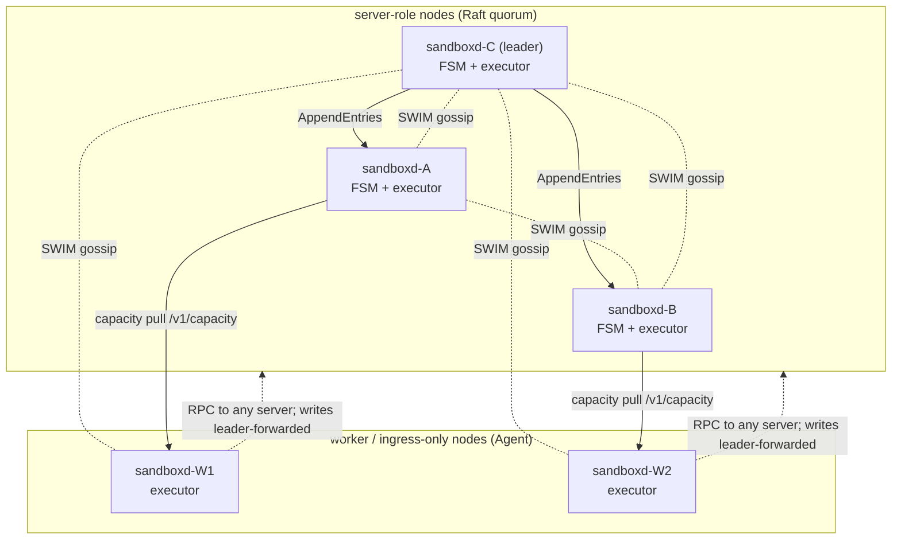
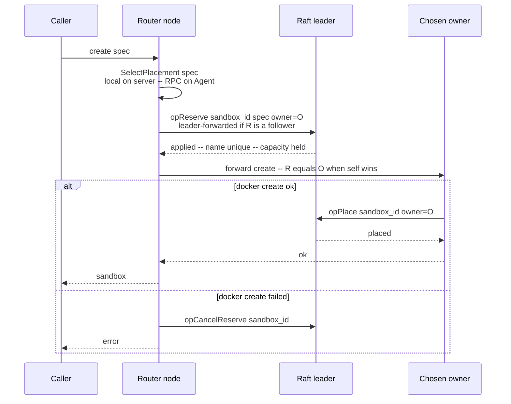

import { Tabs, TabItem } from '@astrojs/starlight/components';

AerolVM is one program. It runs as the standalone daemon and as a cluster node: the same `sandboxd`, with different config. (A daemon is a program that runs in the background on a server.) There is no separate scheduler process and no etcd.

Cluster mode is built from two libraries. `hashicorp/raft` keeps the placement FSM, the shared record of which node (server) owns each sandbox. `hashicorp/memberlist` tracks which nodes are members, using SWIM. Capacity reports travel separately, outside of gossip.

Those terms, in plain words:

- **Raft** is a consensus algorithm: a way for servers to agree on shared data even when some of them fail.
- **The FSM** (finite state machine) is the shared table Raft keeps. Every server changes it only by applying agreed entries from the Raft log.
- **SWIM** is a gossip protocol. In gossip, servers keep telling each other who is alive, and the news spreads like a rumor.

The idea behind the design: use strong agreement only where disagreement would do damage. That means cluster-wide name uniqueness, capacity reservation and custom-domain binding. Everything else uses best-effort gossip plus local decisions.

**In short:**

- Raft holds the few facts that must never disagree: who owns each sandbox, sandbox names, reserved capacity and custom hostnames.
- A create first reserves capacity and the name in Raft, then becomes "placed" once the sandbox runs, so two creates cannot double-book a node.
- Placement samples two nodes and picks the one with more room. Nodes with stale capacity reports are skipped.
- Any node accepts any request and forwards it to the sandbox's owner, so callers see one endpoint.
- When a node dies, sandboxes that opted in are rebuilt elsewhere. The rest are marked orphaned (HTTP 410), never silently deleted.

## Three ideas to know first

Three things in `internal/cluster/` are worth understanding before you read the code:

1. **A two-step create with reservations.** Placement is two FSM writes, not one. `opReserve` claims capacity and the name; `opPlace` promotes the sandbox to "placed" once it is actually running. The reservation stops two creates running at once from picking the same node between capacity reports.
2. **Owner-sharded execution with forwarding.** Each sandbox has one owner node. Any node accepts any request, and requests that change sandbox X are reverse-proxied (passed along) to X's owner. Callers see a single endpoint.
3. **Capacity freshness gating.** A candidate node's last capacity report must be recent. A node that is alive in gossip but missing recent capacity reports drops out of the placement set.

`Noop` (`internal/cluster/noop.go`) is used when `cfg.EnableCluster=false`, so the `cluster.Client` interface still works in single-node mode. Function and type names on this page are real, so you can search the code for them.

## Why not a single central scheduler

AerolVM spreads placement decisions across nodes instead of running one central scheduler. Two assumptions about the workload drive that choice:

1. Each resource node is large: a big bare-metal box or VM. AerolVM packs over 1,000 sandboxes per node, so each node has room to absorb small scheduling drift.
2. Sandboxes are short-lived, so the set on any one node turns over fast.

A central scheduler buys perfect global choices, at the cost of one more moving part to keep alive. This workload makes that trade unattractive. A perfectly balanced cluster drifts back to "roughly balanced" within seconds anyway.

Power-of-two-choices on per-node capacity reaches roughly balanced at a fixed cost per decision (O(1)), with no scheduler to lose. Where correctness needs a hard boundary, Raft holds it. Everywhere else, gossip and local decisions do the job.

**Where it sits on CAP.** The CAP theorem says that when a network splits, a distributed system must choose between consistency and availability. The placement FSM is CP: it chooses consistency. Placement writes (`opReserve`, `opPlace`, `opReassign` and the custom-domain commands) need a Raft leader, the one server that writes new log entries.

During a leader election, those writes fail with `ErrNotLeader` and the API returns 503. Sandboxes already placed keep serving. Reads routed to the owner never touch Raft, and neither does toolbox traffic. (The toolbox is the small agent inside each sandbox that runs commands and file operations.)

## Topology

A cluster has two kinds of nodes, plus an ingress-only variant. (Ingress means incoming traffic from the internet.)

- **Server-role nodes** run the Raft FSM that holds the placement map. Changes go through Raft consensus, and reads come from the local FSM copy.
- **Worker and ingress-only nodes** run `Agent` instead. They gossip their identity and receive forwarded API requests, but they do not store the FSM or join Raft. All their placement reads and writes go to the server quorum over authenticated RPC (remote procedure calls).

The quorum is the set of voting Raft servers. A majority of it must agree on every change.


```mermaid
graph TB
    subgraph server["server-role nodes (Raft quorum)"]
        S3["sandboxd-C (leader)<br/>FSM + executor"]
        S1["sandboxd-A<br/>FSM + executor"]
        S2["sandboxd-B<br/>FSM + executor"]
    end
    subgraph worker["worker / ingress-only nodes (Agent)"]
        W1["sandboxd-W1<br/>executor"]
        W2["sandboxd-W2<br/>executor"]
    end
    S3 -->|AppendEntries| S1
    S3 -->|AppendEntries| S2
    S1 -. SWIM gossip .- S2
    S1 -. SWIM gossip .- S3
    S2 -. SWIM gossip .- S3
    S3 -. SWIM gossip .- W1
    S3 -. SWIM gossip .- W2
    S1 -- "capacity pull /v1/capacity" --> W1
    S2 -- "capacity pull /v1/capacity" --> W2
    W1 -.->|RPC to any server; writes leader-forwarded| server
    W2 -.->|RPC to any server; writes leader-forwarded| server
```

Gossip (`hashicorp/memberlist`) carries only identity and role. Its payload must fit memberlist's 512-byte `NodeMeta` limit, and a capacity report is bigger than that. (`gossip.go` documents the bug that led to splitting them.)

Instead, `capacityLeaseCache` fetches `capacity.Snapshot`, a point-in-time report of free resources, from each worker-capable peer. It uses an authenticated `/v1/capacity` GET request on the gossip interval. That interval is 5 seconds by default, and a report expires after 3 intervals or 15 seconds, whichever is longer (see `capacity_lease.go`).

Worker and Agent nodes do not join Raft. They call any server-role member over RPC, and writes get forwarded to the leader.

## The placement FSM

The FSM changes only through a fixed set of commands, and each one is one Raft log entry. `internal/cluster/fsm.go` defines them. These are the placement commands:

```go
opPlace              opCode = 1
opDelete             opCode = 2
opReassign           opCode = 3
opUpsertSpec         opCode = 4
opAddExposedPort     opCode = 5
opRemoveExposedPort  opCode = 6
opReserve            opCode = 7   // hold capacity + name BEFORE docker
opCancelReserve      opCode = 8   // release a pending reservation
opSetNodeDrainState  opCode = 9
opOrphanOwner        opCode = 10  // atomically orphan all placements of a dead node
opClaimOrphan        opCode = 11  // reclaim an orphaned placement
opReserveBatch       opCode = 12  // one Raft entry for a create burst
opAddCustomDomain    opCode = 13  // cluster-wide hostname binding
opRemoveCustomDomain opCode = 14
```

Later commands (15 and up) cover platform volumes, audit cleanup, secret recipients, two-phase deletes, node storage retirement and template catalogues.

Because every change is one Raft log entry, placement state ends up the same on every replica (copy of the FSM). On apply, `f.version = log.Index` makes the Raft log index the FSM version. That version survives Raft snapshots (compact saved copies of the state) and matches between leader and followers with no extra bookkeeping. An earlier in-process counter reset to zero on every cold restart and broke watchers; tying the version to `log.Index` fixed that.

One caveat: apply also sets `now := time.Now().Unix()`. So timestamps such as `UpdatedUnix` and `OrphanedUnix` come from each server's own clock, and differ between leader and followers by milliseconds. Placement correctness does not need those fields to match byte for byte. It needs the keys and ownership fields to match, and they do.

Reads come from the local FSM copy. The leader is only on the write path.

**No split-brain on placement.** Split-brain is when two halves of a cluster both act as if they are in charge. Two nodes cannot both win a write, because Raft accepts an entry only once a majority of voters has logged it. During a leader election, writes block (the API returns 503), while reads keep working from each replica's last committed state.

Gossip and capacity reports can split, so two halves may hold different *views of capacity*. But neither half can change placement without a majority.

> **Invariant** (a rule that always holds). Ownership of sandbox X is whatever the committed FSM state says about `placements[X]`. The FSM changes only through Raft log entries. Two replicas may briefly disagree while a commit is in flight; once it commits, every server-role node agrees on the same owner.

## Reservations: the two-step create

Reservations stop two creates from double-booking a node. Without them, two creates running at once with the same capacity report would pick the same node. AerolVM records the intent in Raft before anything starts:

1. **On the router.** The router is whichever node received the create. A server-role router runs `SelectPlacement` locally; a worker or ingress-only Agent asks the control plane over RPC for a target. The router then writes `opReserve` for `(sandbox_id, spec, target_owner)`.

   The FSM checks that the name is unique across the cluster, refuses to overwrite a placed sandbox, and counts the reservation against the chosen owner. Before the next `SelectPlacement` runs, other in-flight reservations on that owner are subtracted from its headroom (spare capacity). The code comment explains why:

   > Subtract still-in-flight reservations (router wrote opReserve but the
   > target hasn't yet promoted via opPlace, so the gossip ledger doesn't
   > reflect them) from each peer's headroom. Without this, two creates that
   > arrive between gossip ticks both pick the same "best" node and double-
   > book it. The FSM serializes opReserve through raft, so the second
   > SelectPlacement on the same leader sees the first reservation here.

2. **On the owner.** The chosen owner starts the sandbox locally. On success, it writes `opPlace`, which promotes "reserved" to "placed". On failure, the router writes `opCancelReserve` and the reservation is released.

`opCancelReserve` has a deliberate safety property:

> Only cancel reservations, never delete a placed sandbox, even if a stale
> rollback attempt arrives after a successful promote. This is the safety
> property that lets the router fire CancelReservation freely on any failure
> without worrying about a racing successful promote.

`opReserveBatch` handles bursts: N creates fold into one Raft entry instead of N. `validateReservationBatchLocked` runs under the FSM lock on every replica before anything is applied. So a batch with even one conflict (a name collision or capacity overflow) is rejected whole. No partial commit can leave half the sandboxes reserved.

The leader also runs `admitReservationCommand` as a check before Raft. That check only avoids wasting log entries.


```mermaid
sequenceDiagram
    participant C as Caller
    participant R as Router node
    participant L as Raft leader
    participant O as Chosen owner
    C->>R: create spec
    R->>R: SelectPlacement spec<br/>local on server -- RPC on Agent
    R->>L: opReserve sandbox_id spec owner=O<br/>leader-forwarded if R is a follower
    L-->>R: applied -- name unique -- capacity held
    R->>O: forward create -- R equals O when self wins
    alt docker create ok
        O->>L: opPlace sandbox_id owner=O
        L-->>O: placed
        O-->>R: ok
        R-->>C: sandbox
    else docker create failed
        R->>L: opCancelReserve sandbox_id
        R-->>C: error
    end
```

> **Invariant.** Once `opReserve` commits, the next `SelectPlacement` on the leader sees the held capacity. Followers see it once they apply the log entry locally. That is under a millisecond normally, bounded by Raft commit plus apply time. A sandbox takes up capacity at most once on any node, even when creates run at once against a stale capacity report.

## Power-of-two-choices placement

`SelectPlacement` does not scan every node; it samples two and picks the better one. The comment in `placement.go` spells it out:

> The algorithm samples up to 2 random alive members (including self) and
> picks the one with the most CPU+memory headroom relative to the requested
> resources. This gives near-optimal load balancing without any global
> coordination; at scale it converges to within a small constant factor of
> the truly-optimal choice while costing O(1) per placement.

Why power-of-two instead of consistent hashing, Maglev or load-aware random choice? Power-of-two needs no rebalancing when members change, costs the same for every decision, and needs no global state. A result by Michael Mitzenmacher (see Further reading) explains why it lands within a constant factor of the best choice.

The score is `(budget − reserved − pending − request) / budget`, averaged across CPU, memory and (when reported) disk. See `headroomScore` in `placement.go`. A candidate is rejected if any of these is true:

- It is drained or dead.
- Its role cannot own sandboxes (`CanOwnSandboxRole`).
- It has not advertised an API URL, which means it is only partly joined.
- Its capacity report is stale (`CapacityStale`), or the request would overflow its budget.
- Its GPU or runtime (container, gVisor, Firecracker and so on) does not match the request.
- It lacks the requested template. Older peers that do not report templates are let through (the "unknown-allow" rule).

**The local node wins ties.** The comparison in `placement.go` uses `>`, not `>=`. So `a` (the first pick) wins unless `b` has strictly more headroom. When `a` is the local node, the local node keeps the sandbox.

The intent is to forward only when a peer is truly better. Placement behaves like a single node until the cluster has a reason to disagree.

Draining is a hard admission rule, not a scoring penalty. (Draining a node tells the cluster to stop placing new sandboxes on it.) The code says:

> Drained nodes are excluded from the candidate set entirely. Cheaper and
> clearer than threading the flag through nodeFits; drain is a hard
> admission rule (operator says "don't put more work here"), not a
> soft-scoring penalty.

> **Invariant.** A placement decision uses the freshest information the deciding node has. That is the capacity report, minus in-flight reservations, minus drain marks. The leader sees reservations at once; other replicas see them once their FSM apply catches up. Nodes with stale capacity drop out of the candidate set until their next successful report.

## Capacity reports and freshness

Each node pulls capacity reports from its peers instead of receiving them through gossip. `capacityLeaseCache` fetches `capacity.Snapshot` from each worker-capable peer over an authenticated `/v1/capacity` GET. It runs up to 32 fetches at a time (`capacityLeaseFetchConcurrency = 32`).

The interval is the gossip period, 5 seconds by default. A report expires after 3 intervals or 15 seconds, whichever is longer. An expired report is marked stale, and that node drops out of the candidate set.

Why pull instead of push? Because of the trust boundary. Pulls reuse the existing PAT (personal access token) auth on `/v1/capacity`. Pushes would need a separate authenticated endpoint on every peer.

With 1,000 peers, a 32-way fan-out every 5 seconds is roughly 6 requests per second per peer. That is an order-of-magnitude estimate, but the point stands: it is nowhere near 10,000 per second per peer.

Local capacity is refreshed on every tick from the in-process `Admitter` (`pkg/capacity`). It is not pulled, since that would be a call to itself. The same path adds the node's template list before storing the report, so the local view matches what peers see when they pull this node:

> placement reads straight off this lease, so without the overlay our own
> snapshot would advertise no templates and the unknown-allow rule would let
> creates land on peers that lack them.

> **Invariant.** A node is a placement candidate only if its capacity report is fresh (within the TTL). Being alive in gossip is not enough. A network split that drops capacity traffic but not gossip makes the node "unplaceable", not "placed but unreachable". Existing sandboxes keep serving, because forwarding uses the gossiped `APIURL` and `InternalURL`, not capacity.

## Owner-sharded execution

A placed sandbox stays on its owner node, and every other node forwards requests to it. Its local SQLite record, its container and its toolbox agent never move. Everything else is joined up with reverse-proxy forwarding (`ForwardHTTP` in `forward.go`). The package overview in `cluster.go` says:

> Once a sandbox is placed on node N, all of its state and lifecycle stays on
> N. The local SQLite store is unchanged. Cross-node API calls (toolbox,
> sessions, port forwards) are transparently reverse-proxied to the owner.

`ForwardHTTP` caches one `httputil.ReverseProxy` per peer URL. It keeps separate caches for plain connections and for mTLS-pinned ones. Mutual TLS (mTLS) is the encryption behind HTTPS, with both sides proving who they are by certificate. TLS state and keepalive connections are never shared between the two kinds.

**Loop detection.** A stale placement view could bounce a request between two nodes that each think the other owns sandbox X. `forward.go` sets `X-Cluster-Forwarded: 1` on the way out. A node that receives a request with that header, and is about to forward it again, returns 421 Misdirected Request instead. The caller then retries against fresh placement.

**The trade.** Owner-sharded execution buys local consistency. The toolbox sessions, the SQLite row and the container for one sandbox all live on one host. So that sandbox's state needs no agreement across nodes.

The cost is an extra forwarding hop on every cross-node API call. It also ties the sandbox to its owner: a long-lived sandbox cannot move except through the failover path.

> **Invariant.** A sandbox is reachable through the public API from any node in the cluster, whichever node owns it. Forwarding is automatic, so the client does not need to know placement.

## When a node dies: reassign, then orphan, then evict

When a node dies, the leader moves, marks or removes its sandboxes in a fixed order. First, SWIM declares the node dead, and `deadOwnerTracker` records when that was first seen. After `ClusterDeadOwnerGrace` (30 seconds by default, so a brief flap does not trigger costly cleanup), the leader's `evictDeadOwner` loop in `dead_owner.go` runs three steps:

1. **`opReassign` for each sandbox with the recreate policy.** These are the dead node's sandboxes whose spec set `failover.policy = "recreate"`. For each one, the leader picks a new owner with `selectRecreationTarget` and applies `opReassign`, one Raft entry per sandbox. Any node can be the target, including the leader itself.
2. **One `opOrphanOwner` for the rest.** The dead node's other sandboxes are orphaned in a single FSM change: `OwnerNodeID=""` and `OwnerState=Orphaned`, with the sandbox ID kept. Pending reservations on the dead owner are released in the same command.
3. **`RemoveServer` on the Raft configuration.** This removes the dead node from the quorum.

`selectRecreationTarget` (in `owner_watcher.go`) uses ordinary `SelectPlacement` for a sandbox with no sealed secrets. A sandbox with sealed secrets can only move to a node in its secret's recipient set, the nodes allowed to decrypt it. For that case, the leader scores every node in the set and picks the best.

The order of the steps matters: orphan first, then remove.

Suppose `RemoveServer` ran first and the leader then crashed. After restart, the FSM would still show the dead node as owner, and nothing could discover it was gone, because Raft no longer tracks it. Doing placements first means a crashed leader leaves visibly orphaned rows. The next leader's tick re-orphans them idempotently: repeating the step has the same effect as doing it once.

Recreate-policy sandboxes never pass through the orphaned state. Every node runs an owner-watcher loop that checks the FSM every 5 seconds for sandboxes now assigned to it. Only the node whose ID matches the new owner runs the recreate.

That node loads the sandbox's spec and opens its sealed (encrypted) secrets locally. It then calls `SandboxRecreator.RecreateSandbox(ctx, id, spec, secrets, exposedPorts)` (see `cluster.go`), which the service layer implements. If the recreate fails 5 times in a row (about 25 seconds), the watcher asks the cluster to reassign the sandbox to a different node.

Orphaned sandboxes have two ways out:

- **`opClaimOrphan`.** When the original owner comes back online, `AssertOwnership` runs at boot and reclaims its orphaned placements. The `opPlace` path refuses to overwrite an orphan. An orphan must be claimed on purpose, never silently re-placed, because the original node may still be running the container.
- **Operator delete.** Until it is claimed or deleted, the API returns 410 Gone for the orphaned sandbox.

```mermaid
sequenceDiagram
    participant SWIM as SWIM gossip
    participant T as deadOwnerTracker
    participant L as Raft leader
    participant FSM as Placement FSM
    participant N as Recreation target
    SWIM->>T: node-D suspect → dead
    T->>T: markDead(node-D, now)
    Note over T: wait ClusterDeadOwnerGrace (30s default)
    loop for each D-owned sandbox with failover.policy=recreate
        L->>L: selectRecreationTarget(placement)<br/>→ SelectPlacement (self allowed)
        L->>FSM: opReassign(id, new owner=N)
        N->>FSM: owner watcher sees new owner (polls every 5s)
        N->>N: load spec, open sealed secrets, SandboxRecreator.RecreateSandbox
    end
    L->>FSM: opOrphanOwner(node-D) for remaining placements
    FSM-->>FSM: remaining D-owned → OwnerNodeID=""<br/>(not deleted; 410 Gone)
    L->>L: RemoveServer(node-D)
```

> **Invariant.** Losing a node never deletes placements. Recreate-policy placements are reassigned: they keep their sandbox ID and get a new container on a new owner. The rest are orphaned and return 410 Gone until the original node returns and claims them, or an operator deletes them. Nothing is silently re-placed.

## Keeping secrets out of the Raft log

Sandbox specs can contain secrets, so credentials are removed before a spec enters the Raft log. `opPlace`, `opClaimOrphan`, `opUpsertSpec`, `opReserve` and `opReserveBatch` all carry the sandbox spec. A raw spec may hold plaintext secrets, such as mount credentials or environment variables, and those must never enter the log in the clear.

Before a spec reaches the cluster layer, the service seals its secrets and strips them out, in two steps:

1. It seals the secrets (mount credentials, the registry password and the environment variables) as a cluster secret. The secret is sealed for a recipient set: the owner plus backup nodes that may need to recreate the sandbox. See [Secrets providers](/cluster-secrets/) for how sealing and copying work.
2. `RedactClusterSecrets` (in `internal/service/cluster_secrets.go`) returns a copy of the spec with those values removed. The Raft command carries this cleaned spec plus a handle to the sealed secret: its reference, version and recipient node IDs.

The cluster code states the rule on every entry point:

> Spec MUST be redacted (no plaintext registry password / mount credentials)
> before being handed to AssertOwnership; Secrets carries the provider ref
> that the new owner re-merges on recreate.

Each server-role node splits a placement into a small "hot" row and its recovery data (the spec and secret handle). The recovery data goes into a content-addressed local store (`recoveryStore`), where each item is filed under a hash of its contents. The hot row keeps only a `RecoveryRef` pointing at it.

Raft snapshots carry the hot rows with their references, not the recovery data. So a server that joins from a snapshot fetches each item once from a peer (`fetchRecoveryBlob` walks `recoveryServerMembers`), then caches it. Followers apply FSM changes without ever opening the sealed secrets.

> **Invariant.** The Raft log never contains plaintext credentials. Specs are cleaned before they enter the log, and secrets travel sealed, by reference. Only a node in the secret's recipient set can open it, and only the assigned owner does so, to recreate the sandbox.

## The Noop fallback

In single-node mode, a `Noop` implementation (`internal/cluster/noop.go`) stands in for the whole cluster. It is selected when `cfg.EnableCluster=false`:

> Every method behaves as if this node owns every sandbox and is the only
> cluster member. Used when cfg.EnableCluster is false so callsites can be
> unconditional.

The `cluster.Client` interface stays usable in single-node mode. The service layer calls it without checking `EnableCluster`. The Noop answers "yes, I own this", "yes, you can place here" and "the only ingress target is me".

Service code that needs to know whether it is talking to itself still checks `IsSelf`. But the cluster package itself never goes away. So cluster code can grow without forcing every caller to re-check whether the cluster is real.

> **Invariant.** Cluster-mode code does nothing when cluster mode is off. The service layer calls `cluster.Client` every time. The implementation, not the caller, decides whether there is a quorum to talk to.

## Where the limits are

These are the current limits of cluster mode. This page would be dishonest if it implied the stack is mature in every way:

- **Capacity is pulled, not streamed.** A network blip between fetches does not lose membership, but it can mark capacity stale. A report expires after 3 intervals or 15 seconds, whichever is longer (the default interval is 5 seconds). A host that recovers quickly may take a tick or two to rejoin the placement set.
- **Reservations expire on a timer.** A router that crashes between `opReserve` and starting the sandbox leaves a stray reservation. The cleanup loop runs every 5 seconds and the reservation TTL is 120 seconds. So at worst, the chosen owner's headroom looks too low for about 125 seconds.
- **The dead-owner grace period is 30 seconds.** `ClusterDeadOwnerGrace` defaults to 30 seconds, and you can change it with `SB_DEAD_OWNER_GRACE`. Recreate-policy failover does not start until the dead-owner tracker has seen the node dead for that long without a break.
- **`failover.policy = "recreate"` is best effort.** The new owner rebuilds from the spec. Anything kept only in the container's writable layer is gone; see [Durability and failover](/durability/) for the full table.
- **Raft needs a majority.** Two server-role nodes cannot survive losing one; three can, so run an odd number of server-role nodes. Above 10 live nodes, `LargeClusterTopologyError` (in `topology.go`) also requires dedicated server, worker and ingress roles, and it caps the server tier at 7 nodes.

None of this is hidden. Operators planning a cluster need to know the guarantees and the failure modes. [Cluster setup](/cluster-setup/) covers how to run one.

## What this buys you

The same create call works on one node, on three nodes, and in the middle of a failover. This is the version that opts into recreate-on-failover:

<Tabs syncKey="lang">
  <TabItem label="TypeScript">
    ```ts
    import { MicroVM } from '@aerol-ai/aerolvm-sdk'

    const client = new MicroVM({
      apiUrl: process.env.SB_API_URL,
      patToken: process.env.SB_PAT_TOKEN,
    })

    // failover.policy = "recreate" opts this sandbox into recovery by another
    // node if its current owner dies. The replicated spec is what the new
    // owner uses to rebuild; nothing in this call shape depends on cluster
    // mode being on.
    const sandbox = await client.create({
      image:    'ubuntu:22.04',
      cpu:      1,
      memoryMB: 512,
      failover: { policy: 'recreate' },
    })

    console.log(sandbox.id, sandbox.publicURL)
    ```
  </TabItem>
  <TabItem label="Python">
    ```python
    import os
    from microvm import MicroVM

    client = MicroVM(
        api_url=os.environ['SB_API_URL'],
        pat_token=os.environ['SB_PAT_TOKEN'],
    )

    # failover.policy = "recreate" opts into recovery by another node if the
    # current owner dies; the replicated spec is what the new owner uses to
    # rebuild.
    sandbox = client.create({
        'image':    'ubuntu:22.04',
        'cpu':      1.0,
        'memoryMB': 512,
        'failover': {'policy': 'recreate'},
    })

    print(sandbox.id, sandbox.publicURL)
    ```
  </TabItem>
  <TabItem label="Go">
    ```go
    import (
        "context"
        "fmt"
        "log"
        "os"

        microvm   "github.com/aerol-ai/microvm/sdk/go/pkg/microvm"
        sdktypes  "github.com/aerol-ai/microvm/sdk/go/pkg/types"
    )

    client, err := microvm.NewClientWithConfig(&sdktypes.MicroVMConfig{
        APIUrl:   os.Getenv("SB_API_URL"),
        PATToken: os.Getenv("SB_PAT_TOKEN"),
    })
    if err != nil {
        log.Fatal(err)
    }

    // Failover.Policy = "recreate" opts into recovery by another node if the
    // current owner dies; the replicated spec is what the new owner uses.
    sandbox, err := client.Create(context.Background(), sdktypes.CreateSandboxOptions{
        Image:    "ubuntu:22.04",
        CPU:      1,
        MemoryMB: 512,
        Failover: &sdktypes.Failover{Policy: "recreate"},
    })
    if err != nil {
        log.Fatal(err)
    }

    fmt.Println(sandbox.ID, sandbox.PublicURL)
    ```
  </TabItem>
  <TabItem label="Rust">
    ```rust
    use aerolvm_sdk::{Client, CreateOptions, Failover};

    let client = Client::new(
        std::env::var("SB_API_URL").ok().as_deref(),
        std::env::var("SB_PAT_TOKEN").ok().as_deref(),
    )?;

    // failover.policy = "recreate" opts into recovery by another node if the
    // current owner dies; the replicated spec is what the new owner uses.
    let sandbox = client.create(CreateOptions {
        image:     "ubuntu:22.04".to_string(),
        cpu:       Some(1),
        memory_mb: Some(512),
        failover:  Some(Failover { policy: "recreate".to_string() }),
        ..Default::default()
    })?;

    println!("{} {:?}", sandbox.data.id, sandbox.data.public_url);
    ```
  </TabItem>
  <TabItem label="Java">
    ```java
    import ai.aerol.microvm.MicroVMClient;
    import ai.aerol.microvm.MicroVMConfig;
    import ai.aerol.microvm.Sandbox;
    import ai.aerol.microvm.model.CreateOptions;
    import ai.aerol.microvm.model.Failover;

    MicroVMClient client = new MicroVMClient(
        new MicroVMConfig()
            .setApiUrl(System.getenv("SB_API_URL"))
            .setPatToken(System.getenv("SB_PAT_TOKEN"))
    );

    // failover.policy = "recreate" opts into recovery by another node if the
    // current owner dies; the replicated spec is what the new owner uses.
    Sandbox sandbox = client.create(
        new CreateOptions()
            .setImage("ubuntu:22.04")
            .setCpu(1.0)
            .setMemoryMb(512)
            .setFailover(new Failover().setPolicy("recreate"))
    );

    System.out.println(sandbox.id + " " + sandbox.publicUrl);
    ```
  </TabItem>
</Tabs>

## Further reading

- [SWIM: Scalable Weakly-consistent Infection-style Process Group Membership](https://en.wikipedia.org/wiki/SWIM_Protocol): the gossip protocol behind `hashicorp/memberlist`.
- [In Search of an Understandable Consensus Algorithm (Raft)](https://raft.github.io/raft.pdf): the consensus algorithm `hashicorp/raft` implements.
- [The Power of Two Choices in Randomized Load Balancing](https://www.eecs.harvard.edu/~michaelm/postscripts/tpds2001.pdf): the result that makes sampling two nodes nearly as good as checking them all.

## Next steps

- [Durability and failover](/durability/): what survives a host loss, and what `failover.policy = "recreate"` keeps.
- [Cluster setup](/cluster-setup/): how to deploy a cluster, and the quorum rules.
- [Safe retries (idempotency)](/engineering-idempotency/): the single-node rules (name uniqueness, partial unique indexes) that the FSM mirrors across the cluster.
- [Secrets providers](/cluster-secrets/): how sealed secrets are copied to the nodes that may need them.
