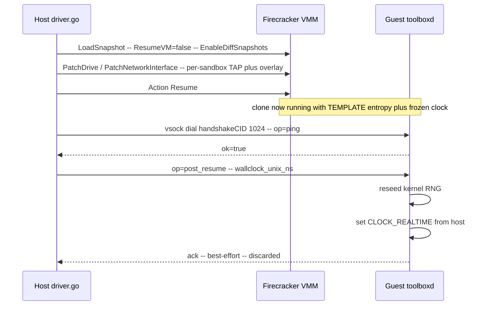
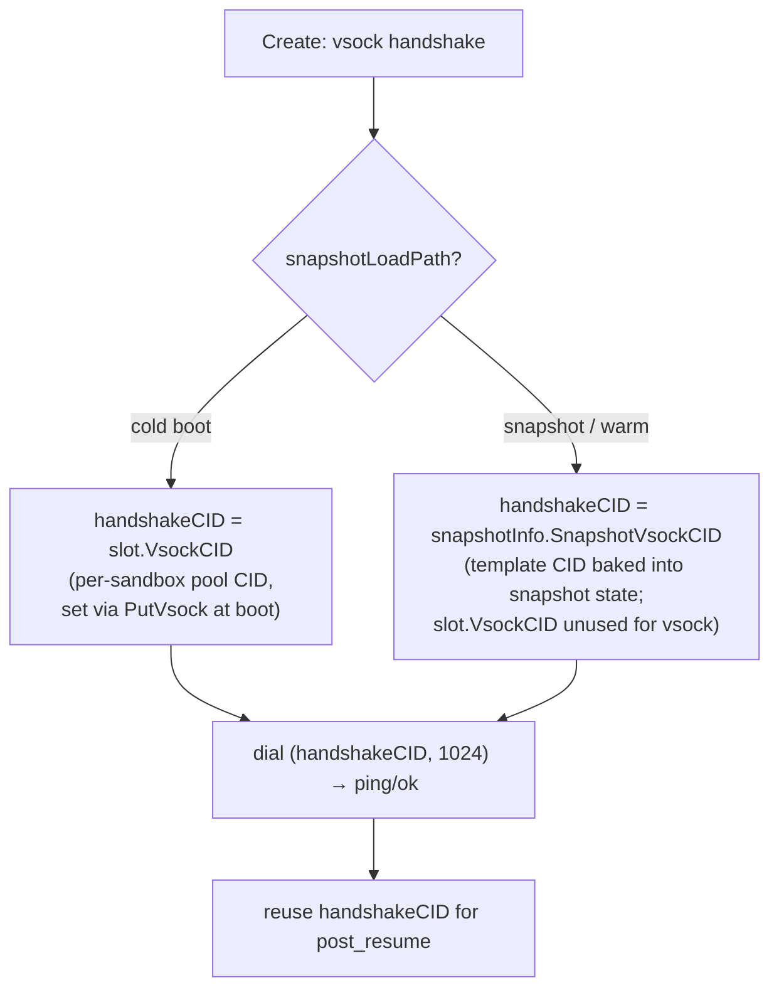

import { Tabs, TabItem } from '@astrojs/starlight/components';

Firecracker sandboxes can resume from a captured snapshot in a fraction of a
cold boot by sharing one memory image. `LoadSnapshot` mmaps the template's
`snapshot.memory` with `MAP_PRIVATE`; the kernel's CoW handler allocates a
private anonymous page on each clone's first write, leaving the file untouched.
[Snapshot restore and the warm-VMM pool](/firecracker-hydration) covers the
sharing mechanics and the warm-pool wiring;
[Firecracker Architecture](/firecracker-architecture) covers the boot pipeline.

**A snapshot is a frozen instant of a *running* operating system, and resuming
many copies of one running OS creates hazards that do not exist for a freshly
booted kernel.** Two clones drawn from the same memory image are, bit-for-bit,
the same machine: same RNG pool, same wall clock, same in-flight kernel state.
Each clone must end up with unique entropy, the current wall clock, its own
per-clone network identity, and its own per-clone memory deltas. AerolVM
resolves five distinct hazards; each one has a single load-bearing invariant.
This page is Firecracker-only; container-runtime checkpointing has different
semantics and is out of scope.

The whole snapshot/resume sequence lives in
`internal/runtime/firecracker/driver.go`, in `Create` Steps 6–8b, with the warm
path in `warmspawn.go` and capture in `snapshot.go`. Function and field names
below are real and grep-able.

## Hazard 1: the control channel must survive resume

The host talks to the in-guest `toolboxd` agent over a channel. The obvious
choice, TCP over the sandbox's TAP interface, is wrong for a *restored* guest.

A snapshot freezes guest kernel memory, including the TCP/IP stack's connection
state: sequence numbers, window sizes, the socket table, ARP entries. When a
clone resumes, all of that is restored verbatim, but it describes connections
to a host endpoint that no longer exists. The template's host-side TAP is
removed *after* `CreateSnapshot` and after the build VMM shuts down
(`internal/runtime/firecracker/snapshot.go:296` writes the snapshot,
`:314` shuts the VMM, `:325` removes the TAP). Each clone then gets a fresh
per-sandbox TAP PATCHed on *before* Resume, inside `configureVMMForLoad`
(`internal/runtime/firecracker/driver.go:910` →
`client.PatchNetworkInterface`). Any TCP connection state baked into the
snapshot now points at a dead peer with stale sequence numbers and will sit
half-open until it times out. The same applies to any guest-initiated outbound
TCP connection that was open at capture; `pre_snapshot`
(`internal/runtime/firecracker/snapshot.go:281`,
`cmd/toolboxd/vsock.go:220`) flushes session recordings today but does not
quiesce guest-side outbound sockets, so any such connections in the template
resume broken.

AerolVM uses **virtio-vsock**, not TCP, for the host↔guest control channel. The
rationale is stated directly in `pkg/firecracker/client.go` on `PutVsock`:

> Vsock is the snapshot-safe host↔guest channel; TCP over the TAP would tear on
> resume.

AerolVM keeps no vsock connection open across the snapshot boundary. The only
vsock state in the snapshot is the guest-side listener bound to `(guest_CID,
1024)`, and a listener is restartable: the host dials fresh after
`Action(Resume)` (`vsockHandshake` in `driver.go`), the guest accepts, and the
channel is live. A vsock *connection* that was open across the boundary would
tear the same as TCP; the snapshot-safe property is about the listener, not
about all vsock state.

> **Invariant.** The host↔guest control channel carries no connection state
> across the snapshot boundary. Every host↔guest exchange on a restored clone
> begins with a fresh vsock dial against a listener whose validity does not
> depend on any host endpoint that existed at capture time.

## Hazard 2: determinism: identical entropy and a frozen clock

Hazard 2 is the one with security consequences.

A snapshot captures the kernel's entropy pool (Linux's ChaCha-based DRBG state
inside `random.c`). Restore that snapshot into N clones and **every clone's
`getrandom(2)` returns the same bytes in the same order**, until something new
is mixed in. Two sandboxes that each generate a "random" TLS session key, a
UUID, an SSH host key, or a nonce will generate the *same* secret. For a
platform running untrusted multi-tenant code, identical entropy across tenants
is a security defect.

The wall clock is the parallel hazard. The snapshot freezes `CLOCK_REALTIME` at
capture time. A clone resumed an hour (or a week) later wakes up believing the
time is whatever it was when the template was built. Logs are misdated, TLS
handshakes that check `notBefore`/`notAfter` fail, and any code that diffs
"now" against a stored timestamp sees a clock that has jumped backwards.

Neither can be fixed before resume: `getrandom` and `clock_settime` both need
the kernel running. So AerolVM fixes it immediately *after*, in `driver.go`
**Step 8b (`post_resume`)**. Once the vsock handshake confirms the agent is up,
the host sends a `post_resume` op carrying the current host wall clock:

```go
// Step 8b: post-resume quiesce signal (snapshot-load path only).
// The clone resumed with the template's RNG entropy pool and
// wall clock. Both are observably wrong: two clones would draw the
// same getrandom bytes, and logs and TLS handshakes show a backwards
// time jump. Tell the in-guest toolboxd to reseed the kernel
// RNG and set CLOCK_REALTIME from the host now.
postCtx, cancel := context.WithTimeout(ctx, d.cfg.PostResumeTimeout)
err := d.sendVsockOp(postCtx, handshakeCID, "post_resume", map[string]any{
    "wallclock_unix_ns": time.Now().UnixNano(),
})
```

The in-guest agent handles this in `cmd/toolboxd/vsock.go:233`
(`OnPostResume`), which calls into `cmd/toolboxd/quiesce_linux.go`:
`SetWallclock` (`quiesce_linux.go:78`) issues `clock_settime(CLOCK_REALTIME,
host_now)`, and `ReseedRandom` (`quiesce_linux.go:41`) reads 32 bytes from the
host-attached virtio-rng device via `/dev/random` and writes them back into
`/dev/random` with the `RNDADDENTROPY` ioctl, crediting 256 bits so the next
`getrandom` reseeds the CSPRNG. Cold-boot skips this entirely: a freshly
initialized kernel has nothing stale to resync.

There is a window between `Action(Resume)` and the `post_resume` ack during
which the guest is running with template entropy and the template's wall clock.
On a slow host that window is hundreds of milliseconds. Anything that runs
inside the guest during that window (init scripts, systemd units, the
toolboxd's own startup) draws stale entropy and reads a stale clock. Code that
derives long-lived secrets at boot must not run before the `post_resume`
ack; the templates AerolVM ships defer key generation until the agent signals
quiesce-complete.



### Why best-effort and not fatal

Step 8b logs a warning and continues on failure; it does not abort the create.
This is a deliberate trade-off, not laxness. The failure mode of a missed
`post_resume` is stale entropy and a wrong clock: degraded, observable,
recoverable. The failure mode of treating it as fatal would be *a destroyed
sandbox that was otherwise healthy*. A clone whose vCPUs are ticking and whose
agent answered the ping is a working sandbox; refusing to hand it back because a
follow-up resync op timed out trades a soft problem for a hard one. The reseed
is bounded by `PostResumeTimeout` so a hung guest cannot stall the create path
indefinitely.

> **Invariant.** A resumed clone is never *silently* handed back sharing the
> template's entropy or clock: on the happy path it is reseeded before first
> use, and on the failure path the divergence is logged, never swallowed. A
> reseed failure does not destroy the sandbox. The warning log is load-bearing;
> an operator watching for entropy-divergence regressions greps that signal.

## Hazard 3: dial the guest's CID, not the slot's

The vsock handshake hinges on dialing the right CID, and the snapshot path makes
this a live hazard rather than a constant.

Every cold-boot sandbox gets a vsock CID from the per-host pool (`slot.VsockCID`)
and the guest is configured with exactly that CID via `PutVsock`. The host dials
it. Simple.

The snapshot/warm path is different. The guest's CID was **baked into the
snapshot state at template-build time** (`snapshot.go` configures `PutVsock`
with `req.GuestCID`, the template's reserved CID, *not* the transient build
slot's CID). When a clone resumes, the listener inside it is bound to *that*
template CID. The per-sandbox `slot.VsockCID` allocated for this create is used
only to derive the TAP/MAC and is irrelevant to vsock. `driver.go` selects the
handshake CID accordingly:

```go
handshakeCID := slot.VsockCID
if snapshotLoadPath {
    handshakeCID = snapshotInfo.SnapshotVsockCID
}
```

Get this wrong and there is no error. There is a hang. Dialing the slot CID
against a guest listening on the template CID races a listener that will never
accept, and `vsockHandshake` retries on connection-refused until it burns the
full deadline. The same `handshakeCID` is then reused for the `post_resume`
send, so a CID mismatch would also silently strand Hazard 2's fix. The driver
logs both CIDs (`template_cid`, `unused_slot_cid`) on the snapshot-load path so
a mismatch is greppable.



> **Invariant.** On the snapshot/warm path the host dials the CID encoded in the
> snapshot state, never the per-sandbox slot CID. The slot CID names the
> network identity; the snapshot CID names the agent. They are different
> numbers and conflating them deadlocks the handshake.

## Hazard 4: verify integrity before the kernel faults on it

A snapshot memory file can be several GiB. Firecracker does not read it eagerly;
`LoadSnapshot` mmaps it, and pages fault in lazily as the guest touches them.
That laziness interacts badly with corruption: a single flipped bit in
`snapshot.memory` does not surface at load time. It surfaces minutes later,
deep in a running guest, when some code path finally faults the bad page in. By
then the failure is unattributable and the sandbox has already been handed to a
tenant.

AerolVM closes this window by verifying the snapshot **on the host, before the
mmap**. `configureVMMForLoad` re-hashes `snapshot.memory` and `snapshot.state`
with streaming SHA-256 and compares against the checksum captured at build time,
*before* issuing the `LoadSnapshot` REST call:

```go
if d.cfg.SnapshotVerifyOnLoad && snap.SnapshotChecksum != "" {
    if err := verifySnapshotChecksum(snap.SnapshotMemoryPath, snap.SnapshotStatePath, snap.SnapshotChecksum); err != nil {
        return fmt.Errorf("firecracker runtime: snapshot integrity: %w", err)
    }
}
```

The checksum is produced once at capture (`snapshot.go` → `hashFile` /
`formatSnapshotChecksum`, stored as `sha256:<hex>|sha256:<hex>`) and streamed so
a multi-GiB memory file verifies in constant memory rather than OOMing on a
one-shot read. A mismatch wraps `models.ErrSnapshotCorrupt`, which the warm path
(`warmspawn.go`) escalates to mark the template UNHEALTHY and trigger a rebuild
- otherwise the refill loop would spin forever re-loading the same rotten
snapshot. The gate is `SnapshotVerifyOnLoad`, default on; it exists as a knob
only so operators benchmarking raw load latency on a known-good snapshot can
measure the mmap cost without the hash scan.

Verification re-reads the whole memory file on every load, duplicating the
capture-time scan. The alternative is a corrupt page faulting into a
tenant-facing guest minutes later.

> **Invariant.** A corrupt snapshot fails before it is mapped, not after it is
> running. Integrity is a host-side precondition of `LoadSnapshot`, never a
> guest-side surprise.

## Hazard 5: capacity accounting under shared memory

CoW makes the nominal memory model wrong. Admission reserves the full
`memoryMB` per sandbox even though the actual RSS of a freshly-resumed clone is
roughly `(template_dirty_pages + clone_dirty_pages_since_resume) × 4 KiB`,
orders of magnitude smaller for short-lived sandboxes. `memoryMB` is the
configured cap Firecracker hands to `KVM_SET_USER_MEMORY_REGION`; the host
kernel grows RSS on first touch, not upfront. Ten clones of one 512 MiB
template do **not** consume 5 GiB of distinct resident memory: they share the
read-only base and each adds only its dirty delta. Reserving against `memoryMB`
overstates the real footprint, often by an order of magnitude, and a host that
*could* pack many clones refuses admission as if each clone were a full
independent VM.

The fix is to measure resident reality. `internal/runtime/firecracker/rss_sampler.go`
samples per-VMM RSS from `/proc/<pid>/statm` on a fixed interval and exposes
the host aggregate via a single atomic load (`TotalRSSMB`), structured so
admission can read it without contending on the sampler's lock.

This is wired end to end. `Driver.Create` calls `d.rssRegister(allocID,
handle.Pid())` after the VMM is healthy
(`internal/runtime/firecracker/driver.go:769`), `Destroy` calls
`d.rssUnregister(sandboxID)` (`driver.go:1136`), and
`pkg/daemon/daemon.go:331` constructs the sampler and injects it with
`fcDriver.SetRSSSampler(rssSampler)`. The capacity admitter holds the sampler
through the `RSSSource` interface (`pkg/capacity/capacity.go:194`) and consults
`TotalRSSMB()` from `admit` (`capacity.go:388`, `:479`) and the effective-memory
watermark check (`capacity.go:572`). The header comment in `rss_sampler.go`
that says "no callers in the daemon" is stale relative to the code; the wiring
above is the current state.

Until the first sample window completes, `Ready()` returns false so admission
falls back to nominal accounting rather than reading the sampler's pre-tick
zero as "host empty". On docker-only hosts the sampler is `nil` and the
watermark check is gated on `rss != nil` (`pkg/daemon/daemon.go:222-229`
materialises the interface as a true nil to keep that gate honest).

> **Invariant.** Admission counts resident reality, not the sum of
> reservations, once the sampler's first window has completed; before that and
> on hosts without firecracker, admission falls back to nominal accounting.

## Known gaps

A snapshot-systems-literate reader will look for these. None of them are fixed
today; we name them so an operator can decide whether they matter for a given
workload.

- **Secrets in `snapshot.memory` on disk.** Captured guest memory sits on the
  host filesystem as a regular file. Anything in guest RAM at capture time
  (TLS session keys, SSH host keys, env vars, decrypted credentials) is in
  that file, readable by anything with host filesystem access. Treat the
  template build as the security boundary; do not bake long-lived secrets into
  templates that ship to disk.
- **`CLOCK_MONOTONIC` is not corrected.** `post_resume` sets `CLOCK_REALTIME`
  only. From inside the guest, `CLOCK_MONOTONIC` appears to skip the time the
  snapshot spent on disk. Code that diffs monotonic timestamps across the
  snapshot boundary will see implausibly small intervals. Pending
  `timerfd`/`setitimer`/`hrtimer` state carries stale relative offsets for the
  same reason.
- **TSC / kvm-clock.** The host TSC moved on while the snapshot was on disk.
  Firecracker's clock sync on restore is the upstream default; AerolVM does
  not intervene.
- **Entropy window.** Between `Action(Resume)` and the `post_resume` ack, the
  guest is running with template entropy. Code that runs in that window
  (early init, systemd units, the toolboxd's own startup) draws stale
  entropy. Quantified in Hazard 2.
- **In-flight guest TCP.** `pre_snapshot` does not quiesce guest-side outbound
  sockets; connections that were open at capture resume broken.
- **KASLR is not re-randomized across restore.** Every clone has the same
  kernel layout as the template. A tenant who can probe kernel addresses
  inside one clone learns the layout of every other clone resumed from the
  same template.
- **Kernel page cache vs. PATCHed rootfs.** The snapshot captured a populated
  page cache backed by the template rootfs. After `PatchDrive` points
  `/dev/vda` at the per-clone rootfs (`linkOrCopyRootfs`,
  `internal/runtime/firecracker/driver.go:566` / `:1389`), the page cache only
  matches the backing store because `linkOrCopyRootfs` preserves byte-for-byte
  equality with the template. Any future change to that path that breaks
  equality would introduce a silent data-corruption hazard.
- **Guest PIDs collide across clones.** PIDs inside the snapshot are reused by
  every clone. A monitoring agent that tags metrics with guest PIDs will see
  collisions across tenants.

## What this buys you

From the SDK, the correctness work is invisible. You create a sandbox from a
Firecracker template and get back a guest with its own entropy, the correct
wall clock, a live control channel, a verified memory image, and honest
capacity accounting once the sampler's first window completes. The create
shape below mirrors [Firecracker Sandbox](/firecracker-sandbox); the only
addition is a `template_id` to take the snapshot/resume path.

<Tabs syncKey="lang">
  <TabItem label="TypeScript">
    ```ts
    import { MicroVM } from '@aerol-ai/aerolvm-sdk'

    const client = new MicroVM({
      apiUrl: process.env.SB_API_URL,
      patToken: process.env.SB_PAT_TOKEN,
    })

    // template_id takes the snapshot-load path: LoadSnapshot + Resume,
    // then the host reseeds entropy and the clock over vsock.
    const sandbox = await client.create({
      templateId: 'tpl-python-3.12',
      runtime: 'firecracker',
      cpu: 1,
      memoryMB: 512,
    })

    console.log(sandbox.id)
    console.log(sandbox.publicURL)
    ```
  </TabItem>
  <TabItem label="Python">
    ```python
    from microvm import MicroVM

    client = MicroVM(
        api_url='https://sandbox.example.com',
        pat_token='your-token',
    )

    # template_id takes the snapshot-load path: LoadSnapshot + Resume,
    # then the host reseeds entropy and the clock over vsock.
    sandbox = client.create({
        'templateId': 'tpl-python-3.12',
        'runtime': 'firecracker',
        'cpu': 1.0,
        'memoryMB': 512,
    })

    print(sandbox.id)
    print(sandbox.publicURL)
    ```
  </TabItem>
  <TabItem label="Go">
    ```go
    import (
        "context"
        "fmt"
        "log"
        "os"

        microvm   "github.com/aerol-ai/microvm/sdk/go/pkg/microvm"
        sdktypes  "github.com/aerol-ai/microvm/sdk/go/pkg/types"
    )

    client, err := microvm.NewClientWithConfig(&sdktypes.MicroVMConfig{
        APIUrl:   os.Getenv("SB_API_URL"),
        PATToken: os.Getenv("SB_PAT_TOKEN"),
    })
    if err != nil {
        log.Fatal(err)
    }

    // TemplateID takes the snapshot-load path: LoadSnapshot + Resume,
    // then the host reseeds entropy and the clock over vsock.
    sandbox, err := client.Create(context.Background(), sdktypes.CreateSandboxOptions{
        TemplateID: "tpl-python-3.12",
        Runtime:    sdktypes.RuntimeFirecracker,
        CPU:        1,
        MemoryMB:   512,
    })
    if err != nil {
        log.Fatal(err)
    }

    fmt.Println(sandbox.ID, sandbox.PublicURL)
    ```
  </TabItem>
  <TabItem label="Rust">
    ```rust
    use aerolvm_sdk::{Client, CreateOptions};

    let client = Client::new(
        Some("https://sandbox.example.com"),
        Some("your-token"),
    )?;

    // template_id takes the snapshot-load path: LoadSnapshot + Resume,
    // then the host reseeds entropy and the clock over vsock.
    let sandbox = client.create(CreateOptions {
        template_id: Some("tpl-python-3.12".to_string()),
        runtime:     Some("firecracker".to_string()),
        cpu:         Some(1),
        memory_mb:   Some(512),
        ..Default::default()
    })?;

    println!("{} {:?}", sandbox.data.id, sandbox.data.public_url);
    ```
  </TabItem>
  <TabItem label="Java">
    ```java
    import ai.aerol.microvm.MicroVMClient;
    import ai.aerol.microvm.MicroVMConfig;
    import ai.aerol.microvm.Sandbox;
    import ai.aerol.microvm.model.CreateOptions;

    MicroVMClient client = new MicroVMClient(
        new MicroVMConfig()
            .setApiUrl("https://sandbox.example.com")
            .setPatToken(System.getenv("SB_PAT_TOKEN"))
    );

    // templateId takes the snapshot-load path: LoadSnapshot + Resume,
    // then the host reseeds entropy and the clock over vsock.
    Sandbox sandbox = client.create(
        new CreateOptions()
            .setTemplateId("tpl-python-3.12")
            .setRuntime("firecracker")
            .setCpu(1.0)
            .setMemoryMb(512)
    );

    System.out.println(sandbox.id + " " + sandbox.publicUrl);
    ```
  </TabItem>
</Tabs>

