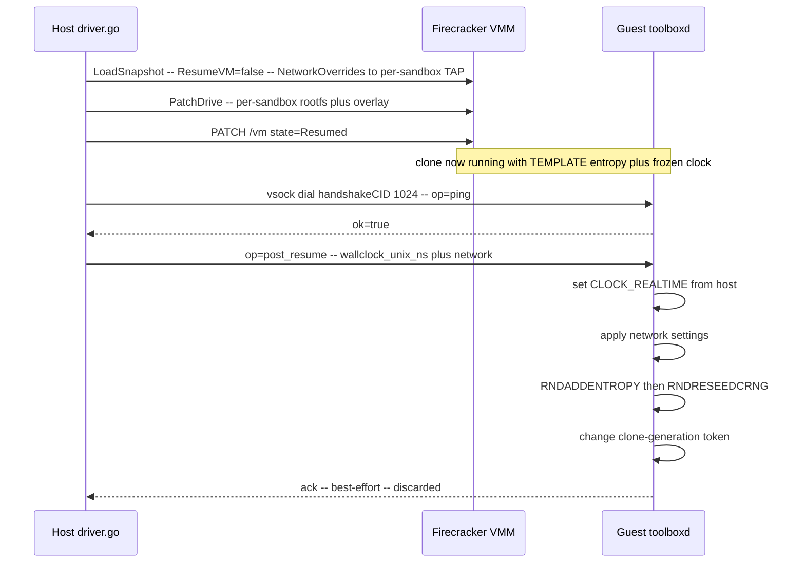
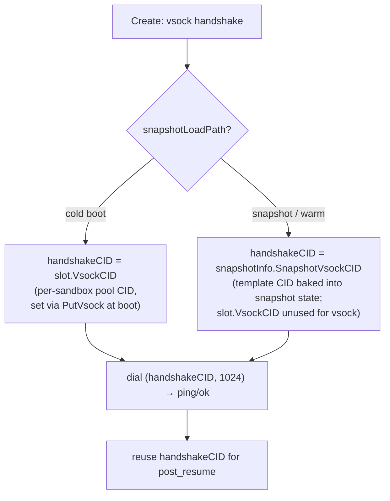

import { Tabs, TabItem } from '@astrojs/starlight/components';

A Firecracker sandbox can start from a snapshot instead of booting from scratch. A **snapshot** is a saved copy of a running virtual machine: its memory, its CPU state and its devices. Starting many sandboxes from one snapshot is fast. Making each copy correct is the hard part, and this page explains how AerolVM does it.

**In short:**

- Every clone of a snapshot starts as the exact same machine: same random-number state, same clock, same network identity.
- AerolVM handles five separate hazards. For each one it keeps a single rule that must always hold.
- The host talks to each clone over vsock, a direct host-to-VM channel that skips the network. It survives a snapshot; TCP does not.
- Right after a clone wakes up, the host resets its clock and network settings and has its kernel reseed its random-number generator.
- The host checks the snapshot file for damage before using it, and counts the memory clones really use.

## How clones share one snapshot

This section shows the basic trick that makes clones fast. Firecracker's `LoadSnapshot` call maps the template's `snapshot.memory` file into each clone with `MAP_PRIVATE`. (A **template** is a prepared disk image plus its snapshot. **Mapping** a file makes it look like memory, and the kernel reads pages from the file when they are needed.)

With `MAP_PRIVATE`, all clones read the same pages. When a clone first writes to a page, the kernel's **copy-on-write** (CoW) handler gives that clone its own private copy. The file itself is never changed.

[Firecracker snapshot restore](/firecracker-hydration/) covers the sharing and the warm pool in detail. [Firecracker architecture](/firecracker-architecture/) covers the boot steps.

## Why a snapshot is risky to copy

This section explains what makes clones different from freshly booted machines. **A snapshot is a frozen moment of a *running* operating system, and copying a running system creates hazards that a fresh boot never has.** Two clones of one memory image are the same machine, bit for bit. They share the same random-number pool, the same wall clock and the same half-finished kernel work.

Each clone must end up with its own randomness, the current time, its own network identity and its own memory changes. AerolVM handles five separate hazards. For each one it keeps a single **invariant**: a rule that must always be true.

This page covers Firecracker only. Container checkpoints work differently and are out of scope.

The whole snapshot and resume sequence lives in `internal/runtime/firecracker/driver.go`, in steps 6 to 8b of `Create`. The warm path is in `warmspawn.go`, and snapshot capture is in `snapshot.go`. Every function and field name on this page is real, so you can search the code for it.

## Hazard 1: the control channel must survive resume

This hazard is about how the host talks to the agent inside a clone. The host sends commands to `toolboxd`, a small agent that runs inside the guest. (The **guest** is the operating system inside the virtual machine; the **host** is the server running it.)

The obvious channel is TCP over the sandbox's TAP interface, a virtual network cable between host and guest. That choice is wrong for a guest restored from a snapshot.

A snapshot freezes the guest kernel's memory, including the state of its TCP/IP network stack. That means sequence numbers, window sizes, the socket table and ARP entries (the table that maps IP addresses to network cards). When a clone resumes, all of it comes back exactly as it was. But it describes connections to a host endpoint that no longer exists.

Here is the order in `snapshot.go`. It writes the snapshot, shuts down the build VMM, then removes the template's host-side TAP. (A **VMM**, or virtual machine monitor, is the Firecracker process that runs one virtual machine.)

Each clone then gets a fresh per-sandbox TAP before it resumes. `configureVMMForLoad` in `driver.go` attaches it inside the `LoadSnapshot` call itself, with a network override (`NetworkOverrides`) that names this sandbox's TAP. Any TCP connection state baked into the snapshot now points at a dead peer with stale sequence numbers. It stays half-open until it times out.

The same applies to any outbound TCP connection the guest had open at capture. The `pre_snapshot` step (in `snapshot.go` and `cmd/toolboxd/vsock.go`) flushes session recordings today. It does not close the guest's outbound sockets, so any such connections in the template resume broken.

AerolVM uses **virtio-vsock** (vsock for short) for the control channel, not TCP. Vsock is a socket that runs straight between the host and one virtual machine, without using the network. Each virtual machine has a vsock address called a **CID** (context ID). The reason for vsock is stated in `pkg/firecracker/client.go`, on `PutVsock`:

> Vsock is the snapshot-safe host↔guest channel; TCP over the TAP would tear on resume.

AerolVM keeps no vsock connection open across the snapshot. The only vsock state in the snapshot is the guest's listener on `(guest_CID, 1024)`, and a listener can restart. After the VM resumes, the host dials fresh (`vsockHandshake` in `driver.go`), the guest accepts, and the channel is live.

A vsock *connection* left open across the snapshot would break just like TCP. So the safe part is the listener, not all vsock state.

> **Invariant.** The host-to-guest control channel carries no connection state across the snapshot. Every exchange with a restored clone starts with a fresh vsock dial. The listener it dials does not depend on any host endpoint that existed at capture time.

## Hazard 2: identical randomness and a frozen clock

This hazard is the one with security consequences. A snapshot captures the kernel's **entropy pool**: the store of unpredictable bits the kernel uses to make random numbers. In Linux this is the ChaCha-based random generator state in `random.c`.

Restore that snapshot into many clones, and **every clone's `getrandom(2)` returns the same bytes in the same order**. This lasts until something new is mixed in.

So two sandboxes that each make a "random" TLS session key, UUID, SSH host key or nonce will make the *same* secret. (A **nonce** is a number meant to be used only once. **TLS** is the encryption behind HTTPS.) AerolVM runs untrusted code for many **tenants** (customers or accounts). Identical randomness across tenants is a security bug.

The wall clock is the matching hazard. The snapshot freezes `CLOCK_REALTIME` (the kernel's wall clock) at capture time. A clone resumed an hour or a week later believes it is still the moment the template was built.

Logs carry the wrong date. TLS checks of a certificate's `notBefore` and `notAfter` dates fail. Any code that compares "now" with a stored timestamp sees the clock jump backwards.

Neither problem can be fixed before resume, because `getrandom` and `clock_settime` both need the kernel running. So AerolVM fixes both right *after* resume, in **step 8b (`post_resume`)** of `Create` in `driver.go`. Once the vsock handshake confirms the agent is up, the host sends a `post_resume` message.

The message runs on every boot path, cold boots included. It carries the host's current wall clock. When the sandbox's TAP slot has an address, it also carries the guest's network settings (`postResumeData` in `driver.go`). Here is the current code, shortened to the relevant lines:

```go
// Step 8b: post-boot/post-resume quiesce signal. Snapshot clones
// resumed with the template's RNG entropy pool and wall clock, so
// toolboxd reseeds and sets CLOCK_REALTIME. Cold boots do not need
// the entropy fix, but the same message also re-applies the static
// TAP address after toolboxd is definitely running, which closes
// the boot-time race where PID 1 starts before the virtio-net
// device is fully visible.
postCtx, cancel := context.WithTimeout(ctx, d.cfg.PostResumeTimeout)
postErr := d.sendVsockOp(postCtx, vsockPath, handshakeCID, "post_resume", postResumeData(slot))
cancel()
```

```go
func postResumeData(slot *TapSlot) map[string]any {
    data := map[string]any{
        "wallclock_unix_ns": time.Now().UnixNano(),
    }
    if network := toolboxNetworkPayload(slot); network != nil {
        data["network"] = network
    }
    return data
}
```

The `network` block holds the guest IP, gateway, netmask and prefix length from the sandbox's TAP slot. The agent handles the message in `OnPostResume` (`cmd/toolboxd/vsock.go`). It does four things, in this order:

1. **Set the clock.** `SetWallclock` (in `cmd/toolboxd/quiesce_linux.go`) calls `clock_settime(CLOCK_REALTIME, host_now)`.
2. **Apply the network settings.** If the message has a `network` block, `ConfigureNetwork` sets the guest's address and default route with `ip`.
3. **Force a reseed.** `ReseedRandom` reads 32 bytes from Go's `crypto/rand` and writes them into `/dev/random` with the `RNDADDENTROPY` ioctl, crediting 256 bits. It then calls `RNDRESEEDCRNG`, which makes the kernel's **CSPRNG** (cryptographically secure random-number generator) reseed at once.
4. **Mark the clone.** It changes the **clone-generation token** in `/run/aerolvm/clone-generation`, even if the reseed failed, and logs `vsock: post_resume complete`.

An **ioctl** is a system call that sends a special command to a device. Kernels older than 5.10 lack `RNDRESEEDCRNG`. There the agent skips that call, and the kernel reseeds on its own schedule.

No randomness comes from the host. AerolVM attaches no virtio-rng device (a virtual device that passes random bytes from the host), and `crypto/rand` reads the guest kernel's own generator. So this step forces a reseed, but brings in nothing from outside the clone. The handler's own code comment names vmgenid, covered below, as the real backstop.

On a cold boot the same message runs. A freshly started kernel has no stale randomness or clock, so there it mainly re-applies the network address once the agent is running.

There is a gap between the resume call and the `post_resume` reply. (AerolVM resumes a VM with `PatchVM`, Firecracker's `PATCH /vm` with state `Resumed`.) During the gap, the guest runs with the template's randomness and the template's clock. On a slow host this gap lasts hundreds of milliseconds.

Anything that runs in the guest during the gap draws stale randomness and reads a stale clock. That includes init scripts, systemd units and toolboxd's own startup. Code that makes long-lived secrets at boot must not run before `post_resume` has finished. Inside the guest, the sign that it has finished is the change in the clone-generation token.

The templates AerolVM ships put off key generation until `post_resume` has finished.


```mermaid
sequenceDiagram
    participant H as Host driver.go
    participant FC as Firecracker VMM
    participant G as Guest toolboxd
    H->>FC: LoadSnapshot -- ResumeVM=false -- NetworkOverrides to per-sandbox TAP
    H->>FC: PatchDrive -- per-sandbox rootfs plus overlay
    H->>FC: PATCH /vm state=Resumed
    Note over FC,G: clone now running with TEMPLATE entropy plus frozen clock
    H->>G: vsock dial handshakeCID 1024 -- op=ping
    G-->>H: ok=true
    H->>G: op=post_resume -- wallclock_unix_ns plus network
    G->>G: set CLOCK_REALTIME from host
    G->>G: apply network settings
    G->>G: RNDADDENTROPY then RNDRESEEDCRNG
    G->>G: change clone-generation token
    G-->>H: ack -- best-effort -- discarded
```

### Why a failed reset does not stop the create

This section explains why step 8b only warns when it fails. It logs a warning and goes on; it does not cancel the create. The agent also replies OK when one of its own steps fails, and logs that step as a warning. This is a deliberate trade-off, not carelessness.

A missed `post_resume` leaves stale randomness and a wrong clock. That state is degraded, but you can see it and recover from it. Treating it as fatal would instead destroy a sandbox that was otherwise healthy.

A clone whose virtual CPUs (vCPUs) are running and whose agent answered the ping is a working sandbox. Refusing to return it because a follow-up step timed out trades a soft problem for a hard one. The reset is bounded by `PostResumeTimeout`, so a hung guest cannot stall the create path forever.

> **Invariant.** A resumed clone is never *silently* returned with the template's randomness or clock. On the normal path it is reseeded before first use. On the failure path the mismatch is logged, never hidden.
>
> A reseed failure does not destroy the sandbox.
>
> The warning log is load-bearing. Operators who watch for clones that share randomness search the logs for it.

### Closing the randomness gap with vmgenid

This section covers a second, faster fix for the gap. `post_resume` is **reactive**: it runs after the VM resumes. So the guest has already run with template randomness for a few hundred milliseconds when the reseed lands.

The stronger partner works inside the kernel, at the moment of resume, and needs no message from the host. It is Firecracker's **VM Generation ID** (vmgenid).

vmgenid is a 128-bit value that Firecracker changes on every snapshot restore. It shows the value to the guest through an **ACPI** device. (ACPI is the standard way a machine describes its hardware to the operating system.) A guest kernel built with `CONFIG_VMGENID` watches that device.

The moment the kernel sees the value change on resume, it reseeds its CSPRNG inside the resume path. This happens *before* any user program runs again. So code that runs in the gap `post_resume` cannot reach (early init, systemd units, toolboxd's own startup) still gets fresh randomness.

The two fixes stack as layers of defense. vmgenid reseeds the kernel CSPRNG with no gap at all. `post_resume` still does what vmgenid does *not*. It resets `CLOCK_REALTIME` (vmgenid handles randomness only), applies the network settings, and forces one more kernel reseed with `RNDADDENTROPY` and `RNDRESEEDCRNG`.

vmgenid only works when the deployment supplies three pieces. AerolVM controls only one of them in code:

- **Kernel command line (in code).** On x86 hosts vmgenid reaches the guest over ACPI, so ACPI must stay on. The x86 boot arguments (`baseBootArgsAMD64` in `driver.go`) deliberately leave out `acpi=off`, while `pci=off` is unrelated and safe. On Arm hosts Firecracker has no ACPI and delivers vmgenid through the device tree instead. A regression test fails the build if a later edit adds `acpi=off` back. That edit would quietly turn off the early reseed.
- **Guest kernel (a file the operator supplies).** The kernel image (`SB_FIRECRACKER_KERNEL`) must be built with `CONFIG_VMGENID=y`. The repository does not build the kernel, so check this when you build templates or deploy.
- **Firecracker binary (a file the operator supplies).** vmgenid support arrived in Firecracker v1.8, so `SB_FIRECRACKER_BINARY` must be that version or newer. With an older binary, the guest never sees a generation-ID change. It quietly falls back to `post_resume` only: correct on the normal path, but with the gap back.

vmgenid reseeds the **kernel** CSPRNG only. A program can also keep its own **PRNG** (pseudo-random number generator) in its own memory. Picture a long-lived process baked into the template, such as a preloaded `python` that ran `import numpy`.

That process seeded its PRNG before the snapshot, and neither fix reaches it. Closing that gap needs the clone-generation signal described in [Randomness in clones](/randomness-in-cloned-sandboxes/).

## Hazard 3: dial the guest's CID, not the slot's

This hazard is about which vsock address the host dials. The handshake only works if the host dials the right CID, and on the snapshot path that number changes.

Every cold-boot sandbox gets a vsock CID from a per-host pool (`slot.VsockCID`). (A **slot** is one entry in that pool: a TAP device, IP addresses and a CID.) `PutVsock` sets the guest up with exactly that CID, and the host dials it. Simple.

The snapshot and warm paths are different. The guest's CID was **baked into the snapshot when the template was built**. `snapshot.go` calls `PutVsock` with `req.GuestCID`, the template's reserved CID. It does *not* use the CID of the temporary build slot.

When a clone resumes, its listener is bound to *that* template CID. On this path vsock ignores the `slot.VsockCID` picked for this create. `driver.go` picks the handshake CID to match:

```go
handshakeCID := slot.VsockCID
if snapshotLoadPath {
    handshakeCID = snapshotInfo.SnapshotVsockCID
}
```

Get this wrong and you get no error. You get a hang. The host dials the slot CID while the guest listens on the template CID, so nothing ever accepts.

`vsockHandshake` retries on "connection refused" until it uses up the whole deadline. The same `handshakeCID` is then reused for the `post_resume` send, so a wrong CID would also quietly skip the Hazard 2 fix. On the snapshot path the driver logs both CIDs (`template_cid`, `unused_slot_cid`), so you can search the logs for a mismatch.


```mermaid
graph TD
    START["Create: vsock handshake"] --> Q{snapshotLoadPath?}
    Q -->|cold boot| COLD["handshakeCID = slot.VsockCID<br/>(per-sandbox pool CID,<br/>set via PutVsock at boot)"]
    Q -->|snapshot / warm| WARM["handshakeCID = snapshotInfo.SnapshotVsockCID<br/>(template CID baked into snapshot state;<br/>slot.VsockCID unused for vsock)"]
    COLD --> DIAL["dial (handshakeCID, 1024) → ping/ok"]
    WARM --> DIAL
    DIAL --> POST["reuse handshakeCID for post_resume"]
```

> **Invariant.** On the snapshot and warm paths the host dials the CID stored in the snapshot, never the per-sandbox slot CID. The slot CID names the network identity; the snapshot CID names the agent. They are different numbers, and mixing them up deadlocks the handshake.

## Hazard 4: check the snapshot before the kernel touches it

This hazard is about a damaged snapshot file. A snapshot memory file can be several GiB, and Firecracker does not read it all at load time.

`LoadSnapshot` maps the file, and pages **fault in** lazily: the kernel loads each page from the file the first time the guest touches it. That laziness hides corruption. A single flipped bit in `snapshot.memory` does not show up at load time.

It shows up minutes later, deep in a running guest, when some code finally touches the bad page. By then you cannot tell what caused the failure, and the sandbox already belongs to a tenant.

AerolVM closes this window by checking the snapshot **on the host, before mapping it**. `configureVMMForLoad` calls `verifySnapshotForLoad`, which hashes `snapshot.memory` and `snapshot.state` with streaming SHA-256. It compares the result with the checksum saved at build time, *before* it makes the `LoadSnapshot` call:

```go
if d.cfg.SnapshotVerifyOnLoad && snap.SnapshotChecksum != "" {
    err := d.verifySnapshotForLoad(snap.TemplateID, snap.SnapshotMemoryPath, snap.SnapshotStatePath, snap.SnapshotChecksum)
    if err != nil {
        return fmt.Errorf("firecracker runtime: snapshot integrity: %w", err)
    }
}
```

The checksum is made once at capture (`hashFile` and `formatSnapshotChecksum` in `snapshot.go`). It is stored as `sha256:<hex>|sha256:<hex>`. Hashing streams the file, so even a multi-GiB memory file is checked with a fixed amount of memory. Reading it in one go could run out of memory.

A mismatch wraps `models.ErrSnapshotCorrupt`. The warm path (`warmspawn.go`) then marks the template UNHEALTHY and triggers a rebuild. Otherwise the refill loop would spin forever, loading the same bad snapshot again.

The switch is `SnapshotVerifyOnLoad`, and it is on by default. It exists only for operators who benchmark raw load speed on a known-good snapshot. They can measure the mapping cost without the hash scan.

By default the full scan does not run on every load. With `SB_FIRECRACKER_SNAPSHOT_VERIFY_MODE=once`, the server checks a snapshot once per server start and per file identity, then caches the result (`snapshot_verify_cache.go`). The file identity is its device, inode, size and modification time.

Set the mode to `always` to re-hash on every create, which repeats the scan done at capture each time. Either way, the other choice is a corrupt page faulting into a tenant's guest minutes later.

> **Invariant.** A corrupt snapshot fails before it is mapped, not after it is running. Integrity is a host-side precondition of `LoadSnapshot`, never a surprise inside the guest.

## Hazard 5: counting memory when clones share it

This hazard is about how the host decides whether it has room for one more sandbox. Copy-on-write makes the simple memory count wrong.

**Admission** is the check that decides whether a host can take a new sandbox. It reserves the full `memoryMB` for each sandbox. But a freshly resumed clone really uses about `(template_dirty_pages + clone_dirty_pages_since_resume) × 4 KiB`. (A **dirty page** is a memory page that has been written to.) For short-lived sandboxes that is orders of magnitude smaller.

`memoryMB` is the cap Firecracker passes to `KVM_SET_USER_MEMORY_REGION`. The host kernel grows a VM's **RSS** (resident set size: the physical memory it really holds) on first touch, not up front.

So ten clones of one 512 MiB template do **not** use 5 GiB of separate memory. They share the read-only base, and each adds only its own dirty pages.

Reserving against `memoryMB` overstates the real footprint, often by ten times or more. A host that *could* fit many clones then turns them away, as if each were a full, separate virtual machine.

The fix is to measure what is really in memory. `internal/runtime/firecracker/rss_sampler.go` reads each VMM's RSS from `/proc/<pid>/statm` on a fixed interval. It publishes the host total through a single atomic load (`TotalRSSMB`), so admission can read it without waiting on the sampler's lock.

This is wired end to end. `Driver.Create` calls `d.rssRegister(allocID, handle.Pid())` once the VMM is healthy, and `Destroy` calls `d.rssUnregister(sandboxID)`. `pkg/daemon/daemon.go` builds the sampler and hands it over with `fcDriver.SetRSSSampler(rssSampler)`.

The capacity admitter holds the sampler through the `RSSSource` interface (`pkg/capacity/capacity.go`). It reads `TotalRSSMB()` in `admit` and in the effective-memory watermark check. The header comment in `rss_sampler.go` says the sampler has "no callers in the daemon" (the daemon is the AerolVM server process). That comment is out of date; the wiring above is how the code works today.

Until the first sample window finishes, `Ready()` returns false. Admission then falls back to the reserved numbers, instead of reading the sampler's starting zero as "host empty".

On Docker-only hosts the sampler is `nil`, and the watermark check only runs when `rss != nil`. `pkg/daemon/daemon.go` turns the interface into a true nil to keep that check honest.

> **Invariant.** Once the sampler's first window has finished, admission counts the memory clones really use, not the sum of reservations. Before that, and on hosts without Firecracker, admission falls back to the reserved numbers.

## Known gaps

This section lists what is not fixed today. A reader who knows snapshot systems will look for these. We name them so an operator can decide whether they matter for a given workload.

- **Secrets in `snapshot.memory` on disk.** Captured guest memory sits on the host disk as a normal file. Anything in guest memory at capture time is in that file: TLS session keys, SSH host keys, environment variables, decrypted credentials. Anyone with access to the host's files can read it. Treat the template build as the security boundary, and do not bake long-lived secrets into templates that are saved to disk.
- **`CLOCK_MONOTONIC` is not corrected.** `post_resume` sets `CLOCK_REALTIME` only. `CLOCK_MONOTONIC` is a clock that only counts forward, used to measure intervals. Inside the guest, it seems to skip the time the snapshot spent on disk. Code that compares monotonic timestamps across the snapshot will see intervals that are too short. Pending `timerfd`, `setitimer` and `hrtimer` timers carry stale offsets for the same reason.
- **TSC and kvm-clock.** The host's TSC (the CPU's cycle counter) moved on while the snapshot sat on disk. Firecracker uses its default clock sync on restore, and AerolVM does not step in.
- **Randomness gap.** Between the resume call and the `post_resume` reply, the guest runs with template randomness. Code in that gap (early init, systemd units, toolboxd's own startup) gets stale randomness, as Hazard 2 explains. **The gap closes when the deployment supports vmgenid**: Firecracker v1.8 or newer, plus a guest kernel with `CONFIG_VMGENID`. vmgenid reseeds the kernel CSPRNG before user programs run (see "Closing the randomness gap" in Hazard 2). Without that support, the gap remains.
- **Open guest TCP connections.** `pre_snapshot` does not close the guest's outbound sockets. Connections that were open at capture resume broken.
- **KASLR is not redone on restore.** KASLR (kernel address space layout randomization) places the kernel at a random memory address on each boot. Every clone has the same kernel layout as its template. A tenant who can probe kernel addresses in one clone learns the layout of every clone from that template.
- **Kernel page cache and the swapped-in rootfs.** The **page cache** is the kernel's in-memory copy of file data. The snapshot captured a full page cache backed by the template's **rootfs** (the disk image that holds the guest's root file system). After `PatchDrive` points `/dev/vda` at the clone's own rootfs (`linkOrCopyRootfs` in `driver.go`), the cache still matches. It matches only because `linkOrCopyRootfs` keeps the file byte-for-byte equal to the template's. A future change that breaks that equality would cause silent data corruption.
- **Guest PIDs repeat across clones.** Every clone reuses the process IDs inside the snapshot. A monitoring agent that tags metrics with guest PIDs will see the same PIDs from different tenants.

## What this means in your code

This section shows what all this looks like from the SDK: nothing. You create a sandbox from a Firecracker template. You get back a guest with its own randomness, the right wall clock and a live control channel. Its memory image has been checked, and memory accounting is honest once the sampler's first window completes.

The create call matches the one in [Firecracker](/firecracker-sandbox/). The only extra field is the template id, which takes the snapshot path. Every SDK can set it: `templateId` in TypeScript and Python, `TemplateID` in Go, `template_id` in Rust and `setTemplateId` in Java. Without it, the sandbox cold-boots, and a fresh kernel has nothing stale to fix.

<Tabs syncKey="lang">
  <TabItem label="TypeScript">
    ```ts
    import { MicroVM } from "@aerol-ai/aerolvm-sdk";

    const client = new MicroVM(); // reads SB_API_URL and SB_PAT_TOKEN

    // The template id takes the snapshot path.
    const sandbox = await client.create({
      image: "python:3.12-slim",
      runtime: "firecracker",
      templateId: "tpl-python-3.12",
      cpu: 1,
      memoryMB: 512,
    });

    console.log(sandbox.id);
    ```
  </TabItem>
  <TabItem label="Python">
    ```python
    from microvm import MicroVM

    client = MicroVM()  # reads SB_API_URL and SB_PAT_TOKEN

    # The template id takes the snapshot path.
    sandbox = client.create(
        image="python:3.12-slim",
        runtime="firecracker",
        templateId="tpl-python-3.12",
        cpu=1,
        memory_mb=512,
    )

    print(sandbox.id)
    ```
  </TabItem>
  <TabItem label="Go">
    ```go
    client, err := microvm.NewClient() // reads SB_API_URL and SB_PAT_TOKEN
    if err != nil {
        log.Fatal(err)
    }

    // TemplateID takes the snapshot path: LoadSnapshot and Resume, then
    // the host resets the clock and reseeds randomness over vsock.
    sandbox, err := client.Create(ctx, sdktypes.CreateSandboxOptions{
        Image:      "python:3.12-slim",
        Runtime:    sdktypes.RuntimeFirecracker,
        TemplateID: "tpl-python-3.12",
        CPU:        1,
        MemoryMB:   512,
    })
    if err != nil {
        log.Fatal(err)
    }

    fmt.Println(sandbox.ID)
    ```
  </TabItem>
  <TabItem label="Rust">
    ```rust
    use aerolvm_sdk::{Client, CreateOptions};

    let client = Client::new(None, None)?; // reads SB_API_URL and SB_PAT_TOKEN

    // The template id takes the snapshot path.
    let sandbox = client.create(CreateOptions {
        image: "python:3.12-slim".into(),
        runtime: Some("firecracker".into()),
        template_id: Some("tpl-python-3.12".into()),
        cpu: Some(1),
        memory_mb: Some(512),
        ..Default::default()
    })?;

    println!("{}", sandbox.data.id);
    ```
  </TabItem>
  <TabItem label="Java">
    ```java
    MicroVMClient client = new MicroVMClient(); // reads SB_API_URL and SB_PAT_TOKEN

    // The template id takes the snapshot path.
    Sandbox sandbox = client.create(new CreateOptions()
        .setImage("python:3.12-slim")
        .setRuntime("firecracker")
        .setTemplateId("tpl-python-3.12")
        .setCpu(1.0)
        .setMemoryMb(512));

    System.out.println(sandbox.id);
    ```
  </TabItem>
</Tabs>

## Next steps

- [The frozen-kernel problem](/engineering-frozen-kernel-problem/): the story of how these hazards were found, and the fixes that failed.
- [Firecracker snapshot restore](/firecracker-hydration/): how clones share memory and how the warm pool works.
- [Randomness in clones](/randomness-in-cloned-sandboxes/): reseed randomness inside your own long-running programs.
- [Firecracker templates](/firecracker-templates/): build the templates that clones start from.
