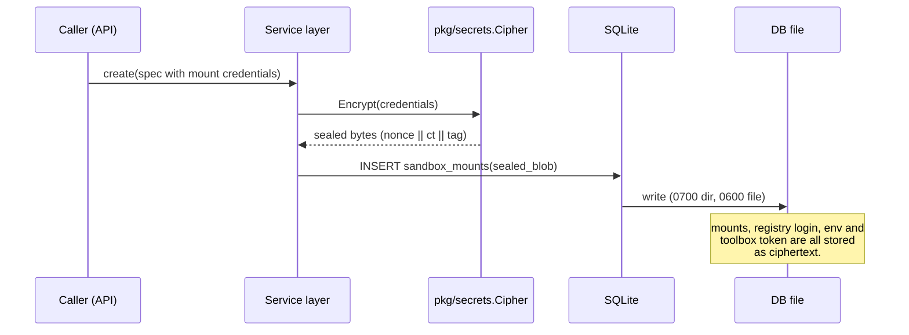
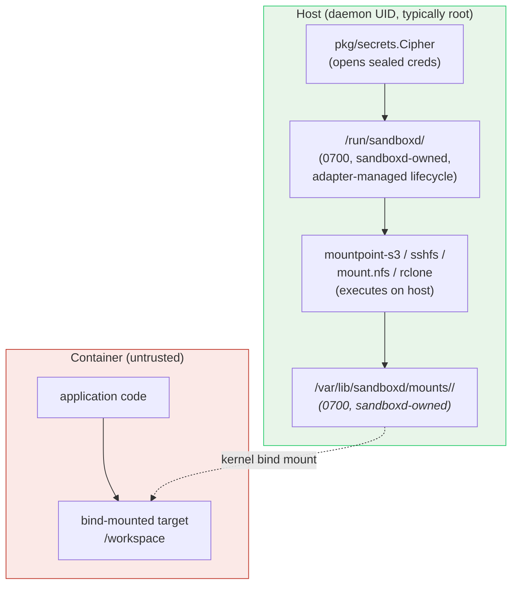

import { Tabs, TabItem } from '@astrojs/starlight/components';

A sandbox runs untrusted code, so the sensitive jobs happen on the host instead. (The host is the server that runs the sandboxes.) Those jobs are storing credentials, running mount tools, enforcing network rules and counting bytes. This page covers what that buys you, what it does not, and where the rule does not hold.

You can search the code for every path and name on this page.

**In short:**

- Storage credentials, registry logins, environment variables and toolbox tokens (the keys to each sandbox's command agent) are encrypted before they are stored.
- The database files and the key file can be read only by the user that runs `sandboxd`.
- Mount tools such as `mountpoint-s3` run on the host, so a sandbox never sees its storage credentials.
- Network rules and byte counters live on the host, where code in the sandbox cannot change them.
- `sandboxd` holds the key to every secret. The default runtime, runc (the software that runs a plain container), does not stop kernel exploits. Use gVisor or Firecracker for untrusted tenants.

## Threat model

A threat model lists the attacks a design defends against, and the ones it does not. A tenant here is one customer or user of the platform.

**In scope:**

- A tenant running any code inside their own sandbox.
- A tenant trying to read another tenant's storage credentials, mount contents or network traffic.
- A tenant trying to fake their own usage numbers or escape a network rule.
- An operator with shell access to the host, reading the stored files from outside the daemon process. (The daemon is `sandboxd`, the program that runs in the background on the host.)

**Out of scope (non-goals):**

- A kernel CVE (a published security bug) used to break out of the container runtime. See "What about runc?" below.
- A malicious operator with access to the `sandboxd` process memory, the AES key file, or root on the host. `sandboxd` holds the key to every secret it stores.
- A malicious container image. Trusting the image is the caller's job.
- Side-channel attacks between tenants that share a physical CPU (the Spectre and L1TF class).
- The `env` block you pass when you create a sandbox. It is stored sealed, but it is handed to the container as ordinary environment variables. Every process in there can see it, including the in-container agent (see "What about toolboxd?" below). Treat `env` as shared with the guest by design.

## What about runc?

By default, a sandbox's runtime is runc, the standard tool that starts Linux containers. **runc is a resource-isolation boundary. It is not a security boundary against an attacker who can exploit the kernel.**

A container escape through a Linux CVE puts the attacker on the host kernel. Then the file permissions and encryption below no longer matter.

If you need a real isolation boundary, set the sandbox's runtime to gVisor or Firecracker:

- **gVisor** puts a kernel, written as a normal program, between the container and the host. It checks every syscall (each request a program makes to the kernel).
- **Firecracker** runs the sandbox as a KVM microVM: a small virtual machine that the CPU's hardware keeps apart from the host.

See [gVisor](/gvisor-sandbox/) and [Firecracker architecture](/firecracker-architecture/). Pick the runtime that matches how much you trust each tenant. runc is the default because most single-tenant deployments do not need more.

## What about toolboxd?

`cmd/toolboxd` is the toolbox: the agent inside each container that carries out API requests. It runs any command the holder of a bearer token asks for: exec, file reads and writes, sessions and environment changes. (A bearer token is a secret string, and whoever holds it is let in.) It is a remote-code-execution endpoint on purpose, limited to one sandbox.

Static analyzers will flag command-injection and path-injection spots inside `cmd/toolboxd`; those are by design. The agent's trust boundary is the container around it, not its own input checks.

Anyone holding a sandbox's toolbox token gets full power to run code inside that one container. The token is 32 random bytes, hex-encoded, made by `generateToolboxToken` in `internal/service/service.go`.

## What about SSH?

The SSH gateway (`pkg/sshgateway/gateway.go`) ends SSH connections on the host and passes each accepted session into the target container as an exec stream. Every sandbox gets a fresh ed25519 key pair when it is created. The public key is stored on the sandbox's row, and it is the only key allowed to SSH into that one sandbox. There is no shared tenant key.

The gateway's own host key, however, is loaded once per host (`pkg/sshgateway/config.go`). A host key is what lets an SSH client confirm it reached the right server. If that key leaks, an attacker can intercept (man-in-the-middle) every SSH session that ends on that host. Rotating it is an operator task.

## Property 1: secrets are sealed before they cross any boundary

Secrets are encrypted inside one package before they reach the database, logs or other servers. `pkg/secrets/secrets.go` defines `Cipher`, which uses AES-256-GCM. That is an AEAD cipher (authenticated encryption with associated data): it hides the data and also detects any tampering. The associated data, or AAD, is a label that must match when you decrypt, so it can tie a sealed value to its owner.

```go
// Cipher seals and opens user-supplied secrets (cloud credentials for sandbox
// mounts) using AES-256-GCM. The seal format is `nonce(12) || ciphertext+tag`.
// The key never leaves this package; sealed bytes are what crosses other
// trust boundaries (DB, logs, error messages).
```

The 32-byte AES key never leaves `pkg/secrets`. `NewCipher` takes either an explicit base64 key from the operator or a fallback file path. If neither exists on first run, it generates a fresh key. It writes the key to the fallback path with mode `0o600` (owner read and write only). Then it uses that key; the logic is in `loadOrGenerateKey`.

`Cipher` has no method that returns the key bytes. A caller in the same process could still re-read the fallback file from disk, since it shares the same binary and the same user. So the no-getter rule prevents accidents, not a determined caller.

**What is sealed.** These columns are encrypted before they are written:

| Column | What it holds | How it is sealed |
|---|---|---|
| `sandbox_mounts.sealed_blob` | Mount specs, with their credentials | `Cipher.Encrypt`, no AAD (`sealMounts`) |
| `sandboxes.registry_auth_sealed` | Login for a private image registry | `Cipher.Encrypt`, no AAD (`sealRegistry`) |
| `sandbox_env.sealed_blob` | The sandbox's environment variables | AAD tied to the sandbox ID and incarnation (`sealEnv`, `secrets.EnvAAD`) |
| `sandboxes.toolbox_token_sealed` | The toolbox bearer token | AAD tied to the sandbox ID (`toolboxTokenAAD` in the store) |
| `cluster_secrets.sealed_payload` | Secrets copied to other nodes for failover | AAD tied to the recipient nodes and the sandbox (`pkg/secrets/envelope.go`) |

An incarnation is one life of a sandbox ID; a recreated sandbox starts a new one. A `sqlite3 .dump` of those tables shows only ciphertext.

Older releases stored the environment and the toolbox token as plain text, in `env_json` and `toolbox_token` columns. When a newer `sandboxd` opens such a database (`OpenWithSecretCipher` in `internal/store/store.go`), it seals those values and then drops the plain-text columns.

**Where the AAD binding matters.** Binding stops a sealed value from being copied onto a different row and opened there. Environment variables, toolbox tokens and cluster secrets have it. So a stolen cluster envelope cannot be replayed against a different set of recipient nodes or a different sandbox.

Mount credentials and registry logins do not have it. `sealMounts` and `sealRegistry` (in `internal/service/service.go`) call `s.cipher.Encrypt(plain)` with no AAD.



> **Invariant** (a rule that always holds). Mount credentials, registry logins, environment variables, toolbox tokens and cluster-secret payloads are stored only as sealed blobs. They cross the database file, logs, the Raft log (the cluster's shared, replicated record) and error messages sealed. Only `pkg/secrets`, inside the running daemon, turns them back into plain text.

## Property 2: the database files are owner-only

The database folder and files can be read only by the user that runs `sandboxd`. Encryption protects the secrets, and file permissions protect the rest: the sandbox metadata and the ciphertext itself. The store's `open()` function in `internal/store/store.go` starts like this:

```go
// The DB stores encrypted secrets and sandbox metadata.
// Lock the directory and file to owner-only so a custom DBPath, a dev
// run on a shared host, or any setup that doesn't go through the
// installer can't leak them via the default 0o755 / umask-derived modes.
dir := filepath.Dir(path)
if err := os.MkdirAll(dir, 0o700); err != nil { ... }
// MkdirAll leaves a pre-existing directory's mode untouched, so chmod
// explicitly to tighten dirs created by older builds at 0o755.
if err := os.Chmod(dir, 0o700); err != nil { ... }
```

The `Chmod` after `MkdirAll` is the line that matters. `MkdirAll` leaves an existing folder's mode alone. So an upgrade from a build that created the folder as `0o755` (readable by everyone) would quietly keep the old mode. An explicit chmod on every start closes that gap.

The same goes for the database file and its WAL and SHM side files (SQLite's write-ahead log and shared-memory index). SQLite creates them using the process umask, the default permission mask, which is usually `0o644` (readable by everyone). The store chmods each one to `0o600` after opening, and skips side files that do not exist yet.

The fallback key file in `pkg/secrets/secrets.go` follows the same pattern: `MkdirAll(..., 0o700)`, then `WriteFile(..., 0o600)`.

> **Invariant.** The database folder, the database file, its WAL and SHM side files and the encryption-key file are owner-only after every start. An operator who moves the database or runs the daemon without the installer still gets tight permissions.

## Property 3: mount tools run on the host, not in the container

Storage is mounted by tools on the host, and the container only sees the result. `pkg/mounts/manager.go` opens with the design statement:

> Mount tools (mountpoint-s3, sshfs, mount.nfs, rclone) run on the
> host in a sandboxd-owned directory tree at `/var/lib/sandboxd/mounts/<id>/<i>/`
> and are bind-mounted into the target container. Cross-tenant isolation is
> enforced by the kernel's mount namespace: containers cannot see other
> containers' bind sources.

A mount namespace is a container's private view of which file systems are mounted where. The naive design ships the credentials into the container and lets it run `mountpoint-s3` itself. That fails in three ways:

1. The credentials sit inside a sandbox that is, by assumption, open to attack. A breakout reads them from the process environment or `/proc/self/environ`.
2. The mount tool runs with the container's privileges. The same attack that broke the application also breaks the mount.
3. The mount tools (mountpoint-s3, sshfs, mount.nfs, rclone) must live in the user's image, which bloats it. Or they need an extra sidecar container per sandbox, which makes startup more complex.

AerolVM turns this around: **the mount runs on the host.** The host creates `/var/lib/sandboxd/mounts/<sandbox_id>/<i>/` and runs `mountpoint-s3 ... <that_path>` as the daemon's user. Then it bind-mounts that path into the container at the target you asked for. (A bind mount makes one folder appear at a second place.)

On a default install, the daemon's user is root. `packaging/sandboxd.service` sets no `User=`, and `sandboxd` needs root to drive the container engine, iptables and bind mounts.

The container sees a file system. It does not see the credentials, the tool, or anything outside its own mount namespace. The mount supervisor (`Manager`) watches the host-side process and restarts it if it crashes. If it fails too many times in a row, the supervisor disables the mount to stop a restart loop.

Credentials are staged in `CredDir = /run/sandboxd`, a folder the mount manager creates with mode `0o700`. That is outside the container, and the container's environment never refers to them. How long the file lives depends on the adapter (the plugin for each kind of storage):

- `s3.go` and `rclone.go` set `UnlinkCred: true`. The file is deleted as soon as the tool has read it.
- `sshfs.go` sets `UnlinkCred: false`. sshfs keeps its identity file for the life of the mount, because the long-running process re-reads it to reconnect. The file stays in the `0o700` `/run/sandboxd` folder, owned by the daemon, and never enters the container's mount namespace.



The isolation between tenants comes from the kernel's mount namespaces, not from anything clever in `sandboxd`. Two tenants mounting different S3 buckets get two separate host folders, two separate `mountpoint-s3` processes and two separate bind mounts.

> **Invariant.** A sandbox sees the bind-mounted target and nothing else from the host. It does not see the credential file, the mount tool or any other host path. The kernel's mount namespace enforces this, not `sandboxd`.

## Property 4: network traffic can be forced through the host

Network rules and traffic counters run on the host, out of the sandbox's reach. A host that controls storage but not the network is only half a trust boundary. Two host-side tools close the network half.

**The egress firewall.** `pkg/docker/netrules` holds each sandbox's egress rules (rules for traffic leaving the sandbox). It applies them to the sandbox's container IP with iptables or nftables, the Linux firewall. The rules go in the `DOCKER-USER` chain on Docker hosts, or in `AEROLVM-USER` under containerd (`pkg/docker/netrules/manager.go`). (A chain is a named list of firewall rules.)

Docker accepts its own bridge traffic early, which would skip any rule simply added to the `FORWARD` chain. `DOCKER-USER` is jumped to from `FORWARD` before `DOCKER-FORWARD`, so AerolVM's rules run first. That holds on older iptables and on Docker 28 and later alike. The rules run on the host, before packets leave its network card. They live in the host's network namespace (its own view of network devices and routes).

**The byte counters.** `pkg/docker/netstats` polls each sandbox's counters for incoming and outgoing traffic from `/proc/<container_pid>/net/dev`. It reads them from the host, by entering the container's network namespace (netns). When a sandbox hits its limit, `sandboxd` installs DROP rules for both directions on the container IP.

It also saves a quota-exceeded flag on the sandbox (`MarkNetworkQuotaExceeded`, called from `internal/service/netstats.go`). So reconcile, the repair loop, re-applies the block after a restart. The metrics are published through expvar, Go's built-in metrics endpoint. They include `aerolvm_netstats_poll_total`, `aerolvm_netstats_samples_total` and counters for dropped samples (`pkg/docker/netstats/metrics.go`).

Both tools do nothing until rules or limits are set. A sandbox with no `network_block_all` and no egress rules can reach everywhere the host can. [Block or allow the internet](/network-isolation/) and [Usage and limits](/network-usage/) cover the defaults. The trust-boundary point is that the enforcement, when present, lives on the host.

> **Invariant.** Where rules and quotas are installed, they live in a host firewall chain, and code in the sandbox cannot remove them. The kernel keeps the byte counters for each network namespace, and they cannot be written from inside the container. So a sandbox cannot under-report its traffic to escape a quota.

## Registry credentials across the cluster (AOCR)

The same sealing pattern covers the credentials that cluster nodes use to pull private images. AOCR is the Aerol OCI Registry, a shared image store for the cluster. `UpstreamWrapKeyRing` (`pkg/secrets/wrap_key_loader.go`) is a rotating set of AES-256-GCM keys. The first key is current, and older keys can only decrypt.

`WrapUpstreamCreds` (`pkg/secrets/upstream_wrap.go`) seals upstream registry credentials into an `aocrwrap:<base64url>` envelope, which AOCR's auth service unwraps. Upstream registries are the original image sources, such as Docker Hub or GHCR. The credentials never appear in the container engine's config, the Raft log or `sandboxd` logs; only the wrapped envelope does. The envelope has a `Scope` field that AOCR checks against the requested image scope, so a leaked blob cannot be reused for a different repository.

Two precise points about this envelope:

- The `Scope` is part of the JSON that gets encrypted. It is not bound as AAD, because `upstream_wrap.go` passes no AAD on purpose, to match the JavaScript code that unwraps it. So the scope check is AOCR's behavior, not a cryptographic binding.
- Cluster secrets are different. They are sealed with AAD tied to their recipient nodes and their sandbox (`KeyAADBound` and `PayloadAADBound` in `pkg/secrets/envelope.go`). Mount credentials stored on one node have no such binding.

These envelopes use their own key ring file (`LoadUpstreamWrapKeyRing`), separate from the main encryption key. A cluster can also have AWS KMS (Amazon's key management service) wrap each cluster secret's data key, instead of the local key. See [Secrets providers](/cluster-secrets/).

## Where the limits are

These are the places where the boundary is weaker than it might look:

- **Sealing protects data at rest only.** A compromised `sandboxd` holds the key, so it can read decrypted secrets: the boundary stops at the host, not the daemon. For cluster secrets, AWS KMS can hold the key that wraps the data keys. But the local key that seals mounts, environments and toolbox tokens is still a file on the host.
- **Sealed values are only as safe as the key file.** The database and the key file sit on the same host. Anyone who can read both, such as root, can open every toolbox token and environment. Operators on shared hosts should run `sandboxd` as a dedicated user; the default install runs it as root.
- **runc is the default runtime.** It is a resource-isolation boundary, not a security boundary against an attacker who can exploit the kernel. For untrusted tenants sharing a host, set the sandbox's runtime to `gvisor` or `firecracker`. See [gVisor](/gvisor-sandbox/) and [Firecracker architecture](/firecracker-architecture/).
- **Mount namespaces are the kernel's mechanism, not `sandboxd`'s.** A kernel CVE that allows an escape from a mount namespace is the kernel's bug, but the trust boundary weakens with it.
- **Network rules and quotas must be set to do anything.** A sandbox with no `network_block_all` and no egress rules can reach everywhere the host can. Property 4 is a mechanism, not a policy.
- **The encryption key file is a single point of failure.** By default it is `/var/lib/sandboxd/credential_encryption.key` (`SB_CREDENTIAL_ENCRYPTION_KEY_PATH`), unless you pass the key in `SB_CREDENTIAL_ENCRYPTION_KEY`. Lose it, and everything it sealed becomes unreadable: mount credentials, registry logins, environments, toolbox tokens and (with the local provider) cluster-secret payloads. Back it up as carefully as a root CA private key.
- **The SSH gateway's host key is per host, not per sandbox.** If that key leaks, an attacker can intercept every SSH session that ends on that host. Each sandbox still has its own fresh ed25519 key pair for login, on top of the shared host key.
- **`toolboxd` runs any command on purpose.** Anyone holding the toolbox bearer token gets full power to run code inside that container. The damage is limited to that container by design. Treat the token as the container's root password.

## What this buys you

From the SDK, the boundary shows in exactly two places. Mount credentials are write-only on create, and listing a sandbox's mounts (`GET /v1/sandboxes/{id}/mounts`, `ListMounts` in the service) returns the specs without them. Everything else is the daemon's job: what runs where, when the credential file is deleted, and which firewall chain holds a rule.

Every example below does the same thing. The credentials in the `mounts` array are sealed by `pkg/secrets.Cipher` before they are stored. The `mountpoint-s3` process runs on the host against `/var/lib/sandboxd/mounts/<id>/0/`, and `sandboxd` bind-mounts that path into the container at `/workspace`. The container never sees the credentials or the mount tool.

<Tabs syncKey="lang">
  <TabItem label="TypeScript">
    ```ts
    import { MicroVM } from '@aerol-ai/aerolvm-sdk'

    const client = new MicroVM({
      apiUrl:   process.env.SB_API_URL,
      patToken: process.env.SB_PAT_TOKEN,
    })

    const sandbox = await client.create({
      image:  'ubuntu:22.04',
      mounts: [{
        type:   's3',
        target: '/workspace',
        source: 's3://my-bucket/project-42',
        credentials: {
          access_key_id:     'AKIA...',
          secret_access_key: 'secret...',
        },
      }],
    })
    ```
  </TabItem>
  <TabItem label="Python">
    ```python
    from microvm import MicroVM

    client = MicroVM(api_url='https://sandbox.example.com', pat_token='your-token')

    sandbox = client.create({
        'image':  'ubuntu:22.04',
        'mounts': [{
            'type':   's3',
            'target': '/workspace',
            'source': 's3://my-bucket/project-42',
            'credentials': {
                'access_key_id':     'AKIA...',
                'secret_access_key': 'secret...',
            },
        }],
    })
    ```
  </TabItem>
  <TabItem label="Go">
    ```go
    client, _ := microvm.NewClientWithConfig(&sdktypes.MicroVMConfig{
        APIUrl:   os.Getenv("SB_API_URL"),
        PATToken: os.Getenv("SB_PAT_TOKEN"),
    })

    sandbox, _ := client.Create(ctx, sdktypes.CreateSandboxOptions{
        Image: "ubuntu:22.04",
        Mounts: []sdktypes.MountSpec{{
            Type:   "s3",
            Target: "/workspace",
            Source: "s3://my-bucket/project-42",
            Credentials: map[string]string{
                "access_key_id":     "AKIA...",
                "secret_access_key": "secret...",
            },
        }},
    })
    ```
  </TabItem>
  <TabItem label="Rust">
    ```rust
    use aerolvm_sdk::{Client, CreateOptions, MountSpec, MountType};
    use std::collections::HashMap;

    let client = Client::new(Some("https://sandbox.example.com"), Some("your-token"))?;

    let mut creds = HashMap::new();
    creds.insert("access_key_id".to_string(),     "AKIA...".to_string());
    creds.insert("secret_access_key".to_string(), "secret...".to_string());

    let sandbox = client.create(CreateOptions {
        image:  "ubuntu:22.04".into(),
        mounts: Some(vec![MountSpec {
            mount_type:  MountType::S3,
            target:      "/workspace".into(),
            source:      "s3://my-bucket/project-42".into(),
            options:     None,
            credentials: Some(creds),
            read_only:   None,
        }]),
        ..Default::default()
    })?;
    ```
  </TabItem>
  <TabItem label="Java">
    ```java
    MicroVMClient client = new MicroVMClient(
        new MicroVMConfig()
            .setApiUrl("https://sandbox.example.com")
            .setPatToken(System.getenv("SB_PAT_TOKEN"))
    );

    Sandbox sandbox = client.create(
        new CreateOptions()
            .setImage("ubuntu:22.04")
            .setMounts(List.of(
                new MountSpec()
                    .setType("s3")
                    .setTarget("/workspace")
                    .setSource("s3://my-bucket/project-42")
                    .setCredentials(Map.of(
                        "access_key_id",     "AKIA...",
                        "secret_access_key", "secret..."
                    ))
            ))
    );
    ```
  </TabItem>
</Tabs>

## Further reading

- [NIST SP 800-38D, Galois/Counter Mode](https://csrc.nist.gov/publications/detail/sp/800-38d/final): the AES-GCM construction that `pkg/secrets.Cipher` implements.
- [Linux mount namespaces](https://man7.org/linux/man-pages/man7/mount_namespaces.7.html): the kernel mechanism that isolation between tenants rests on.

## Next steps

- [Attach cloud storage](/external-storage/): the mount API and the storage backends it supports.
- [Block or allow the internet](/network-isolation/): set network rules for a sandbox.
- [Usage and limits](/network-usage/): byte quotas built on `pkg/docker/netstats`.
- [Secrets providers](/cluster-secrets/): seal cluster secrets with a local key or AWS KMS.
- [Safe retries (idempotency)](/engineering-idempotency/): why the sealed columns live in a single-writer SQLite store.
