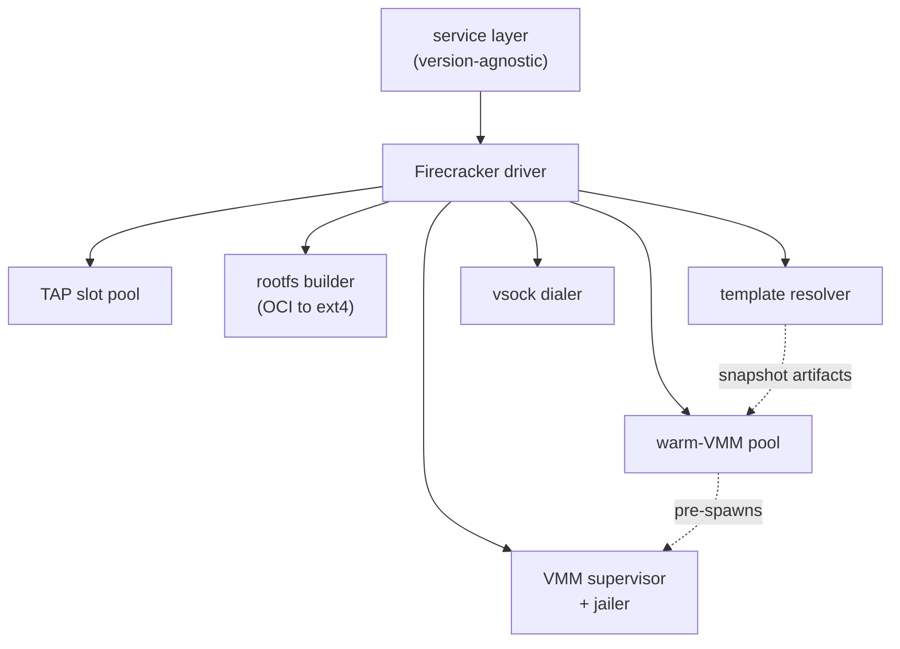
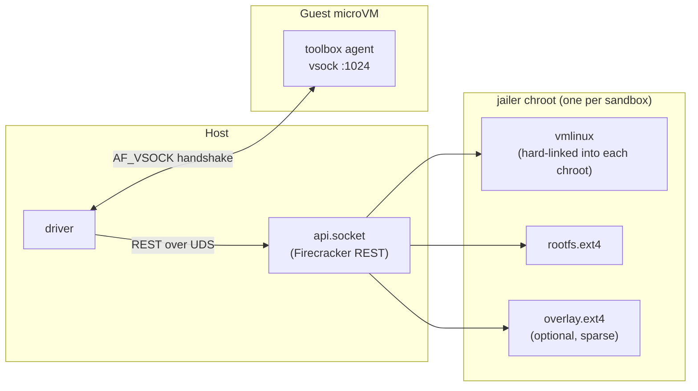
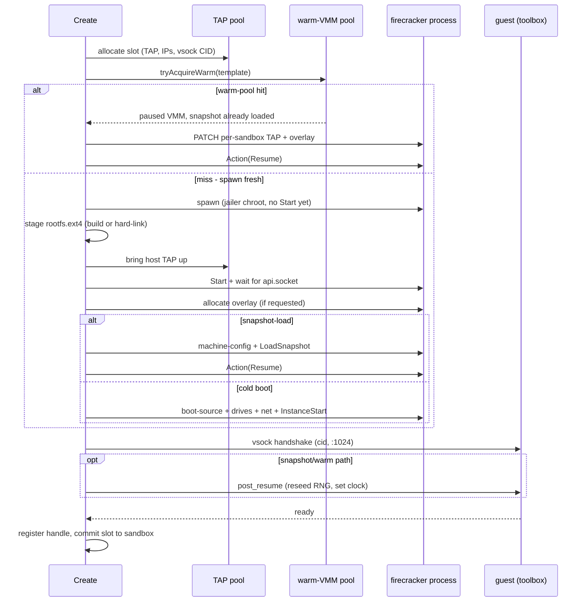

import { Tabs, TabItem } from '@astrojs/starlight/components';

A Firecracker sandbox is a Linux VM with its own kernel, memory, block and
network devices, isolated from the host by KVM. AerolVM's job is to deliver one
(booted, network up, agent listening) by resuming pre-warmed pieces instead of
cold-booting. On the warm-pool-hit path the wall-clock budget is sub-100ms on a
healthy host; cold boots and snapshot loads against a cold page cache are much
slower (see [Boot-time budget](#boot-time-budget)).

For how those pieces are pre-warmed and shared, read
[Snapshot restore and the warm-VMM pool](/firecracker-hydration). For the user-facing
how-to, see [Firecracker Sandbox](/firecracker-sandbox).

## Why Firecracker, not Kata or gVisor

Firecracker runs each guest under KVM with a dedicated kernel and an MMIO-only
virtio device tree. The trade-offs versus the obvious neighbors:

- **gVisor.** Shared host kernel via syscall interception. Defense in depth,
  not isolation parity with hardware virtualization. AerolVM uses Docker today
  for its non-Firecracker runtime; gVisor would slot in there, not here.
- **Kata Containers.** QEMU by default. Heavier cold boot and harder to drive
  the snapshot/resume primitives that the warm-pool depends on.
- **Firecracker.** KVM-only, no QEMU, no PCI bus, no GPU passthrough. The cost
  is "no GPU in a sandbox today"; the win is sub-150ms cold boots upstream and
  the snapshot/resume model the warm-pool is built on.

Firecracker requires `/dev/kvm`. AerolVM hosts must be bare-metal or
nested-virt-capable Linux. No Windows host, no macOS host, no TCG fallback.

## Components

The Firecracker runtime driver is the second implementation of the daemon's
`Runtime` interface (the first being the Docker client). The version-agnostic
service layer calls into it.

| Component | Responsibility |
|---|---|
| **Firecracker driver** | Implements `Runtime` against Firecracker. Drives `Create` / `Destroy`. Owns the live-VMM map. |
| **TAP slot pool** | Per-host pool of `(TAP device, host IP, guest IP, /30 CIDR, vsock CID)` slots, seeded ahead of time. Each sandbox claims one slot for its network identity. |
| **Warm-VMM pool** | Per-template pool of already-spawned, snapshot-loaded, *paused* Firecracker processes. A pool hit skips both the spawn and the `LoadSnapshot` call. |
| **Rootfs builder** | The OCI-to-`ext4` pipeline (`skopeo` + `umoci` + `mkfs.ext4`). Runs on the ad-hoc path; pre-run once on the template path. |
| **Template resolver** | Resolves a `template_id` to the host paths of a pre-built rootfs and snapshot artifacts. |
| **VMM supervisor + jailer** | Spawns the `firecracker` process, wrapped in `jailer` (chroot + new PID and mount namespaces + cgroups + UID/GID drop) on production hosts, bare on dev/CI. The firecracker binary itself installs a seccomp filter from inside the chroot. |
| **vsock dialer** | Host side of the `AF_VSOCK` handshake used to confirm the in-guest agent (toolbox) is alive and to push post-resume signals. |



## Anatomy of one microVM

On a production host every Firecracker process runs inside a `jailer` chroot.
The jailer hard-links the `firecracker` binary into a private root, drops the
process to an unprivileged UID/GID, enters new PID and mount namespaces, and
confines it with cgroups. The firecracker binary then installs a seccomp filter
from inside the chroot. The daemon stages the guest's block devices into the
chroot before the VM starts, so the VM only ever sees files the daemon put
there.



Per sandbox: one jailer chroot, one `rootfs.ext4` (backing the guest's `/`),
an optional sparse `overlay.ext4` for writes, one TAP slot for the network,
one vsock CID for the control channel, and the toolbox agent listening inside
the guest on vsock port `1024`.

A few invariants worth naming up front:

- **Kernel.** The daemon does not build a kernel. The host path to the
  uncompressed `vmlinux` is configured via `SB_FIRECRACKER_KERNEL` (default
  `/var/lib/sandboxd/firecracker/vmlinux`) and validated at startup
  (`driver.go:425`). The jailer hard-links it into each per-sandbox chroot.
  Operators supply the kernel; we recommend the upstream Firecracker-recommended
  build.
- **Devices.** MMIO-only virtio: virtio-blk for `rootfs.ext4` and the optional
  `overlay.ext4`, virtio-net for the TAP, virtio-vsock for the control channel.
  No PCI bus, so no PCI passthrough, no SR-IOV NIC, no GPU. Agents that want
  GPU inference cannot get it inside a Firecracker sandbox today.
- **Networking.** Each sandbox gets one TAP, one host-side `/30`, and one guest
  IP from the slot. No CNI, no multiple NICs, no virtio-balloon. Host-side
  routing and egress firewalling are outside this page.
- **RNG.** AerolVM does not attach a virtio-rng device. Cold-boot guests get
  their entropy from the kernel's own bootstrap path; snapshot/warm clones
  would otherwise resume with identical RNG state (two clones drawing the same
  `getrandom` bytes is a real correctness issue, not cosmetic: TLS session
  tickets, JWT nonces, session-id generation all depend on it). The `post_resume`
  signal below tells the in-guest agent to reseed the kernel RNG from
  virtio-rng and set `CLOCK_REALTIME` from the host before any service runs;
  cold boots skip this because the kernel just initialized.
- **MMDS.** Firecracker's MicroVM Metadata Service exists. AerolVM does not use
  it. Per-sandbox config is delivered over vsock by `post_resume`; MMDS would
  add an HTTP-over-link-local dependency that does not survive `LoadSnapshot`
  cleanly.
- **Memory backend.** Snapshot loads use Firecracker's `File` backend
  (`mem_backend.backend_type = "File"`, see `driver.go:893` and `warmspawn.go:187`).
  That gives `mmap`-based CoW from the template's memory image. The `Uffd`
  backend (lazy demand-faulting via `userfaultfd`) is a future axis for
  tail-latency reduction on multi-GiB snapshots; not in production today.

## The boot path

`Create` releases everything it acquired (TAP slot, host TAP, VMM process,
overlay file) in reverse order on any failure, so a half-built sandbox never
leaks a slot (`driver.go:466-526`, deferred closures gated by a `released`
flag). There are three branches through it:

- **Ad-hoc** - no `template_id`. The full OCI-to-rootfs pipeline runs, then a
  cold kernel boot (`InstanceStart`). Tens of seconds.
- **Snapshot-load** - a `template_id` whose template captured a memory snapshot.
  The driver spawns firecracker, issues `LoadSnapshot` + `Resume`. Sub-100ms
  on a hot page cache; multi-GiB snapshots against a cold page cache spend
  hundreds of ms faulting in memory pages.
- **Warm-pool hit** - same template, but a paused VMM with the snapshot
  *already loaded* was waiting in the pool. The driver only patches per-sandbox
  state onto it and resumes. The fastest path.



Details that bite if you skip them:

- **REST ordering on cold boot.** `machine-config` and `boot-source` go before
  drives; drives and network interfaces before `InstanceStart`. The
  snapshot-load path issues only `machine-config` + `LoadSnapshot`; every other
  device is restored from the snapshot state file. Firecracker itself doesn't
  demand `machine-config` before `LoadSnapshot` - AerolVM sends it first as a
  defensive guard against a stale config from a previous lifecycle leaking in.
- **The overlay is sparse.** A requested overlay drive is allocated as a sparse
  file, so a 64 GiB overlay occupies sub-MiB on disk until the guest writes.
- **Snapshot clones resume with stale entropy and clock.** Two clones of the
  same snapshot would otherwise draw identical `getrandom` bytes and a time
  that jumped backwards. After resume the driver sends a best-effort
  `post_resume` signal so the in-guest agent sets the clock from the host
  (`wallclock_unix_ns`) and unconditionally reseeds the kernel RNG from
  virtio-rng via `RNDADDENTROPY` (`cmd/toolboxd/vsock.go:247`,
  `cmd/toolboxd/quiesce_linux.go:41`). Cold boots skip this entirely
  because their kernel just initialized.
- **The vsock CID differs by path.** On the snapshot/warm path the guest listens
  on the template's CID (baked into the snapshot at build time), not the
  per-sandbox slot CID, so the host dials that CID for the handshake. vsock is
  used because it is snapshot-safe; a TCP control channel over the TAP would
  tear on resume.
- **Snapshot/warm clones share guest memory copy-on-write.** `LoadSnapshot`
  `mmap`s the template's memory image with `MAP_PRIVATE`; the kernel CoW
  handler allocates a private anonymous page on the first write to any page,
  leaving the underlying file untouched. The `track_dirty_pages` flag is a
  separate mechanism for *identifying* dirty pages for diff snapshots, not for
  diverting writes; enabling it costs a VM-exit per first-touch write. The full
  memory model is in
  [Snapshot restore and the warm-VMM pool](/firecracker-hydration#memory-copy-on-write-clones).

## Two creation paths, two boot budgets

| Path | How | Boot time |
|---|---|---|
| **Ad-hoc** | Pass any OCI image (`ubuntu:22.04`). The daemon builds a Firecracker rootfs on demand. | 10–60 seconds per create |
| **Template-backed** | Pre-build a rootfs + snapshot once, then pass `template_id`. Snapshot-load, or a warm-pool hit. | Sub-100ms on a warm-pool hit; snapshot-load is a few hundred ms |

The driver picks the branch from the request alone - there is no separate API.
Creating a Firecracker sandbox looks the same regardless of which path runs
underneath:

<Tabs syncKey="lang">
  <TabItem label="TypeScript">
    ```ts
    import { MicroVM } from '@aerol-ai/aerolvm-sdk'

    const client = new MicroVM({
      apiUrl: process.env.SB_API_URL,
      patToken: process.env.SB_PAT_TOKEN,
    })

    const sandbox = await client.create({
      image: 'ubuntu:22.04',
      runtime: 'firecracker',
      cpu: 1,
      memoryMB: 512,
    })

    console.log(sandbox.id, sandbox.publicURL)
    ```
  </TabItem>
  <TabItem label="Python">
    ```python
    from microvm import MicroVM

    client = MicroVM(
        api_url='https://sandbox.example.com',
        pat_token='your-token',
    )

    sandbox = client.create({
        'image': 'ubuntu:22.04',
        'runtime': 'firecracker',
        'cpu': 1.0,
        'memoryMB': 512,
    })

    print(sandbox.id, sandbox.publicURL)
    ```
  </TabItem>
  <TabItem label="Go">
    ```go
    import (
        "context"
        "fmt"
        "log"
        "os"

        microvm   "github.com/aerol-ai/microvm/sdk/go/pkg/microvm"
        sdktypes  "github.com/aerol-ai/microvm/sdk/go/pkg/types"
    )

    client, err := microvm.NewClientWithConfig(&sdktypes.MicroVMConfig{
        APIUrl:   os.Getenv("SB_API_URL"),
        PATToken: os.Getenv("SB_PAT_TOKEN"),
    })
    if err != nil {
        log.Fatal(err)
    }

    sandbox, err := client.Create(context.Background(), sdktypes.CreateSandboxOptions{
        Image:    "ubuntu:22.04",
        Runtime:  sdktypes.RuntimeFirecracker,
        CPU:      1,
        MemoryMB: 512,
    })
    if err != nil {
        log.Fatal(err)
    }

    fmt.Println(sandbox.ID, sandbox.PublicURL)
    ```
  </TabItem>
  <TabItem label="Rust">
    ```rust
    use aerolvm_sdk::{Client, CreateOptions};

    let client = Client::new(
        Some("https://sandbox.example.com"),
        Some("your-token"),
    )?;

    let sandbox = client.create(CreateOptions {
        image:    "ubuntu:22.04".to_string(),
        runtime:  Some("firecracker".to_string()),
        cpu:      Some(1),
        memory_mb: Some(512),
        ..Default::default()
    })?;

    println!("{} {:?}", sandbox.data.id, sandbox.data.public_url);
    ```
  </TabItem>
  <TabItem label="Java">
    ```java
    import ai.aerol.microvm.MicroVMClient;
    import ai.aerol.microvm.MicroVMConfig;
    import ai.aerol.microvm.Sandbox;
    import ai.aerol.microvm.model.CreateOptions;

    MicroVMClient client = new MicroVMClient(
        new MicroVMConfig()
            .setApiUrl("https://sandbox.example.com")
            .setPatToken(System.getenv("SB_PAT_TOKEN"))
    );

    Sandbox sandbox = client.create(
        new CreateOptions()
            .setImage("ubuntu:22.04")
            .setRuntime("firecracker")
            .setCpu(1.0)
            .setMemoryMb(512)
    );

    System.out.println(sandbox.id + " " + sandbox.publicUrl);
    ```
  </TabItem>
</Tabs>

## Next

The warm-hit budget above is an internal driver timeout, not a published
benchmark; the cost it avoids is real, but the headline number depends on host
class, kernel size, and warm-pool depth.
[Snapshot restore and the warm-VMM pool](/firecracker-hydration) covers how the
rootfs, kernel snapshot, and live VMM are pre-warmed, restored, and shared
across a host, and what AerolVM still doesn't do today (UFFD, huge pages,
diff-snapshot API).

## Further reading

The primary sources behind the design on these two pages:

- [Firecracker: Lightweight Virtualization for Serverless Applications](https://www.usenix.org/conference/nsdi20/presentation/agache) (USENIX NSDI 2020): the foundational paper on the VMM design AerolVM builds on.
- [Firecracker snapshotting](https://github.com/firecracker-microvm/firecracker/blob/main/docs/snapshotting/snapshot-support.md) - the upstream spec for `LoadSnapshot`, diff snapshots, the dirty bitmap, and the `File` vs `Uffd` memory backends behind the [copy-on-write model](/firecracker-hydration#memory-copy-on-write-clones).
- [Firecracker jailer](https://github.com/firecracker-microvm/firecracker/blob/main/docs/jailer.md) - chroot + cgroups + privilege drop; the source for the microVM anatomy above.
- [Firecracker network setup](https://github.com/firecracker-microvm/firecracker/blob/main/docs/network-setup.md) - TAP-device guest networking, the basis for the TAP slot pool.
- [Firecracker REST API](https://github.com/firecracker-microvm/firecracker/blob/main/src/firecracker/swagger/firecracker.yaml) - the wire contract for every `Put`/`Patch`/`Action` call in the boot sequence.
