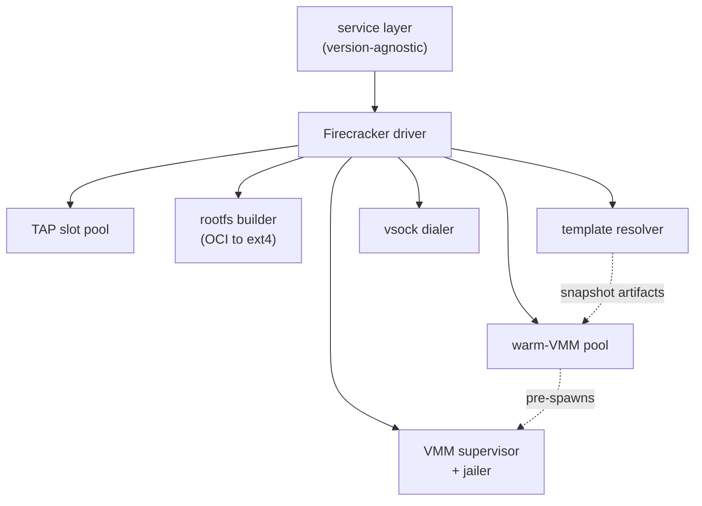
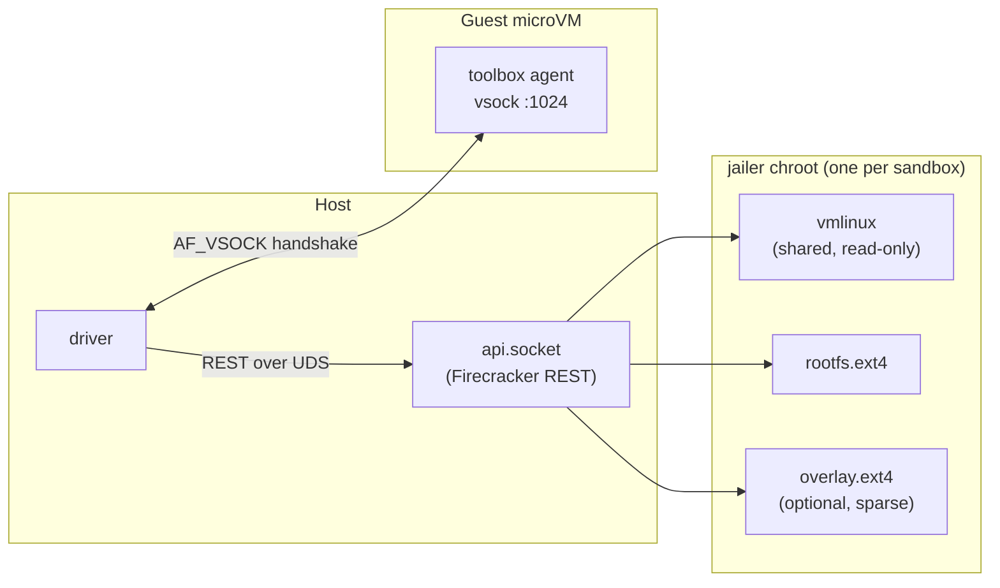
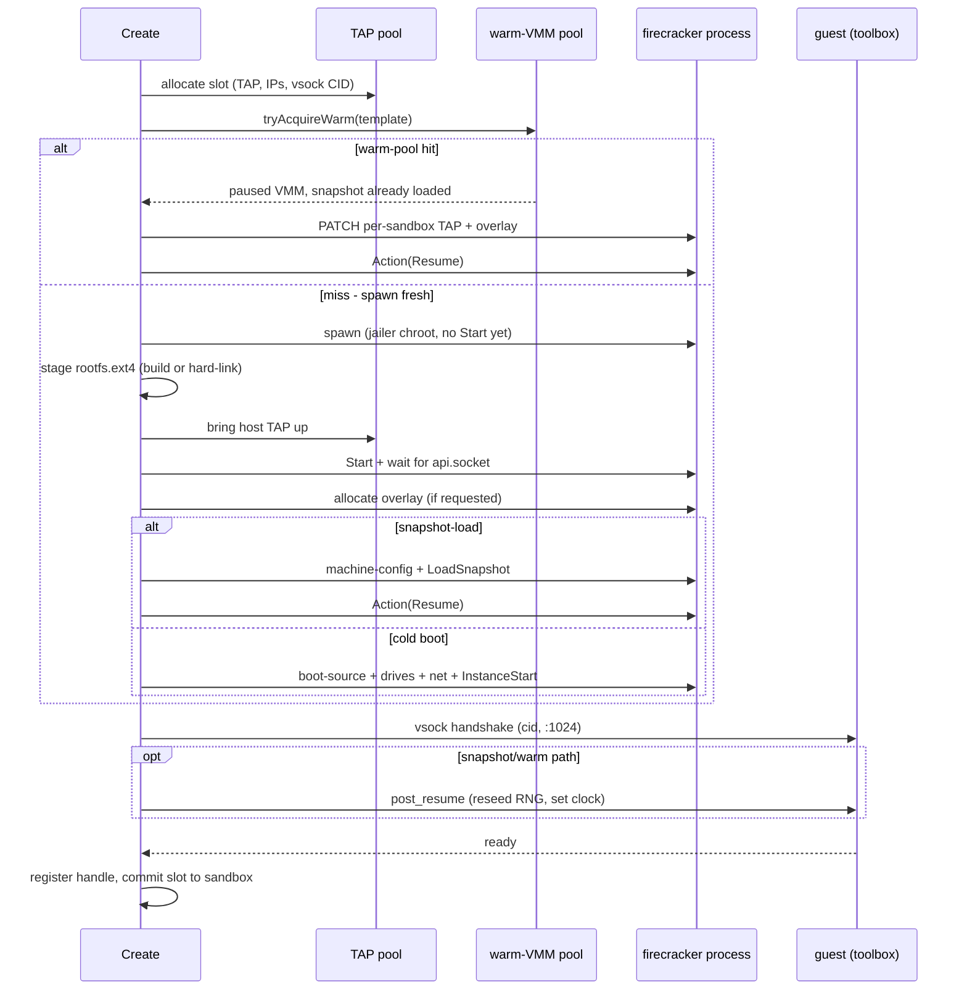

import { Tabs, TabItem } from '@astrojs/starlight/components';

A Firecracker sandbox is a real virtual machine: its own Linux kernel, its own
memory, its own block and network devices, fenced off from the host by hardware
virtualization. There is no shared kernel to escape from. The interesting part
is not that AerolVM can boot a microVM - it is that it can deliver a *serviceable*
one (booted, network up, an agent listening inside) in under 100ms by assembling
it from pre-staged pieces instead of cold-booting every time.

This page explains the moving parts and the exact path a `Create` request takes.
For how those pieces are pre-warmed and shared, read
[Hydration & the Operational Fold](/firecracker-hydration). For the user-facing
how-to, see [Firecracker Sandbox](/firecracker-sandbox).

## Components

The Firecracker runtime driver is the second implementation of the daemon's
`Runtime` interface (the first being the Docker client). It owns no business
logic of its own - the version-agnostic service layer calls into it. Everything
it needs is injected at boot as a narrow seam, which keeps each concern testable
in isolation and keeps the import graph acyclic.

| Component | Responsibility |
|---|---|
| **Firecracker driver** | Implements `Runtime` against Firecracker. Orchestrates every `Create` / `Destroy` and owns the per-sandbox registry of live VMM handles. |
| **TAP slot pool** | Per-host pool of `(TAP device, host IP, guest IP, /30 CIDR, vsock CID)` slots, seeded ahead of time. Each sandbox claims one slot for its network identity. |
| **Warm-VMM pool** | Per-template pool of already-spawned, snapshot-loaded, *paused* Firecracker processes. A pool hit skips the spawn + `LoadSnapshot` wall-clock entirely. |
| **Rootfs builder** | The OCI-to-`ext4` pipeline (`skopeo` + `umoci` + `mkfs.ext4`). Runs on the ad-hoc path; pre-run once on the template path. |
| **Template resolver** | Resolves a `template_id` to the host paths of a pre-built rootfs and snapshot artifacts. |
| **VMM supervisor + jailer** | Spawns the `firecracker` process - wrapped in `jailer` (chroot + cgroups + privilege drop) on production hosts, bare on dev/CI. |
| **vsock dialer** | Host side of the `AF_VSOCK` handshake used to confirm the in-guest agent (toolbox) is alive and to push post-resume signals. |



## Anatomy of one microVM

On a production host every Firecracker process runs inside a `jailer` chroot.
The jailer hard-links the `firecracker` binary into a private root, drops the
process to an unprivileged UID/GID, and confines it with cgroups. The daemon
stages the guest's block devices into that chroot before the VM starts, so the
VM only ever sees files the daemon put there.



A single sandbox is therefore: one jailer chroot, one `rootfs.ext4` (read-mostly,
backing the guest's `/`), an optional sparse `overlay.ext4` for writes, one TAP
slot for the network, one vsock CID for the control channel, and the toolbox
agent listening inside the guest on vsock port `1024`.

## The boot path

`Create` is a single ordered pipeline with strict failure cleanup: every
resource it acquires (TAP slot, host TAP, VMM process, overlay file) is released
in reverse order if any later step fails, so a half-built sandbox never leaks a
slot. There are three branches through it:

- **Ad-hoc** - no `template_id`. The full OCI-to-rootfs pipeline runs, then a
  cold kernel boot (`InstanceStart`). Tens of seconds.
- **Snapshot-load** - a `template_id` whose template captured a memory snapshot.
  The driver issues `LoadSnapshot` + `Resume` instead of cold-booting. Under 100ms.
- **Warm-pool hit** - same template, but a paused VMM with the snapshot
  *already loaded* was waiting in the pool. The driver only patches per-sandbox
  state onto it and resumes. The fastest path.



A few details worth calling out, because they are easy to get wrong:

- **REST ordering matters.** Firecracker requires `machine-config` and
  `boot-source` before drives, and drives + network interfaces before
  `InstanceStart`. The snapshot-load path issues only `machine-config` +
  `LoadSnapshot` - every other device is restored from the snapshot state file.
- **The overlay is sparse.** A requested overlay drive is allocated as a sparse
  file, so a 64 GiB overlay occupies sub-MiB on disk until the guest actually
  writes to it.
- **Snapshot clones resume with a stale RNG and clock.** Two clones of the same
  snapshot would otherwise draw identical `getrandom` bytes and a time that
  jumped backwards. After resume the driver sends a best-effort `post_resume`
  signal telling the in-guest agent to reseed the kernel RNG and set the clock
  from the host. Cold boots skip this - their kernel just initialized.
- **The vsock CID differs by path.** On the snapshot/warm path the guest listens
  on the *template's* CID (baked into the snapshot at build time), not the
  per-sandbox slot CID, so the host dials that CID for the handshake. (vsock is
  used precisely because it is snapshot-safe - a TCP control channel over the TAP
  would tear on resume.)
- **Snapshot/warm clones share guest memory copy-on-write.** `LoadSnapshot`
  `mmap`s the template's memory image as a read-only base; per-clone writes hit a
  private dirty bitmap. The full memory model is in
  [Hydration & the Operational Fold](/firecracker-hydration#memory-copy-on-write-clones).

## Two creation paths, two boot budgets

| Path | How | Boot time |
|---|---|---|
| **Ad-hoc** | Pass any OCI image (`ubuntu:22.04`). The daemon builds a Firecracker rootfs on demand. | 10–60 seconds per create |
| **Template-backed** | Pre-build a rootfs + snapshot once, then pass `template_id`. Snapshot-load, or a warm-pool hit. | Under 100ms |

The driver picks the branch from the request alone - there is no separate API.
Creating a Firecracker sandbox looks the same regardless of which path runs
underneath:

<Tabs syncKey="lang">
  <TabItem label="TypeScript">
    ```ts
    import { MicroVM } from '@aerol-ai/aerolvm-sdk'

    const client = new MicroVM({
      apiUrl: process.env.SB_API_URL,
      patToken: process.env.SB_PAT_TOKEN,
    })

    const sandbox = await client.create({
      image: 'ubuntu:22.04',
      runtime: 'firecracker',
      cpu: 1,
      memoryMB: 512,
    })

    console.log(sandbox.id, sandbox.publicURL)
    ```
  </TabItem>
  <TabItem label="Python">
    ```python
    from microvm import MicroVM

    client = MicroVM(
        api_url='https://sandbox.example.com',
        pat_token='your-token',
    )

    sandbox = client.create({
        'image': 'ubuntu:22.04',
        'runtime': 'firecracker',
        'cpu': 1.0,
        'memoryMB': 512,
    })

    print(sandbox.id, sandbox.publicURL)
    ```
  </TabItem>
  <TabItem label="Go">
    ```go
    import (
        "context"
        "fmt"
        "log"
        "os"

        microvm   "github.com/aerol-ai/microvm/sdk/go/pkg/microvm"
        sdktypes  "github.com/aerol-ai/microvm/sdk/go/pkg/types"
    )

    client, err := microvm.NewClientWithConfig(&sdktypes.MicroVMConfig{
        APIUrl:   os.Getenv("SB_API_URL"),
        PATToken: os.Getenv("SB_PAT_TOKEN"),
    })
    if err != nil {
        log.Fatal(err)
    }

    sandbox, err := client.Create(context.Background(), sdktypes.CreateSandboxOptions{
        Image:    "ubuntu:22.04",
        Runtime:  sdktypes.RuntimeFirecracker,
        CPU:      1,
        MemoryMB: 512,
    })
    if err != nil {
        log.Fatal(err)
    }

    fmt.Println(sandbox.ID, sandbox.PublicURL)
    ```
  </TabItem>
  <TabItem label="Rust">
    ```rust
    use aerolvm_sdk::{Client, CreateOptions};

    let client = Client::new(
        Some("https://sandbox.example.com"),
        Some("your-token"),
    )?;

    let sandbox = client.create(CreateOptions {
        image:    "ubuntu:22.04".to_string(),
        runtime:  Some("firecracker".to_string()),
        cpu:      Some(1),
        memory_mb: Some(512),
        ..Default::default()
    })?;

    println!("{} {:?}", sandbox.data.id, sandbox.data.public_url);
    ```
  </TabItem>
  <TabItem label="Java">
    ```java
    import ai.aerol.microvm.MicroVMClient;
    import ai.aerol.microvm.MicroVMConfig;
    import ai.aerol.microvm.Sandbox;
    import ai.aerol.microvm.model.CreateOptions;

    MicroVMClient client = new MicroVMClient(
        new MicroVMConfig()
            .setApiUrl("https://sandbox.example.com")
            .setPatToken(System.getenv("SB_PAT_TOKEN"))
    );

    Sandbox sandbox = client.create(
        new CreateOptions()
            .setImage("ubuntu:22.04")
            .setRuntime("firecracker")
            .setCpu(1.0)
            .setMemoryMb(512)
    );

    System.out.println(sandbox.id + " " + sandbox.publicUrl);
    ```
  </TabItem>
</Tabs>

## Next

The under-100ms numbers above come entirely from *not* doing work on the boot
path - the rootfs is already built, the kernel is already booted into a
snapshot, and on a warm hit the snapshot is already loaded into a live process.
[Hydration & the Operational Fold](/firecracker-hydration) explains how those
pieces are pre-warmed, restored, and shared across a host.

## Further reading

The primary sources behind the design on these two pages:

- [Firecracker: Lightweight Virtualization for Serverless Applications](https://www.usenix.org/conference/nsdi20/presentation/agache) (USENIX NSDI 2020) - the foundational paper on microVMs for serverless and agent workloads.
- [Firecracker snapshotting](https://github.com/firecracker-microvm/firecracker/blob/main/docs/snapshotting/snapshot-support.md) - the upstream spec for `LoadSnapshot`, diff snapshots, the dirty bitmap, and the `File` vs `Uffd` memory backends behind the [copy-on-write model](/firecracker-hydration#memory-copy-on-write-clones).
- [Firecracker jailer](https://github.com/firecracker-microvm/firecracker/blob/main/docs/jailer.md) - chroot + cgroups + privilege drop; the source for the microVM anatomy above.
- [Firecracker network setup](https://github.com/firecracker-microvm/firecracker/blob/main/docs/network-setup.md) - TAP-device guest networking, the basis for the TAP slot pool.
- [Firecracker REST API](https://github.com/firecracker-microvm/firecracker/blob/main/src/firecracker/swagger/firecracker.yaml) - the wire contract for every `Put`/`Patch`/`Action` call in the boot sequence.
