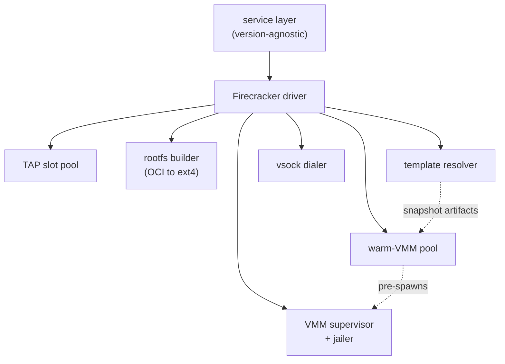
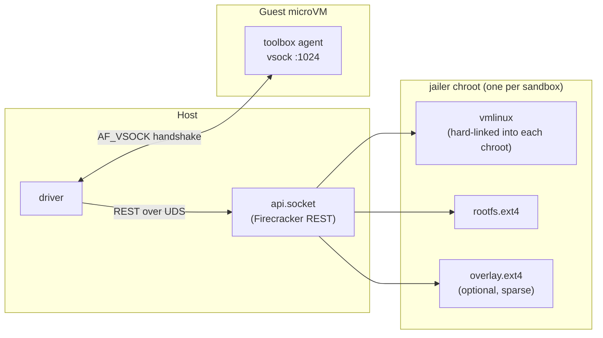
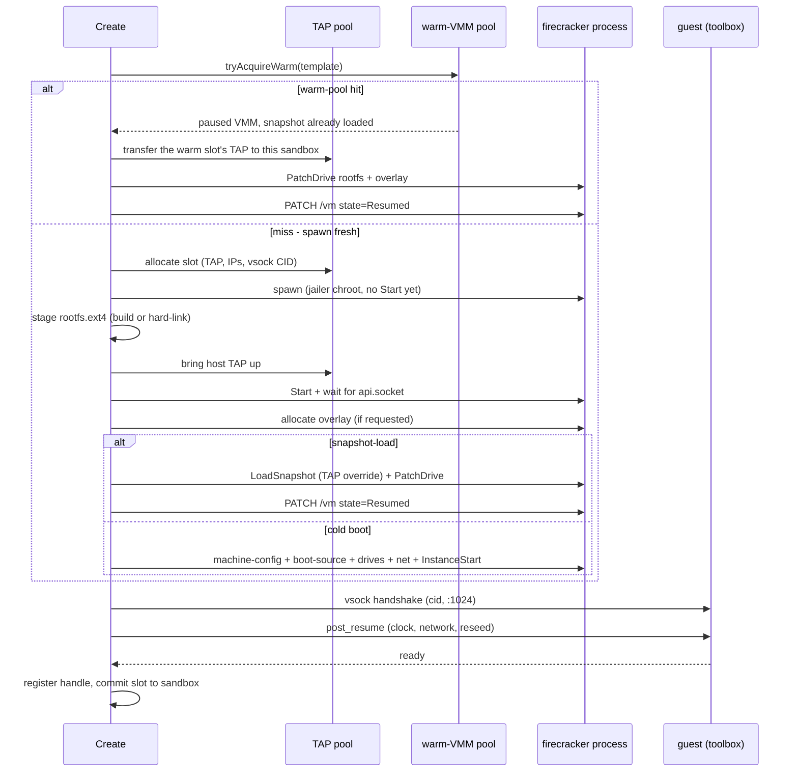

import { Tabs, TabItem } from '@astrojs/starlight/components';

A Firecracker sandbox is a small Linux virtual machine, called a **microVM**, with its own kernel, memory, disk and network devices. **KVM** (the hardware virtualization built into the Linux kernel) keeps it apart from the host. AerolVM's job is to hand you one that is booted, online and running its agent. It does that by resuming pieces prepared ahead of time, instead of booting from cold.

The **warm pool** is a set of VMs started ahead of time and paused. When one is waiting there, the target is under 100 ms on a healthy host. Cold boots are much slower. So are loads from a **snapshot** (a saved copy of a running VM) when the snapshot file is not yet in memory (see [Boot-time budget](#boot-time-budget)).

**In short:**

- Firecracker runs each sandbox as a microVM under KVM, with its own kernel and only a few simple virtual devices.
- On production hosts, each VM process is locked in a jailer: a private file tree, its own view of processes, resource limits and no root rights.
- A sandbox can start three ways: from any image (slowest), from a template snapshot, or from a paused VM in the warm pool (fastest).
- The host talks to the agent inside the VM over vsock, a direct host-to-VM channel that survives snapshots.
- If any step fails, `Create` undoes every earlier step in reverse order, so nothing leaks.

For how those pieces are prepared and shared, read [Firecracker snapshot restore](/firecracker-hydration/). For the how-to guide, see [Firecracker](/firecracker-sandbox/).

## Why Firecracker, not Kata or gVisor

This section compares Firecracker with two common alternatives. Firecracker runs each guest under KVM with its own kernel and an MMIO-only virtio device tree. **virtio** is a standard set of simple virtual devices. **MMIO-only** means they connect through memory addresses, with no PCI bus.

Here are the trade-offs against the obvious neighbors:

- **gVisor.** It shares the host kernel and intercepts each system call. That is defense in depth, not isolation equal to hardware virtualization. AerolVM already offers gVisor as its own runtime ([gVisor](/gvisor-sandbox/)). It is a stronger container, not a replacement for Firecracker.
- **Kata Containers.** It uses QEMU (a full machine emulator) by default. That means a heavier cold boot. It also makes the snapshot and resume steps that the warm pool depends on harder to drive.
- **Firecracker.** KVM only: no QEMU, no PCI bus, no GPU passthrough. The cost is no GPU in a sandbox today. The gain is cold boots under 150 ms in the Firecracker project itself, and the snapshot and resume model the warm pool is built on.

Firecracker needs `/dev/kvm`. AerolVM hosts must run Linux on bare metal, or on a VM that supports nested virtualization (a VM that can run its own VMs). There is no Windows host, no macOS host and no TCG fallback (QEMU's slow, software-only CPU emulation).

## The parts

This section lists the pieces of the Firecracker runtime driver, the part of the server that runs Firecracker sandboxes. The driver is the second implementation of the server's `Runtime` interface; the Docker client is the first. The service layer, which is the same for every API version, calls into it.

| Part | What it does |
|---|---|
| **Firecracker driver** | Implements `Runtime` on top of Firecracker. Runs `Create` and `Destroy`. Keeps the map of live VMMs (virtual machine monitors: one Firecracker process per VM). |
| **TAP slot pool** | A per-host pool of slots, set up ahead of time. Each slot is a TAP device (a virtual network cable), a host IP, a guest IP, a `/30` subnet and a vsock CID (the VM's vsock address). Each sandbox claims one slot as its network identity. |
| **Warm-VMM pool** | A per-template pool of Firecracker processes that are already started, have the snapshot loaded, and are *paused*. A pool hit skips both the start and the `LoadSnapshot` call. |
| **Rootfs builder** | Turns an OCI image (a standard container image) into an `ext4` root file system disk, using `skopeo`, `umoci` and `mkfs.ext4`. It runs on every ad-hoc create. On the template path it runs once, ahead of time. |
| **Template resolver** | Turns a `template_id` into the host paths of a pre-built rootfs and its snapshot files. |
| **VMM supervisor and jailer** | Starts the `firecracker` process. On production hosts it wraps the process in `jailer`: a chroot (a private file tree), new PID and mount namespaces, cgroups (resource limits) and a switch to a non-root user. On dev and CI hosts it runs bare. The firecracker binary then installs a seccomp filter (a list of allowed system calls) from inside the chroot. |
| **vsock dialer** | The host side of the `AF_VSOCK` handshake. It confirms that the agent in the guest (toolbox) is alive, and sends it the post-resume signal. |


```mermaid
graph TB
    SVC["service layer<br/>(version-agnostic)"] --> DRV["Firecracker driver"]
    DRV --> TAP["TAP slot pool"]
    DRV --> WARM["warm-VMM pool"]
    DRV --> ROOTFS["rootfs builder<br/>(OCI to ext4)"]
    DRV --> TPL["template resolver"]
    DRV --> VMM["VMM supervisor<br/>+ jailer"]
    DRV --> VSOCK["vsock dialer"]
    WARM -.->|pre-spawns| VMM
    TPL -.->|snapshot artifacts| WARM
```

## One microVM up close

This section shows what surrounds a single VM on a production host. Every Firecracker process runs inside a `jailer` chroot: a private root folder it cannot see out of. The jailer hard-links the `firecracker` binary into that private root, and switches the process to an unprivileged user and group.

The jailer also puts the process in new PID and mount **namespaces**, so it sees only its own processes and mounts. It limits the process with **cgroups**, the kernel's resource controls. The firecracker binary then installs a **seccomp** filter from inside the chroot, which limits the system calls it may make.

The server places the guest's disk files into the chroot before the VM starts. So the VM only ever sees files the server put there.


```mermaid
graph LR
    subgraph host["Host"]
        DRV["driver"]
        API["api.socket<br/>(Firecracker REST)"]
    end
    subgraph chroot["jailer chroot (one per sandbox)"]
        KERN["vmlinux<br/>(hard-linked into each chroot)"]
        RFS["rootfs.ext4"]
        OVL["overlay.ext4<br/>(optional, sparse)"]
    end
    subgraph guest["Guest microVM"]
        TBX["toolbox agent<br/>vsock :1024"]
    end
    DRV -->|REST over UDS| API
    API --> KERN & RFS & OVL
    DRV <-->|AF_VSOCK handshake| TBX
```

Each sandbox gets:

- one jailer chroot
- one `rootfs.ext4`, which backs the guest's `/`
- an optional sparse `overlay.ext4` for writes (a sparse file takes disk space only where data is written)
- one TAP slot for the network
- one vsock CID for the control channel
- the toolbox agent, listening inside the guest on vsock port `1024`

A few rules are worth naming up front:

- **Kernel.** The server does not build a kernel. You set the host path to the uncompressed `vmlinux` with `SB_FIRECRACKER_KERNEL` (default `/var/lib/sandboxd/firecracker/vmlinux`). The server checks that path at startup, and the jailer hard-links the file into each sandbox's chroot. Operators supply the kernel; we recommend the build the Firecracker project recommends.
- **Devices.** Only MMIO virtio devices: virtio-blk for `rootfs.ext4` and the optional `overlay.ext4`, virtio-net for the TAP, and virtio-vsock for the control channel. There is no PCI bus, so there is no PCI passthrough, no SR-IOV network card and no GPU. Agents that want GPU inference cannot get it inside a Firecracker sandbox today.
- **Networking.** Each sandbox gets one TAP, one host-side `/30` subnet and one guest IP from its slot. There is no CNI (container network plugin), no second network card and no virtio-balloon (a device for handing memory back to the host). Host-side routing and outbound firewall rules are outside this page.
- **Randomness.** AerolVM does not attach a virtio-rng device (a virtual device that passes random bytes from the host). Cold-boot guests get their randomness from the kernel's own startup path. Clones from a snapshot or the warm pool would otherwise resume with identical random-number state. Two clones drawing the same `getrandom` bytes is a real correctness problem, not a cosmetic one. TLS session tickets (TLS is the encryption behind HTTPS), JWT nonces and session IDs all depend on it.
- **post_resume.** After every boot or resume, the host sends a `post_resume` message over vsock (`postResumeData` in `driver.go`). The agent sets `CLOCK_REALTIME` from the host, applies this sandbox's network settings, and forces a kernel reseed (`ReseedRandom` in `cmd/toolboxd/quiesce_linux.go`). The reseed bytes come from the guest's own generator, since there is no virtio-rng device. On snapshot clones, vmgenid (Firecracker's VM generation ID) makes a guest kernel that supports it reseed itself on restore.
- **MMDS.** Firecracker's MicroVM Metadata Service exists, but AerolVM does not use it. Per-sandbox config arrives over vsock in `post_resume` instead. MMDS would add a dependency on HTTP over a link-local address, which does not survive `LoadSnapshot` cleanly.
- **Memory backend.** Snapshot loads use Firecracker's `File` backend (`mem_backend.backend_type = "File"`, in `driver.go` and `warmspawn.go`). That gives copy-on-write through `mmap` from the template's memory image. **Copy-on-write** (CoW) means clones share each page until one writes to it, and then that clone gets its own copy. The `Uffd` backend loads pages on demand through `userfaultfd`, which lets a program handle page faults itself. It is a future option for speeding up the slowest creates on multi-GiB snapshots, and is not in production today.

## The boot path

This section walks through `Create`, the call that builds a sandbox. If any step fails, `Create` releases everything it took, in reverse order: TAP slot, host TAP, VMM process and overlay file. So a half-built sandbox never leaks a slot.

In `driver.go` this is done with deferred cleanup functions, guarded by a `released` flag. There are three branches through `Create`:

- **Ad-hoc**: no `template_id`. The full OCI-to-rootfs pipeline runs, then a cold kernel boot (`InstanceStart`). This takes tens of seconds.
- **Snapshot-load**: a `template_id` whose template captured a memory snapshot. The driver starts firecracker, calls `LoadSnapshot`, then resumes the VM with `PatchVM` (Firecracker's `PATCH /vm`, state `Resumed`). This takes under 100 ms when the snapshot is already in the host's **page cache** (the kernel's in-memory copy of file data). When it is not, a multi-GiB snapshot spends hundreds of ms loading memory pages from disk.
- **Warm-pool hit**: same template, but a paused VMM with the snapshot *already loaded* was waiting in the pool. The driver hands the warm slot's TAP to this sandbox, points the disks at this sandbox's own files, and resumes the VM. This is the fastest path. `Create` tries the warm pool first, before it allocates a new TAP slot.


```mermaid
sequenceDiagram
    participant C as Create
    participant TAP as TAP pool
    participant W as warm-VMM pool
    participant FC as firecracker process
    participant G as guest (toolbox)

    C->>W: tryAcquireWarm(template)
    alt warm-pool hit
        W-->>C: paused VMM, snapshot already loaded
        C->>TAP: transfer the warm slot's TAP to this sandbox
        C->>FC: PatchDrive rootfs + overlay
        C->>FC: PATCH /vm state=Resumed
    else miss - spawn fresh
        C->>TAP: allocate slot (TAP, IPs, vsock CID)
        C->>FC: spawn (jailer chroot, no Start yet)
        C->>C: stage rootfs.ext4 (build or hard-link)
        C->>TAP: bring host TAP up
        C->>FC: Start + wait for api.socket
        C->>FC: allocate overlay (if requested)
        alt snapshot-load
            C->>FC: LoadSnapshot (TAP override) + PatchDrive
            C->>FC: PATCH /vm state=Resumed
        else cold boot
            C->>FC: machine-config + boot-source + drives + net + InstanceStart
        end
    end
    C->>G: vsock handshake (cid, :1024)
    C->>G: post_resume (clock, network, reseed)
    G-->>C: ready
    C->>C: register handle, commit slot to sandbox
```

Details that bite if you skip them:

- **REST call order on cold boot.** `machine-config` and `boot-source` go before the drives. Drives and network interfaces go before `InstanceStart`.

  The snapshot-load path sends no `machine-config` (`configureVMMForLoad` in `driver.go`). It sends `LoadSnapshot` with a network override that points the guest's network card at this sandbox's TAP. Then it sends `PatchDrive` for the rootfs and the overlay. Every other device comes back from the snapshot's state file.
- **The overlay is sparse.** A requested overlay disk is created as a sparse file. So a 64 GiB overlay uses less than 1 MiB on disk until the guest writes to it.
- **Snapshot clones resume with stale randomness and a stale clock.** Two clones of one snapshot would otherwise draw identical `getrandom` bytes, and see a time that jumped backwards. After the handshake, the driver sends a best-effort `post_resume` signal (if it fails, the create goes on). The agent sets the clock from the host (`wallclock_unix_ns`) and applies the `network` settings. It then forces a reseed with `RNDADDENTROPY` and `RNDRESEEDCRNG` (`OnPostResume` in `cmd/toolboxd/vsock.go`). Cold boots get the same message; there it mainly re-applies the static network address once the agent is running.
- **The vsock CID depends on the path.** On the snapshot and warm paths, the guest listens on the template's CID, which was baked into the snapshot at build time. It does not listen on the sandbox's slot CID, so the host dials the template CID for the handshake. AerolVM uses vsock because it survives snapshots; a TCP control channel over the TAP would break on resume.
- **Snapshot and warm clones share guest memory copy-on-write.** `LoadSnapshot` maps the template's memory image with `MAP_PRIVATE`. On the first write to any page, the kernel's CoW handler gives that VM a private anonymous page and leaves the file untouched. The full memory model is in [How clones share memory](/firecracker-hydration/#how-clones-share-memory-copy-on-write).
- **`track_dirty_pages` is a separate feature.** It *finds* changed pages for diff snapshots, and does not redirect writes. Turning it on costs a VM exit (a trip from the guest back to the host) on each first write to a page.

## Boot-time budget

This section compares the two ways to create a Firecracker sandbox, and how long each takes.

| Path | How | Boot time |
|---|---|---|
| **Ad-hoc** | Pass any OCI image, such as `ubuntu:22.04`. The server builds a Firecracker rootfs when you ask. | 10 to 60 seconds per create |
| **Template-backed** | Build a rootfs and snapshot once, then pass `template_id`. You get a snapshot load or a warm-pool hit. | Under 100 ms on a warm-pool hit; a few hundred ms for a snapshot load |

The warm-hit target is a timeout inside the driver, not a published benchmark. The time it saves is real, but the exact number depends on the kind of host, the kernel size and the warm-pool depth.

The driver picks the branch from the request alone; there is no separate API. Creating a Firecracker sandbox looks the same whichever path runs underneath. To take the template path, add the template id: `templateId` in TypeScript and Python, `TemplateID` in Go, `template_id` in Rust and `setTemplateId` in Java.

<Tabs syncKey="lang">
  <TabItem label="TypeScript">
    ```ts
    import { MicroVM } from '@aerol-ai/aerolvm-sdk'

    const client = new MicroVM({
      apiUrl: process.env.SB_API_URL,
      patToken: process.env.SB_PAT_TOKEN,
    })

    const sandbox = await client.create({
      image: 'ubuntu:22.04',
      runtime: 'firecracker',
      cpu: 1,
      memoryMB: 512,
    })

    console.log(sandbox.id, sandbox.publicURL)
    ```
  </TabItem>
  <TabItem label="Python">
    ```python
    from microvm import MicroVM

    client = MicroVM(
        api_url='https://sandbox.example.com',
        pat_token='your-token',
    )

    sandbox = client.create({
        'image': 'ubuntu:22.04',
        'runtime': 'firecracker',
        'cpu': 1.0,
        'memoryMB': 512,
    })

    print(sandbox.id, sandbox.publicURL)
    ```
  </TabItem>
  <TabItem label="Go">
    ```go
    import (
        "context"
        "fmt"
        "log"
        "os"

        microvm   "github.com/aerol-ai/microvm/sdk/go/pkg/microvm"
        sdktypes  "github.com/aerol-ai/microvm/sdk/go/pkg/types"
    )

    client, err := microvm.NewClientWithConfig(&sdktypes.MicroVMConfig{
        APIUrl:   os.Getenv("SB_API_URL"),
        PATToken: os.Getenv("SB_PAT_TOKEN"),
    })
    if err != nil {
        log.Fatal(err)
    }

    sandbox, err := client.Create(context.Background(), sdktypes.CreateSandboxOptions{
        Image:    "ubuntu:22.04",
        Runtime:  sdktypes.RuntimeFirecracker,
        CPU:      1,
        MemoryMB: 512,
    })
    if err != nil {
        log.Fatal(err)
    }

    fmt.Println(sandbox.ID, sandbox.PublicURL)
    ```
  </TabItem>
  <TabItem label="Rust">
    ```rust
    use aerolvm_sdk::{Client, CreateOptions};

    let client = Client::new(
        Some("https://sandbox.example.com"),
        Some("your-token"),
    )?;

    let sandbox = client.create(CreateOptions {
        image:    "ubuntu:22.04".to_string(),
        runtime:  Some("firecracker".to_string()),
        cpu:      Some(1),
        memory_mb: Some(512),
        ..Default::default()
    })?;

    println!("{} {:?}", sandbox.data.id, sandbox.data.public_url);
    ```
  </TabItem>
  <TabItem label="Java">
    ```java
    import ai.aerol.microvm.MicroVMClient;
    import ai.aerol.microvm.MicroVMConfig;
    import ai.aerol.microvm.Sandbox;
    import ai.aerol.microvm.model.CreateOptions;

    MicroVMClient client = new MicroVMClient(
        new MicroVMConfig()
            .setApiUrl("https://sandbox.example.com")
            .setPatToken(System.getenv("SB_PAT_TOKEN"))
    );

    Sandbox sandbox = client.create(
        new CreateOptions()
            .setImage("ubuntu:22.04")
            .setRuntime("firecracker")
            .setCpu(1.0)
            .setMemoryMb(512)
    );

    System.out.println(sandbox.id + " " + sandbox.publicUrl);
    ```
  </TabItem>
</Tabs>

## Further reading

These are the primary sources behind the design on this page and on [Firecracker snapshot restore](/firecracker-hydration/):

- [Firecracker: Lightweight Virtualization for Serverless Applications](https://www.usenix.org/conference/nsdi20/presentation/agache) (USENIX NSDI 2020): the founding paper on the VMM design AerolVM builds on.
- [Firecracker snapshotting](https://github.com/firecracker-microvm/firecracker/blob/main/docs/snapshotting/snapshot-support.md): the Firecracker spec for `LoadSnapshot`, diff snapshots, the dirty bitmap, and the `File` and `Uffd` memory backends behind the [copy-on-write model](/firecracker-hydration/#how-clones-share-memory-copy-on-write).
- [Firecracker jailer](https://github.com/firecracker-microvm/firecracker/blob/main/docs/jailer.md): chroot, cgroups and privilege drop; the source for the microVM layout above.
- [Firecracker network setup](https://github.com/firecracker-microvm/firecracker/blob/main/docs/network-setup.md): guest networking over TAP devices, the basis for the TAP slot pool.
- [Firecracker REST API](https://github.com/firecracker-microvm/firecracker/blob/main/src/firecracker/swagger/firecracker.yaml): the wire contract for every `Put`, `Patch` and `Action` call in the boot sequence.

## Next steps

- [Firecracker snapshot restore](/firecracker-hydration/): how the rootfs, snapshot and live VMs are prepared, restored and shared, and what is not built yet (UFFD, huge pages, a diff-snapshot API).
- [Firecracker](/firecracker-sandbox/): create and use Firecracker sandboxes.
- [Firecracker templates](/firecracker-templates/): build the templates that make fast starts possible.
- [Correct snapshot clones](/engineering-snapshot-correctness/): what can go wrong when many VMs resume from one snapshot.
