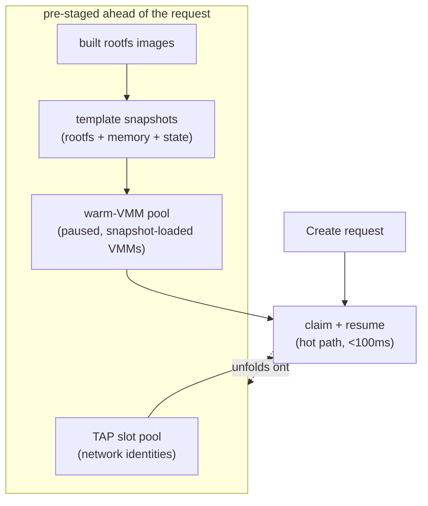
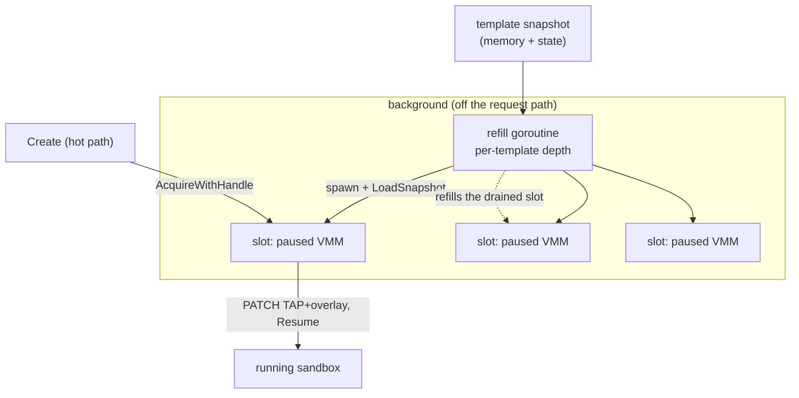
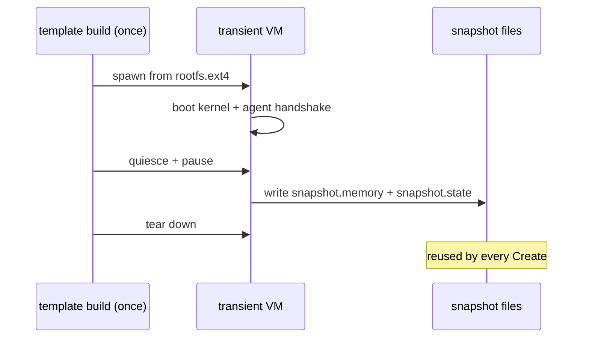
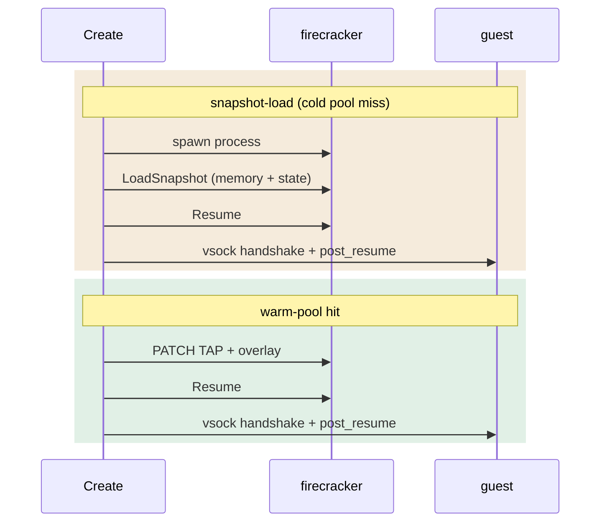
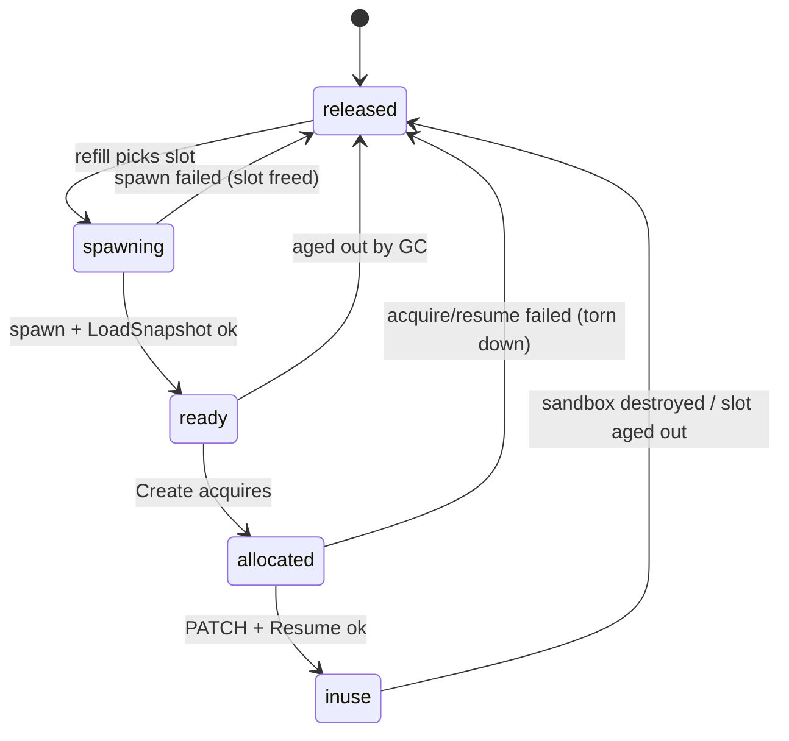

import { Tabs, TabItem } from '@astrojs/starlight/components';

A cold microVM is slow not because virtualization is slow, but because *building*
one is: pull an image, lay down a filesystem, boot a kernel, wait for init, wait
for the agent. AerolVM moves all of that work *off* the request path. By the time
a `Create` arrives, the expensive pieces already exist - pre-built, pre-booted,
pre-loaded - and creating a sandbox is mostly a matter of claiming them and
resuming. We call this the **operational fold**: the deep stack of preparation
work is folded behind a thin, fast claim-and-resume on the hot path.

The guiding rule is simple - **pre-stage everything that can be pre-staged, and
defer everything that can be deferred.** This page walks through how that rule
shows up in the Firecracker runtime. For the boot pipeline these pieces plug
into, read [Firecracker Architecture](/firecracker-architecture) first.

## The fold, top to bottom



Each layer is produced by a background process so the foreground `Create` never
pays for it. The layers build on one another: a rootfs is built once, snapshotted
once, and that snapshot is what the warm pool pre-loads into live processes.

## Resource pooling

Two per-host pools turn "allocate a resource" into "pull one off a free list".
Both are backed by the daemon's single-writer SQLite store, so allocation is
idempotent and safe under concurrent duplicate `Create` calls.

### TAP slot pool

A sandbox's network identity - its TAP device, host and guest IP, `/30` subnet,
and vsock CID - is not invented per request. The host lays out a fixed pool of
`/30` subnets at startup (`SB_FIRECRACKER_TAP_BASE_CIDR` carved into
`SB_FIRECRACKER_TAP_POOL_SIZE` slots). `Create` claims a free slot row; the
pool size is the hard cap on concurrent Firecracker sandboxes on that host.
Allocation (reserving the row) is separated from realization (the actual
`ip link add` of the TAP device), mirroring how the daemon separates host-port
reservation from binding.

### Warm-VMM pool

The warm-VMM pool is where the largest win lives. A background **refill
goroutine** keeps a configurable depth of ready VMMs *per template*: for each
free slot it spawns a `firecracker` process, issues `LoadSnapshot` against the
template's snapshot artifacts, and leaves the VM **paused**. The process is alive,
the memory image is loaded, the devices are configured - it is one `Resume` away
from running.



When `Create` acquires a warm slot it does **not** spawn or load anything - it
PATCHes the per-sandbox TAP and overlay onto the already-loaded VMM and issues
`Resume`. That skips the spawn + `LoadSnapshot` wall-clock that otherwise
dominates a snapshot-load create (on the order of ~150ms). The drained slot is
refilled in the background for the next request.

## Snapshot restore + lazy load

The artifact the warm pool restores is produced once, when a template is built.
The daemon spins up a transient VM from the freshly built `rootfs.ext4`, boots
it, waits for the in-guest agent to handshake, quiesces it, pauses it, and writes
two files: `snapshot.memory` (the guest RAM image) and `snapshot.state` (device
and CPU state). Then it tears the transient VM down. That capture is a one-time
cost; every later sandbox restores from it.



Restoring from a snapshot is a much shorter path than a cold boot - there is no
kernel init, no agent startup, no userspace bring-up. It also enables **lazy
load**: restoring does not require faulting in the entire memory image up front;
guest pages are mapped on demand as the workload touches them. Work the sandbox
never does is work its memory image never pays for.

The difference on the hot path:



Both end identically - a `vsock` handshake confirms the agent is alive, and a
best-effort `post_resume` signal reseeds the guest RNG and resets its clock (a
clone resumes with the snapshot's entropy pool and a stale wall clock). The warm
path simply has the spawn and load already done.

## The warm slot lifecycle

Every warm slot moves through an explicit state machine in the store. The states
are what make the pool safe under retries and crashes: a slot is only ever owned
by one sandbox, and a failed `Create` returns its slot rather than leaking it.



Two guarantees hold across these transitions, and both are load-bearing:

- **Idempotent acquire.** A retried or duplicated `Create` cannot end up with two
  sandboxes on one VMM. The acquire is a guarded `SELECT`-then-`UPDATE` under the
  store's single writer.
- **LIFO cleanup.** Everything a `Create` acquires - TAP slot, host TAP, overlay
  file, warm VMM - is released in reverse order on any failure. A slot that fails
  to resume is moved back to `released` so the pool's sweep tears the dead VMM
  down; it never sticks in `allocated` without an owner.

## What is shared, and what is not

Sharing read-only state across sandboxes is where high density comes from, but
it is easy to overclaim. Here is what AerolVM actually does today on a single
host:

| Asset | Shared across sandboxes? | Mechanism |
|---|---|---|
| Guest kernel (`vmlinux`) | Yes, read-only | One image on disk; every jailer chroot references it. |
| Template `rootfs.ext4` | Yes, as a backing file | Hard-linked into each sandbox's jailer chroot (copy fallback across filesystems). Writes go to the overlay, not the shared rootfs. |
| Writable layer | No | Each sandbox gets its own sparse `overlay.ext4`; real blocks are allocated only on write. |
| Guest memory | **No** | Firecracker reserves the full `memoryMB` per VM. AerolVM does **not** do copy-on-write page sharing between running clones - size requests to what the workload needs. |
| Snapshot artifacts | Yes, as source | One `snapshot.memory` / `snapshot.state` per template feeds every restore and every warm-pool spawn. |

The honest summary: AerolVM shares the *read-only* inputs (kernel, rootfs,
snapshot) aggressively and isolates everything writable (overlay, RAM) completely.
It does not deduplicate live guest memory across running VMs.

## Operational knobs

The fold is configurable per host. The defaults aim for a laptop or single node;
production hosts and clusters tune depth and isolation up.

| Setting | Env | Effect |
|---|---|---|
| Enable runtime | `SB_ENABLE_FIRECRACKER` | Construct the Firecracker driver alongside Docker. |
| Kernel image | `SB_FIRECRACKER_KERNEL` | Path to the `vmlinux` every microVM boots. |
| TAP pool | `SB_FIRECRACKER_TAP_BASE_CIDR` / `SB_FIRECRACKER_TAP_POOL_SIZE` | The `/30` layout and the concurrent-sandbox cap. |
| Jailer | `SB_FIRECRACKER_USE_JAILER` | Wrap each VM in chroot + cgroups + privilege drop (default on; dev/CI can disable). |
| Overlay drive | `SB_FIRECRACKER_OVERLAY_ENABLED` / `SB_FIRECRACKER_OVERLAY_MKFS` | Allow per-sandbox writable overlays, and optionally pre-format them. |
| Template GC | `SB_FIRECRACKER_TEMPLATE_GC_ENABLED` | Sweep stale template artifacts. |

Warm-pool depth is set per template by the daemon, so the templates you create
the most can keep more VMMs hot. A depth of zero falls back to the snapshot-load
path (still under 100ms, just without the spawn/load already done).

## Building the artifact that gets hydrated

Everything above hangs off a template. Registering one builds the `rootfs.ext4`,
captures the snapshot, and (with depth configured) lets the warm pool start
pre-spawning. The build is asynchronous - the call returns immediately and the
template moves through `pending → building_rootfs → snapshotting → ready`.

<Tabs syncKey="lang">
  <TabItem label="TypeScript">
    ```ts
    const tpl = await microvm.createTemplate({
      id: 'py311',
      image: 'docker://python:3.11',
      minSizeMiB: 1024,
    })
    console.log(tpl.id, tpl.status) // "py311" "pending"
    ```
  </TabItem>
  <TabItem label="Python">
    ```python
    tpl = microvm.create_template({
        'id': 'py311',
        'image': 'docker://python:3.11',
        'minSizeMiB': 1024,
    })
    print(tpl['id'], tpl['status'])  # "py311" "pending"
    ```
  </TabItem>
  <TabItem label="Go">
    ```go
    tpl, err := client.CreateTemplate(ctx, sdktypes.CreateTemplateOptions{
        ID: "py311", Image: "docker://python:3.11", MinSizeMiB: 1024,
    })
    if err != nil {
        log.Fatal(err)
    }
    fmt.Println(tpl.ID, tpl.Status) // "py311" "pending"
    ```
  </TabItem>
  <TabItem label="Rust">
    ```rust
    let tpl = client.create_template(CreateTemplateOptions {
        id: Some("py311".into()),
        image: "docker://python:3.11".into(),
        min_size_mib: Some(1024),
    })?;
    println!("{} {:?}", tpl.id, tpl.status); // "py311" Pending
    ```
  </TabItem>
  <TabItem label="Java">
    ```java
    Template tpl = client.createTemplate(new CreateTemplateOptions()
        .setId("py311")
        .setImage("docker://python:3.11")
        .setMinSizeMib(1024));
    System.out.println(tpl.id + " " + tpl.status); // "py311" PENDING
    ```
  </TabItem>
</Tabs>

Once the template is `ready`, sandbox creates against it restore from the
snapshot - and if the warm pool has depth, claim an already-loaded VMM. See
[Firecracker Templates](/firecracker-templates) for the full template lifecycle
(polling, rebuilds, cluster replication).
