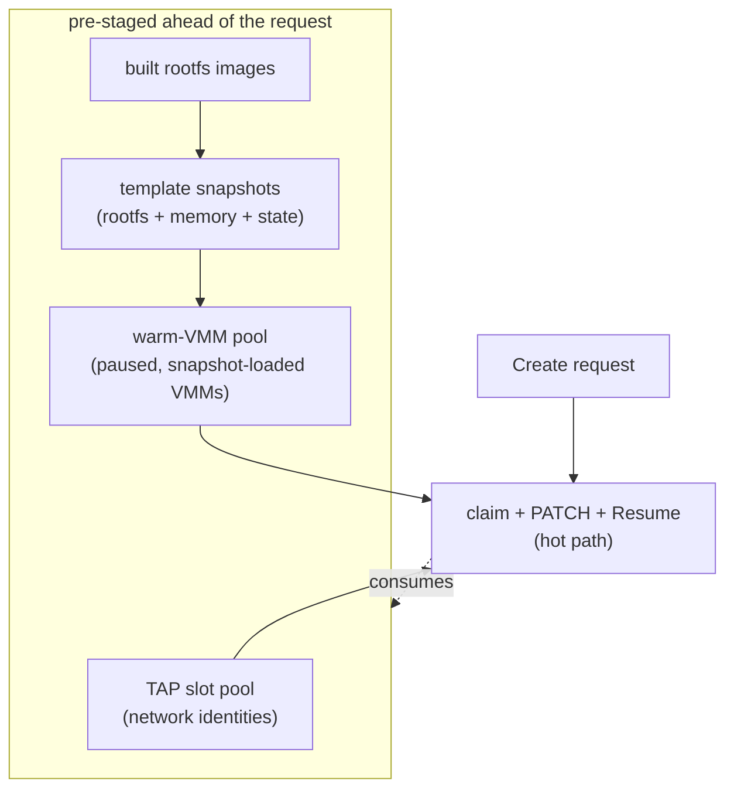
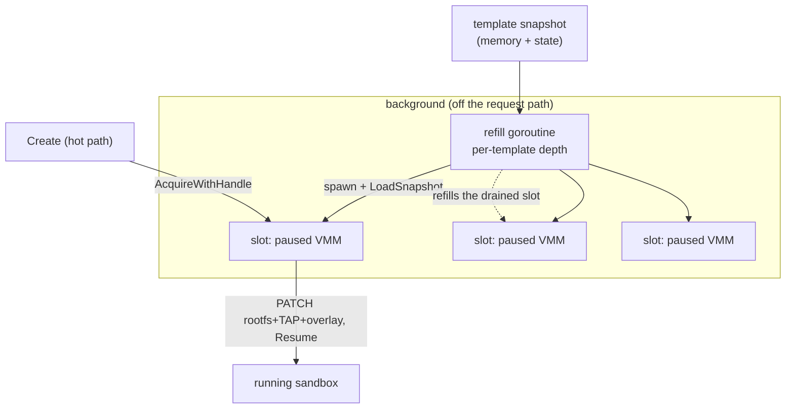
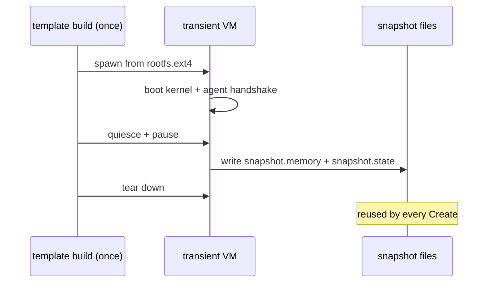
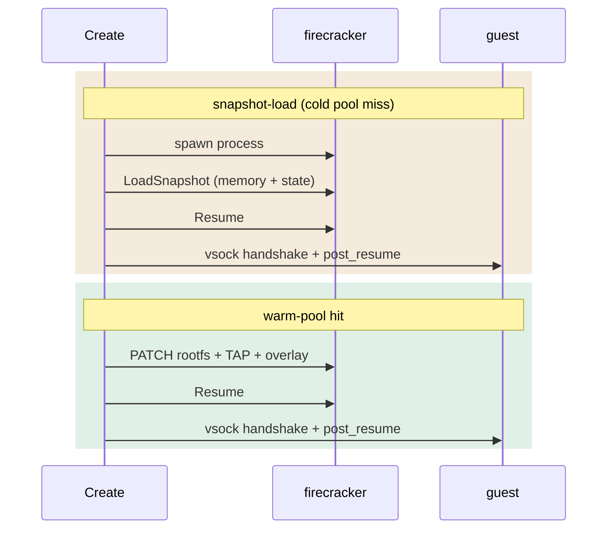
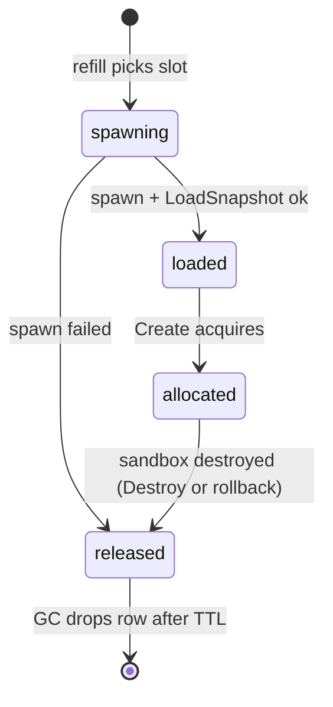
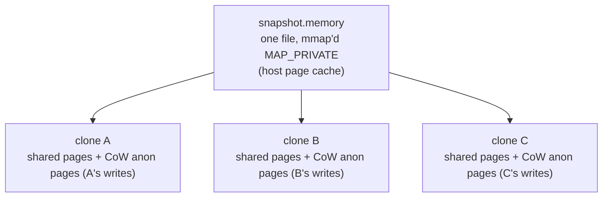

import { Tabs, TabItem } from '@astrojs/starlight/components';

A cold microVM is slow because *building* one is slow: pull an image, build a
rootfs, boot a kernel, wait for init, wait for the agent. AerolVM does all of
that ahead of the request. By the time `Create` arrives, the rootfs is built,
the kernel is booted, the agent is up, and a Firecracker VMM is sitting paused
mid-userspace. `Create` rebinds the per-sandbox state and issues `Resume`.

This page walks through how that path is built. For the boot pipeline these
pieces plug into, read [Firecracker Architecture](/firecracker-architecture)
first.

## Pre-staged layers



A rootfs is built once, snapshotted once, and that snapshot is what the warm
pool pre-loads into live processes.

## Resource pooling

Two per-host pools turn "allocate a resource" into "pull one off a free list".
Both are backed by the daemon's single-writer SQLite store, so allocation is
idempotent and safe under concurrent duplicate `Create` calls.

### TAP slot pool

A sandbox's network identity - its TAP device, host and guest IP, `/30` subnet,
and vsock CID - is not invented per request. The host lays out a fixed pool of
`/30` subnets at startup (`SB_FIRECRACKER_TAP_BASE_CIDR` carved into
`SB_FIRECRACKER_TAP_POOL_SIZE` slots). `Create` claims a free slot row; the
pool size is the hard cap on concurrent Firecracker sandboxes on that host.
Allocation (reserving the row) is separated from realization (the actual
`ip link add` of the TAP device), mirroring how the daemon separates host-port
reservation from binding.

### Warm-VMM pool

The warm-VMM pool removes the spawn and `LoadSnapshot` wall-clock from
snapshot-load `Create` by doing both steps ahead of the request. The driver
comment in `warmacquire.go:7` puts that cost at "~150ms+"; that number comes
from the timeouts the driver was written against, not a published benchmark
(see [Limitations](#limitations-and-gaps)).

A background **refill goroutine** keeps a configurable depth of paused VMMs per
template. For each empty slot it spawns a `firecracker` process, issues
`LoadSnapshot` against the template's snapshot artifacts
(`internal/runtime/firecracker/warmspawn.go:181-197`), and leaves the VM
**paused**. The process is alive, the memory image is loaded, the devices are
configured. It is one `Resume` away from running.



When `Create` acquires a warm slot it does **not** spawn or load anything. It
PATCHes the per-sandbox rootfs, TAP, and (if requested) overlay onto the
already-loaded VMM (`warmacquire.go:180-209`) and issues `Resume`. The drained
slot is refilled in the background for the next request.

The warm pool is **off by default**. See [Operational knobs](#operational-knobs).

## Snapshot restore

The artifact the warm pool restores is produced once, when a template is built.
The daemon spins up a transient VM from the freshly built `rootfs.ext4`, boots
it, waits for the in-guest agent to handshake, pauses it, and writes two files:
`snapshot.memory` (the guest RAM image) and `snapshot.state` (device and CPU
state). Then it tears the transient VM down
(`internal/runtime/firecracker/snapshot.go`). That capture is a one-time cost;
every later sandbox restores from it.



Restoring from a snapshot is a much shorter path than a cold boot: no kernel
init, no agent startup, no userspace bring-up. It also gives you **on-demand
page loading** ([Firecracker snapshot-support.md][fc-snap]): restoring does not
fault the entire memory image in up front; the file is `mmap`'d and guest pages
are loaded by the kernel's page-fault handler as the workload touches them.
"On-demand" here means the kernel's standard mmap+fault path - not a userspace
fault handler. UFFD is the opt-in alternative; see [Limitations](#limitations-and-gaps).

The difference on the hot path:



Both end identically. A `vsock` handshake confirms the agent is alive, and a
best-effort `post_resume` message resyncs the guest wall clock. The payload is
only `{ "wallclock_unix_ns": ... }` today
(`internal/runtime/firecracker/warmacquire.go:230-232`,
`sandbox_snapshot.go:422-424`); RNG re-seeding is a TODO at
`internal/runtime/firecracker/snapshot.go:277` and is **not shipping**. See
[Limitations](#limitations-and-gaps) for what that means for clones that share
an entropy pool, and for `CLOCK_MONOTONIC`.

## The warm slot lifecycle

Every warm slot moves through an explicit state machine in the store. The
states make the pool safe under retries and crashes: a slot is only ever owned
by one sandbox, and a failed `Create` returns its slot rather than leaking it.

The actual states, per `internal/store/store.go:289-349`, are `spawning`,
`loaded`, `allocated`, and `released`.



There is no separate state for "resumed" or "in use". Once `Create` acquires
the slot, the row stays `allocated` until the sandbox is destroyed (or rolled
back on failure). The GC sweep walks `released` rows past
`SB_FIRECRACKER_VMM_POOL_GC_TTL` and drops them
(`internal/store/store.go:344-349`, `internal/pool/vmm/pool.go runGCOnce`).

Two guarantees hold across these transitions:

- **Idempotent acquire.** A retried or duplicated `Create` cannot end up with
  two sandboxes on one VMM. The partial unique index
  `idx_firecracker_vmm_pool_sandbox` (`internal/store/store.go:329-336`)
  enforces exactly one `allocated` row per sandbox; acquire is a
  guarded `SELECT`-then-`UPDATE` under the store's single writer.
- **LIFO cleanup.** Everything `Create` acquires - TAP slot, host TAP, overlay
  file, warm VMM - is released in reverse order on any failure. A slot that
  fails to resume is moved back to `released` so the pool's GC sweep tears the
  dead VMM down; it never sticks in `allocated` without an owner.

## What is shared, and what is not

Sharing read-only state across sandboxes is where high density comes from. The
table below is what AerolVM actually does today on a single host:

| Asset | Shared across sandboxes? | Mechanism |
|---|---|---|
| Guest kernel (`vmlinux`) | Yes, read-only | One image on disk; every jailer chroot references it. |
| Template `rootfs.ext4` (snapshot/warm clones) | Yes, RO backing file | Hard-linked into each sandbox's jailer chroot (copy fallback across filesystems via `linkOrCopyRootfs` at `driver.go`); mounted `IsReadOnly=true` (`snapshot.go:227`); guest writes go to the overlay if the guest mounts it. |
| Cold-boot rootfs (no template) | No | Per-sandbox `mkfs.ext4`, mounted `IsReadOnly=false` (`driver.go:817`). No "shared" rootfs concept on this path. |
| Writable overlay | No | Each sandbox gets its own sparse `overlay.ext4`; real blocks are allocated only on write. |
| Guest memory - snapshot/warm clones | Unmodified pages: yes, via kernel CoW | The template's `snapshot.memory` is `mmap`'d `MAP_PRIVATE` by Firecracker; unmodified pages stay shared in the host page cache. See [Memory](#memory-private-mappings-and-kernel-cow). |
| Guest memory - cold boot | No | A cold-booted VM has no shared base; it reserves its `memoryMB` fresh. |
| Snapshot artifacts | Yes, as source | One `snapshot.memory` / `snapshot.state` per template feeds every restore and every warm-pool spawn. |

AerolVM shares the read-only inputs (kernel, rootfs, snapshot) and the
unmodified guest pages of same-template clones. Each clone keeps private its
overlay blocks and the anonymous pages allocated when it writes to a previously
shared guest page. A cold-booted, template-less sandbox has no sharing.

This sharing model assumes a single-tenant host or a trusted-tenant
deployment. See [Limitations](#limitations-and-gaps) for the side-channel
surface and our KSM stance.

## Memory: private mappings and kernel CoW

The single largest source of density is that clones of the same template share
their unmodified guest memory. The mechanism is plain `MAP_PRIVATE`, not a
userspace bitmap.

Per [Firecracker upstream][fc-snap]: with the File memory backend, Firecracker
creates a `MAP_PRIVATE` mapping of the memory file and subsequent guest writes
go to a copy-on-write anonymous memory mapping. We use the File backend on
every load path (`internal/runtime/firecracker/driver.go:895-896`,
`warmspawn.go:189-191`, `sandbox_snapshot.go:450-451`).

The first time the guest writes a page:

1. The MMU traps the write because the PTE is read-only.
2. The kernel's CoW fault handler allocates an anonymous page, copies the
   file's contents into it, and remaps the page private to that VM.
3. The write completes against private anon memory; the shared file is never
   modified.

From then on, writes hit private memory; unmodified pages stay shared in the
host's page cache. The host keeps one physical copy of every page no clone has
dirtied.



### What `track_dirty_pages` actually does (and what it costs)

We also set `track_dirty_pages=true` and `enable_diff_snapshots=true` on every
load (`driver.go:800`, `snapshot.go:206`, `warmspawn.go:193`). These do not
cause the CoW: the kernel already does. They tell KVM to keep a dirty-page log
so Firecracker can later emit a diff snapshot containing only the pages a clone
wrote since restore.

Per [Firecracker upstream][fc-snap]: enabling dirty page tracking incurs a
runtime cost - KVM write-protects pages and the first write to each clean page
generates a VM exit. We pay that cost on every clone today, even clones that
will never be re-snapshotted, for uniformity with template VMs (the driver
comment at `driver.go:796-800` calls this out).

The dirty log is also the foundation for incremental snapshots. The
infrastructure is on; a user-facing diff-snapshot API is not shipping yet
(see [Limitations](#limitations-and-gaps)).

### Capacity accounting

A clone's *reserved* `memoryMB` overstates its real footprint once pages are
shared. AerolVM's per-VM RSS sampler walks `/proc/<pid>/statm`
(`internal/runtime/firecracker/rss_sampler.go`) and the
[capacity admitter](https://github.com/) consumes that signal so admission
decisions reflect actual physical pages, not reserved size.

## Operational knobs

Defaults aim for a single-node install where the warm pool is opt-in. Cluster
operators tune depth up after sizing snapshot RAM against host capacity.

| Setting | Env | Effect |
|---|---|---|
| Enable runtime | `SB_ENABLE_FIRECRACKER` | Construct the Firecracker driver alongside Docker. |
| Kernel image | `SB_FIRECRACKER_KERNEL` | Path to the `vmlinux` every microVM boots. |
| TAP pool | `SB_FIRECRACKER_TAP_BASE_CIDR` / `SB_FIRECRACKER_TAP_POOL_SIZE` | The `/30` layout and the concurrent-sandbox cap. |
| Jailer | `SB_FIRECRACKER_USE_JAILER` | Wrap each VM in chroot + cgroups + privilege drop (default on; dev/CI can disable). |
| Overlay drive | `SB_FIRECRACKER_OVERLAY_ENABLED` / `SB_FIRECRACKER_OVERLAY_MKFS` | Allow per-sandbox writable overlays, and optionally pre-format them. |
| Template GC | `SB_FIRECRACKER_TEMPLATE_GC_ENABLED` | Sweep stale template artifacts. |
| **Warm pool master switch** | `SB_FIRECRACKER_VMM_POOL_ENABLED` | Off by default (`internal/config/config.go:1157`). Without this set, every `Create` takes the snapshot-load path. |
| Warm pool default depth | `SB_FIRECRACKER_VMM_POOL_DEPTH_DEFAULT` | Slots to keep ready per template. Default `0` (`config.go:1158`); a per-template override is planned but not shipping (`config.go:548-553`). |
| Warm pool refill cadence | `SB_FIRECRACKER_VMM_POOL_REFILL_INTERVAL` | How often the refill goroutine tops slots up. Default 5s. |
| Warm pool GC cadence | `SB_FIRECRACKER_VMM_POOL_GC_INTERVAL` | How often the GC sweep walks released rows. Default 5m. |
| Warm pool GC TTL | `SB_FIRECRACKER_VMM_POOL_GC_TTL` | How long a released row sits before GC drops it. Default 1h. |

To actually use the warm pool today: set
`SB_FIRECRACKER_VMM_POOL_ENABLED=true` and
`SB_FIRECRACKER_VMM_POOL_DEPTH_DEFAULT=N` for some `N > 0`. The per-template
depth override is not yet wired into the public template API.

## Building a template

Everything above hangs off a template. Registering one builds the
`rootfs.ext4`, captures the snapshot, and (with depth configured and the pool
enabled) lets the warm pool start pre-spawning. The build is asynchronous: the
call returns immediately and the template moves through `pending →
building_rootfs → snapshotting → ready`.

<Tabs syncKey="lang">
  <TabItem label="TypeScript">
    ```ts
    const tpl = await microvm.createTemplate({
      id: 'py311',
      image: 'docker://python:3.11',
      minSizeMiB: 1024,
    })
    console.log(tpl.id, tpl.status) // "py311" "pending"

    // After the template is ready, every Create against it goes
    // through the warm path if the pool has depth.
    const sb = await microvm.createSandbox({ templateId: 'py311' })
    ```
  </TabItem>
  <TabItem label="Python">
    ```python
    tpl = microvm.create_template({
        'id': 'py311',
        'image': 'docker://python:3.11',
        'minSizeMiB': 1024,
    })
    print(tpl['id'], tpl['status'])  # "py311" "pending"

    sb = microvm.create_sandbox({'templateId': 'py311'})
    ```
  </TabItem>
  <TabItem label="Go">
    ```go
    tpl, err := client.CreateTemplate(ctx, sdktypes.CreateTemplateOptions{
        ID: "py311", Image: "docker://python:3.11", MinSizeMiB: 1024,
    })
    if err != nil {
        log.Fatal(err)
    }
    fmt.Println(tpl.ID, tpl.Status) // "py311" "pending"

    sb, err := client.CreateSandbox(ctx, sdktypes.CreateSandboxOptions{
        TemplateID: "py311",
    })
    ```
  </TabItem>
  <TabItem label="Rust">
    ```rust
    let tpl = client.create_template(CreateTemplateOptions {
        id: Some("py311".into()),
        image: "docker://python:3.11".into(),
        min_size_mib: Some(1024),
    })?;
    println!("{} {:?}", tpl.id, tpl.status); // "py311" Pending

    let sb = client.create_sandbox(CreateSandboxOptions {
        template_id: Some("py311".into()),
        ..Default::default()
    })?;
    ```
  </TabItem>
  <TabItem label="Java">
    ```java
    Template tpl = client.createTemplate(new CreateTemplateOptions()
        .setId("py311")
        .setImage("docker://python:3.11")
        .setMinSizeMib(1024));
    System.out.println(tpl.id + " " + tpl.status); // "py311" PENDING

    Sandbox sb = client.createSandbox(new CreateSandboxOptions()
        .setTemplateId("py311"));
    ```
  </TabItem>
</Tabs>

Once the template is `ready`, sandbox creates against it restore from the
snapshot, and if the warm pool has depth, claim an already-loaded VMM. See
[Firecracker Templates](/firecracker-templates) for the full template lifecycle
(polling, rebuilds, cluster replication).

## Limitations and gaps

A short list of things this page deliberately does not over-claim.

- **No published benchmarks.** Numbers like "sub-100ms" or "~150ms" in the
  driver source (`warmacquire.go:7`, `vmm.go:42`, `warmspawn.go:152`) are
  written against internal timeouts on a healthy host, not measured P50/P95/P99
  on a named instance class with a stated workload. Treat them as upper-bound
  intent, not measurement.
- **Cold-cache vs warm-cache restore.** The fast restore path assumes
  `snapshot.memory` is already in the host page cache. The first restore after
  a host reboot will fault every touched page from disk; on a multi-GB
  snapshot that can be seconds, not milliseconds.
- **Warm pool off by default.** See [Operational knobs](#operational-knobs).
- **Per-template warm-pool depth.** Only the global default
  (`SB_FIRECRACKER_VMM_POOL_DEPTH_DEFAULT`) is wired today. The per-template
  override referenced in `config.go:548-553` is a planned follow-up.
- **RNG re-seed on resume is not shipping.** The `post_resume` payload carries
  only `wallclock_unix_ns`. Every clone of a template resumes with the same
  entropy-pool state captured in the snapshot. Any in-guest CSPRNG that pins
  state at process start (TLS handshake nonces, session keys, IDs derived
  without re-reading `/dev/urandom`) **will** repeat values across clones of
  the same template until reseed lands. The TODO is at
  `internal/runtime/firecracker/snapshot.go:277`.
- **`CLOCK_MONOTONIC` is not reset.** `post_resume` only nudges
  `CLOCK_REALTIME`. Workloads that pin monotonic deadlines across the snapshot
  boundary will see a long forward jump in elapsed time. This is a known
  Firecracker behavior, not a bug we own.
- **Best-effort `post_resume`.** If the vsock send fails, the driver logs and
  continues (`warmacquire.go:233-234`, `sandbox_snapshot.go:425`). The guest
  then keeps the snapshot's stale wallclock until something else corrects it.
- **Huge pages are not enabled.** The `HugePages` field on `MachineConfig`
  (`pkg/firecracker/types.go:32`) is never set anywhere in
  `internal/runtime/firecracker/`. Per [Firecracker upstream][fc-huge],
  huge-page-backed snapshots restore only via UFFD (we use File), and dirty
  page tracking negates the TLB win because KVM falls back to 4K page tables.
  All three would need to change together. (The lingering comment in
  `types.go:25-26` is out of date and should be ignored.)
- **UFFD memory backend is not enabled.** The File backend handles faults via
  the kernel. UFFD would let userspace control faulting (prefetch, pre-warm,
  remote paging) but is not wired today.
- **Diff snapshot API is not user-facing.** The plumbing
  (`track_dirty_pages=true`, `enable_diff_snapshots=true`) is on; there is no
  public endpoint to *take* a diff snapshot of a running sandbox today.
- **Secrets must not live in the template snapshot.** `post_resume` carries no
  secret payload. Per-sandbox secrets must be injected through a separate path
  (cluster sealed-secret machinery in `pkg/secrets/` and
  `internal/cluster/recovery_replication.go`), not baked into
  `snapshot.memory`, which is shared across every clone.
- **Snapshot integrity is not authenticity.** The checksum verify on load
  (`warmspawn.go:172-179`, `driver.go:888-892`, gated on
  `SB_FIRECRACKER_SNAPSHOT_VERIFY_ON_LOAD`) catches a corrupt memory file
  before mmap. It does not defend against a tenant who can write to the
  snapshot directory and produce a matching checksum.
- **Shared CoW pages are a tenant-isolation concern.** Two tenants whose VMs
  derive from the same template share physical RAM for every page neither has
  written. Rowhammer, flush+reload, and prime+probe apply across `MAP_PRIVATE`
  pages until one side dirties them. AerolVM does **not** enable KSM (kernel
  same-page merging) and assumes single-tenant per host or a trusted-tenant
  deployment. Multi-tenant operators should pin templates per-tenant or
  disable warm-pool sharing across tenants.
- **Network identity is baked in at template build.** Every clone resumes with
  the same guest MAC and guest IP as the template's transient build VM. This
  is safe because each TAP slot lives on its own `/30` (host TAP and guest are
  point-to-point); ARP cannot collide across slots. The host-side `HostDevName`
  is what we PATCH per acquire (`warmacquire.go:192-197`), not the MAC.
- **Vsock CID is also baked in.** `warmacquire.go:218-225` dials `slot.VsockCID`
  (the snapshot's CID, captured at template build), not the per-sandbox TAP
  slot CID. Differentiation across clones happens host-side on the AF_VSOCK
  socket file path, not on the guest CID.
- **Single-host CPU template only.** Firecracker is strict about CPU/MSR
  compatibility when restoring on a host different from the one that captured
  the snapshot. The cluster snapshot transfer path
  (`internal/cluster/recovery_replication.go`) does not paper over CPU
  drift; restores to a host with a different CPU template are not supported.

[fc-snap]: https://github.com/firecracker-microvm/firecracker/blob/main/docs/snapshotting/snapshot-support.md
[fc-huge]: https://github.com/firecracker-microvm/firecracker/blob/main/docs/hugepages.md
