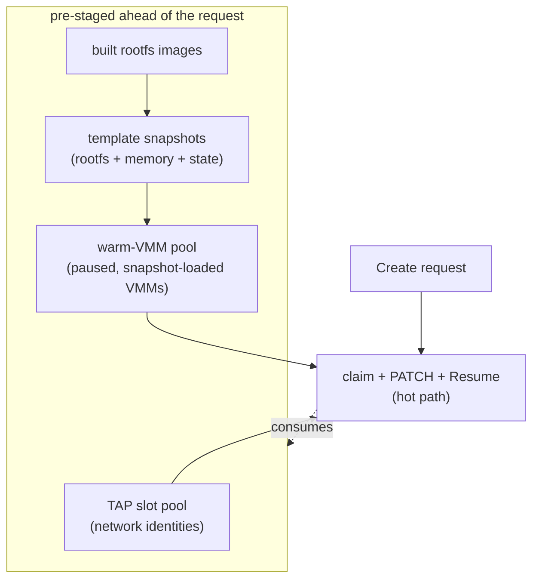
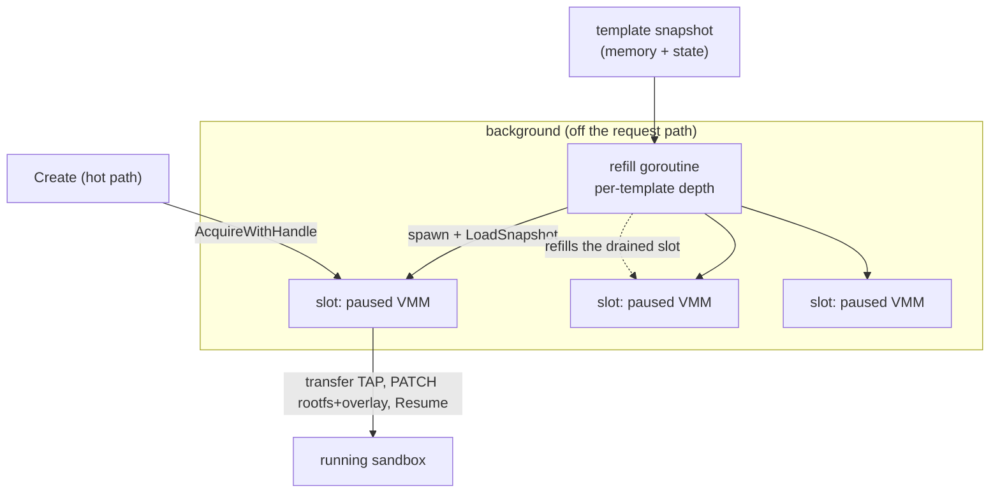
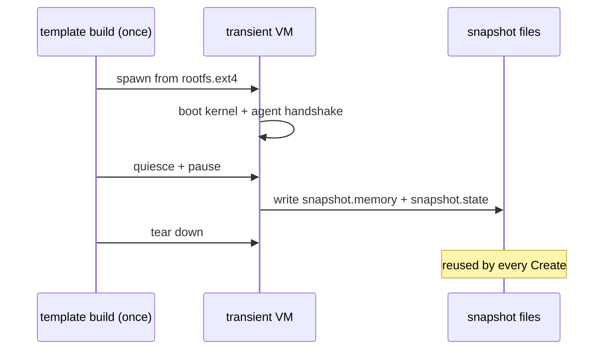
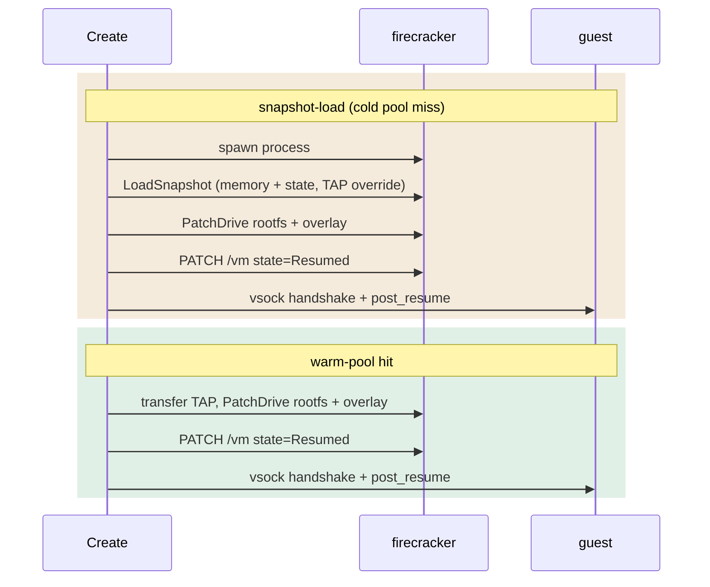
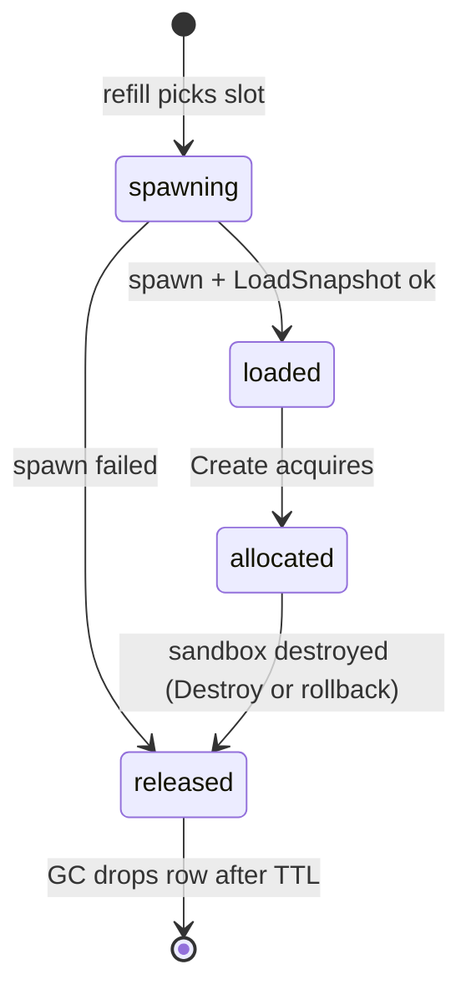
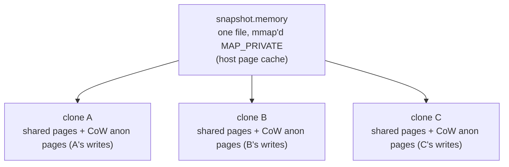

import { Tabs, TabItem } from '@astrojs/starlight/components';

A **microVM** is a small, fast virtual machine with its own kernel. A cold one is slow because *building* one is slow.

You pull an image and build a **rootfs** (the disk image that holds the root file system). Then you boot a kernel, wait for init and wait for the agent. AerolVM does all of that before the request arrives.

When `Create` arrives, the rootfs is built, the kernel is booted and the agent is up. A Firecracker **VMM** (virtual machine monitor: the process that runs one VM) sits paused while its guest is already running programs. `Create` gives it this sandbox's own network and disks, and resumes it.

**In short:**

- AerolVM builds each template's disk image once, boots it once, and saves one snapshot of it: a copy of the running VM's memory.
- An optional warm pool keeps paused VMs with that snapshot already loaded. A create then only attaches devices and resumes.
- Clones share the snapshot's memory pages until they write to them (copy-on-write), so one host can fit many sandboxes.
- The pools track every slot in the server's database, so retries and crashes cannot give one VM to two sandboxes.
- The warm pool is off by default, and several speed-ups (UFFD, huge pages, diff snapshots) are not built yet.

This page walks through how that path is built. Read [Firecracker architecture](/firecracker-architecture/) first for the boot steps these pieces plug into.

## What is ready before the request

This section shows the layers that are prepared ahead of time. A **snapshot** is a saved copy of a running VM's memory and device state, and a **template** is a disk image plus its snapshot.


```mermaid
graph TB
    REQ["Create request"] --> CLAIM["claim + PATCH + Resume<br/>(hot path)"]
    CLAIM -.consumes.-> POOLS
    subgraph POOLS["pre-staged ahead of the request"]
        TAP["TAP slot pool<br/>(network identities)"]
        WARM["warm-VMM pool<br/>(paused, snapshot-loaded VMMs)"]
        SNAP["template snapshots<br/>(rootfs + memory + state)"]
        RFS["built rootfs images"]
    end
    RFS --> SNAP --> WARM
    TAP --> CLAIM
    WARM --> CLAIM
```

A rootfs is built once and snapshotted once. That snapshot is what the warm pool loads into live processes ahead of time.

## Resource pools

This section covers the two per-host pools that turn "create a resource" into "take one off a free list". Both are stored in the server's single-writer SQLite database. So taking a resource is **idempotent** (doing it twice has the same effect as doing it once). It is also safe when duplicate `Create` calls arrive at the same time.

### TAP slot pool

This pool holds network identities. A sandbox's network identity is not made up per request. It is made of a TAP device (a virtual network cable), a host IP, a guest IP and a `/30` subnet. It also has a vsock CID: the VM's address on vsock, the direct host-to-VM channel.

The host lays out a fixed pool of `/30` subnets at startup: `SB_FIRECRACKER_TAP_BASE_CIDR` divided into `SB_FIRECRACKER_TAP_POOL_SIZE` slots. `Create` claims a free slot row. The pool size is the hard limit on how many Firecracker sandboxes the host can run at once.

Reserving the row is kept separate from creating the real TAP device with `ip link add`. This mirrors how the server keeps reserving a host port separate from binding it.

### Warm-VMM pool

This pool holds paused VMs that are ready to go. It removes two costs from a snapshot-load `Create`: starting the process and calling `LoadSnapshot`. It does both before the request arrives.

A comment in `warmacquire.go` puts that cost at "~150ms+". That number comes from the timeouts the driver was written against, not from a published benchmark (see [Limitations](#limitations-and-gaps)).

A background **refill goroutine** (a lightweight Go thread) keeps a set number of paused VMMs per template. For each empty slot it starts a `firecracker` process and calls `LoadSnapshot` on the template's snapshot files (in `internal/runtime/firecracker/warmspawn.go`). That call also attaches the slot's own TAP, through a network override. Then it leaves the VM **paused**.

The process is alive, the memory image is loaded and the devices are set up. It is one resume call away from running.


```mermaid
graph TB
    subgraph bg["background (off the request path)"]
        REFILL["refill goroutine<br/>per-template depth"]
        REFILL -->|spawn + LoadSnapshot| S1["slot: paused VMM"]
        REFILL --> S2["slot: paused VMM"]
        REFILL --> S3["slot: paused VMM"]
    end
    SNAP["template snapshot<br/>(memory + state)"] --> REFILL
    CREATE["Create (hot path)"] -->|AcquireWithHandle| S1
    S1 -->|transfer TAP, PATCH rootfs+overlay, Resume| RUN["running sandbox"]
    REFILL -.refills the drained slot.-> S2
```

When `Create` takes a warm slot, it does **not** start or load anything. Instead, it hands the slot's TAP over to this sandbox (`d.pool.Transfer`).

It points the rootfs and (if requested) overlay disks at this sandbox's own files with `PatchDrive` (in `warmacquire.go`). Then it resumes the VM with `PatchVM` (Firecracker's `PATCH /vm`, state `Resumed`). The emptied slot is refilled in the background for the next request.

The warm pool is **off by default**. See [Settings for server operators](#settings-for-server-operators).

## Snapshot restore

This section explains how the snapshot is made, and why restoring from it is fast. The file the warm pool restores is made once, when a template is built.

The server starts a temporary VM from the freshly built `rootfs.ext4`, boots it, waits for the agent's handshake and pauses it. It then writes two files: `snapshot.memory` (the guest's RAM) and `snapshot.state` (device and CPU state). Then it tears the temporary VM down (`internal/runtime/firecracker/snapshot.go`).

That capture is a one-time cost. Every later sandbox restores from it.


```mermaid
sequenceDiagram
    participant B as template build (once)
    participant T as transient VM
    participant F as snapshot files

    B->>T: spawn from rootfs.ext4
    T->>T: boot kernel + agent handshake
    B->>T: quiesce + pause
    T->>F: write snapshot.memory + snapshot.state
    B->>T: tear down
    Note over F: reused by every Create
```

Restoring from a snapshot is a much shorter path than a cold boot. There is no kernel start, no agent startup and no bring-up of user programs.

It also gives you **on-demand page loading** ([Firecracker snapshot-support.md][fc-snap]). Restoring does not read the whole memory image up front. The file is mapped with `mmap`, and the kernel's page-fault handler loads each guest page when the workload first touches it.

"On demand" here means the kernel's standard mmap and page-fault path, not a handler in a user program. UFFD (`userfaultfd`, which lets a program handle page faults itself) is the opt-in alternative; see [Limitations](#limitations-and-gaps).

This is the difference on the hot path (the steps a request waits for):


```mermaid
sequenceDiagram
    participant C as Create
    participant FC as firecracker
    participant G as guest

    rect rgb(245, 235, 220)
    Note over C,G: snapshot-load (cold pool miss)
    C->>FC: spawn process
    C->>FC: LoadSnapshot (memory + state, TAP override)
    C->>FC: PatchDrive rootfs + overlay
    C->>FC: PATCH /vm state=Resumed
    C->>G: vsock handshake + post_resume
    end

    rect rgb(225, 240, 230)
    Note over C,G: warm-pool hit
    C->>FC: transfer TAP, PatchDrive rootfs + overlay
    C->>FC: PATCH /vm state=Resumed
    C->>G: vsock handshake + post_resume
    end
```

Both paths end the same way. A vsock handshake confirms the agent is alive. Then a best-effort `post_resume` message (if it fails, the create goes on) brings the guest up to date.

Every path builds the payload with `postResumeData` (in `driver.go`). It carries the host's wall clock and, when the TAP slot has an address, a `network` block with the guest IP and gateway. Cold boots get the same message too.

The agent then does four things (`OnPostResume` in `cmd/toolboxd/vsock.go`). It sets `CLOCK_REALTIME`, applies the network settings and forces a kernel reseed with `RNDADDENTROPY` and `RNDRESEEDCRNG`. Last, it changes the clone-generation token in `/run/aerolvm/clone-generation`.

The reseed bytes are 32 bytes from the guest's own `crypto/rand` (`ReseedRandom` in `cmd/toolboxd/quiesce_linux.go`). No randomness comes from the host: AerolVM attaches no virtio-rng device. On snapshot clones, fresh outside randomness comes from vmgenid, covered on [Correct snapshot clones](/engineering-snapshot-correctness/).

See [Limitations](#limitations-and-gaps) for the randomness gap before that reply lands, and for `CLOCK_MONOTONIC`.

## How a warm slot moves through its states

This section shows the states each warm slot passes through. Every slot follows an explicit state machine stored in the database. The states keep the pool safe under retries and crashes: a slot only ever belongs to one sandbox, and a failed `Create` returns its slot instead of leaking it.

The real states, from `internal/store/store.go`, are `spawning`, `loaded`, `allocated` and `released`.


```mermaid
stateDiagram-v2
    [*] --> spawning: refill picks slot
    spawning --> loaded: spawn + LoadSnapshot ok
    spawning --> released: spawn failed
    loaded --> allocated: Create acquires
    allocated --> released: sandbox destroyed (Destroy or rollback)
    released --> [*]: GC drops row after TTL
```

There is no separate state for "resumed" or "in use". Once `Create` takes the slot, the row stays `allocated` until the sandbox is destroyed, or rolled back after a failure.

A cleanup sweep (GC, short for garbage collection) walks `released` rows older than `SB_FIRECRACKER_VMM_POOL_GC_TTL` and drops them. It lives in `internal/store/store.go` and in `runGCOnce` in `internal/pool/vmm/pool.go`.

Two guarantees hold across these steps:

- **Taking a slot is idempotent.** A retried or duplicate `Create` cannot put two sandboxes on one VMM. The partial unique index `idx_firecracker_vmm_pool_sandbox` (in `internal/store/store.go`) allows exactly one `allocated` row per sandbox. Taking a slot is a guarded `SELECT` then `UPDATE`, run by the database's single writer.
- **Cleanup runs last-in, first-out.** Everything `Create` takes (TAP slot, host TAP, overlay file, warm VMM) is released in reverse order on any failure. A slot that fails to resume moves back to `released`, so the cleanup sweep tears down the dead VMM. It never stays `allocated` without an owner.

## What is shared, and what is not

This section lists what sandboxes on one host share. Sharing read-only data is where high density (many sandboxes per host) comes from. The table shows what AerolVM does today on a single host:

| What | Shared across sandboxes? | How |
|---|---|---|
| Guest kernel (`vmlinux`) | Yes, read-only | One image on disk; every jailer chroot (the private file tree each VM runs in) refers to it. |
| Template `rootfs.ext4` (snapshot and warm clones) | Yes, as a read-only backing file | Hard-linked into each sandbox's jailer chroot, with a copy fallback across file systems (`linkOrCopyRootfs` in `driver.go`). Mounted `IsReadOnly=true` (in `snapshot.go`). Guest writes go to the overlay, if the guest mounts it. |
| Cold-boot rootfs (no template) | No | Each sandbox gets its own `mkfs.ext4` image, mounted `IsReadOnly=false` (in `driver.go`). This path has no shared rootfs. |
| Writable overlay | No | Each sandbox gets its own sparse `overlay.ext4`. Real disk blocks are used only when the guest writes. |
| Guest memory, snapshot and warm clones | Unchanged pages: yes, through kernel copy-on-write | Firecracker maps the template's `snapshot.memory` with `MAP_PRIVATE`. Unchanged pages stay shared in the host page cache. See [How clones share memory](#how-clones-share-memory-copy-on-write). |
| Guest memory, cold boot | No | A cold-booted VM has no shared base. It reserves its `memoryMB` fresh. |
| Snapshot files | Yes, as the source | One `snapshot.memory` and one `snapshot.state` per template feed every restore and every warm-pool start. |

AerolVM shares the read-only inputs (kernel, rootfs, snapshot) and the unchanged guest pages of clones from the same template. Each clone keeps its own overlay blocks. It also keeps the anonymous pages made when it writes to a shared guest page. (An **anonymous page** is memory that no file backs.)

A cold-booted sandbox with no template shares nothing.

This sharing model assumes the host serves a single tenant (customer), or tenants that trust each other. See [Limitations](#limitations-and-gaps) for the side-channel risk and our stance on KSM.

## How clones share memory (copy-on-write)

This section explains the biggest reason one host can fit many clones. Clones of the same template share their unchanged guest memory. The mechanism is plain `MAP_PRIVATE`, not a bitmap kept by a user program.

[Firecracker's own docs][fc-snap] describe this. With the File memory backend, Firecracker maps the memory file with `MAP_PRIVATE`. Later guest writes go to a **copy-on-write** (CoW) anonymous memory mapping. We use the File backend on every load path (in `driver.go`, `warmspawn.go` and `sandbox_snapshot.go`).

The first time the guest writes to a page:

1. The MMU (the CPU's memory-mapping unit) traps the write, because the page-table entry is read-only.
2. The kernel's CoW fault handler allocates an anonymous page, copies the file's contents into it, and maps that page privately for this VM.
3. The write finishes in private memory. The shared file is never changed.

From then on, writes to that page go to private memory. Unchanged pages stay shared in the host's **page cache** (the kernel's in-memory copy of file data). The host keeps one physical copy of every page that no clone has changed.


```mermaid
graph TB
    BASE["snapshot.memory<br/>one file, mmap'd MAP_PRIVATE<br/>(host page cache)"]
    BASE --> C1["clone A<br/>shared pages + CoW anon pages (A's writes)"]
    BASE --> C2["clone B<br/>shared pages + CoW anon pages (B's writes)"]
    BASE --> C3["clone C<br/>shared pages + CoW anon pages (C's writes)"]
```

### What `track_dirty_pages` does, and what it costs

This section covers a related flag that is easy to confuse with copy-on-write. We also set `track_dirty_pages=true` and `enable_diff_snapshots=true` on every load (in `driver.go`, `snapshot.go` and `warmspawn.go`). These do not cause the copy-on-write; the kernel already does that.

They tell **KVM** (the Linux kernel's hardware virtualization) to keep a log of dirty, or changed, pages. Firecracker can then write a diff snapshot that holds only the pages a clone changed since restore.

[Firecracker's docs][fc-snap] say dirty-page tracking has a runtime cost. KVM write-protects pages, and the first write to each clean page causes a VM exit (a trip from the guest back to the host). We pay that cost on every clone today, even clones that will never be snapshotted again.

We do it so clones behave the same as template VMs, as a comment in `driver.go` notes. The dirty log is also the base for incremental snapshots. The groundwork is on, but a user-facing diff-snapshot API is not shipping yet (see [Limitations](#limitations-and-gaps)).

### Capacity accounting

This section covers how the host counts memory once pages are shared. A clone's *reserved* `memoryMB` then overstates what it really uses. AerolVM's per-VM RSS sampler reads `/proc/<pid>/statm` (in `internal/runtime/firecracker/rss_sampler.go`). **RSS**, or resident set size, is the physical memory a process really holds.

The capacity admitter (`pkg/capacity/capacity.go`) uses that number. So the check that decides whether a host has room is based on real physical pages, not reserved size.

## Settings for server operators

This section lists the server settings that control Firecracker and the warm pool. The defaults suit a single-node install, where the warm pool is opt-in. Cluster operators raise the depth after sizing snapshot memory against host capacity.

| Setting | Environment variable | What it does |
|---|---|---|
| Turn on the runtime | `SB_ENABLE_FIRECRACKER` | Builds the Firecracker driver alongside Docker. |
| Kernel image | `SB_FIRECRACKER_KERNEL` | Path to the `vmlinux` every microVM boots. |
| TAP pool | `SB_FIRECRACKER_TAP_BASE_CIDR` and `SB_FIRECRACKER_TAP_POOL_SIZE` | The `/30` layout, and the limit on sandboxes running at once. |
| Jailer | `SB_FIRECRACKER_USE_JAILER` | Wraps each VM in a chroot, cgroups (resource limits) and a switch to a non-root user. On by default; dev and CI can turn it off. |
| Overlay drive | `SB_FIRECRACKER_OVERLAY_ENABLED` and `SB_FIRECRACKER_OVERLAY_MKFS` | Allows per-sandbox writable overlays, and can format them ahead of time. |
| Template cleanup | `SB_FIRECRACKER_TEMPLATE_GC_ENABLED` | Sweeps away stale template files. |
| Snapshot check | `SB_FIRECRACKER_SNAPSHOT_VERIFY_ON_LOAD` and `SB_FIRECRACKER_SNAPSHOT_VERIFY_MODE` | Checks snapshot files against their checksum before each load. On by default. Mode `once` (the default) caches the result per server start and file; `always` re-hashes on every create. |
| **Warm pool on or off** | `SB_FIRECRACKER_VMM_POOL_ENABLED` | Off by default. When it is off, every `Create` takes the snapshot-load path. |
| Warm pool default depth | `SB_FIRECRACKER_VMM_POOL_DEPTH_DEFAULT` | How many slots to keep ready per template. Default `0`. A per-template override is planned but not shipping. |
| Warm pool refill interval | `SB_FIRECRACKER_VMM_POOL_REFILL_INTERVAL` | How often the refill goroutine tops slots up. Default 5s. |
| Warm pool cleanup interval | `SB_FIRECRACKER_VMM_POOL_GC_INTERVAL` | How often the cleanup sweep walks released rows. Default 5m. |
| Warm pool cleanup TTL | `SB_FIRECRACKER_VMM_POOL_GC_TTL` | How long a released row waits before the sweep drops it. Default 1h. |

To use the warm pool today, set `SB_FIRECRACKER_VMM_POOL_ENABLED=true` and `SB_FIRECRACKER_VMM_POOL_DEPTH_DEFAULT=N`, where `N` is more than 0. The per-template depth setting is not wired into the public template API yet.

## Build a template

This section shows how to register the template everything above depends on. Registering one builds the `rootfs.ext4` and captures the snapshot. If the warm pool is on and has a depth, the pool then starts preparing paused VMs for it.

The build runs in the background. The call returns at once, and the template moves through `pending`, `building_rootfs`, `snapshotting` and then `ready`.

Creating a sandbox from a template needs the template id on the create call: `templateId` in TypeScript and Python, `TemplateID` in Go, `template_id` in Rust and `setTemplateId` in Java.

<Tabs syncKey="lang">
  <TabItem label="TypeScript">
    ```ts
    import { MicroVM } from "@aerol-ai/aerolvm-sdk";

    const client = new MicroVM(); // reads SB_API_URL and SB_PAT_TOKEN

    const tpl = await client.createTemplate({
      id: "py311",
      image: "docker://python:3.11",
      minSizeMiB: 1024,
    });
    console.log(tpl.id, tpl.status); // py311 pending

    // After the template is ready, every create against it takes the
    // snapshot path, and the warm path if the pool has depth.
    const sandbox = await client.create({
      image: "python:3.11",
      runtime: "firecracker",
      templateId: "py311",
    });
    console.log(sandbox.id);
    ```
  </TabItem>
  <TabItem label="Python">
    ```python
    from microvm import MicroVM

    client = MicroVM()  # reads SB_API_URL and SB_PAT_TOKEN

    tpl = client.create_template({
        "id": "py311",
        "image": "docker://python:3.11",
        "minSizeMiB": 1024,
    })
    print(tpl["id"], tpl["status"])  # py311 pending

    # After the template is ready, every create against it takes the
    # snapshot path, and the warm path if the pool has depth.
    sandbox = client.create(image="python:3.11", runtime="firecracker", templateId="py311")
    print(sandbox.id)
    ```
  </TabItem>
  <TabItem label="Go">
    ```go
    tpl, err := client.CreateTemplate(ctx, sdktypes.CreateTemplateOptions{
        ID:         "py311",
        Image:      "docker://python:3.11",
        MinSizeMiB: 1024,
    })
    if err != nil {
        log.Fatal(err)
    }
    fmt.Println(tpl.ID, tpl.Status) // py311 pending

    // After the template is ready, every create against it takes the
    // snapshot path, and the warm path if the pool has depth.
    sandbox, err := client.Create(ctx, sdktypes.CreateSandboxOptions{
        Image:      "python:3.11",
        Runtime:    sdktypes.RuntimeFirecracker,
        TemplateID: "py311",
    })
    if err != nil {
        log.Fatal(err)
    }
    fmt.Println(sandbox.ID)
    ```
  </TabItem>
  <TabItem label="Rust">
    ```rust
    use aerolvm_sdk::{Client, CreateOptions, CreateTemplateOptions};

    let client = Client::new(None, None)?; // reads SB_API_URL and SB_PAT_TOKEN

    let tpl = client.create_template(CreateTemplateOptions {
        id: Some("py311".into()),
        image: "docker://python:3.11".into(),
        min_size_mib: Some(1024),
    })?;
    println!("{} {:?}", tpl.id, tpl.status); // py311 Pending

    // After the template is ready, every create against it takes the
    // snapshot path, and the warm path if the pool has depth.
    let sandbox = client.create(CreateOptions {
        image: "python:3.11".into(),
        runtime: Some("firecracker".into()),
        template_id: Some("py311".into()),
        ..Default::default()
    })?;
    println!("{}", sandbox.data.id);
    ```
  </TabItem>
  <TabItem label="Java">
    ```java
    MicroVMClient client = new MicroVMClient(); // reads SB_API_URL and SB_PAT_TOKEN

    Template tpl = client.createTemplate(new CreateTemplateOptions()
        .setId("py311")
        .setImage("docker://python:3.11")
        .setMinSizeMib(1024));
    System.out.println(tpl.id + " " + tpl.status); // py311 PENDING

    // After the template is ready, every create against it takes the
    // snapshot path, and the warm path if the pool has depth.
    Sandbox sandbox = client.create(new CreateOptions()
        .setImage("python:3.11")
        .setRuntime("firecracker")
        .setTemplateId("py311"));
    System.out.println(sandbox.id);
    ```
  </TabItem>
</Tabs>

Once the template is `ready`, sandboxes created from it restore from the snapshot. If the warm pool has depth, they take an already-loaded VMM. See [Firecracker templates](/firecracker-templates/) for the full template lifecycle: waiting for `ready`, rebuilds and copies across a cluster.

## Limitations and gaps

This section lists what this page does not claim. Keep these in mind before you depend on the warm path.

- **No published benchmarks.** Numbers like "sub-100ms" or "~150ms" in the driver source (`warmacquire.go`, `vmm.go`, `warmspawn.go`) come from internal timeouts on a healthy host. They are not measured P50, P95 or P99 times (the median, 95th and 99th percentile) on a named instance type with a stated workload. Treat them as upper-bound goals, not measurements.
- **Cold-cache versus warm-cache restore.** The fast restore path assumes `snapshot.memory` is already in the host's page cache. The first restore after a host reboot loads every touched page from disk. On a multi-GB snapshot that can take seconds, not milliseconds.
- **Warm pool off by default.** See [Settings for server operators](#settings-for-server-operators).
- **Per-template warm-pool depth.** Only the global default (`SB_FIRECRACKER_VMM_POOL_DEPTH_DEFAULT`) works today. The per-template override mentioned in `config.go` is planned for later.
- **There is a randomness gap before `post_resume` lands.** The reseed itself ships: `cmd/toolboxd/vsock.go` calls `ReseedRandom` on every `post_resume`. But the time between the resume call and the agent's reply is hundreds of milliseconds on a slow host. Anything that runs in that window draws from the template's captured **entropy pool** (the kernel's store of unpredictable bits). That includes init scripts, systemd units and the agent's own startup.
- **Some in-guest random generators will repeat values.** A **CSPRNG** (cryptographically secure random-number generator) inside the guest may fix its state when its process starts. If that happens before the reply, it **will** repeat values across clones of the same template. Examples are TLS handshake nonces (TLS is the encryption behind HTTPS), session keys, and IDs made without re-reading `/dev/urandom`. Templates AerolVM ships put off key generation until `post_resume` has finished.
- **`CLOCK_MONOTONIC` is not reset.** `post_resume` only adjusts `CLOCK_REALTIME`. Workloads that hold monotonic deadlines across the snapshot will see a long forward jump in elapsed time. This is known Firecracker behavior, not a bug in AerolVM.
- **`post_resume` is best-effort.** If the vsock send fails, the driver logs it and goes on (in `warmacquire.go` and `sandbox_snapshot.go`). The guest then keeps the snapshot's stale wall clock until something else corrects it.
- **Huge pages are not turned on.** Huge pages are memory pages much larger than the usual 4 KiB, which means fewer entries in the TLB (the CPU's cache of address translations). The `HugePages` field on `MachineConfig` (`pkg/firecracker/types.go`) is never set anywhere in `internal/runtime/firecracker/`. [Firecracker's docs][fc-huge] say huge-page snapshots restore only through UFFD, and we use File. Dirty-page tracking also cancels the TLB gain, because KVM falls back to 4K page tables. All three would need to change together.

  The older comment above `MachineConfig` in `types.go` is out of date; ignore it.
- **The UFFD memory backend is not turned on.** With the File backend, the kernel handles page faults. UFFD would let a user program control faulting (prefetch, pre-warm, remote paging), but it is not wired up today.
- **The diff-snapshot API is not public.** The groundwork (`track_dirty_pages=true`, `enable_diff_snapshots=true`) is on. But there is no public endpoint to *take* a diff snapshot of a running sandbox today.
- **Secrets must not live in the template snapshot.** `post_resume` carries no secrets. Per-sandbox secrets must arrive by a separate path: the cluster's sealed-secret system in `pkg/secrets/` and `internal/cluster/recovery_replication.go`. Never bake them into `snapshot.memory`, which every clone shares.
- **Snapshot integrity is not authenticity.** The checksum check on load catches a corrupt memory file before it is mapped. It lives in `warmspawn.go` and `driver.go`, and is switched by `SB_FIRECRACKER_SNAPSHOT_VERIFY_ON_LOAD` (on by default). It does not stop a tenant who can write to the snapshot folder and produce a matching checksum.
- **Shared copy-on-write pages are a tenant-isolation concern.** Two tenants whose VMs come from the same template share physical RAM for every page neither has written. Rowhammer, flush+reload and prime+probe attacks work across `MAP_PRIVATE` pages until one side writes them.

  These attacks read or flip another program's memory through shared hardware. AerolVM does **not** turn on KSM (kernel same-page merging, which merges identical pages across processes). It assumes one tenant per host, or tenants that trust each other. Multi-tenant operators should give each tenant its own templates, or turn off warm-pool sharing across tenants.
- **The guest MAC is fixed when the template is built.** Every clone resumes with the same guest MAC and guest IP as the template's temporary build VM. `post_resume` then gives the guest this sandbox's own IP and gateway from its TAP slot. The MAC stays the template's, so the host points the TAP's neighbor entry at the template MAC (`hostSlot.GuestMAC` in `driver.go`).

  This is safe because each TAP slot has its own `/30`: a point-to-point link between the host TAP and the guest. So ARP (the table that maps IP addresses to network cards) cannot collide across slots. What changes per sandbox at the Firecracker level is the host-side `HostDevName`, not the MAC. It is set by the network override in `LoadSnapshot`, in `driver.go` and in `warmspawn.go` for warm VMs.
- **The vsock CID is also fixed.** `warmacquire.go` dials `slot.VsockCID`, which here is the snapshot's CID, captured at template build. It is not the sandbox's TAP slot CID. Clones are told apart on the host side, by the path of the `AF_VSOCK` socket file, not by the guest CID.
- **Restores need the same CPU template.** Firecracker is strict about CPU and MSR (model-specific register) compatibility when you restore on a different host from the one that took the snapshot. The cluster's snapshot transfer path (`internal/cluster/recovery_replication.go`) does not hide CPU differences. Restoring to a host with a different CPU template (Firecracker's CPU feature profile) is not supported.

## Next steps

- [Firecracker architecture](/firecracker-architecture/): the boot path these pools plug into.
- [Firecracker templates](/firecracker-templates/): register, wait for and rebuild templates.
- [Correct snapshot clones](/engineering-snapshot-correctness/): the five hazards of cloning a running VM, and how AerolVM handles each.
- [The frozen-kernel problem](/engineering-frozen-kernel-problem/): how clones get unique randomness and the right clock.

[fc-snap]: https://github.com/firecracker-microvm/firecracker/blob/main/docs/snapshotting/snapshot-support.md
[fc-huge]: https://github.com/firecracker-microvm/firecracker/blob/main/docs/hugepages.md
