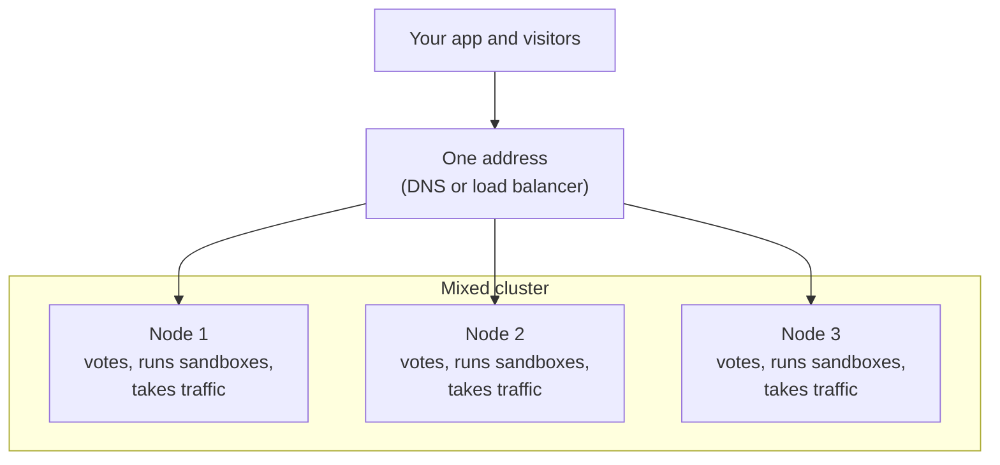
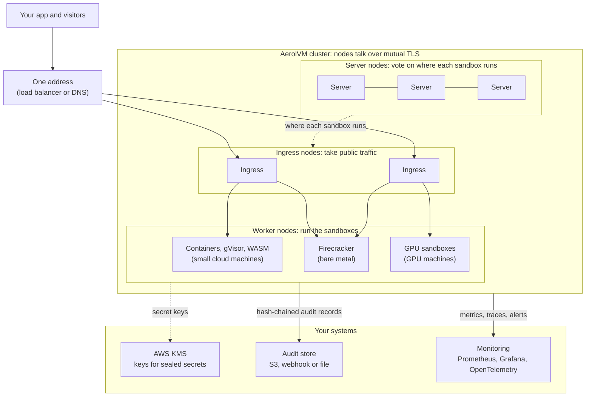

import { Tabs, TabItem } from '@astrojs/starlight/components';
import BookCall from '../../../components/BookCall.astro';

export const bookingUrl = 'https://calendly.com/REPLACE-WITH-YOUR-LINK';

A cluster is a group of AerolVM servers that work as one. Your app still talks to one address. Behind it, sandboxes spread across many machines, and the cluster keeps running when one of them dies.

One server is enough for development and light production use. You need a cluster when one server cannot hold all your sandboxes, or when a dead server must not take your product down with it.

<BookCall href={bookingUrl} title="Need a cluster?">
  We set it up with you. Book a call to plan yours.
</BookCall>

## What a cluster adds

### Scalability

- **20,000 sandboxes at once.** We have run 20,000 sandboxes at the same time on one AerolVM cluster.
- **More room as you add servers.** Each new sandbox goes to a worker with free room. It only lands on a worker that can run its runtime and has the GPUs it asks for.
- **One address for everything.** Your app sends every request to one URL. Any node can take a call and pass it to the node that runs the sandbox. Public links, [TCP ports](/tcp-ports/) and [custom domains](/custom-domains/) work the same way.
- **Room to grow.** The split layout is built for about 1,000 worker nodes. Adding workers does not add voters, so agreeing on changes does not get slower as the cluster grows.
- **Snapshots and templates on every node.** A [snapshot](/snapshots/) or [Firecracker template](/firecracker-templates/) made on one node can be shared, so it starts on any other.
- **Fast creates.** Median create times on our AWS test servers, with warm pools on: V8 isolate 4 ms, WebAssembly 22 ms, Firecracker 34 ms, standard container 189 ms.

### Durability

- **A dead server is not an outage.** Server nodes agree on every change by majority vote. With three voting servers, the cluster keeps working after losing one. With five, it survives losing two.
- **Sandboxes that come back.** Ask for failover when you create a sandbox. If its server dies, a healthy one rebuilds it with the same ID, the same ports and the same public link. See [Durability and failover](/durability/).
- **Secrets that follow the sandbox.** Registry and storage passwords are copied to backup nodes, so a rebuilt sandbox can still pull its image and mount its storage. A create waits until at least one backup holds a copy.
- **Public traffic survives a lost ingress node.** The load balancer stops sending traffic to it, and public links keep working through the others.

### Security

- **Nodes prove who they are.** Nodes talk to each other over mutual TLS: both sides show a certificate signed by the cluster's own authority. Each certificate names its node, and only live members are accepted.
- **Encrypted discovery traffic.** Nodes find each other with a shared encryption key. A machine without the key cannot join.
- **Sealed secrets.** Registry and storage passwords are encrypted so only chosen nodes can open them. [AWS KMS](/cluster-secrets/) can hold the keys, with AWS permissions and logs. Sandbox environment variables are always encrypted on disk.
- **Internal calls stay internal.** Node-to-node requests use their own listener and are refused on the public one.
- **Stricter production rules.** Enterprise mode turns on extra checks, such as two backups for every secret and no insecure shortcuts.

### Auditability

- **Every secret open is recorded.** Each time a sandbox's environment variables, registry password or storage credentials are opened, the node writes a record. It says which sandbox, which tenant, which node, and whether it worked.
- **Refused traffic is recorded.** Each outbound connection the network filter refuses is logged with its destination and the reason. The destinations of allowed traffic can be recorded too.
- **Records cannot be quietly changed.** Each record carries a fingerprint (hash) of the one before it, so editing or deleting a record breaks the chain. The server can check the whole chain on demand, and an alert fires when it breaks.
- **History from any node.** `sandbox.audit()` in every SDK reads a sandbox's history, whichever node it ran on.
- **Shipped to your own systems.** Each node can send its audit log to a file, a webhook or an S3 bucket. If your system is down, nothing is dropped: the node keeps the records, retries, and fires an alert when it falls behind.
- **Gaps are visible.** If a burst overflows the buffer, the log writes a marker with the number of missed events instead of losing them silently.

### Observability

- **One dashboard for the whole cluster.** The [dashboard](/dashboard/) shows every node and every sandbox, from whichever node you open. You can drain a node from it.
- **Metrics and traces.** Every server offers Prometheus metrics and can send OpenTelemetry metrics and traces. Traces join your app's own traces.
- **Ready-made dashboards and alerts.** Grafana dashboards cover create speed, worker pressure, route lag and voting health. Prometheus alerts link straight to step-by-step [runbooks](/operational-runbooks/).
- **Health that explains itself.** A node's health check reports `degraded` with the reason, such as a broken layout or a stopped engine.

## Two ways to build a cluster

| | Mixed mode | Hetero mode |
|---|---|---|
| Size | 2 to 10 servers | Any size. Required above 10. |
| What each node does | Everything: votes, runs sandboxes, takes traffic | One job: vote, run sandboxes, or take traffic |
| Hardware | All nodes alike | Different machines for different jobs |
| Best for | More room, and surviving a dead server | Large fleets, bare metal and GPUs |

### Mixed mode: every node does every job

Each node votes on cluster changes, runs sandboxes and takes public traffic. You grow by adding more servers of the same kind. It is the simplest cluster to reason about.



- **Good for 2 to 10 servers.** Use three or more to survive a dead server. With two, both must stay up, because a majority of two is two.
- **Every node holds everything.** Each one keeps a full copy of where every sandbox runs and of every public route.
- **It stops at 10.** Past 10 live nodes, every new node adds another voter and another full copy of the route table. So the cluster refuses new sandboxes until you split it into hetero mode.

We test mixed mode on three small AWS machines with 2 CPUs and 4 GB of memory each.

### Hetero mode: each node has one job

The cluster splits into three kinds of node. Each kind can use the hardware that suits its job.



- **Server nodes (3, 5 or at most 7)** vote on every change and keep the record of which worker runs which sandbox. They do little work, so small machines are enough.
- **Worker nodes** run the sandboxes. Add as many as you need. They can differ: small cloud machines for containers, gVisor and WASM, bare-metal servers for Firecracker, and GPU machines. Each worker reports which runtimes it can run, so a sandbox only lands on a worker that fits it.
- **Ingress nodes (2 to 10)** take public traffic and send it to the right worker. Only they hold the public route table. Past 10, they need a router in front that knows which ingress node holds which sandbox.

The cluster also connects to systems you already run:

- **AWS KMS** holds the keys for sealed secrets, so AWS permissions decide which workers can open them. It is optional. Without it, the nodes keep the keys themselves.
- **Your audit store** receives every node's hash-chained audit records, in an S3 bucket, through a webhook, or in a file.
- **Your monitoring** gets Prometheus metrics and OpenTelemetry traces from every node. Grafana dashboards and alerts come ready-made.

The number of voters stays at 3 or 5, however many workers join. We test hetero mode on eight nodes: three servers, one ingress node and four workers. One of the workers is a bare-metal machine for Firecracker.

## Your code does not change

The SDKs work the same against one server or a cluster, in either mode. Point `SB_API_URL` at the cluster's address. The one cluster-only option is failover:

<Tabs syncKey="lang">
  <TabItem label="TypeScript">
    ```ts
    const sandbox = await client.create({
      image: "ubuntu:22.04",
      failover: { policy: "recreate" },
    });
    ```
  </TabItem>
  <TabItem label="Python">
    ```python
    sandbox = client.create(image="ubuntu:22.04", failover={"policy": "recreate"})
    ```
  </TabItem>
  <TabItem label="Go">
    ```go
    sandbox, err := client.Create(ctx, sdktypes.CreateSandboxOptions{
        Image:    "ubuntu:22.04",
        Failover: &sdktypes.Failover{Policy: sdktypes.FailoverPolicyRecreate},
    })
    ```
  </TabItem>
  <TabItem label="Rust">
    ```rust
    use aerolvm_sdk::Failover;

    let sandbox = client.create(CreateOptions {
        image: "ubuntu:22.04".into(),
        failover: Some(Failover { policy: "recreate".into() }),
        ..Default::default()
    })?;
    ```
  </TabItem>
  <TabItem label="Java">
    ```java
    Sandbox sandbox = client.create(new CreateOptions()
        .setImage("ubuntu:22.04")
        .setFailover(new Failover().setPolicy("recreate")));
    ```
  </TabItem>
</Tabs>

Without failover, a sandbox on a dead server is gone. Calls for it return `410 Gone`, and your app creates a new one.

## What running a cluster takes

A cluster is many moving parts that must agree with each other. This is the work behind it:

- **Voting and quorum.** Server nodes agree on every change by majority vote. If too many go down at once, every change stops until they return. Restarts and upgrades must go one node at a time, in the right order. Getting a cluster back after it loses its majority is a manual recovery.
- **Your own certificate authority.** Every node needs a certificate signed by the cluster's private authority, plus a shared encryption key for discovery traffic. You keep the signing key offline and rotate everything after a leak.
- **Secrets that survive failover.** Encrypted passwords must reach backup nodes before a sandbox is safe to move. You choose where the keys live and give each worker only the access it needs.
- **Private networking.** The voting, discovery and node-to-node ports must sit on a private network that the internet cannot reach.
- **Traffic in front.** A load balancer or DNS sits in front of the ingress nodes. Their HTTPS certificates are shared through a storage bucket. Past 10 ingress nodes, a plain load balancer silently drops most traffic. You need a router that knows where each sandbox lives.
- **The right hardware.** Firecracker needs bare-metal servers. GPU workers need drivers. Each tier needs sizing for its job.
- **Moving from mixed to hetero.** Past 10 nodes, every node must change to a single job before the cluster takes new sandboxes again.
- **Day-to-day work.** Adding and removing nodes, backups and restores, alerts, and runbooks for when something breaks at night.

Each of these is a place where a small mistake costs you sandboxes or an outage.

## Get a cluster

We set up clusters together with each team. On the call, we go through your expected sandbox count, the runtimes and GPUs you need, where you want to run, and which mode fits.

<BookCall href={bookingUrl} title="Set up your cluster with us">
  Bring your expected sandbox count and the runtimes you need.
</BookCall>

Not ready for a cluster yet? [Install on one server](/getting-started/single-node-setup/) and move later. Your code stays the same.
