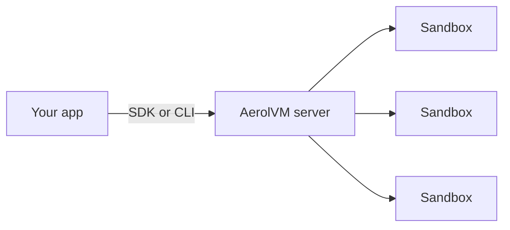

import { CardGrid, LinkCard, Tabs, TabItem } from '@astrojs/starlight/components';

AerolVM is a self-hosted sandbox server for code you do not trust: AI agents, user code, plugins, package installs, CI jobs, dev environments, scrapers and automation.

A sandbox is a short-lived Linux machine with its own files, its own network and its own CPU and memory limits. Code inside it cannot read or change your app, your server's files or another sandbox's files.

Your app asks the AerolVM server for a sandbox through an SDK in TypeScript, Python, Go, Rust or Java, or through the `aerolvm` command-line tool. It runs commands, moves files in and out, and deletes the sandbox when it is done. Sandboxes start from the Docker images you already use.

You run the server yourself: on your laptop, on one Linux server, or on a cluster of servers.

## Why AerolVM

- **Choose how strong the wall is.** Five execution environments, from a plain container to a small virtual machine. See [Where your code runs](#where-your-code-runs).
- **Private until you open it.** A new sandbox has no public web address. Open a port when you want a preview link.
- **You decide what it can reach.** Block the internet, or allow only the sites you list, such as `pypi.org`.
- **Fast enough to create from code.** Once the image is on the server, most sandboxes start in under a second. The lightest start in tens of milliseconds.
- **One server or many.** Start on your laptop, then move to one Linux server or a cluster. If a server fails, its sandboxes can be recreated on a healthy one.
- **Works with Daytona and E2B code.** Apps written for the Daytona or E2B SDKs can point at AerolVM with small changes.
- **Open source.** MIT licensed. Your code and data stay on your own machines.

## Where your code runs

Each sandbox runs in one of five execution environments. You pick it with the `runtime` option when you create the sandbox. If you leave it out, you get a container.

| Environment | `runtime` | What it is | Good for | Server needs |
|---|---|---|---|---|
| [Container](/sandboxes/) | `docker` (default) | A normal Linux container, run by Docker or containerd. It shares the server's kernel. | Most work: scripts, builds, agents, dev environments | Nothing extra. Works on macOS and Linux. |
| [gVisor](/gvisor-sandbox/) | `gvisor` | A container with an extra kernel layer that checks every request the code makes to the real kernel. | Untrusted code that still needs a full Linux system | Linux, installed with `--with-gvisor` |
| [Firecracker](/firecracker-sandbox/) | `firecracker` | A microVM: a small virtual machine that boots its own Linux kernel. | The riskiest code. This is the strongest wall. | Linux with KVM (`/dev/kvm`) and `SB_ENABLE_FIRECRACKER=true` |
| [WebAssembly](/wasm-sandbox/) | `wasm` | One compiled WebAssembly program, with no Linux system inside. | Small jobs that must start fast | `SB_ENABLE_WASM=true` |
| [V8 isolate](/isolate-sandbox/) | `isolate` | A JavaScript or TypeScript web handler running in V8, the engine inside Chrome. | Tiny web handlers that must start in milliseconds | Installed with `--with-isolate` |

## What people build with it

- **AI agents.** Give a coding agent its own machine to install packages, run tests and edit files.
- **Running user code.** Run the scripts, notebooks and plugins your users submit, away from your servers.
- **Package installs.** Run `pip install` or `npm install` on code you have not read. A bad package only harms a sandbox you throw away.
- **CI and builds.** Give every test job a fresh sandbox and throw it away afterward.
- **Dev environments.** Hand out short-lived Linux machines with SSH, a terminal and a preview link.
- **Scrapers and automation.** Run scripts and browsers on the open web, and limit which sites they can reach.
- **Data jobs.** Attach cloud storage, process files and keep the results.

## A minimal example

This creates a sandbox, runs one line of Python inside it, prints the answer and deletes the sandbox.

<Tabs syncKey="lang">
  <TabItem label="TypeScript">
    ```ts
    import { MicroVM } from "@aerol-ai/aerolvm-sdk";

    const client = new MicroVM(); // reads SB_API_URL and SB_PAT_TOKEN

    const sandbox = await client.create({ image: "python:3.12-slim" });
    const result = await sandbox.exec(`python3 -c "print('Hello from AerolVM!')"`);
    console.log(result.stdout); // Hello from AerolVM!

    await sandbox.destroy();
    ```
  </TabItem>
  <TabItem label="Python">
    ```python
    from microvm import MicroVM

    client = MicroVM()  # reads SB_API_URL and SB_PAT_TOKEN

    sandbox = client.create(image="python:3.12-slim")
    result = sandbox.exec("python3 -c \"print('Hello from AerolVM!')\"")
    print(result["stdout"])  # Hello from AerolVM!

    sandbox.destroy()
    ```
  </TabItem>
  <TabItem label="Go">
    ```go
    client, err := microvm.NewClient() // reads SB_API_URL and SB_PAT_TOKEN
    if err != nil {
        log.Fatal(err)
    }

    sandbox, err := client.Create(ctx, sdktypes.CreateSandboxOptions{Image: "python:3.12-slim"})
    if err != nil {
        log.Fatal(err)
    }
    defer sandbox.Destroy(ctx)

    result, err := sandbox.ExecCommand(ctx, `python3 -c "print('Hello from AerolVM!')"`)
    if err != nil {
        log.Fatal(err)
    }
    fmt.Print(result.Stdout) // Hello from AerolVM!
    ```
  </TabItem>
  <TabItem label="Rust">
    ```rust
    use aerolvm_sdk::{Client, CreateOptions};

    let client = Client::new(None, None)?; // reads SB_API_URL and SB_PAT_TOKEN

    let sandbox = client.create(CreateOptions {
        image: "python:3.12-slim".into(),
        ..Default::default()
    })?;
    let result = sandbox.exec(r#"python3 -c "print('Hello from AerolVM!')""#)?;
    print!("{}", result.stdout); // Hello from AerolVM!

    sandbox.destroy()?;
    ```
  </TabItem>
  <TabItem label="Java">
    ```java
    MicroVMClient client = new MicroVMClient(); // reads SB_API_URL and SB_PAT_TOKEN

    Sandbox sandbox = client.create(new CreateOptions().setImage("python:3.12-slim"));
    ExecResult result = sandbox.exec("python3 -c \"print('Hello from AerolVM!')\"");
    System.out.print(result.stdout); // Hello from AerolVM!

    sandbox.destroy();
    ```
  </TabItem>
</Tabs>

The client class is called `MicroVM` (`MicroVMClient` in Java) after the project's GitHub repository, `aerol-ai/microvm`. It is the AerolVM SDK.

## How it fits together



Your app never runs the risky code itself. It sends requests to the AerolVM server. The server starts the sandbox, runs your commands inside it and sends back the output.

## Next steps

<CardGrid>
  <LinkCard title="Quickstart" description="Install AerolVM and run your first sandbox in about five minutes." href="/quick-start/" />
  <LinkCard title="Choose a setup" description="Your computer, one server, or a cluster: which one fits you." href="/getting-started/" />
  <LinkCard title="Create and manage sandboxes" description="Start, stop, resize and delete sandboxes." href="/sandboxes/" />
  <LinkCard title="Run commands" description="Run programs, stream their output and read exit codes." href="/exec-streaming/" />
</CardGrid>
