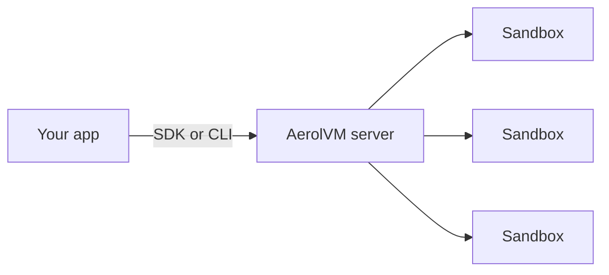

import { CardGrid, LinkCard, Tabs, TabItem } from '@astrojs/starlight/components';

AerolVM gives your program a separate, locked-down computer to run code in. We call each one a **sandbox**. A sandbox has its own files, its own network and its own share of CPU and memory. Code inside it cannot touch your real machine or other sandboxes.

You run the AerolVM server yourself: on your laptop, on one Linux server, or on a group of servers. Your app talks to it through an SDK in TypeScript, Python, Go, Rust or Java. You can also use the `aerolvm` command-line tool.

AerolVM is open source under the MIT license.

## Why AerolVM

- **Safe by default.** Each sandbox is walled off from your machine and from the others. A new sandbox has no public web address until you ask for one.
- **Fast.** Once the image is on the server, most sandboxes start in well under a second. The lightest kinds start in tens of milliseconds.
- **Choose how strong the wall is.** Pick a plain container, a gVisor container with its own kernel layer, a Firecracker virtual machine, a WebAssembly module, or a V8 JavaScript isolate.
- **You own it.** Run it on your own hardware. Add more servers when you need them. If a server fails, you can have its sandboxes recreated on a healthy one.
- **Bring your existing code.** Apps written for the Daytona or E2B SDKs can point at AerolVM with small changes.
- **Control the network.** Block the internet, or allow only the websites you list, such as `pypi.org`.

## What people build with it

- **AI agents.** Give a coding agent its own machine to install packages, run tests and edit files.
- **Running user code.** Run scripts, notebooks or plugins that your users submit, away from your servers.
- **CI and builds.** Run each test job in a fresh sandbox and throw it away afterward.
- **Dev environments.** Hand out short-lived Linux machines with SSH, a terminal and a preview link.
- **Data jobs.** Attach cloud storage, process files and save the results.

## A minimal example

This creates a sandbox, runs one line of Python inside it, prints the answer and deletes the sandbox.

<Tabs syncKey="lang">
  <TabItem label="TypeScript">
    ```ts
    import { MicroVM } from "@aerol-ai/aerolvm-sdk";

    const client = new MicroVM(); // reads SB_API_URL and SB_PAT_TOKEN

    const sandbox = await client.create({ image: "python:3.12-slim" });
    const result = await sandbox.exec(`python3 -c "print('Hello from AerolVM!')"`);
    console.log(result.stdout); // Hello from AerolVM!

    await sandbox.destroy();
    ```
  </TabItem>
  <TabItem label="Python">
    ```python
    from microvm import MicroVM

    client = MicroVM()  # reads SB_API_URL and SB_PAT_TOKEN

    sandbox = client.create(image="python:3.12-slim")
    result = sandbox.exec("python3 -c \"print('Hello from AerolVM!')\"")
    print(result["stdout"])  # Hello from AerolVM!

    sandbox.destroy()
    ```
  </TabItem>
  <TabItem label="Go">
    ```go
    client, err := microvm.NewClient() // reads SB_API_URL and SB_PAT_TOKEN
    if err != nil {
        log.Fatal(err)
    }

    sandbox, err := client.Create(ctx, sdktypes.CreateSandboxOptions{Image: "python:3.12-slim"})
    if err != nil {
        log.Fatal(err)
    }
    defer sandbox.Destroy(ctx)

    result, err := sandbox.ExecCommand(ctx, `python3 -c "print('Hello from AerolVM!')"`)
    if err != nil {
        log.Fatal(err)
    }
    fmt.Print(result.Stdout) // Hello from AerolVM!
    ```
  </TabItem>
  <TabItem label="Rust">
    ```rust
    use aerolvm_sdk::{Client, CreateOptions};

    let client = Client::new(None, None)?; // reads SB_API_URL and SB_PAT_TOKEN

    let sandbox = client.create(CreateOptions {
        image: "python:3.12-slim".into(),
        ..Default::default()
    })?;
    let result = sandbox.exec(r#"python3 -c "print('Hello from AerolVM!')""#)?;
    print!("{}", result.stdout); // Hello from AerolVM!

    sandbox.destroy()?;
    ```
  </TabItem>
  <TabItem label="Java">
    ```java
    MicroVMClient client = new MicroVMClient(); // reads SB_API_URL and SB_PAT_TOKEN

    Sandbox sandbox = client.create(new CreateOptions().setImage("python:3.12-slim"));
    ExecResult result = sandbox.exec("python3 -c \"print('Hello from AerolVM!')\"");
    System.out.print(result.stdout); // Hello from AerolVM!

    sandbox.destroy();
    ```
  </TabItem>
</Tabs>

The SDK classes are named `MicroVM` and `MicroVMClient`, after the project's GitHub repository, `aerol-ai/microvm`. They are the AerolVM SDK.

## How it fits together



Your app never runs untrusted code itself. It asks the AerolVM server to create a sandbox, then sends commands and files to it. The server starts the sandbox, passes your commands in, and sends the results back.

## Next steps

<CardGrid>
  <LinkCard title="Quickstart" description="Install AerolVM and run your first sandbox in about five minutes." href="/quick-start/" />
  <LinkCard title="Choose a setup" description="Your computer, one server, or a cluster: which one fits you." href="/getting-started/" />
  <LinkCard title="Create and manage sandboxes" description="Start, stop, resize and delete sandboxes." href="/sandboxes/" />
  <LinkCard title="Run commands" description="Run programs, stream their output and read exit codes." href="/exec-streaming/" />
</CardGrid>
