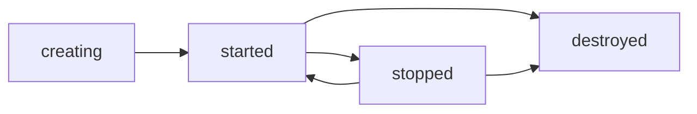

import { Aside, Tabs, TabItem } from '@astrojs/starlight/components';

A sandbox is a separate, locked-down place to run code. Most sandboxes have their own files, their own network and their own share of CPU, memory and disk. You create one with a single SDK call, use it, and delete it when you are done.

This page covers the everyday tasks: create, name, find, stop, start, resize and delete. The [Images, resources and lifecycle](/environment/) page lists every option in more detail.

## Create a sandbox

The only thing a sandbox needs is an image. An image is a packaged Linux system, such as `ubuntu:22.04` or `python:3.12-slim` from Docker Hub.

<Tabs syncKey="lang">
  <TabItem label="TypeScript">
    ```ts
    import { MicroVM } from "@aerol-ai/aerolvm-sdk";

    const client = new MicroVM(); // reads SB_API_URL and SB_PAT_TOKEN

    const sandbox = await client.create({ image: "ubuntu:22.04" });
    console.log(sandbox.id); // sb-1a2b3c4d5e6f7a8b
    ```
  </TabItem>
  <TabItem label="Python">
    ```python
    from microvm import MicroVM

    client = MicroVM()  # reads SB_API_URL and SB_PAT_TOKEN

    sandbox = client.create(image="ubuntu:22.04")
    print(sandbox.id)  # sb-1a2b3c4d5e6f7a8b
    ```
  </TabItem>
  <TabItem label="Go">
    ```go
    client, err := microvm.NewClient() // reads SB_API_URL and SB_PAT_TOKEN
    if err != nil {
        log.Fatal(err)
    }

    sandbox, err := client.Create(ctx, sdktypes.CreateSandboxOptions{Image: "ubuntu:22.04"})
    if err != nil {
        log.Fatal(err)
    }
    fmt.Println(sandbox.ID) // sb-1a2b3c4d5e6f7a8b
    ```
  </TabItem>
  <TabItem label="Rust">
    ```rust
    use aerolvm_sdk::{Client, CreateOptions};

    let client = Client::new(None, None)?; // reads SB_API_URL and SB_PAT_TOKEN

    let sandbox = client.create(CreateOptions {
        image: "ubuntu:22.04".into(),
        ..Default::default()
    })?;
    println!("{}", sandbox.data.id); // sb-1a2b3c4d5e6f7a8b
    ```
  </TabItem>
  <TabItem label="Java">
    ```java
    MicroVMClient client = new MicroVMClient(); // reads SB_API_URL and SB_PAT_TOKEN

    Sandbox sandbox = client.create(new CreateOptions().setImage("ubuntu:22.04"));
    System.out.println(sandbox.id); // sb-1a2b3c4d5e6f7a8b
    ```
  </TabItem>
</Tabs>

The sandbox is running when the call returns. It gets 1 CPU, 1024 MB of memory and 10 GB of disk unless you ask for more.

The create result also holds the sandbox's SSH private key: `sshPrivateKey` (Go `SSHPrivateKey`, Rust `ssh_private_key`). Only create returns it. Save it now if you plan to use [SSH access](/ssh-access/).

<Aside>
A new sandbox is private. It has no public web address. To share a web app running inside it, call `exposePort`, or set `allowPublicTraffic: true` when you create it. See [Block or allow the internet](/network-isolation/).
</Aside>

The rest of this page assumes you already have a `client` and a `sandbox` from the step above.

## Give the sandbox more CPU, memory or disk

Set `cpu`, `memoryMB` and `diskGB` when you create the sandbox. CPU can be a fraction, like `0.5` for half a core.

<Tabs syncKey="lang">
  <TabItem label="TypeScript">
    ```ts
    const sandbox = await client.create({
      image: "ubuntu:22.04",
      cpu: 2,
      memoryMB: 2048,
      diskGB: 20,
    });
    ```
  </TabItem>
  <TabItem label="Python">
    ```python
    sandbox = client.create(image="ubuntu:22.04", cpu=2, memory_mb=2048, disk_gb=20)
    ```
  </TabItem>
  <TabItem label="Go">
    ```go
    sandbox, err := client.Create(ctx, sdktypes.CreateSandboxOptions{
        Image:    "ubuntu:22.04",
        CPU:      2,
        MemoryMB: 2048,
        DiskGB:   20,
    })
    ```
  </TabItem>
  <TabItem label="Rust">
    ```rust
    let sandbox = client.create(CreateOptions {
        image: "ubuntu:22.04".into(),
        cpu: Some(2),
        memory_mb: Some(2048),
        disk_gb: Some(20),
        ..Default::default()
    })?;
    ```
  </TabItem>
  <TabItem label="Java">
    ```java
    Sandbox sandbox = client.create(new CreateOptions()
        .setImage("ubuntu:22.04")
        .setCpu(2.0)
        .setMemoryMb(2048)
        .setDiskGb(20));
    ```
  </TabItem>
</Tabs>

You can change CPU and memory later without a restart. See [Change CPU or memory](#change-cpu-or-memory).

## Give the sandbox a name

A name is a label you choose, such as `build-box`. Without one, you can only find the sandbox by its ID.

<Tabs syncKey="lang">
  <TabItem label="TypeScript">
    ```ts
    const sandbox = await client.create({ image: "ubuntu:22.04", name: "build-box" });
    ```
  </TabItem>
  <TabItem label="Python">
    ```python
    sandbox = client.create(image="ubuntu:22.04", name="build-box")
    ```
  </TabItem>
  <TabItem label="Go">
    ```go
    sandbox, err := client.Create(ctx, sdktypes.CreateSandboxOptions{
        Image: "ubuntu:22.04",
        Name:  "build-box",
    })
    ```
  </TabItem>
  <TabItem label="Rust">
    ```rust
    let sandbox = client.create(CreateOptions {
        image: "ubuntu:22.04".into(),
        name: Some("build-box".into()),
        ..Default::default()
    })?;
    ```
  </TabItem>
  <TabItem label="Java">
    ```java
    CreateOptions options = new CreateOptions().setImage("ubuntu:22.04");
    options.name = "build-box"; // there is no setName(); set the field directly
    Sandbox sandbox = client.create(options);
    ```
  </TabItem>
</Tabs>

Rules for names:

- **Unique per account.** You cannot have two sandboxes with the same name. Another account (a different token owner) can use the same name.
- **A repeat name fails.** Creating a sandbox with a name you already use returns HTTP 409 Conflict with `sandbox name already in use`.
- **Two shapes are reserved.** A name cannot start with `owner:`. It also cannot look like an ID (`sb-` followed by 16 hex digits), so a name and an ID never get mixed up.

### Find a sandbox by its name

`getByName` returns your sandbox with that name, or nothing if you have none. It only looks at your own sandboxes.

<Tabs syncKey="lang">
  <TabItem label="TypeScript">
    ```ts
    const sandbox = await client.getByName("build-box");
    if (sandbox === null) {
      console.log("no sandbox called build-box");
    }
    ```
  </TabItem>
  <TabItem label="Python">
    ```python
    sandbox = client.get_by_name("build-box")
    if sandbox is None:
        print("no sandbox called build-box")
    ```
  </TabItem>
  <TabItem label="Go">
    ```go
    sandbox, err := client.GetByName(ctx, "build-box")
    if errors.Is(err, microvm.ErrNotFound) {
        fmt.Println("no sandbox called build-box")
    } else if err != nil {
        log.Fatal(err)
    }
    ```
  </TabItem>
  <TabItem label="Rust">
    ```rust
    match client.get_by_name("build-box")? {
        Some(sandbox) => println!("{}", sandbox.data.id),
        None => println!("no sandbox called build-box"),
    }
    ```
  </TabItem>
  <TabItem label="Java">
    ```java
    Optional<Sandbox> sandbox = client.getByName("build-box");
    if (sandbox.isEmpty()) {
        System.out.println("no sandbox called build-box");
    }
    ```
  </TabItem>
</Tabs>

Names make "get or create" safe to retry. Look the name up. If it is missing, create it. If the create fails with 409, another call won the race, so look it up again.

An older server that does not support name lookup returns a normal list instead. Every SDK notices this and raises a "does not support sandbox name lookup" error. It never guesses which sandbox you meant. Use the ID with that server, or upgrade it.

## Stop or delete it automatically

A lifecycle tells the server when to stop or delete a sandbox for you. This example stops it after one hour with no activity, and deletes it 24 hours after it was created.

The SDKs measure these times in nanoseconds (billionths of a second). One hour is `60 * 60 * 1_000_000_000` nanoseconds. Go is the exception: it takes a normal `time.Duration`, such as `time.Hour`.

<Tabs syncKey="lang">
  <TabItem label="TypeScript">
    ```ts
    const HOUR = 60 * 60 * 1_000_000_000; // one hour in nanoseconds

    const sandbox = await client.create({
      image: "ubuntu:22.04",
      lifecycle: {
        stopIfIdleFor: HOUR,
        destroyAtAge: 24 * HOUR,
      },
    });
    ```
  </TabItem>
  <TabItem label="Python">
    ```python
    HOUR = 60 * 60 * 1_000_000_000  # one hour in nanoseconds

    sandbox = client.create(
        image="ubuntu:22.04",
        lifecycle={"stopIfIdleFor": HOUR, "destroyAtAge": 24 * HOUR},
    )
    ```
  </TabItem>
  <TabItem label="Go">
    ```go
    sandbox, err := client.Create(ctx, sdktypes.CreateSandboxOptions{
        Image: "ubuntu:22.04",
        Lifecycle: &sdktypes.Lifecycle{
            StopIfIdleFor: time.Hour,
            DestroyAtAge:  24 * time.Hour,
        },
    })
    ```
  </TabItem>
  <TabItem label="Rust">
    ```rust
    use aerolvm_sdk::Lifecycle;

    let hour: u64 = 60 * 60 * 1_000_000_000; // one hour in nanoseconds

    let sandbox = client.create(CreateOptions {
        image: "ubuntu:22.04".into(),
        lifecycle: Some(Lifecycle {
            stop_if_idle_for: hour,
            destroy_at_age: 24 * hour,
            ..Default::default()
        }),
        ..Default::default()
    })?;
    ```
  </TabItem>
  <TabItem label="Java">
    ```java
    long hour = 60L * 60 * 1_000_000_000; // one hour in nanoseconds

    Sandbox sandbox = client.create(new CreateOptions()
        .setImage("ubuntu:22.04")
        .setLifecycle(new Lifecycle()
            .setStopIfIdleFor(hour)
            .setDestroyAtAge(24 * hour)));
    ```
  </TabItem>
</Tabs>

There are four timers in all, and you can change them later. See [Stop or delete a sandbox automatically](/environment/#stop-or-delete-a-sandbox-automatically).

## Pick a runtime

A runtime is the technology that walls the sandbox off from the server. Set it with the `runtime` option. If you leave it out, you get a standard container.

| Runtime | `runtime` value | Pick it when | Learn more |
|---|---|---|---|
| Standard container | `docker` (default) | You want the most compatible choice. Any Linux image works. | This page |
| gVisor | `gvisor` | You run code you do not trust and want an extra wall between it and the server's kernel (the core of the operating system). | [gVisor](/gvisor-sandbox/) |
| Firecracker | `firecracker` | You want the strongest wall: a small virtual machine with its own kernel. It needs servers that support hardware virtualization (KVM). | [Firecracker](/firecracker-sandbox/) |
| WebAssembly | `wasm` | You run small WebAssembly programs and want very fast starts. You pass a module instead of a Linux image. | [WebAssembly (WASM)](/wasm-sandbox/) |
| V8 isolate | `isolate` | You run a JavaScript or TypeScript web handler, like a Cloudflare Worker. There is no image. | [V8 isolate](/isolate-sandbox/) |
| GPU | `docker` plus the `gpus` option | Your code needs an NVIDIA, AMD or Apple GPU. | [GPU](/gpu-sandboxes/) |

<Tabs syncKey="lang">
  <TabItem label="TypeScript">
    ```ts
    const sandbox = await client.create({ image: "ubuntu:22.04", runtime: "gvisor" });
    ```
  </TabItem>
  <TabItem label="Python">
    ```python
    sandbox = client.create(image="ubuntu:22.04", runtime="gvisor")
    ```
  </TabItem>
  <TabItem label="Go">
    ```go
    sandbox, err := client.Create(ctx, sdktypes.CreateSandboxOptions{
        Image:   "ubuntu:22.04",
        Runtime: "gvisor",
    })
    ```
  </TabItem>
  <TabItem label="Rust">
    ```rust
    let sandbox = client.create(CreateOptions {
        image: "ubuntu:22.04".into(),
        runtime: Some("gvisor".into()),
        ..Default::default()
    })?;
    ```
  </TabItem>
  <TabItem label="Java">
    ```java
    Sandbox sandbox = client.create(new CreateOptions()
        .setImage("ubuntu:22.04")
        .setRuntime("gvisor"));
    ```
  </TabItem>
</Tabs>

Only the standard container is always on. gVisor, Firecracker, WebAssembly and V8 isolates work only after the server operator turns them on.

How fast is a create? On our AWS test servers, with warm pools on, the median server time was about 4 ms for a V8 isolate. It was 22 ms for WebAssembly, 34 ms for Firecracker and 189 ms for a standard container. Network time between your app and the server comes on top.

## Connect to a sandbox you already have

Use the ID to get a sandbox object you can work with.

<Tabs syncKey="lang">
  <TabItem label="TypeScript">
    ```ts
    const sandbox = await client.get("sb-1a2b3c4d5e6f7a8b");
    console.log(sandbox.status, sandbox.publicURL);
    ```
  </TabItem>
  <TabItem label="Python">
    ```python
    sandbox = client.get("sb-1a2b3c4d5e6f7a8b")
    print(sandbox.status, sandbox.publicURL)
    ```
  </TabItem>
  <TabItem label="Go">
    ```go
    sandbox, err := client.Get(ctx, "sb-1a2b3c4d5e6f7a8b")
    if err != nil {
        log.Fatal(err)
    }
    fmt.Println(sandbox.Status, sandbox.PublicURL)
    ```
  </TabItem>
  <TabItem label="Rust">
    ```rust
    let sandbox = client.get("sb-1a2b3c4d5e6f7a8b")?;
    println!("{} {}", sandbox.data.status, sandbox.data.public_url);
    ```
  </TabItem>
  <TabItem label="Java">
    ```java
    Sandbox sandbox = client.get("sb-1a2b3c4d5e6f7a8b");
    System.out.println(sandbox.status + " " + sandbox.publicUrl);
    ```
  </TabItem>
</Tabs>

The public URL is empty until the sandbox is made public.

## List your sandboxes

`list` returns every sandbox your token can see.

<Tabs syncKey="lang">
  <TabItem label="TypeScript">
    ```ts
    const sandboxes = await client.list();
    ```
  </TabItem>
  <TabItem label="Python">
    ```python
    sandboxes = client.list()
    ```
  </TabItem>
  <TabItem label="Go">
    ```go
    sandboxes, err := client.List(ctx)
    ```
  </TabItem>
  <TabItem label="Rust">
    ```rust
    let sandboxes = client.list()?;
    ```
  </TabItem>
  <TabItem label="Java">
    ```java
    List<Sandbox> sandboxes = client.list();
    ```
  </TabItem>
</Tabs>

To list only some sandboxes, give them [tags](/sandbox-tags/) and filter on those.

### Read a long list one page at a time

`list` holds every sandbox in memory at once. If you have many thousands, read one page at a time instead.

<Tabs syncKey="lang">
  <TabItem label="TypeScript">
    ```ts
    for await (const page of client.listPages()) {
      processPage(page);
    }
    ```
  </TabItem>
  <TabItem label="Python">
    ```python
    for page in client.iter_pages():
        process_page(page)
    ```
  </TabItem>
  <TabItem label="Go">
    ```go
    token := ""
    for {
        page, next, err := client.ListPage(ctx, token)
        if err != nil {
            log.Fatal(err)
        }
        processPage(page)
        if next == "" {
            break
        }
        token = next
    }
    ```
  </TabItem>
  <TabItem label="Rust">
    ```rust
    let tags = std::collections::HashMap::new(); // no tag filter
    let mut token = String::new();
    loop {
        let page = client.list_page_with_options(&tags, false, &token)?;
        process_page(&page.sandboxes);
        match page.next_page_token {
            Some(next) => token = next,
            None => break,
        }
    }
    ```
  </TabItem>
  <TabItem label="Java">
    ```java
    String token = "";
    do {
        MicroVMClient.SandboxPage page = client.listPage(Collections.emptyMap(), false, token);
        processPage(page.sandboxes);
        token = page.nextPageToken;
    } while (!token.isEmpty());
    ```
  </TabItem>
</Tabs>

## Stop and start a sandbox

Stopping a sandbox frees its CPU and memory but keeps its files. Starting it again brings the same files back. Running programs do not survive a stop, so start them again after `start`.

<Tabs syncKey="lang">
  <TabItem label="TypeScript">
    ```ts
    await sandbox.stop();
    await sandbox.start();
    ```
  </TabItem>
  <TabItem label="Python">
    ```python
    sandbox.stop()
    sandbox.start()
    ```
  </TabItem>
  <TabItem label="Go">
    ```go
    if err := sandbox.Stop(ctx); err != nil {
        log.Fatal(err)
    }
    if err := sandbox.Start(ctx); err != nil {
        log.Fatal(err)
    }
    ```
  </TabItem>
  <TabItem label="Rust">
    ```rust
    // stop() and start() update the sandbox, so declare it with `let mut`.
    sandbox.stop()?;
    sandbox.start()?;
    ```
  </TabItem>
  <TabItem label="Java">
    ```java
    sandbox.stop();
    sandbox.start();
    ```
  </TabItem>
</Tabs>

## Change CPU or memory

`resize` changes CPU and memory on a running sandbox without a restart. Leave a value out to keep it as it is.

<Tabs syncKey="lang">
  <TabItem label="TypeScript">
    ```ts
    await sandbox.resize({ cpu: 2, memoryMB: 2048 });
    ```
  </TabItem>
  <TabItem label="Python">
    ```python
    sandbox.resize({"cpu": 2, "memoryMB": 2048})
    ```
  </TabItem>
  <TabItem label="Go">
    ```go
    err := sandbox.Resize(ctx, sdktypes.ResizeSandboxOptions{CPU: 2, MemoryMB: 2048})
    ```
  </TabItem>
  <TabItem label="Rust">
    ```rust
    use aerolvm_sdk::ResizeOptions;

    sandbox.resize(ResizeOptions { cpu: Some(2), memory_mb: Some(2048), disk_gb: None })?;
    ```
  </TabItem>
  <TabItem label="Java">
    ```java
    sandbox.resize(new ResizeOptions().setCpu(2.0).setMemoryMb(2048));
    ```
  </TabItem>
</Tabs>

Resize works for container and WebAssembly sandboxes. Firecracker and V8 isolate sandboxes cannot be resized yet. The server refuses a resize that would go over its capacity, and then nothing changes.

## Delete a sandbox

`destroy` deletes the sandbox, its files and its record. Attached cloud storage is unmounted first, so the data in your bucket stays safe. You cannot undo a delete.

<Tabs syncKey="lang">
  <TabItem label="TypeScript">
    ```ts
    await sandbox.destroy();
    ```
  </TabItem>
  <TabItem label="Python">
    ```python
    sandbox.destroy()
    ```
  </TabItem>
  <TabItem label="Go">
    ```go
    if err := sandbox.Destroy(ctx); err != nil {
        log.Fatal(err)
    }
    ```
  </TabItem>
  <TabItem label="Rust">
    ```rust
    sandbox.destroy()?;
    ```
  </TabItem>
  <TabItem label="Java">
    ```java
    sandbox.destroy();
    ```
  </TabItem>
</Tabs>

## Sandbox states



| State | What it means |
|---|---|
| `creating` | The server is setting the sandbox up. |
| `started` | The sandbox is running and accepts commands. |
| `stopped` | The sandbox is not running. Its files are kept. |
| `error` | Something went wrong. Check the sandbox's `lastError` field. |
| `destroyed` | The sandbox and its data are gone for good. |

WebAssembly sandboxes have a few extra states, such as `passivated` (saved to disk while the server restarts). See [WebAssembly (WASM)](/wasm-sandbox/).

## For server operators

- **Default runtime.** `SB_CONTAINER_RUNTIME` sets the runtime a create gets when it leaves `runtime` out. The default is `docker`.
- **Container engine.** Standard containers run on Docker. They can also run directly on containerd (the engine Docker is built on) when you set `SB_CONTAINER_ENGINE=containerd` (installer flag `--with-containerd-engine`). The `runtime` value stays `docker` either way.
- **Turning on other runtimes.** gVisor needs `runsc` on the host (installer flag `--with-gvisor`). Firecracker needs `SB_ENABLE_FIRECRACKER=true` and KVM. WebAssembly needs `SB_ENABLE_WASM=true`. V8 isolates need `SB_ENABLE_ISOLATE=true` (installer flag `--with-isolate`).

## Next steps

- [Images, resources and lifecycle](/environment/): every create option and its default.
- [Run commands](/exec-streaming/): run programs and stream their output.
- [Files](/file-system/): copy files into and out of a sandbox.
- [Tags](/sandbox-tags/): label sandboxes and list only the ones you want.
- [Snapshots](/snapshots/): save a set-up sandbox and start copies of it.
