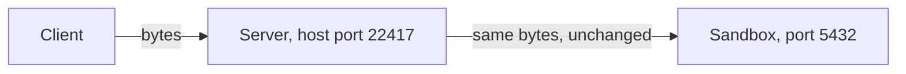
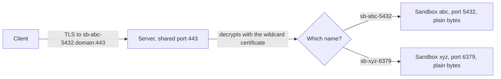

import { Tabs, TabItem } from '@astrojs/starlight/components';

`exposePort(port, { protocol: "tcp" })` and `exposePort(port, { protocol: "tls" })` both share a non-web service from a sandbox. They connect clients in very different ways. This page explains both, so you can pick the right one.

For how to call them, see [TCP and TLS ports](/tcp-ports/).

## The short answer

- **Use TCP** for plain database and wire protocols: Postgres, Redis, MySQL, MongoDB, SSH, game servers. It works for any service that uses TCP (the basic way programs send bytes over a network). Use it too when your service needs the client's own TLS handshake (TLS is the encryption behind `https://`), for example to check client certificates.
- **Use TLS** when you want a `tls://` address on port 443 with a real certificate. Your client must start with TLS right away, and your service speaks plain TCP.

On a server with a domain, TLS is a good default when your client supports it. Use TCP if your client does not send SNI (explained below), if your service needs the original handshake, or if the server has no domain.

## How a TCP port works

The server opens one of its own ports for each exposure, called the **host port**. It comes from a pool, `22000` to `23000` by default. Every byte that arrives there goes to the port inside the sandbox, unchanged.



- The address looks like `tcp://<host>:<host-port>`.
- The result also has `host` and `hostPort` as separate fields, so you can build a connection string without parsing the URL.
- The server does not read the bytes. It only passes them along.
- Each TCP port uses one host port from the pool and one opening in the server's firewall.
- It works for **any** TCP protocol, with or without TLS.

## How a TLS port works

All TLS ports share one port on the server, usually `443`. A client starting a TLS connection first says which name it wants. This is called **SNI** (Server Name Indication). The server reads that name and picks the right sandbox.

The server then ends the TLS connection itself, using the wildcard certificate it already has for `*.<domain>`. A wildcard certificate covers every name under the domain. The server sends the decrypted bytes to the sandbox on its normal port.



- The address looks like `tls://<sandbox-id>-<port>.<domain>:443`.
- Your service speaks **plain TCP**. It does not need a certificate, renewals, or any TLS setup.
- Many TLS ports share the same server port and the same certificate. They use no host ports and need no extra firewall openings.
- The certificate's private key never leaves the server. Sandboxes only see decrypted bytes.
- The client must send SNI. Almost every modern client does. If yours does not, use TCP.
- The client must start with TLS right away. Protocols that start in plain text and switch to TLS later, such as MySQL and default Postgres, need TCP.
- **No client certificates (mutual TLS) and no custom protocol negotiation (ALPN) reach your service.** Those need the original TLS handshake, so use TCP for them.

## Pick by service

| Service | Pick | Why |
|---|---|---|
| Postgres | **TCP** | Works with any client, with or without TLS. |
| Postgres with TLS from the first byte | **TLS**, test first | Postgres 17 and newer clients can start with TLS (`sslnegotiation=direct`) and send SNI. Test it with your client before you rely on it. |
| Redis | **TCP** | Most Redis setups use plain TCP. |
| MySQL or MariaDB | **TCP** | The connection starts in plain text, so a TLS port cannot route it. |
| MongoDB | **TCP** | Plain MongoDB over TCP is the default. |
| MQTT broker | **TCP** for `mqtt://`, **TLS** for `mqtts://` | Match the client's address scheme. |
| gRPC without TLS | **TCP** | No TLS and no SNI, just bytes. |
| gRPC over TLS | **TLS**, test first | gRPC clients start with TLS and send SNI. Some gRPC clients also require protocol negotiation (ALPN), which this mode does not pass through. |
| SSH server or Git server | **TCP** | SSH does not use SNI, so a TLS port cannot route it. |
| Game server | **TCP** | Game protocols are custom. |
| Custom protocol without TLS | **TCP** | Same reason as game servers. |

## Examples

A TCP port. Pick this when the protocol has no TLS, or the sandbox should not deal with certificates. It also suits clients that want a `host:port` connection string (`psql`, `redis-cli`, `mongosh`). The cost: one host port and one firewall opening per exposure, and a high port number in the address.

<Tabs syncKey="lang">
  <TabItem label="TypeScript">
    ```ts
    const exposure = await sandbox.exposePort(5432, { protocol: "tcp" });
    if (exposure.protocol === "tcp") {
      console.log(exposure.host, exposure.hostPort); // sandbox.example.com 22417
    }
    ```
  </TabItem>
  <TabItem label="Python">
    ```python
    exposure = sandbox.expose_port(5432, protocol="tcp")
    print(exposure.host, exposure.host_port)  # sandbox.example.com 22417
    ```
  </TabItem>
  <TabItem label="Go">
    ```go
    exposure, err := sandbox.ExposePort(ctx, 5432, microvm.WithProtocol(sdktypes.ExposeProtocolTCP))
    if err != nil {
        log.Fatal(err)
    }
    fmt.Println(exposure.Host, exposure.HostPort) // sandbox.example.com 22417
    ```
  </TabItem>
  <TabItem label="Rust">
    ```rust
    if let ExposeResult::Tcp { host, host_port, .. } = sandbox.expose_port(5432, ExposeOptions::tcp())? {
        println!("{} {}", host, host_port); // sandbox.example.com 22417
    }
    ```
  </TabItem>
  <TabItem label="Java">
    ```java
    ExposeResult exposure = sandbox.exposePort(5432, ExposeOptions.tcp());
    System.out.println(exposure.host + " " + exposure.hostPort); // sandbox.example.com 22417
    ```
  </TabItem>
</Tabs>

A TLS port. Pick this when the client sends SNI, the service speaks plain TCP, and you want many services sharing port 443. You give up client certificates and custom protocol negotiation. You save certificate work in the sandbox, host ports, firewall openings, and the odd port number in the address.

<Tabs syncKey="lang">
  <TabItem label="TypeScript">
    ```ts
    const exposure = await sandbox.exposePort(5432, { protocol: "tls" });
    console.log(exposure.url); // tls://sb-9f2c41d07a3e5b86-5432.sandbox.example.com:443
    ```
  </TabItem>
  <TabItem label="Python">
    ```python
    exposure = sandbox.expose_port(5432, protocol="tls")
    print(exposure.url)  # tls://sb-9f2c41d07a3e5b86-5432.sandbox.example.com:443
    ```
  </TabItem>
  <TabItem label="Go">
    ```go
    exposure, err := sandbox.ExposePort(ctx, 5432, microvm.WithProtocol(sdktypes.ExposeProtocolTLS))
    if err != nil {
        log.Fatal(err)
    }
    fmt.Println(exposure.PublicURL) // tls://sb-9f2c41d07a3e5b86-5432.sandbox.example.com:443
    ```
  </TabItem>
  <TabItem label="Rust">
    ```rust
    if let ExposeResult::Tls { url } = sandbox.expose_port(5432, ExposeOptions::tls())? {
        println!("{}", url); // tls://sb-9f2c41d07a3e5b86-5432.sandbox.example.com:443
    }
    ```
  </TabItem>
  <TabItem label="Java">
    ```java
    ExposeResult exposure = sandbox.exposePort(5432, ExposeOptions.tls());
    System.out.println(exposure.url); // tls://sb-9f2c41d07a3e5b86-5432.sandbox.example.com:443
    ```
  </TabItem>
</Tabs>

## Side by side

| | `protocol: "tcp"` | `protocol: "tls"` |
|---|---|---|
| Server port | One host port per exposure, from `22000` to `23000` | One shared port, `443` by default |
| Address | `tcp://<host>:<host-port>` | `tls://<sandbox-id>-<port>.<domain>:443` |
| Result fields | `url`, `host`, `hostPort` | `url` |
| Server reads the traffic? | No | Yes, it decrypts it |
| Who holds the certificate | Not needed by AerolVM | The server (the key never enters the sandbox) |
| Your service speaks | Anything | Plain TCP |
| Client certificates (mutual TLS) | Pass through to your service | Not supported |
| Client must send SNI? | No | Yes |
| Server needs a domain? | No | Yes |
| Firewall openings per exposure | 1 | 0 (shared port) |

## Next steps

- [TCP and TLS ports](/tcp-ports/): how to expose, unexpose and switch ports, plus the server settings.
- [Share a web app](/preview/): web URLs for websites and APIs.
- [Port allowlist](/port-allowlist/): how ports stay closed until you expose them.
