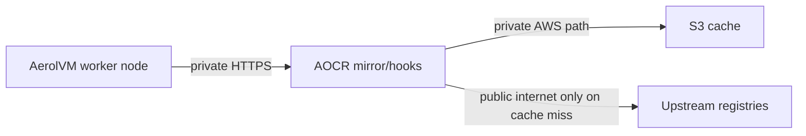
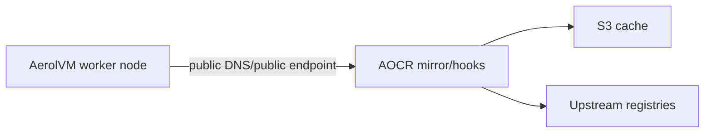
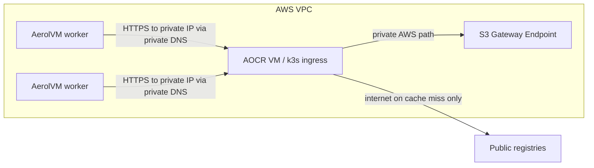

# AOCR Private VPC Routing Plan

## Status

Draft - ready for implementation planning.

## Why this plan exists

Today the AerolVM cluster is already wired to use AOCR as a pull-through cache:

- `Terraform/templates/bootstrap.sh.tftpl` writes Docker Hub's `registry-mirrors` to `https://<aocr.mirror_host>`.
- The same bootstrap writes `SB_MIRROR_HOST`, `SB_MIRROR_PUSH_HOST`, `SB_MIRROR_UPSTREAMS`, and `SB_AUTO_IMPORT_HOOKS_URL` into `/etc/sandboxd/cluster.env`.
- `pkg/docker/mirror_rewrite.go` rewrites `ghcr.io`, `gcr.io`, `quay.io`, and `registry.k8s.io` pulls onto the mirror host.
- `internal/service/auto_import.go` posts back to AOCR at `<hooks_url>/v1/internal/imports` after a successful pull.
- In the AOCR repo, `helm/aocr/templates/ingress.yaml` and `helm/aocr/templates/mirror-ingress.yaml` expose the push/hooks host and the mirror host as host-based HTTPS ingresses.

The cache behavior is already correct. The remaining problem is network path.

Right now the configured AOCR endpoints are public hostnames:

- `mirror.aocr.aerol.ai`
- `https://aocr.aerol.ai`

That means AerolVM nodes talk to AOCR over the public path even when both systems are under the same operator control. The consequence is:

- cached pulls still traverse a public endpoint
- auto-import calls still traverse a public endpoint
- private AOCR traffic depends on public DNS and public reachability
- you pay transfer charges for node-to-AOCR traffic that should stay private

This plan explains how to move the AerolVM to AOCR path onto VPC-private networking while keeping the existing AOCR cache semantics intact.

## Executive summary

The important finding from the current codebase is this:

1. AerolVM does not require AOCR to be public.
2. The mirror path does require HTTPS.
3. The hooks path does not hardcode HTTPS in code, but it carries a bearer token and should stay HTTPS.
4. The current bottleneck is infrastructure and name resolution, not mirror logic.

The recommended strategy is:

1. Keep using HTTPS.
2. Keep the existing hostnames if possible.
3. Make those hostnames resolve to AOCR's private address from inside the AerolVM VPC.
4. Restrict AOCR ingress to the AerolVM VPC CIDRs or security groups.
5. Add an S3 VPC endpoint on the AOCR side so AOCR-to-S3 traffic also stays on AWS private networking.

If you do this, AerolVM-to-AOCR traffic becomes private while AOCR still uses the public internet only for true cache misses against upstream registries.

## Current behavior, mapped to code

### AerolVM side

#### Docker Hub mirror path

`Terraform/templates/bootstrap.sh.tftpl` writes:

```json
{
  "registry-mirrors": ["https://<aocr.mirror_host>"],
  "live-restore": true
}
```

Implications:

- the Docker daemon is explicitly configured to use an HTTPS mirror URL
- there is no current support for an insecure mirror in Terraform bootstrap
- if the mirror certificate is not trusted by the node, Docker Hub mirroring breaks

#### Non-Docker-Hub registries

`pkg/docker/mirror_rewrite.go` rewrites supported registries to:

```text
<mirror_host>/aocr/<shortname>/<repo>:<tag>
```

Examples:

- `ghcr.io/aerol-ai/sandbox:v1` -> `mirror.aocr.aerol.ai/aocr/ghcr/aerol-ai/sandbox:v1`
- `registry.k8s.io/pause:3.9` -> `mirror.aocr.aerol.ai/aocr/k8s/pause:3.9`

Implications:

- the host is entirely configuration-driven through `SB_MIRROR_HOST`
- the code does not care whether that host is public or private
- if DNS and TLS work, private routing works without code changes

#### Auto-import

`internal/service/auto_import.go` builds the import endpoint as:

```text
<hooks_url>/v1/internal/imports
```

Implications:

- the value is taken verbatim from `SB_AUTO_IMPORT_HOOKS_URL`
- the code validates only that it parses as a URL
- the path does not require a public hostname
- it should remain HTTPS because it carries `Authorization: Bearer <cluster_pat>`

### AOCR side

From the sibling `aocr.sh` repo:

- `helm/aocr/templates/ingress.yaml` exposes the main AOCR hostname from `global.domain`
- `helm/aocr/templates/mirror-ingress.yaml` exposes the mirror hostname from `mirror.host` or `mirror.<global.domain>`
- `helm/aocr/values.yaml` defaults to `ingress.className: traefik` and `ingress.tls.enabled: true`
- `ansible/inventory/group_vars/all/vars.yml` currently assumes public DNS records and currently leaves `aocr_mirror_allow_list` wide open (`0.0.0.0/0`)

Implications:

- AOCR is already host-routed and TLS-terminated
- mirror exposure is already gated by CIDR allow-list
- the current deployment assumptions are public-DNS-oriented, but the product shape is still compatible with private routing

## Problem statement

You want this traffic path:



Instead of this path:



The exact target state is:

- AerolVM nodes reach AOCR over private IP space or private load-balancer addresses.
- AOCR keeps serving HTTPS so Docker and sandboxd behave normally.
- AOCR can still fetch from upstream registries when the cache is cold.
- AOCR can still persist cache objects to S3 without using public internet paths.
- External operator access, if still needed, is either preserved separately or intentionally removed.

## Important constraint: HTTPS is required for the mirror

For the mirror specifically, HTTPS is not optional in the current setup.

Why:

- Terraform bootstrap hardcodes `https://<mirror_host>` into Docker's `registry-mirrors`.
- There is no current bootstrap support for Docker `insecure-registries`.
- There is no current automation for distributing a custom private CA to every AerolVM node.

Therefore the shortest safe path is:

- keep the mirror on HTTPS
- use a certificate that AerolVM nodes already trust
- route that HTTPS host privately inside the VPC

This is the central design point: private does not mean plaintext. Private HTTPS over VPC is the correct end state.

## What moving to VPC-private does and does not solve

### What it solves

- AerolVM node -> AOCR mirror traffic no longer leaves private networking.
- AerolVM node -> AOCR auto-import traffic no longer leaves private networking.
- You stop paying public-transfer-style costs for repeated cached pulls from cluster nodes to AOCR.
- You reduce dependency on public routing for the internal AOCR control path.

### What it does not solve

- AOCR still needs outbound reachability to public registries on cache miss.
- If AOCR is in a private subnet, it still needs NAT, an egress proxy, or equivalent for upstream pulls and any Cloudflare or ACME API calls.
- If AOCR keeps using public DNS-issued certificates, certificate issuance still depends on the public DNS control plane.

This is expected. The goal is not to eliminate all internet usage. The goal is to eliminate public-path traffic for the AerolVM <-> AOCR connection.

## Candidate strategies

## Strategy A - Same FQDNs, private resolution inside the VPC

### Summary

Keep using:

- `mirror.aocr.aerol.ai`
- `aocr.aerol.ai`

But make those names resolve to AOCR's private address from inside the AerolVM VPC.

### Why this is the recommended strategy

It fits the current code with the least churn:

- no AerolVM code change
- no new Terraform schema required in AerolVM
- no mirror rewrite changes
- no auto-import changes
- no Docker daemon behavior changes
- no need to teach the system new internal-only hostnames

### How it works

1. AOCR is reachable on a private IP or an internal load balancer.
2. Inside the AerolVM VPC, DNS resolves the existing AOCR names to that private address.
3. Outside the VPC, those same names can either:
   - continue resolving publicly for operator use, or
   - be retired if AOCR becomes private-only.

### DNS pattern

Use split-horizon DNS:

- public DNS continues to exist in Cloudflare for the AOCR public names if you still need public/operator access
- a Route53 Private Hosted Zone associated with the AerolVM VPC overrides the same names with private records

Example private records inside the VPC:

- `mirror.aocr.aerol.ai` -> AOCR private IP or internal NLB
- `aocr.aerol.ai` -> AOCR private IP or internal NLB

### Certificate pattern

Preferred:

- keep publicly trusted certificates on the same names
- issue them through DNS-01 or another method that does not depend on public HTTP reachability

Why this is preferred:

- AerolVM nodes already trust public roots
- no node bootstrap change is needed
- Docker keeps working with the existing HTTPS mirror config

### Best fit when

- AOCR is in the same VPC as AerolVM, or in a peered or transit-connected VPC
- you want the lowest-risk migration
- you are okay using split-horizon DNS

## Strategy B - Dedicated internal AOCR hostnames

### Summary

Introduce separate private names such as:

- `mirror-internal.aocr.aerol.ai`
- `aocr-internal.aocr.aerol.ai`

Then point AerolVM at those instead of the public names.

### Pros

- explicit separation between public and private traffic
- easier to reason about in logs and DNS
- no split-horizon behavior to debug

### Cons

- AOCR chart and ingress may need new hosts and certs
- operational docs become more complex
- if you still want both public and private surfaces, you now manage two naming planes

### Best fit when

- you want a very explicit private/public split
- you are willing to change the AOCR chart or deploy parallel ingress resources

## Strategy C - PrivateLink or internal NLB service publication

### Summary

Front AOCR with an internal NLB and publish it across VPCs or accounts using peering, Transit Gateway, or PrivateLink.

### Pros

- strong private-network boundary
- good future shape if many clusters in many VPCs must consume one AOCR

### Cons

- more AWS infrastructure
- more TLS and DNS coordination
- overkill for the current single-VM k3s-style AOCR deployment

### Best fit when

- AOCR serves multiple clusters across VPCs or AWS accounts
- you want AOCR to look like a reusable private platform service

## Strategy D - Private HTTP or insecure registry

Not recommended.

Why:

- it would require Docker daemon insecure-registry configuration changes
- it would weaken the security posture of the mirror path
- it is unnecessary because private HTTPS solves the actual problem cleanly

## Recommendation

Adopt Strategy A first.

More concretely:

1. Keep `mirror.aocr.aerol.ai` and `aocr.aerol.ai`.
2. Make them resolve privately inside the AerolVM VPC.
3. Keep HTTPS on both names.
4. Restrict AOCR ingress to cluster-private sources.
5. Add an S3 endpoint so AOCR-to-S3 is private as well.

This gives you the benefit you want without forcing product-level changes on either repo.

## Recommended target architecture

## Option A1 - Simplest immediate move

Use the AOCR VM's private IP directly.

This is the right first move if AOCR is a single k3s VM and you want the lowest effort migration.



Characteristics:

- no new load balancer
- easiest if AOCR is already on EC2
- works well for a single AOCR node
- not HA

## Option A2 - Better long-term move

Put AOCR behind an internal load balancer.

This is the right follow-up if AOCR becomes multi-node or you want cleaner failover.

Characteristics:

- better HA story
- easier to move AOCR nodes later
- more AWS setup work

For the current deployment shape, A1 is likely the correct first phase and A2 the later hardening phase.

## Required design decisions before implementation

Make these decisions first.

### D1. Is AOCR staying publicly reachable at all?

Choose one:

1. public + private
2. private only

If you choose public + private:

- keep public DNS and public/operator access
- add private DNS overrides for the AerolVM VPC

If you choose private only:

- remove public dependency from AerolVM entirely
- use VPN, SSM, bastion, or other admin path for operators

### D2. Is AOCR in the same VPC, or a different VPC?

Choose one:

1. same VPC
2. peered VPC
3. separate accounts/VPCs needing PrivateLink or TGW

This determines whether private DNS alone is sufficient.

### D3. What certificate source will you use?

Preferred order:

1. public-trust cert on the same FQDNs using DNS-01
2. ACM or another managed public-trust cert presented at an internal LB
3. private CA, only if you are willing to distribute trust to every AerolVM node

Avoid private CA for phase 1 unless there is a hard requirement. The current cluster bootstrap does not automate AOCR-specific CA trust.

### D4. Will AOCR remain on one VM, or do you want HA now?

Choose one:

1. single AOCR VM with private DNS
2. internal LB in front of multiple AOCR ingress nodes

## Detailed implementation plan

## Phase 0 - Decide the network model

### Goal

Pick the exact target topology before touching either repo.

### Work

1. Decide whether AOCR will be public + private or private-only.
2. Decide whether AOCR stays on a single VM or moves behind an internal LB.
3. Decide whether same-FQDN split-horizon DNS is acceptable.
4. Decide certificate source:
   - public-trust DNS-01 is preferred
   - private CA is fallback only
5. Decide whether AOCR remains in a public subnet with private-IP access from AerolVM, or moves to a private subnet with NAT/proxy egress.

### Deliverable

A short decision record listing:

- chosen hostname model
- chosen certificate model
- chosen routing model
- whether operator public access remains

## Phase 1 - Move AOCR onto a private-reachable network path

### Goal

Make AOCR reachable from AerolVM over private IP space.

### Work

If AOCR and AerolVM are in the same VPC:

1. Ensure the AOCR VM has a stable private IP, or place AOCR behind an internal LB.
2. Ensure AOCR security groups allow 443 and, if needed, 80 only from:
   - AerolVM node security group, or
   - AerolVM VPC CIDR
3. If AOCR remains on a public subnet, keep private-IP routing for cluster traffic.

If AOCR is in a different VPC:

1. Add VPC peering or Transit Gateway connectivity.
2. Ensure route tables include each side's CIDRs.
3. Apply SG rules so only AerolVM sources can reach AOCR ingress.

If AOCR is in a private subnet:

1. Provide outbound access for upstream registry fetches.
2. Provide outbound access for Cloudflare or ACME APIs if certificate issuance still depends on them.

### Notes

Because the current AerolVM Terraform creates a single public subnet, nothing on the AerolVM side prevents private reachability. The cluster only needs AOCR to be reachable at a private address.

## Phase 2 - Private DNS and hostname routing

### Goal

Make AerolVM nodes resolve AOCR names to private addresses.

### Recommended work

Use split-horizon DNS with a Route53 Private Hosted Zone associated to the AerolVM VPC.

1. Create a private hosted zone for the AOCR parent zone or a delegated subzone.
2. Add private A or alias records for:
   - `mirror.aocr.aerol.ai`
   - `aocr.aerol.ai`
3. Point them to the AOCR private IP or internal LB.
4. Verify that an EC2 instance inside the AerolVM VPC resolves those names privately.

### Why this works well

- AerolVM config values do not change.
- Existing mirror hostnames remain valid.
- Existing certificates can stay tied to the same names.

### If you reject split-horizon DNS

Then use dedicated private names and accept the extra AOCR ingress and certificate work.

## Phase 3 - TLS plan

### Goal

Keep both AOCR surfaces on trusted HTTPS.

### Recommended work

1. Keep using publicly trusted certificates for `aocr.aerol.ai` and `mirror.aocr.aerol.ai`.
2. Make certificate issuance independent of public HTTP reachability.
3. Prefer DNS-01 if AOCR becomes internal-only.

### Why this matters

The AOCR chart defaults to `cert-manager.io/cluster-issuer: letsencrypt-prod`, but the actual solver strategy lives in the cluster issuer. If your current issuer depends on HTTP-01 against public ingress, fully private-only AOCR will break issuance until the issuer is switched to DNS-01 or certificates are provisioned another way.

### Private CA fallback

Only use this if you are willing to change AerolVM bootstrap.

That change would need to:

1. place the AOCR CA cert onto every node
2. run `update-ca-certificates`
3. install the CA for Docker under `/etc/docker/certs.d/<mirror_host>/ca.crt`
4. restart Docker safely

None of that exists today in the AerolVM Terraform bootstrap.

## Phase 4 - AOCR ingress hardening

### Goal

Make the AOCR mirror and hooks surfaces private-by-policy, not just private-by-DNS.

### Work

1. In the AOCR repo, narrow `aocr_mirror_allow_list` from `0.0.0.0/0` to the AerolVM VPC CIDRs or other approved source ranges.
2. If AOCR remains publicly reachable, ensure the main host ingress is also protected appropriately for admin/operator use.
3. If you add an internal LB later, place the tighter rules at the LB and SG layers as well.

### Result

Even if public DNS still exists, unauthorized public callers cannot use the mirror.

## Phase 5 - S3 private path

### Goal

Keep AOCR-to-S3 traffic off the public internet too.

### Work

1. Add an S3 Gateway Endpoint to the VPC that hosts AOCR.
2. Update route tables so AOCR reaches S3 through that endpoint.
3. Verify the AOCR S3 backend continues working unchanged.

### Why this matters

AOCR's entire value proposition depends on S3-backed cached content. If node-to-AOCR becomes private but AOCR-to-S3 still hairpins over public paths or NAT, you only solved half the cost problem.

## Phase 6 - AerolVM configuration changes

### Case 1: same FQDN split-horizon DNS

This is the best case.

Expected change in AerolVM repo:

- possibly none

Why:

- your current `aocr.mirror_host` already names `mirror.aocr.aerol.ai`
- your current `aocr.hooks_url` already names `https://aocr.aerol.ai`
- once those names resolve privately inside the VPC, AerolVM automatically starts using the private path

### Case 2: dedicated internal hostnames

Expected change in AerolVM repo:

1. update `Terraform/terraform.tfvars`
2. optionally update the Terraform README and setup docs so the AOCR section explicitly supports internal hostnames

Fields that would change:

- `aocr.mirror_host`
- `aocr.hooks_url`
- maybe `aocr.mirror_push_host` if sandbox-side pushes should also use a private host

### Important conclusion

There is no apparent code change required in AerolVM for the basic private-routing move. This is already a configuration seam.

## Phase 7 - AOCR chart changes only if you choose dedicated internal names

If you use Strategy A with same hostnames, skip this phase.

If you use Strategy B, likely work includes:

1. extending the AOCR chart to support additional ingress hosts for the main AOCR surface
2. extending the AOCR chart to support additional ingress hosts for the mirror surface
3. issuing or mounting certificates for those additional hosts
4. updating the AOCR Ansible deploy playbook to pass those values through Helm

## Phase 8 - Validation plan

### Functional validation

1. From an AerolVM node, resolve the AOCR names and confirm they return private addresses.
2. Confirm `docker pull alpine` succeeds and still uses the configured mirror.
3. Confirm a rewritten pull such as `ghcr.io/...` succeeds through AOCR.
4. Confirm auto-import still succeeds after a first private pull.

### Network-path validation

1. Use VPC Flow Logs to confirm traffic from AerolVM nodes to AOCR uses private addresses.
2. Confirm no node-to-AOCR traffic leaves through internet egress for cache hits.
3. Confirm AOCR-to-S3 uses the S3 endpoint.
4. Confirm AOCR still reaches upstream registries only on cache miss.

### Security validation

1. Confirm the mirror refuses requests from outside the approved source ranges.
2. Confirm the AOCR certificate chain is trusted by Docker on the nodes.
3. Confirm the bearer-token-based auto-import call stays on HTTPS.

### Cost validation

1. Compare pre-change and post-change transfer usage on the AerolVM side.
2. Compare NAT or internet-gateway traffic before and after.
3. Confirm repeated cached pulls no longer show the same public-path transfer pattern.

## Phase 9 - Rollout plan

### Step 1

Stand up the private DNS records and private network path first.

### Step 2

Test from one node manually before rotating the whole cluster.

### Step 3

Tighten AOCR allow-lists only after private reachability is confirmed.

### Step 4

If AerolVM config values change, roll one node or one environment first, then the full cluster.

## Rollback plan

If the private path fails:

1. remove the private DNS override or disassociate the private hosted zone
2. revert any tightened AOCR ingress allow-lists
3. if you changed AerolVM endpoint values, restore the prior values and recycle nodes

Because the current production path is hostname-driven, DNS rollback is the fastest and least invasive backout mechanism.

## Risks and edge cases

### R1. Certificate issuance fails after privatization

Most likely cause:

- current cert-manager issuer depends on HTTP-01 and public reachability

Mitigation:

- move to DNS-01 or pre-provision certs before the cutover

### R2. Private CA chosen too early

Most likely cause:

- trying to avoid public-trust certs by introducing a custom CA

Mitigation:

- do not choose private CA in phase 1 unless there is a strong compliance reason

### R3. AOCR still pays unexpected transfer costs

Most likely cause:

- S3 path still uses NAT or public routing
- AOCR and AerolVM are cross-AZ or cross-VPC in a way that still incurs transfer charges

Mitigation:

- add the S3 endpoint
- verify route tables
- verify AWS transfer billing dimensions for your exact placement

### R4. Public and private DNS disagree unexpectedly

Most likely cause:

- split-horizon DNS was introduced without a clear ownership model

Mitigation:

- document the private hosted zone association and record ownership explicitly

## Open questions

These need answers before implementation starts.

1. Is AOCR in the same AWS VPC as AerolVM today, or in a different VPC or account?
2. Do you still need public/operator access to `aocr.aerol.ai` and `mirror.aocr.aerol.ai`, or can AOCR become private-only?
3. Is the current AOCR certificate flow based on HTTP-01 or DNS-01?
4. Do you want to keep AOCR on a single VM for now, or invest immediately in an internal LB?
5. Is reducing AerolVM-node egress sufficient, or do you also want to guarantee AOCR-to-S3 stays private from day one?

## Proposed final recommendation

Implement in this order:

1. Keep the current AOCR hostnames.
2. Introduce split-horizon DNS so AerolVM nodes resolve them privately.
3. Keep HTTPS with publicly trusted certificates.
4. Restrict AOCR ingress to AerolVM-private sources.
5. Add an S3 VPC endpoint for AOCR.
6. Only after that, decide whether AOCR should also become private-only for operator access.

This sequence solves the cost problem with the smallest blast radius and aligns with the seams that already exist in both codebases.