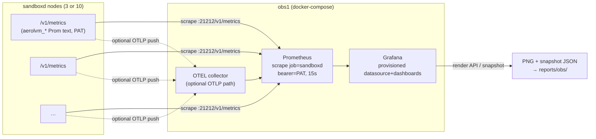

# Investor-Grade Benchmark + Observability Scenarios

**Status:** DRAFT plan — not yet eng-reviewed. Author: platform.
**Goal owner ask:** Two new self-contained AWS scenarios that (a) run the full breadth
of AerolVM's sandbox capabilities under load, (b) render the results on a live,
investor-grade Grafana wall, and (c) emit a machine-readable catalogue of every
"question we asked the platform" with its latency and pass/fail — so the numbers and
the dashboard snapshots can headline a VC deck **and** a Hacker News launch post.

Two scenarios, deliberately different in cost/ambition:

| Scenario | Nodes | Instances | Runtime coverage | Full pass | Purpose |
|---|---|---|---|---|---|
| `cluster-mixed-benchmark-with-obs` | 4 | t3.large, **on-demand** (durable) | containerd/docker, gVisor, WASM, isolate (**no Firecracker**) | ~20–30 min | The cheap, repeatable "everyday" dashboard + numbers; runs the UC suite clean |
| `cluster-hetero-benchmark-with-obs` | 11–12 | **m6i.large** + c5.metal, on-demand | **all five** incl. Firecracker on metal | 3–4 h soak | The flagship "everything, at scale, for hours" run for the deck |

> **This is a plan only.** Nothing below is built yet. The "File-touch checklist"
> (§13) and "Phasing" (§12) are the build order once approved.

---

## 1. The thesis — what should "awe" the viewer

Two audiences, two hooks, one dataset:

1. **The numbers** (for the technical/HN crowd): a single latency ladder that no
   competitor can show side by side — **isolate 4 ms → WASM 22 ms → Firecracker 34 ms
   → containerd 189 ms → gVisor 284 ms** create-to-serving, warm path, on commodity
   EC2, reproduced live and pinned to a dashboard. Plus density (sandboxes/host to
   rejection), warm-pool hit rates, and boot-time attribution showing *where the
   milliseconds go*.
2. **The breadth** (for the product/VC crowd): the *same platform* runs a Postgres
   with row-level security, a Redis with an Upstash-compatible REST API, a durable
   Temporal-style workflow engine with failover, a hosted JupyterLab, a parallel ML
   tuning fleet, a claude-code repo agent, and a gVisor kernel-isolation proof —
   each on the isolation tier that fits it, each reachable on a real public URL,
   each recorded as a timed, pass/failed "question."

The dashboard's job is to make both legible **while the run is happening**: a wall
you can screenshot at any minute and it tells a complete story.

---

## 2. What already exists (grounding — do not rebuild)

- **Harness**: `integration-tests/run.sh <scenario>` resolves `scenarios/<name>.tfvars`
  + `scenarios/<name>.caps.yml`, provisions via the prod Terraform module against
  isolated state, waits DNS/TLS/health, runs the `integration`-tagged Go suite, and
  `report/gen.go` writes `reports/<scenario>.{md,json}` + the UC×scenario matrix.
- **108 use cases** (`suite/harness/usecases.go`, UC-01→UC-105, all `Implemented`),
  gated by **17 capabilities**. Report generation is registry-driven — adding a UC
  needs no gen.go change.
- **Benchmark engine** (`suite/benchmark_test.go`): `benchRuntimes` table (docker,
  docker-cold, containerd, firecracker, gvisor, wasm, isolate), UC-94 latency sweep
  (api/server/running p50/p90/p99 + per-stage Server-Timing), UC-95 density; emits
  a merged `benchReport` JSON when `AEROL_BENCH_OUT` is set. Doubly gated:
  `CapBenchmark` **and** `AEROL_BENCH=1`.
- **Metrics**: stdlib `expvar`, exposed at `GET /v1/metrics` (Prometheus text,
  PAT-gated, only `aerolvm_*`-prefixed vars) and `GET /debug/vars` (JSON). Optional
  OTLP push (`internal/observability/otel.go`) bridges the same vars as two gauges
  keyed by a `metric` attribute. Full named inventory in §7 of the research notes;
  the load-bearing ones are cited inline in §6 below.
- **One dashboard**: `setup/grafana/sandboxd-slo-dashboard.json` ("sandboxd SLOs",
  20 control-plane panels). No dashboard variables, no per-runtime/pool/stage views.
- **No live monitoring stack**: the repo *stages* the dashboard JSON + alert rules
  onto nodes (Ansible `configure-ops.yml`) and *outputs* per-node scrape targets
  (`Terraform/outputs.tf` → `prometheus_scrape_targets` = `<private_ip>:21212`,
  `metrics_path=/v1/metrics`, `bearer_token=<PAT>`, job `sandboxd`) — but nothing
  runs Prometheus/Grafana. **We must deploy that.**
- **Examples**: `~/aerolvm-examples` — 30 workloads across `ml-data-engineering/`,
  `customer-facing/`, `daytona-examples/`. The demo-grade ones are catalogued in §8.

---

## 3. Gap analysis — what this plan must add

| # | Gap | Consequence if unaddressed | Where addressed |
|---|---|---|---|
| G1 | No live Prometheus/Grafana/OTEL-collector stack | No dashboard to screenshot | §5 (obs node), §12 Phase 0 |
| G2 | Only a control-plane SLO dashboard | No per-runtime / pool / cost / simulation story | §7 dashboard catalogue |
| G3 | Boot-stage timings (`fc_*`,`wasm_*`,`toolbox_wait`,`cluster_promote`) only in Server-Timing headers | "Where do the ms go?" panel impossible | §9 instrumentation |
| G4 | WASM + isolate warm-pool hit/miss counters not exported | Two of five runtimes missing from the pool-efficiency panel | §9 instrumentation |
| G5 | No "simulation" layer that runs the example workloads as recorded, timed questions | No breadth story; no 200+ record | §8 simulation catalogue |
| G6 | No question/latency/success JSON record format beyond `benchReport` | Nothing to feed the deck / blog tables | §8.4 record schema |
| G7 | No AI-key injection path for the claude-code simulation | Can't run the hero AI-agent demo | §8.5 |
| G8 | No dashboard-snapshot / blog-asset pipeline | Manual screenshotting, not reproducible | §10 |
| G9 | Non-cumulative histograms (no `histogram_quantile`, no `_count`/`_sum`) | Naive latency panels render wrong | §6 (PromQL rules), §9 (optional fix) |

---

## 4. The two scenarios

### 4.1 `cluster-mixed-benchmark-with-obs` (cheap, repeatable)

**Intent:** everyday driver. Spins in minutes, runs the four host-mediated/container
runtimes, lights up the full dashboard wall, tears down cheap. This is what you run
before a meeting to get fresh screenshots.

**Topology — 4 EC2 instances, all on-demand (durable — a spot reclaim mid-suite would show up as spurious UC failures):**

```
node1  role=mixed  seed=true  t3.large   on-demand   # containerd(default)+gVisor+WASM(resident)+isolate
node2  role=mixed             t3.large   on-demand   # same runtime set — gives cluster placement + density
node3  role=mixed             t3.large   on-demand   # same — 3 sandboxd Raft members (expected_members=3)
obs1   (NOT a sandboxd node)  t3.medium  on-demand   # Prometheus + Grafana + OTEL collector via docker-compose
```

- **t3.large** (not medium) because the WASM resident host + isolate warm pool +
  gVisor coexisting on one box needs the headroom, and the resident-host benchmark
  is already validated on t3.large (`cluster-3-mixed-wasm`).
- **On-demand, not spot (durable).** This scenario's job is to run the 108-UC
  functional suite cleanly — a spot reclaim mid-run would surface as spurious UC
  failures / inconclusive rows. t3 (burstable) is still the right *family* here
  despite the soak warning below: a ~30-min pass never depletes CPU credits, so the
  throttling that hurts the hetero soak doesn't apply, and it keeps the commodity
  "runs on a cheap box" baseline the README ladder was measured on.
- **No Firecracker** — it needs bare metal (c5.metal, on-demand, ~$4+/hr). Excluded
  by the owner's cost decision; it lives in the hetero scenario.
- **`obs1` is a 4th instance, not a Raft member.** It runs the monitoring stack and
  scrapes the three sandboxd nodes. `expected_members: 3`.
- Enablement is provisioning-driven, matching existing scenarios:
  `default_with_gvisor=true`, run.sh flips `wasm.enabled` + `SB_WASM_RESIDENT_HOST_ENABLED=true`
  + stages modules, `default_with_isolate=true` + `SB_ISOLATE_USE_JAIL=false` via
  `extra_user_data` (the jail-off gotcha from `single-node-isolate`).

**Capabilities** (`.caps.yml`): `docker, gvisor, wasm, isolate, platform-volumes,
domain, custom-domains, cluster, benchmark, observability` (new cap — see §5.4).

**A full pass** (`make integration-cluster-mixed-obs`): provisions → 108 UCs minus
the FC/arm64-gated ones → benchmark sweep across `{containerd, gvisor, wasm, isolate}`
→ a **short** simulation set (Postgres, Redis, Jupyter, gVisor-probe, isolate egress)
→ dashboard populated → teardown (or `keep` for screenshotting). ~20–30 min.

### 4.2 `cluster-hetero-benchmark-with-obs` (flagship soak)

**Intent:** the "boil the ocean" run. Every runtime including Firecracker on metal,
every use case, the full simulation catalogue including the long-running services and
the AI agent, held up for 3–4 hours so the dashboards accumulate a rich time series
worth screenshotting. On-demand (not spot) so a reclaim can't kill a 3-hour run.

**Topology — 11 EC2 instances (12 with the optional 2nd FC), all on-demand:**

```
server-1  role=server   seed=true  t3.medium  # Raft voters, no sandboxes → burstable is fine (light)
server-2  role=server              t3.medium
server-3  role=server              t3.medium
ingress-1 role=ingress             m6i.large  # Caddy L7/L4 + SSH gateway — steady traffic wants fixed perf
ingress-2 role=ingress             m6i.large  # 2nd ingress → HA ingress story on the dashboard
worker-c  role=worker  m6i.large   with containerd(default)  # docker/containerd + density target
worker-g  role=worker  m6i.large   with_gvisor=true          # gVisor
worker-w  role=worker  m6i.large   WASM resident host         # WASM
worker-i  role=worker  m6i.large   with_isolate               # isolate (jail-off)
worker-f  role=worker  c5.metal    with_firecracker=true      # Firecracker (KVM) — the only metal box
obs1      (NOT a sandboxd node)  m6i.large                    # Prometheus(+long retention)/Grafana/OTEL
[optional] worker-f2 role=worker c7g.metal with_firecracker=true arch=arm64  # 12th: cross-arch FC story
```

- `expected_members: 10` (obs1 excluded).
- **On-demand** everywhere: `--no-disruptive` is *not* the default here, but a 3–4 h
  soak with spot reclaim is a bad demo; on-demand + the reaper TTL is the trade.
- **m6i.large (not t3.large) on every sandbox-bearing + ingress + obs node.** t3 is
  burstable — a multi-hour soak of continuous creates depletes CPU credits and
  throttles to baseline, inflating exactly the p99 tail we're showcasing. m6i.large
  keeps t3.large's 8 GiB RAM (the resident-host + isolate + gVisor coexistence
  headroom) but with fixed, non-burstable performance and flat, predictable cost.
  **Raft servers stay t3.medium** — they run no sandboxes, so burstable is fine and
  cheaper. **Firecracker stays c5.metal** — KVM needs bare metal, no alternative.
- **`obs1` on m6i.large** + longer Prometheus retention (the run is hours; we want the
  whole window on one screen; scraping 10 nodes every 15s for hours is steady, not
  bursty).
- Dedicated per-runtime workers (vs the current hetero's shared workers) so each
  runtime's dashboard row is attributable to one node and density tests don't
  cross-contaminate.
- **EBS tuning — pin gp3 with bumped IOPS on the write-hot nodes.** Durable writes on
  the create path are `fsync`-bound, not CPU-bound, so the instance family (t3 vs m6i)
  does *not* govern them — the **EBS volume does**. Two write paths matter: the SQLite
  sandbox-row INSERT (`internal/store/store.go` — WAL, `MaxOpenConns=1` single-writer,
  `synchronous` left at the default so each commit fsyncs) on the **owner worker**, and
  the Raft log append (`raft-boltdb/v2` + `raft-wal`, `internal/cluster/raft.go`) on the
  **leader server**. For a normal create both are trivial and `svc_persist` /
  `cluster_promote` are low-single-digit ms — but the **UC-95 density burst** fires
  hundreds of creates rapidly, serializing many small fsyncs through the single SQLite
  writer + the Raft log. gp3's baseline **3000 IOPS / 125 MiB/s** covers ordinary runs;
  to guarantee the density burst never hits an fsync ceiling (which would read as a fake
  latency tail), bump the volume on the write-hot nodes via the per-node knobs the TF
  module already exposes (`volume_iops` / `volume_throughput`, `Terraform/locals.tf:66-68`,
  `variables.tf` default `gp3`):
  - **`worker-c`** (the containerd density target) and the **3 Raft servers** →
    gp3 `volume_iops = 8000`, `volume_throughput = 250`.
  - Everything else stays on the module default (gp3 3000/125) — plenty.

  This is a cheap knob (a few dollars over the run) and it is the *correct* lever for
  "make record-writes fast," not the instance type. `synchronous = NORMAL` in WAL would
  be faster still, but that is a global durability change in `store.go` (server-touching,
  affects every deployment), so it is **out of scope** for a benchmark scenario.

**Capabilities**: everything the current `cluster-hetero` advertises + `isolate` +
`observability`: `docker, firecracker, gvisor, wasm, isolate, platform-volumes,
domain, custom-domains, cluster, benchmark, observability` (+ `mixed-arch-negative`
if the 12th arm64 metal node is included).

**A full pass** (`make integration-cluster-hetero-obs`): provisions → all 108 UCs
(disruptive drain/failover UCs included → dashboard shows recovery live) → benchmark
sweep across **all five** runtimes → the **full** simulation catalogue (§8) including
the long-running services left *running* for the duration and the claude-code agent →
a soak loop that keeps re-sampling latency + re-running a rotating simulation subset
for `AEROL_SOAK_HOURS` (default 3) so the time series fills → snapshot capture (§10)
→ teardown. ~3–4 h.

---

## 5. Observability stack (the big new infra — G1)

The repo has everything *except* a running stack. We add a dedicated obs instance and
provision Prometheus + Grafana + an OTEL collector on it with docker-compose, wired to
the already-emitted scrape targets.

### 5.1 Pipeline



**Decision: use the native scrape path, not OTLP, as the source of truth.** The
shipped dashboard and all our new PromQL assume native `aerolvm_*` series. OTLP
collapses everything into `aerolvm.expvar.int64/float64` keyed by a `metric` label,
which would force every query to be rewritten. Keep the OTEL collector in the compose
file (it's a nice "we also speak OTLP" bullet) but point Grafana at Prometheus.

### 5.2 What provisions it

New Terraform `Terraform/obs.tf` (behind a `deploy_obs` var, default false so no other
scenario pays for it):
- One EC2 instance in the same VPC/subnet + SG allowing egress to `:21212` on the
  sandboxd nodes and ingress `:3000` (Grafana) from the operator IP.
- `user_data` that: installs docker + compose, renders `prometheus.yml` from the
  `prometheus_scrape_targets` output (templated with the PAT from secrets), drops the
  compose file + Grafana provisioning, `docker compose up -d`.
- Outputs `grafana_url` (`http://<obs_public_ip>:3000`) into `integration_targets`.

New assets under `setup/obs/` (committed, reused by both scenarios):
- `docker-compose.yml` — prometheus, grafana, otel-collector.
- `prometheus.yml.tftpl` — one `static_configs` target per node, `metrics_path:
  /v1/metrics`, `authorization: { credentials: <PAT> }`, `scrape_interval: 15s`.
- `grafana/provisioning/datasources/prometheus.yml` — the Prometheus datasource so
  `${DS_PROMETHEUS}` resolves automatically on boot.
- `grafana/provisioning/dashboards/*` — a file provider that auto-loads every
  dashboard JSON in `setup/grafana/` (the existing SLO one + the new ones from §7).

`run.sh` wiring: when caps advertise `observability`, pass `-var deploy_obs=true`,
wait for `grafana_url` to answer, and (soak scenario) start the snapshot job.

### 5.3 Non-standard histograms — the PromQL rule (G9)

Every `*_seconds_bucket` here is a **non-cumulative** `expvar.Map`: keys are
`le_5ms…le_inf`, the label is `key` (not `le`), and there is **no `_count`/`_sum`**.
So:
- **Never** use `histogram_quantile()` — it will silently mislead.
- Latency-distribution panels use `sum(rate(<name>_bucket[5m])) by (key)` rendered as
  a **stacked bar / heatmap over the `key` dimension** (the shipped dashboard's
  pattern), or a bar-gauge of the per-bucket rate.
- The authoritative p50/p90/p99 numbers come from the **benchmark JSON** (`benchReport`
  computes true percentiles from raw samples), surfaced on the dashboard via a small
  JSON/Infinity datasource or a Grafana "Text/Table from file" panel fed by the
  `reports/<scenario>-bench.json` artifact. **Dashboard = trend + shape; benchReport =
  the quotable percentile.** This split is important and called out again in §7 D2.

### 5.4 New capability + config

- New `Capability` const `CapObservability = "observability"` in `usecases.go` +
  the `skip_test.go` known-cap switch + `TestRegistryWellFormed`.
- It gates a couple of new "the stack is actually up" UCs (§8.3 UC-106/107) and tells
  `run.sh` to deploy obs. It is advertisement + provisioning, like `gvisor`/`isolate`.

---

## 6. The metric surface we can actually draw (grounded)

Load-bearing series for the new dashboards (all confirmed present at `/v1/metrics`
unless flagged). Full list in the research notes; this is the working set.

- **Create funnel** (`internal/service/metrics.go`): `aerolvm_create_requests_total`,
  `aerolvm_create_queue_depth`, `aerolvm_create_errors_total{key=reason}`,
  `aerolvm_create_latency_seconds_bucket{key=le_*}`,
  `aerolvm_create_admission_rejects_total`.
- **Capacity/density** (`pkg/capacity/metrics.go`): `aerolvm_host_pressure_sandboxes`,
  `aerolvm_host_pressure_can_admit`, `_reserved_cpu_millicores`/`_cpu_budget_millicores`
  (+ memory/disk/gpu), `aerolvm_host_pressure_reject_reasons`.
- **Cluster** (`internal/cluster/metrics.go`): `aerolvm_gossip_members_alive`/`_total`,
  `aerolvm_worker_leases_alive`/`_total`, `aerolvm_worker_lease_max_age_nanos`,
  `aerolvm_raft_apply_*`, `aerolvm_scheduler_decisions_total{key}`,
  `aerolvm_owner_forward_*`, `aerolvm_placement_cache_*`.
- **Ingress/Caddy** (`internal/service/ingress_metrics.go`, `pkg/caddy/metrics.go`):
  `aerolvm_ingress_routes_{http,tls,tcp}`, `aerolvm_ingress_route_lag_versions`,
  `aerolvm_caddy_admin_calls_total`/`_errors_total`/`_latency_seconds_bucket`.
- **Wake/serverless**: `aerolvm_wake_requests_total`, `aerolvm_wake_cold_starts_total`,
  `aerolvm_wake_failures_total{key}`, `aerolvm_wake_duration_seconds_bucket`,
  `aerolvm_wake_circuit_open`.
- **Warm pools — EXPORTED**: vmm `aerolvm_vmm_pool_acquire_total{key=hit|miss|orphan|error}`
  + `aerolvm_vmm_pool_slots{key=template,key2=state}`; docker
  `aerolvm_docker_pool_hits_total`/`_misses_total`/`_orphans_total`/`_parked`,
  `aerolvm_docker_netns_pool_hits_total`/`_misses_total`.
- **Warm pools — NOT EXPORTED (needs §9)**: WASM + isolate pools track
  `{Hits,Misses,Refilled,SpawnFail}` in memory only.
- **Per-runtime WASM**: `aerolvm_wasm_invoke_total`, `_invoke_wall_ms_total`,
  `_invoke_instructions_total`. (`aerolvm_wasm_resident_hosts` + `aerolvm_container_engine`
  are `/debug/vars`-only — struct/string, not scrapable.)
- **Image pulls / secrets / templates / ACME**: pull queue+errors+latency, secret
  decrypt health, the full FC template lifecycle (already on the SLO dashboard), ACME
  lock/ask.
- **Boot-stage timings — NOT metrics (needs §9)**: `createtiming` renders `fc_*`,
  `wasm_*`, `docker_*`, `containerd_*`, `cluster_promote`, `cluster_seal`,
  `svc_caddy`, `toolbox_wait` only as `Server-Timing` headers + trace attributes.

---

## 7. Dashboard catalogue (G2) — the "best possible view"

Design principles: (1) one **Executive Overview** anyone can read in 10 seconds; (2)
per-runtime and per-subsystem drill-downs; (3) a **template variable** `$node`,
`$runtime`, `$scenario` on every drill-down (the shipped dashboard has none — we add
them); (4) every latency-shape panel obeys the §5.3 rule; (5) quotable percentiles
come from the benchReport table panel, not from the histograms.

Dashboards ("permutations of the dashboard" the owner asked for = these boards ×
their template-variable slices):

**D1 — Executive Overview** (the screenshot). Hero stat panels: live sandboxes
(`sum(aerolvm_host_pressure_sandboxes)`), creates/sec
(`sum(rate(aerolvm_create_requests_total[1m]))`), cluster members alive
(`sum(aerolvm_gossip_members_alive)`), + a **table** of per-runtime p50/p90/p99 from
the benchReport, + a big "cost/sandbox vs e2b/Daytona" stat (static annotation), + the
create-error rate. One row, big numbers, no jargon.

**D2 — Create-Latency Ladder** (the hero technical board). A bar/table panel of
server p50/p90/p99 per runtime sourced from `reports/<scenario>-bench.json` (true
percentiles), *beside* a live `sum(rate(aerolvm_create_latency_seconds_bucket[5m])) by
(key)` stacked-bucket heatmap showing the shape shifting as load arrives. Annotated
with the 4→22→34→189→284 ms ladder. **This is the panel that goes on the HN post.**

**D3 — Boot-Time Attribution** (needs §9). Stacked bar per runtime of the mean stage
durations (`fc_spawn`/`fc_load`/`fc_resume`/`fc_post_resume`, `wasm_load_compile`/
`wasm_instantiate`, `docker_create`/`docker_start`, `cluster_promote`, `toolbox_wait`)
— the "where do the milliseconds go" story that justifies the numbers. Blocked on
promoting `createtiming` stages to an exported histogram.

**D4 — Warm-Pool Efficiency** (needs §9 for wasm/isolate). Hit-rate gauges per pool:
docker `rate(hits)/(rate(hits)+rate(misses))`, vmm `acquire_total{key=hit}` ratio,
netns pool, + (after §9) wasm + isolate. Orphan counters. Tells the "we pre-warm, so
cold tails vanish" story.

**D5 — Cluster Health & Placement.** Members alive/total, worker-lease max age,
Raft apply latency+errors, scheduler decisions by reason
(`sum(rate(aerolvm_scheduler_decisions_total[5m])) by (key)`), owner-forward
latency+stale-421, placement-cache refresh. During the hetero drain/failover UCs this
board visibly reacts — great for a "self-heals live" screenshot.

**D6 — Capacity & Density** (pairs with UC-95). Per-node host pressure (cpu/mem/disk
reserved vs budget), `can_admit` heatmap, reject reasons, live sandbox count climbing
to the density ceiling. The "how many sandboxes per box" board.

**D7 — Ingress & Networking.** Route counts by kind (http/tls/tcp), route lag, caddy
admin latency/errors, ingress caddy batch sizes. Shows the L4/TLS-SNI exposure that
Postgres/Redis/VPN sims use (differentiator vs plain HTTP preview URLs).

**D8 — Serverless / Wake.** Wake requests, cold starts, wake duration buckets, circuit
state — the scale-to-zero story (ai-app-hosting-serverless, burner-vpn-serverless).

**D9 — Security & Isolation.** A table fed by the gVisor kernel-probe simulation
(§8) showing host-kernel fields visible under docker vs synthetic under gVisor;
isolate per-sandbox egress allow/deny counts; `network_block_all` drop evidence
(UC-98). The "untrusted code is actually contained" board for security-minded VCs.

**D10 — Live Simulations.** One row per running long-lived sim (Postgres, Redis,
Jupyter, Temporal, AI-app), each a stat panel: up/down (from a sim heartbeat), uptime,
public URL (text), request count where the sim exposes it. Turns the abstract platform
into "these are real services running right now."

**D11 — Cost & Efficiency.** Sandboxes-per-node, $/sandbox-hour (instance price ÷ live
sandboxes, static price map), projected monthly cost for 100 sandboxes vs the
$4k-vs-$12k e2b/Daytona comparison from the README. The board the CFO screenshots.

Each new board ships as a JSON under `setup/grafana/` (auto-provisioned per §5.2) with
`templating.list` populated for `$node`/`$runtime`. D1/D2/D11 are the deck heroes;
D3/D4 depend on §9; the rest draw on already-exported metrics.

---

## 8. Simulation / workload catalogue (G5, G6) — the "200+ permutations"

### 8.1 The enumerated catalogue (287 rows)

The full, enumerated list is its own document:
**[`benchmark-usecase-catalogue.md`](./benchmark-usecase-catalogue.md) — 287 concrete
questions across 25 categories** (general + niche), each mapped to runtime(s), scenario,
and a pass signal. It is *not* a "108 × runtimes" hand-wave: every runtime crossing is a
distinct proof (exec under gVisor's userspace kernel ≠ exec inside a Firecracker guest ≠
exec on a WASM worker), and the ID ranges (e.g. `LIFE-01..05`) expand the executed
question count **past 300** on the hetero scenario. ~70 rows map 1:1 to existing
`harness.Registry` UCs (`↔UC-NN` in the catalogue); the other ~217 are the new
`suite/sims/` simulations + extended coverage rows. The mixed scenario runs the ~180-row
subset its caps satisfy (fc/arm64/GPU/HA-drain rows skip there).

Category headline counts: Provisioning 14 · Lifecycle 25 · Runtime-specialization 11 ·
Exec 15 · Files 13 · Sessions/PTY 10 · Networking 18 · Egress-policy 10 · Isolation 11 ·
Snapshots 10 · Real-services 16 · Heavy-compute 10 · AI-agents 12 · Mounts 14 ·
Cluster-HA 16 · Density 8 · Latency 12 · Serverless 10 · SSH 6 · Templates 13 ·
Facade-compat 15 · Multi-region/arch 5 · GPU 3 · Observability 10 · Idempotency 10.

### 8.2 The simulation layer

A new build-tagged package `integration-tests/suite/sims/` (tag `integration`,
gated by a new `CapSimulations` + `AEROL_SIMS=1`, like the benchmark gate) that drives
the highest-wow example workloads from `~/aerolvm-examples` as **timed, recorded
questions**. Each sim: create sandbox(es) → run workload → assert a success signal →
record `{question, category, subcategory, runtime, scenario, latency_ms, success,
public_url, artifact}` → (long-lived sims) leave running for the soak; (one-shot)
teardown.

The table below is a **curated priority subset** for the demo; the full **287-row
enumeration** (25 categories, general + niche) lives in
[`benchmark-usecase-catalogue.md`](./benchmark-usecase-catalogue.md) — the high-wow sims
here map to its SVC / COMP / AI / ISO categories:

| Category | Sub-category | Sim (source) | Runtime(s) | Signal recorded |
|---|---|---|---|---|
| Real service | Database | your-own-supabase (Postgres+RLS, TLS-SNI :5432) | containerd | connect + RLS query returns seeded row |
| Real service | Cache | create-upstash-redis (REST + raw TCP :6379) | containerd | SET/GET round-trip via REST |
| Real service | Workflow/durable | Create-Your-Own-Temporal (dashboard + per-activity sandboxes + failover) | containerd | 5-step workflow completes incl. retry |
| Real service | Notebook | headless-jupyter-notebook (public JupyterLab) | containerd | tokenized URL serves 200 |
| Heavy compute | ML fan-out | hyperparameter-tuning-farm (3 parallel trainers) | containerd | all 3 return accuracy |
| Heavy compute | Data ETL | kaggle-to-parquet / duckdb-dataset-explorer | containerd | parquet emitted / SQL endpoint answers |
| Heavy compute | Code-interpreter | daytona charts (matplotlib artifacts) | containerd | PNG artifacts returned |
| AI agent | Repo agent | claude-code repo-architecture agent (docs use-case) | containerd/gVisor | `arch.md` generated (needs key, §8.5) |
| AI agent | Hosted AI app | ai-app-hosting-2 (custom domain) | containerd | app serves on custom domain + DNS records |
| Security | Kernel isolation | gVisor-kernel probe (docker vs gvisor diff) | docker + gVisor | host-kernel fields synthetic under gVisor |
| Security | Remote browser | secure-burner-browser (noVNC desktop) | gVisor | noVNC serves 200 |
| Security | Egress control | isolate per-sandbox egress (UC-104 extended) + network-settings | isolate/containerd | allow=200, deny=403 |
| Networking | L4/TCP + TLS-SNI | Postgres :5432 TLS + Redis :6379 TCP + VPN SOCKS5 :1080 | containerd | non-HTTP port reachable |
| Density | Fleet to ceiling | UC-95 per runtime | all | count at rejection |
| Durability | Failover | UC-58/58b + Temporal failover | cluster | replica serves, identity preserved |
| Serverless | Scale-to-zero | ai-app-hosting-serverless / burner-vpn-serverless | containerd | wakes on request after idle-stop |
| Latency | Cold vs warm | UC-94 sweep + docker-cold | all | p50/p90/p99 |

Mixed scenario runs the fast subset (real-service DB/cache/notebook + gVisor probe +
isolate egress + latency). Hetero runs **all** of it, leaves the long-lived services
up for the soak, and rotates the one-shots to keep the time series busy.

### 8.3 New "the stack works" UCs

- UC-106 — Grafana reachable + Prometheus datasource healthy (`CapObservability`).
- UC-107 — All expected sandboxd nodes are `up` in Prometheus (`CapObservability, CapCluster`).
- UC-108 — Each simulation's recorded success signal is green (`CapSimulations`).

(Registry-driven, so `report/gen.go` picks them up with no change.)

### 8.4 The question-catalogue JSON record (G6)

Extend, don't replace, `benchReport`. A new artifact `reports/<scenario>-catalogue.json`
merged the same atomic way `benchReport` is:

```jsonc
{
  "scenario": "cluster-hetero-benchmark-with-obs",
  "generated_at": "<stamped after run>",
  "machine": { /* reuse machineConfig from benchmark_test.go */ },
  "entries": [
    {
      "id": "SIM-supabase-pg",
      "question": "Can the platform run Postgres with row-level security and expose it over TLS?",
      "category": "Real service",
      "subcategory": "Database",
      "runtime": "containerd",
      "scenario": "cluster-hetero-benchmark-with-obs",
      "latency_ms": 8421,           // wall time to ready
      "success": true,
      "public_url": "tcp://...:5432",
      "artifact": "reports/obs/sim-supabase.png",
      "notes": "RLS policy enforced; anon role denied, service_role allowed"
    }
    // … one row per catalogue entry (benchmark-usecase-catalogue.md), runtime crossings expanded
  ],
  "summary": { "total": 287, "passed": 281, "failed": 2, "skipped": 4,
               "by_category": { "Real service": 16, "Isolation": 11, "Facade": 15, "…": 0 } }
}
```

A small `catalogue/gen.go` (sibling of `report/gen.go`) renders it to
`reports/<scenario>-catalogue.md` — a grouped table (category → subcategory → rows)
ready to paste into the deck/blog. The `question` strings are authored once in the
`catalogue.go` registry (populated from
[`benchmark-usecase-catalogue.md`](./benchmark-usecase-catalogue.md), keyed by
catalogue-ID / UC-ID) so they read as investor questions, not test names.

### 8.5 AI-key injection (G7)

The claude-code sim needs `ANTHROPIC_API_KEY` inside the sandbox. Path:
- Add `sims.anthropic_api_key` to `config/secrets.yml` (git-ignored, symlinked by
  run.sh as today).
- `run.sh` exports it as `AEROL_SIM_ANTHROPIC_KEY` into the suite env (only when
  present; sim skips with a clear reason if absent).
- The sim injects it via the create request `env` map (server seals env at rest via
  `pkg/secrets`) — never logged, never in the catalogue JSON.
- Run claude-code headlessly (the documented repo-architecture-agent recipe): install
  CLI + gh, clone a fixed public repo, generate `arch.md`, assert non-empty. Record
  wall time + success only.

---

## 9. Metrics instrumentation work (G3, G4) — server-touching, needs pr-review

Two dashboards (D3, D4) need data that isn't on the wire. This is the only part that
touches `internal/` and therefore triggers the `pr-review.md` axes. **Boot-path
latency (§2 of pr-review) is directly implicated** — call it out in the PR.

1. **Promote `createtiming` stages to an exported histogram.** Add
   `aerolvm_create_stage_latency_seconds_bucket{key=stage,key2=le_*}` (a nested
   DurationBuckets keyed by stage name) recorded at the same call sites that already
   `RecordStage`. Purely additive; the hot path already computes the durations, so the
   only new cost is one map increment per stage — must be measured and stated in the
   PR (boot-path axis). Regression test next to `createtiming`.
2. **Export WASM + isolate warm-pool metrics.** Wire the existing in-memory
   `{Hits,Misses,Refilled,SpawnFail}` snapshots to expvar as
   `aerolvm_wasm_pool_*` / `aerolvm_isolate_pool_*` (mirror `dockerpool/metrics.go`).
   Additive, off the hot path (published via a `Stats()` accessor on a ticker or an
   `expvar.Func`). Tests in each pool package to keep it at the ~85% bar.

Both are optional for a *first* dashboard cut — D1/D2/D5/D6/D7/D8/D10/D11 work today.
Sequence them after the stack is up so the boards render before the fix, then fill in.

---

## 10. Snapshot & blog pipeline (G8)

- **Snapshots:** obs1's compose stack includes a tiny `snapshotter` step the soak run
  triggers at the end (and at intervals): calls Grafana's render API for D1/D2/D5/D6/
  D11 at the full soak window → PNGs into `reports/obs/`, plus a Grafana **snapshot**
  (self-contained shareable JSON) per board. `run.sh` pulls them back over SSH into
  `integration-tests/reports/obs/` on teardown. Reports dir is gitignored (`*`), so
  these are local artifacts, not committed — matching every other bench artifact.
- **Blog draft:** `plans/blog/hn-launch.md` (this plan's sibling) — outline below,
  filled from the catalogue + snapshots after the flagship run.

### HN / blog post outline (draft skeleton)

1. **Hook**: "We built five isolation runtimes behind one API and benchmarked them on
   the same EC2 box. Here's the latency ladder." → D2 screenshot.
2. **The ladder explained**: isolate 4 ms / WASM 22 ms / Firecracker 34 ms / containerd
   189 ms / gVisor 284 ms — what each trades (density vs isolation) → D3 boot
   attribution.
3. **Breadth**: the same platform ran Postgres+RLS, Redis, a Temporal clone, JupyterLab,
   a parallel ML fleet, a claude-code agent, and proved gVisor kernel isolation — table
   from the catalogue.
4. **Scale & self-healing**: 10-node cluster, density to ceiling, drain/failover live →
   D5/D6 screenshots.
5. **Cost**: $4k vs $12k, unlimited sandbox lifetime → D11.
6. **Reproduce it**: the exact `make integration-cluster-hetero-obs` command; link the
   catalogue JSON. Reproducibility is the credibility close.

---

## 11. Config management (owner: "take inputs from Makefile")

All knobs flow through `make` → `run.sh` env, matching the existing benchmark targets.
New/extended env:

| Env | Default | Meaning |
|---|---|---|
| `AEROL_BENCH` | (set by target) | master benchmark gate |
| `AEROL_BENCH_RUNTIMES` | scenario-dependent | which runtimes to sweep |
| `AEROL_BENCH_SAMPLES` | 10 | latency samples/runtime |
| `AEROL_SIMS` | (set by obs targets) | run the simulation catalogue |
| `AEROL_SIMS_SELECT` | all | comma-filter of sim IDs (e.g. `supabase-pg,redis`) |
| `AEROL_SOAK_HOURS` | 3 | hetero soak duration |
| `AEROL_SOAK_SAMPLE_INTERVAL` | 5m | re-sample cadence during soak |
| `AEROL_SIM_ANTHROPIC_KEY` | (from secrets) | claude-code sim key |
| `AEROL_OBS_SNAPSHOT` | 1 | capture Grafana snapshots on teardown |
| `AEROL_WASM_POOL_DEPTH` / pool depths | 2 | reuse existing overlay knobs |

New Makefile targets (mirroring the verbatim benchmark-target pattern):
`integration-cluster-mixed-obs`, `integration-cluster-mixed-obs-only`,
`integration-cluster-hetero-obs`, `integration-cluster-hetero-obs-only`,
`integration-obs-snapshot` (render+pull only, against a `keep`-provisioned stack).

---

## 12. Phasing (execution order once approved)

- **Phase 0 — Obs stack + mixed scenario (cheap).** `setup/obs/` compose + provisioning,
  `Terraform/obs.tf`, `cluster-mixed-benchmark-with-obs.{tfvars,caps.yml}`, `CapObservability`,
  run.sh obs wiring, D1/D2/D5/D6 dashboards, Makefile targets. Prove the stack lights up
  on a spot 4-node cluster. Offline-test everything (vet/harness/report-gen/fmt).
- **Phase 1 — Full dashboard set.** D7/D8/D9/D10/D11 + template variables + benchReport
  table-panel wiring. Re-provision mixed, screenshot.
- **Phase 2 — Instrumentation (§9).** Stage histogram + wasm/isolate pool export → D3/D4
  fill in. Server-touching → pr-review + regression tests + boot-path call-out.
- **Phase 3 — Simulation catalogue (§8).** `suite/sims/`, catalogue registry + JSON/MD
  gen, AI-key path, UC-106/107/108. Validate the fast subset on mixed.
- **Phase 4 — Flagship hetero soak.** `cluster-hetero-benchmark-with-obs`, on-demand,
  `AEROL_SOAK_HOURS=3`, full sims incl. claude-code + long-lived services. One real run.
- **Phase 5 — Snapshots + blog.** Snapshot pipeline, fill `plans/blog/hn-launch.md` from
  catalogue + PNGs.

Each phase is independently shippable; Phase 0 alone already produces a screenshotable
dashboard for a meeting.

---

## 13. File-touch checklist

**New:**
- `integration-tests/scenarios/cluster-mixed-benchmark-with-obs.tfvars` + `.caps.yml`
- `integration-tests/scenarios/cluster-hetero-benchmark-with-obs.tfvars` + `.caps.yml`
- `setup/obs/docker-compose.yml`, `setup/obs/prometheus.yml.tftpl`,
  `setup/obs/grafana/provisioning/{datasources,dashboards}/*`
- `setup/grafana/` new boards: `exec-overview.json`, `create-latency-ladder.json`,
  `boot-attribution.json`, `warm-pools.json`, `capacity-density.json`,
  `ingress-networking.json`, `serverless-wake.json`, `security-isolation.json`,
  `live-simulations.json`, `cost-efficiency.json` (D5 cluster-health can extend the
  existing SLO board or be a sibling)
- `Terraform/obs.tf` (+ `deploy_obs`, `obs_instance_type` vars; `grafana_url` output)
- `integration-tests/suite/sims/*.go` (sim drivers, `//go:build integration`)
- `integration-tests/suite/harness/catalogue.go` (question registry, populated from the
  287-row `plans/benchmark-usecase-catalogue.md`) +
  `integration-tests/catalogue/gen.go` (+ `gen_test.go`)
- `plans/benchmark-usecase-catalogue.md` — the 287-row master list (**created**; the
  source of truth for `catalogue.go`)
- `plans/blog/hn-launch.md`

**Modified:**
- `integration-tests/suite/harness/usecases.go` — `CapObservability`, `CapSimulations`,
  UC-106/107/108
- `integration-tests/suite/harness/skip_test.go` — new caps in the known-cap switch
- `integration-tests/run.sh` — obs deploy wiring, Grafana wait, sims env, soak loop,
  snapshot pull; add both scenarios to usage + (optionally) the `all` loop
- `Makefile` — the new `integration-cluster-*-obs[-only]` + `integration-obs-snapshot`
  targets + `.PHONY`
- `internal/service/*` + `internal/pool/{wasm,isolate}/*` — §9 instrumentation (Phase 2,
  pr-review-gated)
- `config/secrets.yml` (operator, git-ignored) — `sims.anthropic_api_key`
- `integration-tests/README.md` — document the two obs scenarios + sims env table

---

## 14. Cost & safety

- **Mixed (on-demand, 3× t3.large + 1× t3.medium):** ~$0.29/hr all-in (t3.large
  ≈ $0.083/hr, t3.medium ≈ $0.042/hr); a 30-min pass ≈ **~$0.15**. On-demand (not
  spot) so the UC suite runs clean; still cheap enough to run before every meeting.
  TTL tag `ttl=4`, auto-teardown, reaper.
- **Hetero (on-demand, 11–12 nodes incl. 1× c5.metal):** c5.metal ≈ $4.08/hr
  dominates; 7× m6i.large (workers + ingress + obs) ≈ $0.096/hr each ≈ $0.67/hr; 3×
  t3.medium servers ≈ $0.13/hr. **≈ $4.9/hr → a 3–4 h flagship run ≈ $18–22** plus
  data egress. m6i (not t3) on the sandbox workers so the soak tail doesn't degrade
  from CPU-credit throttling; on-demand (not spot) so a reclaim can't kill a 3-h run.
  Optional 2nd metal (arm64) adds ~$3–4/hr — include only if the cross-arch story is
  wanted.
- **Safety**: reuse the existing tripwires (`lib/provision.sh check-safety`), isolated
  TF state key, `itest=true`+`ttl` tags, teardown trap, `make integration-reap`. Reuse
  the persistent cert store (`make integration-cert-store-init`) so the hetero run
  doesn't burn Let's Encrypt budget re-issuing wildcards. Grafana `:3000` SG scoped to
  the operator IP only. The Anthropic key lives only in the operator's `secrets.yml`,
  is injected sealed, and is never written to any artifact.

---

## 15. Open decisions (recommend → confirm)

1. **Obs deployment** → *dedicated obs EC2 via `Terraform/obs.tf` + docker-compose*
   (recommended, cleanest, doesn't steal sandbox capacity). Alt: co-locate on the seed
   node (cheaper by one instance, muddier metrics).
2. **Metrics source of truth** → *native Prometheus scrape* (recommended; matches
   existing dashboard + all new PromQL). OTLP collector shipped but not the query path.
3. **Instrumentation (§9) now or later** → *later (Phase 2)*; D1/D2/D5/D6/D7/D8/D10/D11
   render without it, so the first screenshots don't block on server changes.
4. **Hetero node count** → *11 (recommended)*; add the 12th arm64 metal only if the
   cross-arch FC story earns its ~$3–4/hr.
5. **Instance families (DECIDED):** mixed = **t3.large on-demand** (durable, clean UC
   suite, commodity baseline); hetero soak workers/ingress/obs = **m6i.large**
   (non-burstable — no credit-throttle on the multi-hour tail), Raft servers
   t3.medium, Firecracker c5.metal. Both scenarios on-demand (durable), not spot.
   Confirm the **~$18–22** hetero run cost is acceptable.
6. **Blog target** → HN launch post + deck assets from the same catalogue/snapshots.

---

*Next step after approval: this plan is a good candidate for `/plan-eng-review` before
Phase 0, since it touches the fragile boot path (§9), adds a cluster scenario, and
provisions a new stack.*

---

## Eng-Review Outcomes — 2026-07-19 (locked decisions)

Full interactive review (mode: FULL_REVIEW, "full program, one push"). Every decision
below was made via AskUserQuestion; Codex ran as the outside voice.

### Locked decisions

| ID | Decision | Rationale |
|---|---|---|
| Arch-1 | Soak = **run.sh loop of short `go test` passes**, each writing incrementally to the catalogue JSON (atomic-merge). No single long test. | The hardcoded `-timeout=60m` (run.sh:783,925) would kill a 3-4h soak; a loop survives a mid-run failure and keeps hours 0-N of data. |
| Arch-2 | Node SG gets an **ingress rule on :21212 sourced from the obs SG** (SG-to-SG, not CIDR). | Least-privilege; survives obs1 IP churn. Without it every scrape is refused → empty dashboards. |
| Arch-3 | **Dedicated obs EC2 via `Terraform/obs.tf`, modeled OUTSIDE the `nodes` map** so `local.all_instances`/`prometheus_scrape_targets` don't bootstrap/scrape it as sandboxd. | Capacity isolation for the flagship; Codex caught the `nodes`-map modeling trap. |
| Arch-4 | **Accept PAT-at-rest** in the Prometheus config for the disposable cluster; document it. Scoped token → TODOS.md. | Blast radius = a TTL'd throwaway cluster; token-scoping is server work out of scope. |
| Arch-5 | **Prometheus data on a persistent EBS volume** + the §10 interval Grafana snapshots. | Survives a container/box restart at hour 3; belt-and-suspenders for the time-series. |
| Arch-6 | **AI sim hard-capped** (max-turns + wall-timeout + token ceiling), **run once**, not in the rotating loop. | Bounds Anthropic spend (separate from EC2 cost); a looping agent over 3-4h is uncapped otherwise. |
| CQ-1 | **Vendor the used example bundles** into `integration-tests/suite/sims/fixtures/` (pinned, source-commit noted). | The harness must be self-contained; `~/aerolvm-examples` is a separate repo not present on a fresh checkout/box. |
| CQ-2 | `catalogue.go` **DRY-linked**: rows carry `Runtimes[]` (expanded per-runtime at gen time); UC-mapped rows store only `{Question, Category, UCRef}` and derive runtime/signal from `harness.Registry`. | No field duplication across two registries; leaves `report/gen.go` untouched. |
| CQ-3 | External-dep sims **gate-and-skip** when creds/images absent + **mirror GHCR images** + **parameterize `sarvam.suman.ink`** to the leased domain. | A missing Kaggle key / moved image must not red the catalogue and break the headline pass rate. |
| CQ-4 | Dashboards **generated via grafonnet/jsonnet** (one panel library) + a **metric-existence guard test**. | DRY: a metric rename touches one template; the guard blocks empty-panel typos and premature §9-metric references. |
| Test-1 | §9 boot-path proven by a **Go micro-benchmark + a UC-94 before/after A/B** on mixed. | pr-review.md §2: boot-path latency is non-negotiable; a unit test can't prove no-regression. |
| Test-2 | Offline test: generated dashboards reference **only real exported metric names** (committed `/v1/metrics` fixture). | Kills the silent empty-panel class before a screenshot. |
| Perf-1 | Density measured in a **clean window** (soak sequences density so no resident SVC sims sit on the density target). | Otherwise the ceiling is contaminated/low and the worker risks OOM mid-soak. |
| CM-1 | **Prometheus Pushgateway on obs1**: the suite + long-lived sims push true percentiles + sim heartbeats → Prometheus → Grafana. | `go test` writes reports on the OPERATOR machine; obs1's Grafana can't read them. One mechanism feeds D1/D2/D10/D11. |
| CM-2 | **Per-runtime panels sourced from the pushed (runtime-labeled) benchReport**; native `aerolvm_*` metrics power only cluster/node boards (D5/D6/D7). | Native metrics have no runtime label; benchReport is already per-runtime. No hot-path server work. |
| CM-3 | Headline p50/p90/p99 computed over **all soak-accumulated samples** (N disclosed + method + hardware); `SAMPLES=10` for smoke only. | p99 over 10 samples is max-of-10 noise; the soak accumulates a defensible N for free. |
| CM-4 | **D2 = runtime capability matrix** (supported? / latency p50-p99 / density, all 5 runtimes). **Hetero uses comparable metal-class hardware** for the headline numbers; **mixed (t3) validates test-cases + connectivity only**, never a headline source. | Reframes "ladder vs" as a breadth-and-numbers table; FC-on-metal forces comparable hardware for fairness; closes the t3-credit critique (t3 never backs a headline). |
| CM-5 | Exposed data services require **auth + operator-IP scope + verified teardown** (assert port/route gone post-destroy). | An open Postgres/Redis/VPN on the internet for hours is a real exposure. |

**Must-fix corrections (folded in, no separate question):** add `CapSimulations`,
`CapContainerdEngine` (so a containerd bench row emits), and `CapExternalDNSZone`
(else UC-35/36 skip) to the scenario caps, and update `TestRegistryWellFormed`'s
known-cap switch; add `grafana-image-renderer` to the obs compose; set a Grafana admin
password + SG-scope `:3000` to the operator IP; `UC-108` records **per-sim** pass/fail
(never a single "all green" rollup); set `SB_HOST_RUNTIMES` so gVisor is visible to
placement (learning `gvisor-no-enable-flag`); the gVisor sims that use host UDS need
`runsc --host-uds=open` or they gate-skip (learning `gvisor-host-uds-default-none`).

**Messaging (baked in):** drop the decorative OTEL collector; security matrix stays
honest (isolate runs jail-off → don't claim isolate "containment"; lead untrusted-code
with gVisor/Firecracker; gVisor synthetic-kernel is a *signal*, pair with cap-drop);
date/source/region-stamp the cost board; drop the optional 12th arm64 node (static
`expected_members` can't express "10 or 11").

### NOT in scope

- **Metrics-scoped read-only token** — deferred to TODOS.md (server auth work).
- **Native per-runtime metric labels** — deferred to TODOS.md (hot-path server work; CM-2 uses pushed benchReport instead).
- **Full isolate jail realization (chroot-populate)** — pre-existing tracked item; until done, the security matrix must not claim isolate containment.
- **E2B facade sims** beyond a smoke row — facade is "planned, not active"; FAC-15 gated/deferred.
- **OTEL-powered dashboards / the 12th arm64 metal node** — cut (dead weight / static-caps complexity).

### What already exists (reuse, not rebuild)

- **`benchReport`** (true percentiles, atomic `os.Rename` merge, `benchmark_test.go:664-707`) — reused as the pushed per-runtime source (CM-1/2/3), not reimplemented.
- **`report/gen.go` + the 108-UC registry** — ~70 catalogue rows derive from it via `UCRef` (CQ-2).
- **Terraform `prometheus_scrape_targets`** — consumed by `obs.tf`; **Ansible dashboard staging** superseded by compose provisioning.
- **The `AEROL_BENCH` gate pattern** — reused for sim gating (CQ-3).
- **Existing scenario provisioning** (`default_with_gvisor/isolate`, `SB_WASM_RESIDENT_HOST_ENABLED`, jail-off `extra_user_data`) — reused verbatim; add `SB_HOST_RUNTIMES` for gVisor placement.

### Failure modes (per new codepath)

| Codepath | Realistic failure | Test? | Error-handling? | Visible? |
|---|---|---|---|---|
| Pushgateway push | obs1 unreachable mid-soak | Y (sim retries, then skip-record) | Y | Y (log) |
| **Catalogue merge** | **concurrent cross-process write** (Codex) | Y — **must add an `flock`/lockfile** (`benchArtifactMu` guards one process only) + test | must add | silent corruption → **required fix, now a P1 task** |
| §9 stage histogram | map-lock contention slows create | Y (micro-bench + UC-94 A/B) | n/a | measured |
| wasm/isolate pool export | nil pool snapshot on early scrape | Y (regression per package) | Y | Y |
| soak loop | one pass panics/OOMs | Y (loop continues; incremental write) | Y | Y |
| exposed SVC sim | port/route not torn down | Y (verified-teardown assert, CM-5) | Y | Y |
| gVisor host-UDS sim | `runsc host-uds=none` blocks connect | gate-skip (learning) | Y | Y (skip reason) |

No **unaddressed** critical gaps: the one silent-corruption risk (cross-process catalogue
write) has a prescribed fix (flock + test) captured as task T1.

### Worktree parallelization

| Lane | Modules | Depends on |
|---|---|---|
| A — obs stack | `setup/obs/`, `Terraform/obs.tf`, `setup/grafana/` (jsonnet), run.sh obs wiring | — |
| B — catalogue + sims | `integration-tests/suite/sims/`, `harness/catalogue.go`, `integration-tests/catalogue/` | — |
| C — §9 instrumentation | `internal/service/`, `internal/pool/{wasm,isolate}/` + tests | — |
| D — scenarios + Makefile | `integration-tests/scenarios/`, `Makefile` | A (obs/caps) + B (sim caps) |

Execution: **launch A + B + C in parallel worktrees → merge → then D.** Conflict flag:
A and D both touch `run.sh` + caps — coordinate those edits (do A's run.sh wiring first).

### Implementation Tasks

Synthesized from the findings above. P1 blocks the flagship run; P2 lands same branch.

- [ ] **T1 (P1, human ~1.5d / CC ~1h)** — soak orchestration — run.sh loop of short passes + incremental atomic-merge catalogue JSON **with a cross-process `flock`** + test. (Arch-1, catalogue write-race)
- [ ] **T2 (P1, human ~2d / CC ~2h)** — obs infra — `obs.tf` dedicated node outside `nodes`; SG-to-SG :21212; Grafana admin pw + :3000 operator-IP scope; `grafana-image-renderer`; Prometheus on EBS. (Arch-2/3/5, N3/N12)
- [ ] **T3 (P1, human ~1.5d / CC ~1h)** — data path — Pushgateway in compose; suite/sims push runtime-labeled percentiles + heartbeats; D2 capability-matrix + D10 sourced from pushed metrics. (CM-1/2, D2 reframe)
- [ ] **T4 (P1, human ~1.5d / CC ~1.5h)** — §9 instrumentation — create-stage histogram + wasm/isolate pool export, with Go micro-bench + UC-94 A/B guard + regression tests. (Test-1, §9; pr-review boot-path call-out required)
- [ ] **T5 (P1, human ~1h / CC ~15min)** — caps — add `CapSimulations`/`CapContainerdEngine`/`CapExternalDNSZone` + update `TestRegistryWellFormed`. (Codex)
- [ ] **T6 (P1, human ~2h / CC ~30min)** — methodology — headline p50/p90/p99 over accumulated soak samples + disclose N/method/per-runtime hardware; SAMPLES=10 smoke only. (CM-3/4)
- [x] **T7 (P1)** — hetero comparable-hardware mix + budget **RESOLVED 2026-07-19**: 5×c5.metal workers + 2×m6i.large ingress + 3×t3.medium servers + m6i.large obs (~$21/hr). (CM-4)
- [ ] **T8 (P2, human ~1d / CC ~1.5h)** — sim fixtures — vendor bundles into `suite/sims/fixtures/` (pinned); mirror GHCR images; parameterize domain; gate-and-skip external-dep sims. (CQ-1/3)
- [ ] **T9 (P2, human ~1d / CC ~1.5h)** — catalogue — DRY-linked `catalogue.go` + `catalogue/gen.go` + `gen_test.go` + well-formed test; UC-108 per-sim. (CQ-2)
- [ ] **T10 (P2, human ~2d / CC ~half day)** — dashboards — grafonnet/jsonnet generator + metric-existence guard test. (CQ-4, Test-2)
- [ ] **T11 (P2, human ~1d / CC ~1.5h)** — svc security — auth + operator-IP scope + verified teardown on exposed services. (CM-5)
- [ ] **T12 (P2, human ~half day / CC ~1h)** — soak sequencing — density in a clean window; long-lived sims off the density target. (Perf-1)
- [ ] **T13 (P2, human ~half day / CC ~1h)** — cleanup/messaging — drop OTEL collector + optional 12th node; metal-AZ pre-flight; `SB_HOST_RUNTIMES` for gVisor; honest security matrix + dated cost board. (Codex notes)
- [ ] **T14 (P3)** — TODOS.md — scoped read-only token + native per-runtime labels (already captured).

## GSTACK REVIEW REPORT

| Review | Trigger | Why | Runs | Status | Findings |
|--------|---------|-----|------|--------|----------|
| CEO Review | `/plan-ceo-review` | Scope & strategy | 0 | — | — |
| Codex Review | `/codex review` | Independent 2nd opinion | 1 | issues_found | 30 raised; 5 net-new tensions folded, rest consensus/notes |
| Eng Review | `/plan-eng-review` | Architecture & tests (required) | 1 | issues_open | 18 issues, 0 unaddressed critical gaps, 1 unresolved decision |
| Design Review | `/plan-design-review` | UI/UX gaps | 0 | — | — |
| DX Review | `/plan-devex-review` | Developer experience gaps | 0 | — | — |

- **CODEX:** ran (high effort, read-only). Consensus on 6 findings (60m timeout, examples-pinning, density contamination, catalogue write-race, external-dep fragility, `TestRegistryWellFormed`). 5 net-new material tensions surfaced and resolved via AskUserQuestion (CM-1 bench→Grafana data path, CM-2 runtime labels, CM-3 sample count, CM-4 ladder framing, CM-5 svc security). Remaining points folded as must-fixes/notes. Its "phase it / skip the 287 sims" closing = the scope reduction already rejected ("full program, one push").
- **CROSS-MODEL:** strong overlap on the boot-path/timeout, sim fragility, and density-contamination axes; no unresolved disagreement (every tension was decided by the user).
- **VERDICT:** ENG reviewed — Phase 0 (mixed obs stack) is CLEARED to build; the flagship hetero run is gated on **one open cost/topology decision (T7)**. No design/CEO review run (infra + dashboards, minimal UI surface — a Grafana theme, not a product UI).

**UNRESOLVED DECISIONS:** none remaining for implementation.

**T7 RESOLVED 2026-07-19:** comparable metal-class mix locked as **5× c5.metal workers**
(one per runtime: containerd / gVisor / WASM / isolate / Firecracker) + **2× m6i.large
ingress** + **3× t3.medium Raft servers** + **m6i.large obs1**. Ballpark us-east-1
on-demand **~$21/hr → ~$63–84 for a 3–4h soak**. Encoded in
`integration-tests/scenarios/cluster-hetero-benchmark-with-obs.tfvars`; Makefile sets
`AEROL_HETERO_OBS_T7_OK=1` as the cost acknowledgement.
