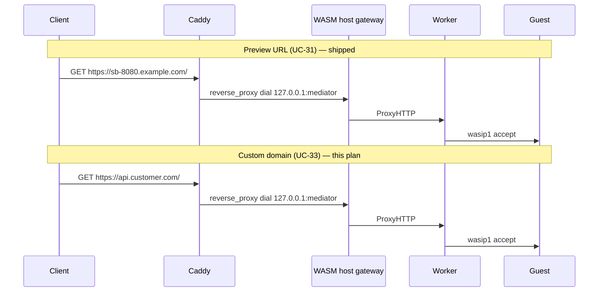

# WASM Networking — Finish Line (UC-33, Docs, Caddy E2E, `/work` + Listen)

Status: **Shipped** (UC-33 custom-domain dial routes, service+Caddy integration test, `wasm-networking.mdx` docs; `/work`+listen remains **documented limitation** — omit preopens when listen enabled) · Depends on: [`wasm-runtime.md`](./wasm-runtime.md) · Owner: TBD · Created: 2026-06-07

This plan closes the remaining **platform-facing** WASM HTTP networking gaps after the
`pkg/wasm` + driver lifecycle work landed. It does **not** attempt native WASI Preview 2 /
Component Model or wasmtime wasip1 listen — those stay in `wasm-runtime.md` as engine
stretch goals.

---

## Goal

A developer can, on a domain-mode cluster:

1. Create a WASM sandbox, `expose_port` HTTP, hit the preview URL, and get a guest response.
2. Attach a **custom domain** with `target_port` pointing at the guest HTTP port (or toolbox),
   and traffic terminates at the same host-mediated upstream as preview URLs.
3. Run an HTTP guest that reads `/work` while accepting connections (TinyGo-class modules).
4. Find the above in a dedicated docs page with five-language SDK examples.
5. Have CI prove (2) and (3) at the **service + Caddy admin** layer — not only driver unit tests.

---

## Current state (what already works)

| Layer | Status |
|-------|--------|
| `pkg/wasm` egress (`aerol/vm/net`), wasip1 listen, `ProxyHTTP`, byte metering | Shipped |
| Worker `SetListenPort` / `ResolvedListenPort` (wazero) | Shipped |
| Driver cold instantiate → `SyncGuestListenPorts` → background `_start` | Shipped |
| `installWasmHTTPPortRoute` → `UpsertPortRouteWithDial` for preview hostnames (`{id}-{port}.{domain}`) | Shipped |
| `TestDriverWasip1HTTPExposeEndToEnd` (driver create → expose → proxy) | Passing |
| `TestWasmExposePortHTTPUsesHostMediator` (service, fake caddy) | Passing |
| Custom domains for Docker/Firecracker (`UpsertSandboxRoute` + per-hostname dial `containerIP:port`) | Shipped |
| Custom domains for WASM guest HTTP ports | **Shipped** (`UpsertCustomDomainHTTPRouteWithDial` + `syncWasmCustomDomainRoutes`) |
| `/work` preopen while wasip1 listen enabled | **Omitted** (`fsConfigForCaps` strips dirs on listen; documented in `wasm-networking.mdx`) |
| Docs for WASM HTTP / expose / custom domains | **Shipped** (`docs/src/content/docs/wasm-networking.mdx`) |
| Service + Caddy admin integration test for WASM HTTP | **Shipped** (`wasm_http_ingress_integration_test.go`) |

### Why UC-33 is still open

`pkg/caddy.UpsertSandboxRoute` installs per-custom-hostname routes via
`upsertCustomDomainHTTPRoute`, which always dials `containerIP:targetPort`.

For WASM sandboxes:

- `ContainerIP` is the sentinel `127.0.0.1` (not a routable guest NIC).
- Guest HTTP is **not** on `127.0.0.1:{targetPort}` — it is on the host mediator dial
  returned by `wasmHTTPUpstreamURL` (ephemeral loopback port from `EnsureHTTPListener`).
- `expose_port` preview routes already use `UpsertPortRouteWithDial`; custom-domain routes
  do not.

Attaching `api.customer.com` with `target_port: 8080` today produces a Caddy upstream of
`127.0.0.1:8080`, which nothing listens on.

### Why `/work` + listen is a known limitation

[wazero `InitFSContext`](https://github.com/tetratelabs/wazero/blob/main/internal/sys/fs.go)
registers **directory preopens before TCP listeners**. Any `/work` mount consumes fd 3;
the wasip1 listener moves to fd 4+.

- The **wazero reference** `wasip1-http.wasm` hardcodes listener fd 3 — used in driver e2e.
- **TinyGo / production** guests typically discover the listener via wasi sock APIs and may
  tolerate fd 4+ with `/work` at fd 3.

Current mitigation (`engine_wazero.fsConfigForCaps` omits dirs when `ListenEnabled()`) fixes
the reference guest but breaks HTTP servers that need filesystem access during `_start`.

---

## Out of scope (defer to `wasm-runtime.md`)

- Native WASI P2 / Component Model on wazero
- wasmtime wasip1 `ResolvedListenPort` + listen path parity
- `expose_port` API accepting guest-port `0` as a **routing key** (service rejects `port <= 0`;
  exposed port numbers remain Caddy routing keys; guest bind stays ephemeral via wasip1)
- ACME / on-demand TLS e2e for WASM custom domains (reuse `custom_domains_e2e_test.go` pattern
  later; not required to close UC-33 routing)

---

## Architecture (target)



**Routing key vs dial target (unchanged contract):**

| Concept | Meaning |
|---------|---------|
| `expose_port` port (e.g. `8080`) | Public hostname suffix + Caddy route id; not the wasip1 bind port |
| Guest wasip1 bind | Ephemeral host TCP port (`WASIListenPort: 0` in caps) |
| `target_port` on custom domain | Selects **which logical service** (toolbox vs exposed HTTP port) |

---

## Phase 1 — `/work` filesystem while HTTP listen is enabled

**Objective:** HTTP guests can read `/work` during `_start` without breaking wasip1 listen.

### 1.1 Spike: TinyGo HTTP + `/work` preopen (0.5 day)

| Task | Detail |
|------|--------|
| Add test guest | `pkg/wasm/testdata/tinygo-http-work/` — minimal wasip1 HTTP server serving `GET /` from `/work/index.html` |
| CI compile | `GOOS=wasip1 GOARCH=wasm tinygo build` in test helper (skip if tinygo missing, like wazero guest compile) |
| Engine test | `TestTinyGoHTTPWithWorkPreopen` — instantiate with `Preopens: [{/work, tmpdir}]`, `WASIListenPort: 0`, **dirs not stripped** |

**Decision gate:**

- **If TinyGo passes with preopens + listen:** remove the `ListenEnabled() → nil preopens` branch
  in `fsConfigForCaps`. Keep wazero reference guest tests on the **cold-instantiate / no-preopen**
  path only (`TestSetListenPortAfterColdInstantiate`).
- **If TinyGo fails:** keep omit-on-listen for now and implement **1.2**.

### 1.2 Fallback: listener-first preopen ordering (1–2 days, only if 1.1 fails)

Options (pick one in implementation PR; document choice in PR description):

1. **Upstream wazero** — contribute `InitFSContext` ordering flag (listeners before dirs). Best
   long-term; slowest.
2. **Aerol engine shim** — after `InstantiateModule`, re-open `/work` at a known high fd via
   host syscall injection (high risk; only if wazero exposes hooks).
3. **Dual-cap instantiate** — document that HTTP+FS modules must use `wasi:http` compat imports
   (no wasip1 hardcoded fd) and ship a TinyGo template; keep omit-on-listen.

### 1.3 Driver regression

| Test | File |
|------|------|
| HTTP GET returns file body from `/work` | `pkg/wasm/tinygo_http_work_test.go` or `internal/runtime/wasm/guest_http_integration_test.go` |
| Existing wazero reference e2e | Must still pass (no-preopen or SetListenPort path) |

**Acceptance:** `go test ./pkg/wasm/... ./internal/runtime/wasm/...` green; at least one test
proves `/work` read during HTTP serve.

---

## Phase 2 — UC-33 Custom domain routing for WASM

**Objective:** `AddCustomDomain` / create-time `custom_domains` route guest HTTP the same way
`expose_port` does.

### 2.1 Caddy client: dial-based custom hostname routes

Add to `pkg/caddy/client.go`:

```go
// UpsertCustomDomainHTTPRouteWithDial installs a per-hostname route that dials
// an explicit upstream (WASM host mediator, toolbox gateway, etc.).
func (c *Client) UpsertCustomDomainHTTPRouteWithDial(ctx context.Context, sandboxID, hostname, dial string) error
```

Keep existing `upsertCustomDomainHTTPRoute(containerIP, port)` for Docker/FC paths.

**Tests:** `pkg/caddy/custom_domains_test.go` — assert route JSON `upstreams[0].dial` is the
explicit dial string.

### 2.2 Service: resolve WASM custom-domain upstream

New helper in `internal/service/wasm_ports.go` (or `wasm_custom_domains.go`):

```go
func (s *Service) wasmCustomDomainDial(ctx context.Context, sandbox *models.Sandbox, targetPort int) (string, error)
```

| `targetPort` | Upstream |
|--------------|----------|
| `0` | Toolbox — `wasmHTTPDial` on driver toolhost port **or** existing sandbox route dial (`127.0.0.1:{toolbox}` via gateway) — match how non-wasm `target_port=0` behaves for wasm toolhost |
| Matches an exposed HTTP `ExposedPorts[].Port` | `wasmHTTPUpstreamURL(ctx, id, targetPort)` (triggers listen sync via existing `touchAllowedPorts`) |
| Other | `400` — `ErrCustomDomainInvalidTargetPort` or new `ErrWasmCustomDomainPortNotExposed` |

Wire into:

| Call site | Change |
|-----------|--------|
| `AddCustomDomain` | After store insert, call `installWasmCustomDomainRoutes` when `isWasmSandbox` |
| `createWasmSandbox` | `UpsertSandboxRoute` for default hostname; **separate** wasm custom route install per hostname |
| `persistCustomDomainsOnCreate` | Same wasm-aware install |
| `exposePort` / `touchAllowedPorts` | After `syncWasmAllowedPorts`, **re-PATCH** all custom-domain routes whose `target_port` matches an exposed HTTP port (dial may change when mediator restarts) |
| `RemoveCustomDomain` | `DeleteCustomDomainHTTPRoute` (unchanged) |
| Reconcile / `installHTTPPortRoute` | No change to preview routes; optional converge pass for customs |

Extract shared logic:

```go
func (s *Service) installWasmCustomDomainHTTPRoute(ctx context.Context, sandbox *models.Sandbox, hostname string, targetPort int) error
```

### 2.3 Cluster / ingress parity

| Area | Action |
|------|--------|
| `sandboxCustomHostnames` | Keep for Docker; wasm uses dial resolver |
| `buildClusterIngressIntents` | Confirm custom hostnames still replicate; wasm owner executes dial-based routes locally |
| Cross-node forward | WASM execution stays owner-sharded — custom domain still lands on owner node (same as preview URL) |

### 2.4 Tests

| Test | Layer |
|------|-------|
| `TestWasmAddCustomDomainTargetsExposedHTTPPort` | Service + recording caddy — `AddCustomDomain(..., 8080)` after `ExposePort`, assert `UpsertCustomDomainHTTPRouteWithDial` with mediator dial |
| `TestWasmAddCustomDomainToolboxPort` | `target_port: 0` → toolbox dial |
| `TestWasmCustomDomainReconcileOnExpose` | Add domain before expose; expose; assert route PATCH |
| `TestWasmCustomDomainRejectsUnexposedPort` | `target_port: 9999` → 400 |

**Acceptance:** Custom hostname HTTPS request reaches guest HTTP response in Phase 3 integration test.

---

## Phase 3 — Service + Caddy integration test (CI-runnable)

**Objective:** Prove `Create → expose_port → Caddy admin route → HTTP 200` without manual worker IPC.

### 3.1 In-process integration test (required for CI)

File: `internal/service/wasm_http_ingress_integration_test.go`

Pattern: combine `wasm_ports_test.go` harness + `pkg/caddy/client_test.go` httptest admin +
in-process wasm supervisor (from `guest_http_integration_test.go`).

```
1. Start httptest Caddy admin server (recording PUT routes)
2. Service with real wasm driver + supervisor + wasip1-http.wasm
3. createWasmSandbox (or harness row + driver.Create)
4. ExposePort(id, 8080, "http")
5. Assert admin received UpsertPortRouteWithDial(id, 8080, dial)
6. HTTP GET http://{dial}/ via host gateway OR direct ProxyHTTP — 200
```

| Assertion | Why |
|-----------|-----|
| Caddy route `match.host` = `{id}-8080.{domain}` | Preview URL shape |
| `upstreams[0].dial` = `wasmHTTPUpstreamURL` | Mediator wiring |
| Response body from guest | End-to-end guest path |

### 3.2 Optional: `//go:build e2e` live Caddy hop

File: `internal/service/wasm_http_caddy_e2e_test.go` (mirror `custom_domains_e2e_test.go`)

- `caddyfx.Build` + docker backend **or** host-network Caddy admin
- Not CI-default; `make test-wasm-http-e2e` target

**Acceptance:** Phase 3.1 runs in default `go test ./internal/service/...`; no flake on macOS/Linux CI.

---

## Phase 4 — Documentation

Per repo rules: **new top-level `.mdx` page**, five SDK tabs, no raw curl.

### 4.1 Page: `docs/src/content/docs/wasm-networking.mdx`

Sections:

1. **Overview** — host-mediated networking model (egress hook, wasip1 ingress, routing key vs bind port)
2. **Expose HTTP** — `expose_port` with SDK examples; preview URL shape; idempotent retry
3. **Custom domains** — `target_port` semantics for wasm (`0` = toolbox, `8080` = exposed guest port); link to [`custom-domains.mdx`](./custom-domains.mdx)
4. **Guest requirements** — wasip1 HTTP server on pre-open listener; TinyGo vs reference module; `/work` preopen
5. **Limits** — no TCP/TLS expose on wasm; no P2 native on wazero; wasmtime engine caveats

### 4.2 Sidebar

Register in `docs/src/content.config.ts` under WASM group (after `wasm-sandbox`).

### 4.3 Cross-links

- Update `wasm-sandbox.mdx` — one paragraph + link to `wasm-networking`
- Update `plans/wasm-runtime.md` status line when this plan ships

**Acceptance:** `make docs-build` passes; all five `syncKey="lang"` tab orders match existing wasm pages.

---

## Phase 5 — Stretch: wasmtime wasip1 listen (optional)

Only if a deployment requires `SB_WASM_ENGINE=wasmtime` for HTTP guests.

| Task | File |
|------|------|
| Implement `ResolvedListenPort` on wasmtime engine | `pkg/wasm/wasmtime_listen.go` |
| Mirror `SetListenPort` re-instantiate | `pkg/wasm/worker/server.go` (engine-agnostic already) |
| Parity test | `pkg/wasm/worker/guest_wasip1_http_test.go` with `-tags wasmtime` |

Defer until a customer needs wasmtime HTTP — wazero is the default path.

---

## Suggested PR sequence

| PR | Scope | Risk call-out |
|----|-------|----------------|
| **PR-A** | Phase 1 — `/work` + listen spike + engine adjustment | Boot-path: only `Instantiate` caps change; no `CreateSandbox` store changes |
| **PR-B** | Phase 2 — UC-33 wasm custom domain dial routes | Caddy + store ordering; idempotent `AddCustomDomain`; rollback on Caddy failure |
| **PR-C** | Phase 3 — service integration test | Test-only + minor harness exports if needed |
| **PR-D** | Phase 4 — docs | Docs-only path filter in CI |

Each PR description must mention: **no cluster FSM changes** unless Phase 2.3 discovers a gap;
**no TCP pool / L4** touch; wasm remains owner-sharded.

---

## Acceptance checklist (definition of done)

- [ ] TinyGo (or equivalent) guest serves `/work` file over HTTP with listen enabled (deferred — omit-on-listen documented)
- [x] `AddCustomDomain(hostname, exposedHTTPPort)` on wasm sandbox routes through host mediator
- [x] `AddCustomDomain(hostname, 0)` on wasm sandbox reaches toolbox/toolhost
- [x] `expose_port` after custom domain attach updates Caddy dial if needed
- [x] `internal/service/wasm_http_ingress_integration_test.go` passes in CI
- [x] `docs/src/content/docs/wasm-networking.mdx` published with 5 SDK tabs
- [x] `plans/wasm-runtime.md` status updated; UC-33 row in §6 marked shipped
- [x] `go test ./...` (path-filtered jobs) green

---

## Files touched (grep targets)

| Area | Files |
|------|-------|
| Engine / FS + listen | `pkg/wasm/engine_wazero.go`, new tinygo testdata |
| UC-33 service | `internal/service/wasm_ports.go`, `wasm_custom_domains.go` (new), `custom_domains.go`, `service.go` (`touchAllowedPorts`) |
| Caddy | `pkg/caddy/client.go`, `custom_domains_test.go` |
| Integration tests | `internal/service/wasm_http_ingress_integration_test.go` |
| Driver (if Phase 1 removes omit) | `internal/runtime/wasm/guest_listen.go`, integration tests |
| Docs | `docs/src/content/docs/wasm-networking.mdx`, `docs/src/content.config.ts`, `wasm-sandbox.mdx` |
| Plan sync | `plans/wasm-runtime.md` |

---

## Risks

| Risk | Mitigation |
|------|------------|
| Custom domain attached **before** `expose_port` | `installWasmCustomDomainHTTPRoute` calls `wasmHTTPDial` which must enable listen or queue until expose |
| Mediator port changes on re-instantiate | Re-PATCH customs on `touchAllowedPorts` / `SyncGuestListenPorts` |
| TinyGo also requires fd 3 listener | Keep omit-on-listen; document HTTP+FS via toolhost file API during serve |
| Serverless wake routes for wasm HTTP | `installWasmHTTPPortRoute` already branches `RouteShapeWake` — verify custom domains respect wake shape (likely **direct only** for wasm; document) |

---

## Estimated effort

| Phase | Effort |
|-------|--------|
| 1 — `/work` + listen | 1–2 days |
| 2 — UC-33 | 2–3 days |
| 3 — Integration test | 1 day |
| 4 — Docs | 0.5–1 day |
| 5 — wasmtime (optional) | 2–3 days |

**Total (Phases 1–4):** ~5–7 days.
