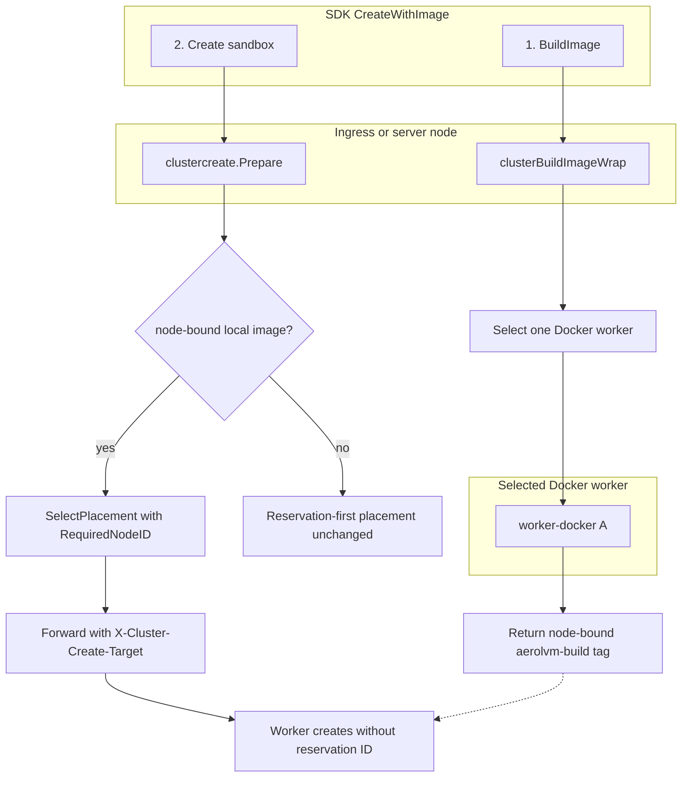
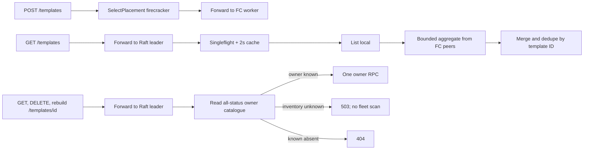

# PR Review Checklist

Every PR touching `internal/service`, `internal/store`, `pkg/caddy`, `pkg/api`, or the SDKs must be reviewed against the rules below. The PR description must explicitly call out each rule it touches — silence is not acceptable on these axes.

The fill-in template lives at [`.github/pull_request_template.md`](./.github/pull_request_template.md) and is auto-populated by GitHub when a PR is opened. This file is the rationale and the reviewer's reference; the template is what authors fill in.

## 1. Idempotency

All sandbox APIs MUST be idempotent.

- Retrying the same request with the same inputs MUST yield the same result.
- A retry MUST NOT cause resource leaks, double allocations, or "already exists" errors.
- Worked example: `expose_port` for an already-exposed `(sandbox, port)` pair must return the existing public URL, not allocate a new host port. The TCP path specifically must NOT walk the host-port pool on a PK conflict.
- Cross-protocol re-expose on the same port should fail fast with a clear "unexpose first" error rather than silently overwriting and leaking the prior caddy route.

**Reviewer asks:** what happens if this exact request is retried 5 times? 50 times? Concurrently from two callers?

## 2. Sandbox boot / `CreateSandbox` latency

Sandbox creation latency is a load-bearing UX metric. Treat the boot path as protected.

- No new work — even lazy or amortized — gets added to `CreateSandbox` or anything it calls without an explicit call-out in the PR description.
- The call-out must state: what was added, expected added latency, conditions under which it fires, whether it's bounded.
- "It's only on the first call" is still an impact and must be called out.

**Reviewer asks:** does this PR add ANY work — DB query, HTTP round-trip, file I/O, lock acquisition — to the sandbox boot path? If yes, is it documented?

## 3. Bootstrap belongs at daemon start, not on hot APIs

When daemon-start bootstrap is best-effort (e.g., depends on Caddy being reachable on a cold restart), the recovery pattern is:

- A lazy single-flight retry that fires only on the API path that needs it (e.g., the first L4 expose).
- Behind an `atomic.Bool` fast-path latch, so the steady-state hot path is a single atomic load.
- A `sync.Mutex` around the slow path so a thundering herd of concurrent first-callers issues exactly one bootstrap, not N.
- Failure leaves the latch unset so the next caller retries; success latches forever.

The L4 bootstrap (`Service.EnsureLayer4Ready`) is the canonical shape. Mirror it for any future best-effort daemon-start work.

**Anti-patterns:** retrying bootstrap on every request; failing the daemon outright on a transient bootstrap error; logging-and-forgetting so the first user request gets a confusing "X not found" from the underlying system.

## 4. Failure-path state consistency

Any expose / unexpose / reconcile path that touches BOTH caddy and the store can leave the system inconsistent on partial failure.

- Decide and document the rollback rule: if caddy succeeds and store fails, what cleans up? If store succeeds and caddy fails, who owns the rollback?
- Do not delete a row that another caller (race) just installed. Track "did I create this?" with an explicit flag (see `allocateHostPort`'s `reused` return) before issuing rollback deletes.
- The reconcile loop is the safety net, not the primary cleanup path. Don't lean on it to cover routine error handling.

**Reviewer asks:** if step 2 of 3 fails, what state is the system in? Is the next request to the same sandbox going to succeed, fail confusingly, or leak resources?

## 5. Mount inputs run on the host

Mount fields (`source`, `options.opts` for NFS, `options.extra_args` for S3, mount-tool flags generally) are passed verbatim into commands that execute on the host as the daemon user — outside the microVM isolation boundary. PAT holders are assumed to be host operators; the threat model treats their input as already-trusted.

If you change who holds a PAT (sub-accounts, hosted offering, external CI), this assumption inverts and these fields become a host attack surface. Before that move:

- Allowlist `options.opts` / `extra_args` keys instead of pass-through.
- Isolate mount helpers (dedicated low-priv user, network namespace scoped to the declared endpoint, seccomp/AppArmor, or a helper VM).
- Re-validate `source` schemes and reject control characters.

**Reviewer asks:** does this PR widen what a PAT holder can pass into a host-side mount command? If yes, is it still safe under the "PAT == operator" assumption, and is the assumption still accurate?


## 6. TCP host-port pool & L4 bootstrap

These two areas are particularly fragile and have produced live incidents (PR #16):

- Any change to `TryReserveHostPort` semantics, the partial unique index on `host_port`, or the allocator loop in `allocateHostPort` requires a regression test in `internal/store/store_test.go` AND a call-out in the PR description.
- Any change to `EnsureLayer4` / `EnsureLayer4Ready` / the `l4Ready` latch requires a regression test in `internal/service/layer4_bootstrap_test.go` AND a call-out.
- Do not collapse the three-state `ReserveHostPortResult` (`Reserved` / `Existing` / neither) back into a `bool`. The middle state is what prevents pool walks on PK collisions.

## 7. Cluster placement, forwarding & per-host artifacts

Cluster mode runs Raft placement state, SWIM gossip, and cross-node HTTP forwarding.
This area is as fragile as the TCP host-port pool (see `CLAUDE.md` Hard rules §6).

**Reviewer asks:** does this PR change who runs a sandbox, where an artifact is
built, or how a request is forwarded? If yes, document split-brain / misdirect
behavior, single-node no-op, and leader-change replay safety.

### Rules (all cluster-touching PRs)

- **Role gate.** Only `worker` and `mixed` nodes may own sandboxes
  (`cluster.CanOwnSandboxRole`). Ingress/server nodes may route but must not
  assume they can execute creates locally.
- **Per-host artifacts.** Built images (`aerolvm-build/*`), Firecracker template
  rootfs, and similar node-local blobs must be built or probed on nodes that can
  run them. API entrypoints that cannot own sandboxes must forward or fan out —
  not pin work to self.
- **Local-only create contract.** When `service.ImageRequiresLocalPlacement` is
  true, create skips the reservation-first flow: forward with
  `X-Cluster-Create-Target` only (no `X-Cluster-Create-ID`). The target worker
  runs `createSandboxOnSelectedNode` directly.
- **Loop guards.** Cross-node wrappers MUST set a private header
  (`X-Cluster-Image-Build-Routed`, `X-Cluster-Template-Forwarded`, etc.) on
  forwarded requests so the receiver executes locally and does not re-fanout.
- **Runtime in placement vs body.** Placement scoring may infer a default
  runtime (e.g. `docker` for built images) for `SelectPlacement` filters, but
  must not rewrite an omitted `runtime` on the forwarded create body — the
  selected worker applies its configured default (e.g. gVisor).
- **Regression tests.** Changes to placement selection, create forwarding,
  build/template routing, or `capacityRequestFromCreate` need a test next to the
  file changed (`placement_test.go`, `clustercreate_test.go`,
  `cluster_handler_test.go`, `build_test.go`, `template_test.go`).
- **Single-node / cluster-off.** All wrappers must no-op when `EnableCluster` is
  false or `cluster.Client` is nil (`cluster.NewNoop`).

### 7.1 Reference implementation — B7 local-only built images & per-host routing

**Plan:** [`plans/b7-built-image-placement.md`](plans/b7-built-image-placement.md)
(parent: [`plans/cluster-hetero-failures-fix.md`](plans/cluster-hetero-failures-fix.md),
integration UC-74). The original PR #253 all-worker fanout is superseded by the
node-bound implementation described here; do not copy the historical fanout.

#### What was solved

| Symptom | Root cause | Fix |
|---------|------------|-----|
| UC-74 `CreateWithImage` → `cluster: no worker placement target available` on role-separated clusters | `POST /v1/images/build` ran on ingress/server; image existed only there; `ImageRequiresLocalPlacement` pinned create to self; `CanOwnSandboxRole(server)` is false | Select one Docker worker, build there, encode its node ID in the returned tag, and constrain create to that node |
| Template API unusable from ingress (B3 ticket) | Templates are per-worker rootfs; routes had no cluster wrappers | Create routes via Firecracker placement; cluster lists are leader-coalesced with a short cache; get/delete/rebuild coordinate on the leader and route from a distinct all-lifecycle catalogue |
| Placement under-filtered for built images / WASM | `capacityRequestFromCreate` omitted runtime, module ref, WASM overhead | Align scoring with `internal/cluster/placement.go` (default `docker`, `ModuleRef`, +8MB WASM, overlay disk) |

Before (broken on ingress/server):

```
CreateWithImage
  → build on ingress (image only on non-worker)
  → create pinned to self (ImageRequiresLocalPlacement)
  → CanOwnSandboxRole(server) == false
  → ErrNoPlacementTarget
```

After:

```
CreateWithImage
  → build: SelectPlacement(runtime=docker) → one worker
  → response: aerolvm-build/node-<encoded-worker>/<digest>:latest
  → create: decode RequiredNodeID → forward to the same worker
  → worker creates without reservation ID
```

#### Decisions taken

The B7 plan evaluated three options. **What ships is Option A with a structural
worker affinity in the existing image tag.** It replaces the earlier
replicate-to-all-workers implementation, whose O(workers) cost is not viable at
the 2,000-node target. Option B remains available when durable/cross-worker
reuse is an explicit product requirement.

| Decision | Rationale |
|----------|-----------|
| **Select exactly one Docker worker** | Build cost remains O(1) instead of multiplying across the fleet. |
| **Encode worker affinity in the existing image tag** | The independent create call recovers the target without a new response field, SDK state, or compatibility branch. |
| **Route push/context builds through the same worker selection** | No cluster build is accidentally executed on an ingress-only node; request-scoped registry credentials stay on the authenticated mTLS hop. |
| **Local-image create: no reservation ID** | Image must already exist on the target; reservation-first would reserve on router then forward to a node that cannot see the router's local image. |
| **Template cluster wrappers in same PR** | Same class of bug (per-host artifact on ingress); unblocks B3 without AOCR. The leader coalesces list aggregation; item routes make at most one owner RPC and fail closed while inventory is unknown. |
| **Do not inject `runtime` into forwarded create body** | Preserves worker-specific defaults (gVisor cluster-hetero fix); placement filter uses inferred `docker` only for scoring. |

Option B (AOCR distribution after build) is not superseded, but it should be
added only with an explicit durability/cross-worker promise. The node-bound
local contract is simpler and avoids speculative registry work.

#### Impact

| Surface | Who is affected | Behavior change |
|---------|-----------------|-----------------|
| `POST /v1/images/build` | Clients hitting any cluster node | One placement and at most one internal build forward; returned tag is node-bound |
| `POST /v1/sandboxes` with a node-bound `aerolvm-build/*` | Same | `RequiredNodeID` constrains placement to the build worker; unavailable/drained owner fails retryably |
| `POST /v1/sandboxes` (normal) | Unchanged | Still reservation-first |
| Template CRUD from ingress | Operator credentials using templates in cluster mode | Global template administration is operator-only; create forwards to one FC worker, list is a leader-coalesced union, and get/delete/rebuild use the leader's all-status owner catalogue (pending and failed rows included) |
| Worker `CreateSandbox` | No added work on worker boot path | Forwarded local-image create uses existing `createSandboxOnSelectedNode` |
| Single-node / `EnableCluster=false` | No impact | Wrappers no-op |
| Integration harness | WASM scenarios | Ignores stale `AEROL_WASM_MODULE_REF=aocr.aerol.ai/cluster/*/snapshots/*` |

**Latency:** one placement + at most one forward for build, then one placement +
at most one forward for create. Fleet size does not multiply build work.

#### Implementation map

| Component | File(s) | Mechanism |
|-----------|---------|-----------|
| Image build routing | `pkg/api/v1/build.go`, `pkg/docker/build.go` | `clusterBuildImageWrap`; node-bound tag; authenticated `X-Cluster-Image-Build-Routed: 1` loop guard |
| Local-image create (facade) | `pkg/api/clustercreate/clustercreate.go` | `clusterCreateSelfCanOwnSandbox`; placement + `ForwardHTTP` without `HeaderID` |
| Local-image create (v1) | `pkg/api/v1/cluster_handler.go` | Mirror of clustercreate branch; accepts target-pinned forward without `X-Cluster-Create-ID` |
| Shared helpers | `pkg/api/v1/cluster_helpers.go` | `clusterSelfCanOwnSandbox`, `clusterMemberSupportsRuntime`, `dialClusterPeer` (node-pinned mTLS only) |
| Placement scoring | `pkg/api/clustercreate/clustercreate.go`, `pkg/api/v1/cluster_handler.go`, `internal/cluster/placement.go` | `CapacityRequestFromCreate` / `capacityRequestFromSpec`, including `RequiredNodeID` |
| Template cluster | `pkg/api/v1/template.go`, `routes.go` | `clusterCreateTemplateWrap`, `clusterListTemplatesWrap`, `clusterTemplateItemWrap`; leader coordination, distinct ready-vs-administrative inventories, and one owner RPC |
| Classification (unchanged) | `internal/service/image_distribution.go` | `ImageRequiresLocalPlacement` still true for `aerolvm-build/*` |

Key invariant preserved: **`ImageRequiresLocalPlacement` still means the image
must exist on the node that runs the sandbox** — we changed *which* node that
is, not the local-only contract.

#### End-to-end flow (operator / SDK view)



#### Template API flow (cluster mode)



#### pr-review axes for this change

**Idempotency (§1)**

- Build: content-addressed tag is deterministic per selected node;
  `X-Cluster-Image-Build-Routed: 1` prevents forwarding loops and is rejected
  unless the request came from an authenticated live peer.
- Local-image create: no reservation on forward; worker create idempotency is
  unchanged (name conflict, etc.). Misdirect guard: `X-Cluster-Create-Target` must
  match self → 421.
- Template list: read-only merge; duplicate IDs deduped (leader-local row wins);
  concurrent ingress requests share one aggregate and its two-second cache.

**Sandbox boot / `CreateSandbox` latency (§2)**

- **Worker path:** N/A — no new work on `CreateSandbox` at the worker.
- **Ingress path:** build and create each add at most one placement + one
  forward. No operation scales with Docker-worker count.

**Bootstrap (§3)**

- N/A — no daemon-start lazy bootstrap added.

**Failure-path consistency (§4)**

- N/A — no new multi-step caddy + store write. A selected-worker build failure
  returns 502; client retries placement/build. Template list reports partial
  peer coverage in headers; item routing returns 503 rather than scanning the
  fleet while inventory is unconverged.

**Mount inputs (§5)**

- N/A.

**TCP host-port pool & L4 (§6)**

- N/A.

**Cluster correctness**

- Split-brain / wrong target: forwarded creates require target header == self.
- FSM unchanged; no new Raft ops for local-image path.
- Single-node: all wrappers no-op when cluster disabled or self can own.
- Regression tests: `clustercreate_test.go`, `build_test.go`,
  `cluster_handler_test.go`, `template_test.go`, `placement_test.go`.

**Live verification:** `make integration-cluster-hetero` — UC-74
(CreateWithImage built-image graph).

## 8. Code-path diagram (mermaid)

Every PR that changes runtime behavior MUST include at least one mermaid
diagram of the changed code path in its description. Prose descriptions of
control flow hide exactly the bugs this checklist exists to catch — ordering
mistakes, missed cleanup branches, races between goroutines. A diagram makes
the reviewer walk the same branches the code walks.

- **Which diagram:** `sequenceDiagram` for protocol / handshake / cross-process
  changes (guest↔host, node↔node, client↔server); `flowchart` for control-flow,
  lifecycle, or cleanup-path changes; both when the PR spans both.
- **Annotate the delta, not just the end state.** Mark what changed on each
  branch (before → after). A diagram of only the new behavior forces the
  reviewer to reconstruct the old one from memory.
- **Every failure/cleanup branch the PR touches must appear in the diagram** —
  the discard paths are where leaks live (see §4). If a branch is too trivial
  to draw, it is trivial enough to draw quickly.
- Reference example: PR #289 ("What changed, visually") — a handshake
  sequence diagram, a discard-path flowchart with each fixed leak marked, and
  a before/after wiring-order flowchart.
- "N/A — docs/comment-only change" is the only acceptable opt-out, same
  convention as the other template sections.

**Reviewer asks:** can I trace the changed request/lifecycle end-to-end from
the diagram alone? Does every error branch in the diff appear as a branch in
the diagram?

## PR description template

Lives at [`.github/pull_request_template.md`](./.github/pull_request_template.md). GitHub auto-fills new PRs with it. Authors must answer every section; "N/A — <one-line reason>" is valid, empty is not.
